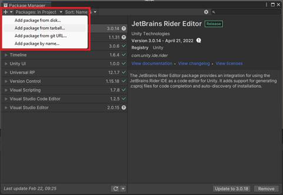
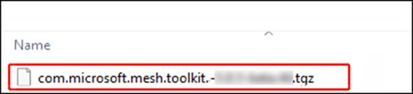

# Importing the Mesh Toolkit

1. In Unity, open the Package manager, then select the "+" drop-down, and then select **Add package from tarball**.
    

2. Navigate to the folder named *Packages* in the unzipped file you
    downloaded earlier, and then add the *toolkit* file outlined in red
    in the image below.
    

3. If you get a Warning, as shown below, select **Yes** to allow the
    packages to properly configure your project.

    

    You may see other dialogues, such as this one:

    

    If you see a dialog box named **Project Settings for Mesh** with a **Configure Settings** button, select that button.
>
Unity may restart during this process.

4. Once you've installed the package, verify that you see it in the
    Package Manager.

Next Steps:
Building for single and multiple platforms TBD

    