# Overview

In a Mesh experience, physics simulation is key to enabling engaging dynamic content. In order to provide Mesh participants with high quality shared physics experiences and offer developers a productive workflow in creating custom content, we've created the *Mesh Physics* system (usually referred to as "Mesh Physics" in this document). Mesh Physics is based on local authoritative simulation, which results in a very simple architecture. There's no need for server-side logic and special logic on the clients. Most importantly, this approach results in a very responsive and low-latency experience for each player interacting with their environment, even when connected to a high-latency network.

Here's a sampling what you can do with Mesh Physics features:

* Allow participants to grab and carry objects.

* Display a tether when a participant reaches for a distant object.

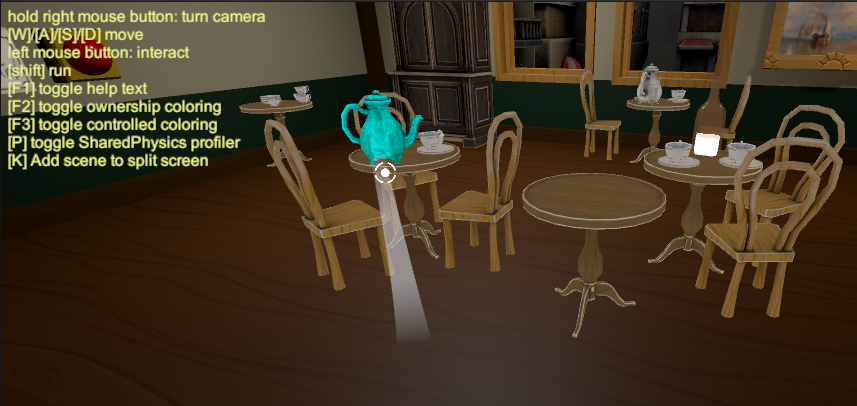

* Make objects “throwable” (darts, different types of balls: for example, snowballs or bowling balls).

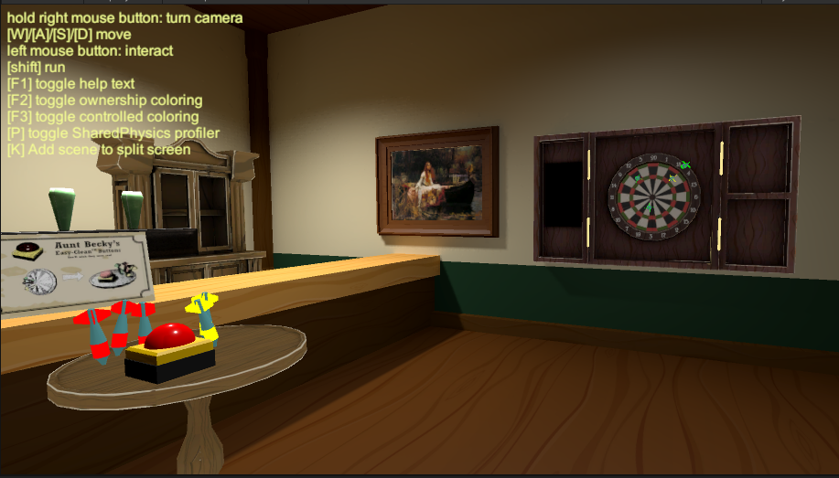

* Control how gravity affects objects.

* Fire certain events when an object is grabbed, carried and released.

* Make an object “sticky”—it sticks to whatever it hits. Examples: throwing a dart at a dart board, attaching a picture to a wall.

* Add auto-play animations that interact with physics bodies.

* Allow participants to reset objects (for example, reset a chess board, or clean up a room after objects have been scattered about).

* Fire events when an object enters a trigger collider.

* Create a containment field. Objects will stay within the boundaries of the field.

* Control the velocity of an object.

* Control the buoyancy of objects&mdash;for example, make boats and other seagoing objects “float.”

* Control the angular velocity of an object.

* Create an explosion, causing nearby objects to move outward or in a specific direction.

* Create “bouncy” objects that bounce off each other with a predefined velocity.

* Teleport an object to a new position and (optional) new rotation.

## Sample Projects that use Mesh Physics

In the Mesh Toolkit Samples folder, you'll find several projects that contain scenes that use Mesh Physics. 

### DartRoom

The *DartRoom* project (scene: *DartRoom*) uses most physics features. In this project, you'll find:

- **Cups:** Simple objects to pick up.

- **Tables:** When grabbed, they try to align themselves with gravity.

- **Cupboards:** These should feel heavy. They use physics constraints.

- **Reset buttons (red):** Resets the transforms of a sub-scene.

- **Clock pendulums:** Powered by a physics hinge and velocity field.

- **Darts:** You can throw these in the camera direction. They're "sticky," so they'll stay attached to anything they hit.

- **Globe:** The globe rotates, demonstrating a motored hinge. The globe also has a gravity field which influences small objects entering a spherical trigger volume. Drag some cups close to the globe and watch them rotate around it like satellites.

This is a beautifully rendered scene that demonstrates the power of combining appealing visuals with the creative use of Mesh Physics features. Feel free to inspect the scene and play with it!

### ScriptedWorlds

Open the *PhysicsShowcase* scene in this project and select the Play button. You'll find a number of labeled buttons that, when clicked, demonstrate various Mesh Physics features.

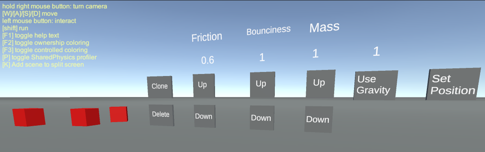

### Mesh 101 Tutorial

In the Mesh 101 tutorial (sample name: *Mesh101.Unity*), Chapter 4 walks you step-by-step through the process of setting up three Mesh Physics features: grabbing and releasing objects, triggering an animation using a trigger volume, and constraining an object with a containment field. To learn more, see our document named *Mesh 101 Tutorial*, Chapter 4: *Move objects and trigger animations with Mesh Physics*.

### Other projects with Mesh Physics

As you explore our other sample projects, you'll find various instances of Mesh Physics. For example, if you wander around in our *ScienceBuilding* project (scene: *ScienceBuilding*), you'll eventually encounter the **Mass & Buoyancy** exhibit which uses the **Buoyancy Field** and **Buoyancy Field Waves** components.

## Prerequisites for Mesh Physics

* Advanced Unity skills.

* A username and password for the Azure Portal so you can upload your work.

* Your account must be added as a Contributor to the Mesh world you’re trying to publish to. If you’re unsure about this, check with your IT admin.

* There must be an existing Mesh World in the Azure Portal that you can upload your work to. To learn more about setting this up, see our document titled *Mesh IT Admin Guide*.  

* There must be an existing Unity project that contains the Mesh Uploader (in Mesh terms, this project is used to create an *Environment*), or you must create one. To learn more about creating one, see our document titled *Get Started with Mesh Environments*.

## Terminology

Throughout this article, "body" is used as shorthand for "Rigidbody."

## Packages

The document titled *Get Started with Mesh Environments* contains instructions on how to load packages into your project. When you load the tarball named *com.microsoft.mesh.toolkit.xxx.tgz*, you import the Mesh Physics packages *mesh.physics.runtime* and *mesh.physics.playmode* (among other content).

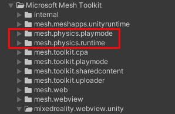

The *mesh.physics.runtime* package synchronizes the positions of rigid bodies and should work out-of-the-box, assuming all clients share the same scene. It also offers interaction and additional physics-related functionalities such as:

- various fields to physically influence bodies inside (buoyancy, gravity)
- various components to modify the behavior of individual bodies (magnetic, sticky, throwable)
- the ability to reset bodies to their startup positions (selective scene cleanup)

The *mesh.physics.playmode* package enhances the Mesh.Toolkit.Playmode functionality with Mesh Physics synchronization. To learn more about Playmode, see the document titled *Get Started with Mesh Environments*, section: *Testing with the Playmode package*.

## Distributed physics simulation

Most Unity physics features will be synchronized without extra developer effort:

- Rigidbodies, colliders, materials, constraints, etc.

**Notes:**

- Only rigidbody positions & orientations are synchronized with interpolation
- Discrete state changes (for example, breakable constraints) and trigger events must be avoided

Each client is responsible for simulating some of the bodies, called the distributed simulation "ownership". When a player touches a rigid body, simulation ownership is immediately transferred to allow low-latency interaction. For neighboring bodies, the physics synchronization engine performs local prediction, interpolation, and automatic ownership redistribution to minimize visual artifacts.

## Current limitations for v1

Mesh Physics is still an early version. Here are the things to consider:

- **Scripting:** Mesh Physics only handles synchronizing of transforms. It doesn't provide any scriptable game logic or synchronize scene graph topology changes. However, if another script modifies the scene graph consistently between all participants of a meeting, including late join, Mesh Physics can handle this.

- **API:** Since the Mesh Web client is fixed and can't be extended, there's no way to access the Mesh Physics C# API. However, if you have a specific use case which can be useful for others, contact our team.

- **Bandwidth:** We're sending raw rigid body transforms uncompressed between the clients. This results in a higher bandwidth than necessary and limits the number of bodies in the scene to 100.

    **Note:** We are working on a transform compression technology which will reduce the bandwidth by >10x (to be released soon).

- **CPU:** Currently we are quite CPU limited, so do not go beyond 50 active rigid bodies.

    **Note:** We're working to bring CPU-intensive tasks from Unity scripts into a WebAsm library which should improve performance by 10x.

- **Versioning:** We expect Mesh Physics to continue evolving significantly in the near future. As a result, some Unity Mesh Physics components need to be replaced by newer versions. We plan to ship upgraded scripts to make the transition from one version to the next as painless as possible.

## Change Log

### Mesh.Physics 6.0.x

* The component `PhysicsSceneSetup` has become redundant and can be removed. It has been temporarily renamed to `obsolete_PhysicsSceneSetup` and triggers a harmless error message when found.

### Mesh.Physics 0.21.0

Mesh.Physics 0.21.0 brings a renaming of the package along with a major restructuring of its content. The major changes in transitioning from lib.sharedphysics 0.15.x are:

* renaming of packages (`com.microsoft.edt.lib.sharedphysics.*` to `com.microsoft.mesh.physics.*`)
* renaming of several physics components (detailed list below)
* removal of various rarely-used or problematic components and properties (detailed list below)

After updating the mesh.toolkit packages, any `lib.sharedphysics` content in the scene requires an explicit migration step for which a tool is provided (see below). If this step is found to be necessary, an error dialog will be displayed.

#### Using Migration tool from lib.sharedphysics 0.15.x

* Ensure that project is fully backed up (committed to source control)
* Use the MeshPhysicsUpdater-23_5-to-23_6 tool on the project (available in the Extras/ folder on SharePoint).

* Update package dependency
* After loading, check the Unity console for warnings and errors about necessary manual adjustments.

#### Details changes

|old package name                                   |new package name
|-------------------------------------------------- |-------------------------------------
|com.microsoft.toolkit.authoring                    |com.microsoft.mesh.toolkit
|com.microsoft.edt.lib.sharedphysics.runtime        |com.microsoft.mesh.physics.runtime
|com.microsoft.edt.lib.sharedphysics.dev            |com.microsoft.mesh.physics.playmode

|old component name                     |new component name
|---------------------------------------|---------------------------------
|AntigravityField                       |ScaledGravityField
|CollisionVolume                        |CollisionEventsSensor
|DirectionalVelocityField               |VelocityVectorField
|GravityField                           |OrbitalGravityField
|SteerField                             |VelocityDirectionField
|VelocityField                          |VelocityMagnitudeField
|SharedBodyDistanceSensor               |BodyPairDistanceSensor
|TeleportRigidBody                      |TeleportBody
|TriggerVolume                          |TriggerEventsSensor
|SharedEventsAction_TeleportGameObject  |SharedEventsAction_TeleportBody

|class name             |old propery name           |new property name
|-----------------------|---------------------------|-------------------------
|AlignField             |bodiesToAffectFilter       |affectedBodies
|AlignField             |damper                     |angularDrag
|BouncingSurface        |bounceVelocity             |bounceVelocityMagnitude
|BuoyancyField          |buoyantBodies              |affectedBodies
|BuoyancyField          |waterDensity               |density
|BuoyancyField          |WaterSurfaceType           |surfaceType
|ContainmentField       |bodiesToContain            |affectedBodies
|DirectionalExplosion   |bodiesToAffect             |affectedBodies
|OrbitalGravityField    |moonsToCapture             |affectedBodies
|OrbitalGravityField    |defaultRadiusOfForcedOrbit |defaultForceRadius
|PreventSleep           |sleepTime                  |timeThreshold
|PreventSleep           |bodiesToAffectFilter       |affectedBodies
|ScaledGravityField     |bodiesToAffect             |affectedBodies
|TeleportBody           |relativeToObject           |targetObject
|VelocityDirectionField |bodiesToAffectFilter       |affectedBodies
|VelocityMagnitudeField |bodiesToAffectFilter       |affectedBodies
|VelocityVectorField    |bodiesToAffectFilter       |affectedBodies

| removed property
|-
| BodyPairDistanceSensor.referencePoint
| BuoyancyField.preventDrift
| CollisionEventsSensor.triggerDelay
| ResetBodyTransforms.initialAutoSaveDelay
| ResetBodyTransforms.transitionEasing
| ResetBodyTransforms.transitionEasingMode
| ResetBodyTransforms.transitionDuration
| ResetBodyTransforms.cooldownDuration
| ResetBodyTransforms.additionalJumpHeightScale
| SharedEventsAction_PlayAudio.playbackDelay
| StickyBody.stickyBodyTriggerTag
| StickyBody.collisionControlTag
| StickyBodyTrigger.onlyStickyBodyWithTag
| TriggerEventsSensor.triggerDelay

# Development

## Quick Start

The Mesh scene **Dartroom** demonstrates a fully designed example environment showcasing elements that are available with the released version of the library. You can find the Dartroom sample in the Mesh Toolkit (see the next section for download instructions).

The scene can be tried out in its final form within the Mesh app: `https://aka.ms/sharedphysics-dartroom-nocode`

### Download the Mesh Toolkit

1. In your browser, navigate to the [Microsoft Mesh EAP Onboarding Resources website](https://microsoft.sharepoint.com/teams/MicrosoftMeshEAPOnboardingResources).

1.	On the main page, scroll down to the **Mesh Resources and Developer Tools** section, and then, under **Get the Files and Packages**, select the **Go** button.

    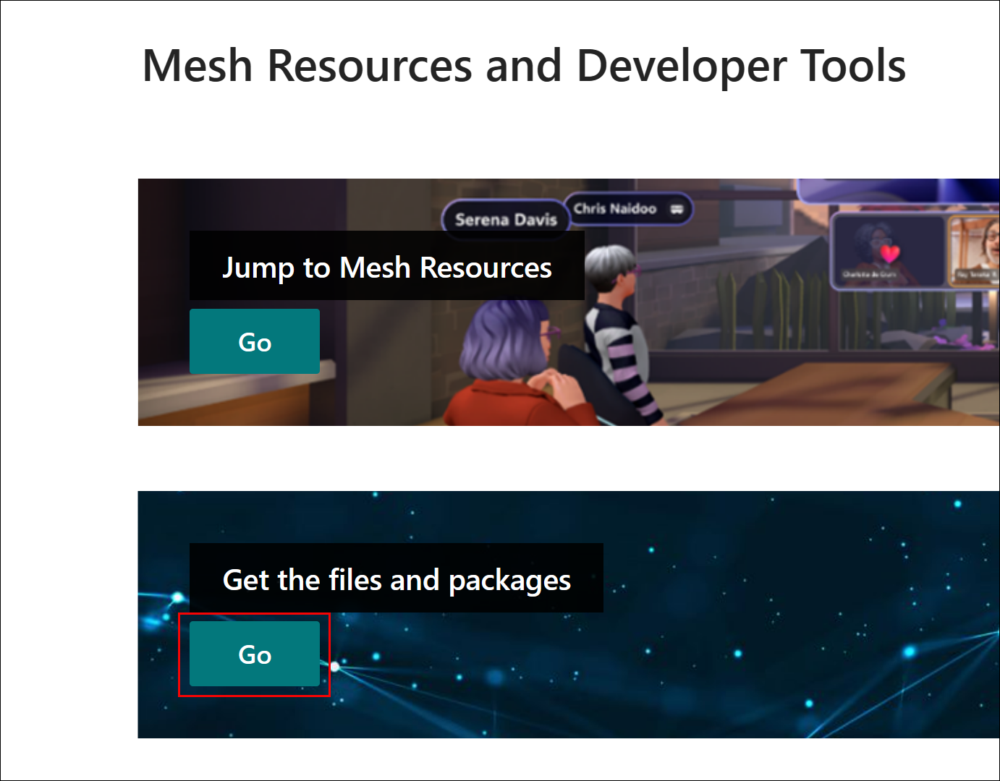

1. 3.	On the **Files and Packages** page, download the latest version of the Mesh Toolkit--it will have a more recent version number than what you see here. Select the three-dot button and then select **Download**.

    

1.	Place the downloaded zip file in a location where the file path won’t be too long, such as the Windows desktop.

  **Note**: The downloaded zip file’s name may vary depending on your computer setup.

1.	Unzip the file, and then navigate through the unzipped folder hierarchy until you see folders named **Packages and Samples**. 

    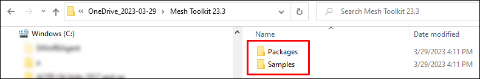

1. Double-click the **Samples** folder. This folder contains five Zip files.

    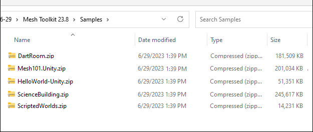

1. Unzip the file named **DartRoom.zip**. This gives you a folder named **DartRoom** which contains your sample Unity project.

1. Open the sample project in Unity.

### Run the Project in "Playmode"

The project is already configured to use Mesh Playmode.

1. Open the project in Unity.
1. Navigate to the **Assets > Scenes** folder, and then load the **DartRoom** scene.
1. Click Play to try out the scene. When you're finished, exit Play mode.

### Run Split Screen with multiple players

By default, Mesh Playmode runs with a single player. To add a second player with emulated networking:

1. In the **Hierarchy**, select **PlaymodeSetup [NoUpload]**.
1. In the **Inspector**, navigate to the **Playmode Setup** component, then increase the Inital Screen Count 2.

  

### Upload your own Environment to your Mesh World

To learn about uploading your Environment to your Mesh World, go to the EAP Onboarding Resources website and download the document named *Get Started with Mesh Environments*.

## Extend existing content using Mesh Physics

To make an existing Unity project Mesh Physics-enabled, the following steps are necessary:

1. Open the Package Manager and then remove the old 'com.microsoft.mesh.toolkit.authoring' package.
1. Select the “+” drop-down, and then select **Add package from tarball**.

    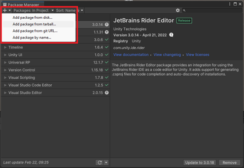

1. Navigate to the folder named *Packages* in the unzipped file you downloaded earlier, and then add the *toolkit* file (it will be a newer version than what's shown in the image below). If you haven't downloaded the *toolkit* tarball yet, see the instructions in the *Quickstart* section.

    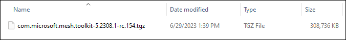
  
1. Select **Edit > Project Settings > Player > Other Settings > Configuration > Active Input Handling > Both**, and then restart.

1. Add the component named `ForceToolConfig` to any object in the scene that contains `Rigidbody` children that should become interactable.

  **Note:** Any `ForceToolConfig` affects all Rigidbodies below it in the transform hierarchy. The detailed configuration options of the tool are described here.

  **IMPORTANT**: As of July 2023, `ForceToolConfig` has been deprecated and replaced by the Object Configuration Layer (OCL), which features components that you can use for Mesh Physics as well as general object and player interactions. `ForceToolConfig` still has some useful features, but if you use it, keep in mind that it will be removed within a few months and you'll have to update your project(s) to use OCL. To learn more, see the document titled *Mesh Object and Player Interactions.pdf*.

1. Add the prefab named `PlaymodeSetup [NoUpload]` to the scene via the context menu:

  

- The avatar is replaced by a simple capsule-based character controller
- The Camera is now attached to the avatar; the main scene camera is ignored and should be removed.
- There is slightly downgraded performance due to C# bytecode being executed instead of optimized web-assembly.
- Single user by default, but also offers to test multiplayer using Playmode split screen.

1. Ensure that the physical origin (0,0,0) is a reasonable place for the character controller to start.

  **Note:** The MeshSDK standard component `SpawnPointConfig` is currently ignored by our character controller.

1. Ensure that the static content of the scene contains correctly set up solid colliders. Note that planes are prone to tunneling.

To learn more about Playmode, see the document titled *Get Started with Mesh Environments*, section: *Testing with the Playmode package*.

# General tips for building Mesh Physics experiences

You can start with scanning the Unity physics docs: `https://docs.unity3d.com/Manual/PhysicsOverview.html`. There are plenty of resources around on how to optimize physics in Unity.

Mesh Physics comes with some extra challenges:

- **Make thick walls:** Network synchronization might move rigid bodies slightly. As a result, you will see some extra penetration between objects. Small dynamic bodies might get pushed through thin walls. For thicker objects and walls, these tunneling effects are less likely. So, if possible:
- Use convex hull or a small set of convex hulls for dynamic bodies
- Whenever possible, use thick convex pieces for static geometry. Try to avoid meshes, especially highly dense meshes.
- **CPU limitations:** MeshXP runs inside a browser; as a result, its performance is limited. Try to use only a few dozen rigid bodies.
- **Realistic masses in kg:** Content from various sources might interact in the same scene. This works well if the mass ratios between the objects are reasonable. A good starting point is to assign realistic masses to bodies using kg.

# Feedback & Roadmap

Mesh Physics is currently under heavy development, and we are very hungry for feedback, suggestions, and feature requests.

Our current roadmap is flexible:

## Short term

- Improve stability and better handling of network package drop
- Add more control
- More example scenes

## Medium term

- Improve scalability, both bandwidth and CPU
- Integrate interactions with MRTK3 Object Manipulator
- More example scenes + artifacts

## Long term

- Integrate with client and server-side scripting
- Add a builder tool, which supports scene graph manipulation. This tool is inspired by Kerbal Space Program. An example would be building cars out of random scene objects.

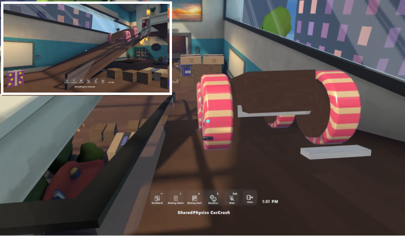

# Configuring ForceTool interactions: ForceToolConfig

**Important**: As of July 2023, `ForceToolConfig` has been deprecated and replaced by the Object Configuration Layer (OCL), which features components that you can use for Mesh Physics as well as general object and player interactions. `ForceToolConfig` still has some useful features, but if you use it, keep in mind that it will be removed within a few months and you'll have to update your project(s) to use OCL. To learn more, see the document titled *Mesh Object and Player Interactions.pdf*.

If you choose to continue using `ForceToolConfig` and want to physically interact with rigid bodies, you must enable the Mesh Physics force tool by adding the `ForceToolConfig` script.

**Important:** A given `Rigidbody` object will only be interactable with ForceTool if it or one of its parents in the transform hierarchy has a `ForceToolConfig` script attached to it. The interaction behavior of a `Rigidbody` is defined by the `ForceToolConfig` closest to it in the transform hierarchy.

Normally, you would create a `ForceToolConfig` at the root of your scene to set interaction defaults for all physics bodies in the scene, and optionally set up a more specific `ForceToolConfig` on specific sub-parts of the transform hierarchy or on individual `Rigidbody` objects.

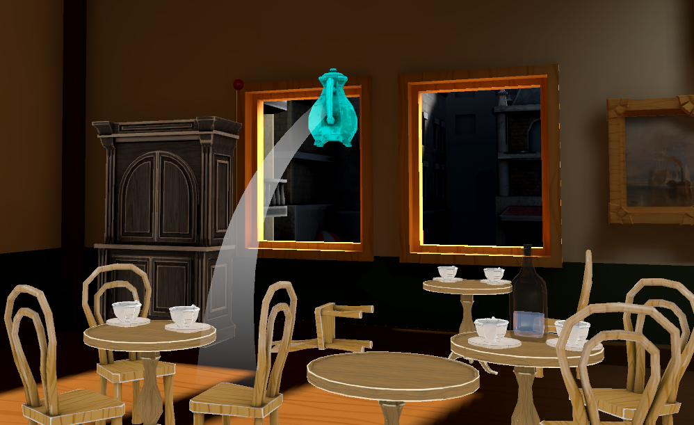

## Default behaviors

Out-of-the-box, a newly added `ForceToolConfig` makes the physics bodies behave as follows:

- You can **grab and carry** the object with ForceTool.
- While you're grabbing the object, if the object is farther away than about two meters, a **tether** (a semi-transparent white line) appears between your avatar and the object you're holding. The tether is visible both to you and to anyone else in the room. To disable or customize the tether, see [Tether settings](#tether-settings).
- As you carry the object, its upright axis will remain upright, even if you move the object up or down. To change this behavior, see rotation constraints in [Constraint Setup and Reference settings](#constraint-setup-and-reference-settings).
- As you carry the object, the side of the object that was facing you when you grabbed it will continue facing you, even if you turn. This gives you some control over the object's orientation around the vertical axis. To change this behavior, see targeting constraints in [Constraint Setup and Reference settings](#constraint-setup-and-reference-settings).
- ForceTool applies a default motion behavior regardless of the object's `Rigidbody` mass. To change this behavior, see [Positional and Rotational Motion settings](#positional-and-rotational-motion-settings).
 
The following section details how you can customize and override this default behavior.

## Experimental settings

**WARNING**: The interaction with physics objects will be moved to a new architecture that's currently under construction. It's not yet clear which of the current experimental features will be reimplemented in the new model and whether a migration of the individual settings will be possible. Feel free to use the experimental settings until we can offer a replacement, but keep in mind that we don't expect to offer any kind of long term support for them.

### Activating experimental settings

* By default, no settings in the Inspector
* Menu allows activating experimental configuration
* Button allows hiding settings, unless non-default settings are present

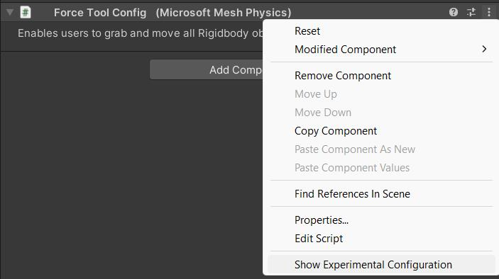

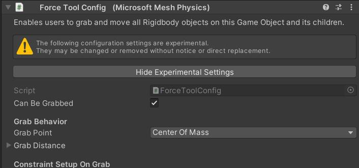

**Settings**

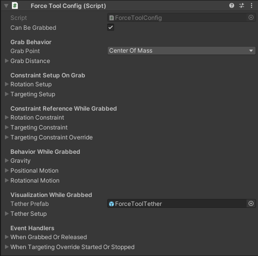

### Can Be Grabbed setting

This option controls whether you can or can't use ForceTool to grab and carry the object (default: on).

Switching this off disables ForceTool for these objects, and all the other settings are effectively ignored. You can use this to make certain physics objects un-grabbable when they would otherwise be considered grabbable by way of another `ForceToolConfig` further up the transform hierarchy, or you can switch this option at runtime (for example, through an event)  to make an object grabbable or un-grabbable in line with your gameplay logic.

### Grab Behavior settings

These settings control where you're grabbing the object, how far it can be away when you attempt to grab it, and whether (and how) it moves to a closer distance once you have grabbed it.

The **Grab Point** setting affects which point the object will rotate around as you're carrying it. The setting has the following options:

- **Focus Point** makes you grab the object exactly at a point along the line of your aim. The point you're grabbing will be at the half-way point between the surface you're looking at and the corresponding surface on the opposite side. This means you're always grabbing a point within the substance of the object.
- **Center Of Mass** makes you grab the object exactly at its `Rigidbody` center of mass regardless of where you aimed. If the center of mass is away from the line of your aim, this means the object will rotate around a point that's not underneath your visual focus point.
- **Center Of Mass Moves to Focus Point** makes you grab the object at its `Rigidbody` center of mass but will then move the object so that its center of mass becomes coincident with your visual focus point. This combines the benefits of the first two options but also makes the object start moving as soon as you've grabbed it.

The **Grab Distance** section contains settings that control the distance between the player and the carried object:  
- **Max Grab Distance** setting controls how far the object can be away when you grab it. If set to _Infinity_, you can grab objects regardless of their distance to you. If set to anything less, objects that are farther away than what you've set can't be grabbed.  
- **Max Carry Distance** setting makes ForceTool automatically pull the object towards you once you've grabbed it. If you're setting this to anything less than **Max Grab Distance**, this means you can grab objects that are far away, but you'll carry them much closer in front of you.  
- **Pull Through Obstructions** option (default: off) controls if ForceTool will apply force when trying to move the object from where you grabbed it to the **Max Carry Distance** you'll be carrying it at. If switched off, ForceTool won't apply any force to move the object closer to you; it'll only move the object closer to you when there's unobstructed space to move the object closer. If switched on, ForceTool applies regular physical forces in all directions, including towards you.

### Constraint Setup and Reference settings

These settings control how the object will rotate while you're carrying it.

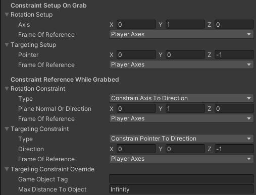

Without further adjustments, a physics object that's being held at a single point would be able to freely rotate around that point – subject to outside physical forces affecting it. Examples of this are when it's dragged over the ground, or when one of its corners hits another solid object.

The **Constraint Setup on Grab** and **Constraint Reference While Grabbed** settings give you control over the object's degrees of freedom as it's being carried. You can't make a carried physics object penetrate another solid object using these settings, but you can completely control how the carried object will orient itself when it would otherwise just freely rotate.

Constraints are defined by way of two separate axes:

- The **Rotation** axis has highest precedence and can be constrained to either two degrees of freedom (onto a plane) or just one degree of freedom (in a direction).
- The **Targeting** axis, which applies after the **Rotation** axis constraint has been satisfied, can further constrain the object's rotation by another degree of freedom.

Both axes are _defined_ in relation to the grabbed object's own coordinate frame in the moment the object is grabbed. You can use the **Constraint Setup on Grab** settings to control exactly how these axes are going to be oriented in relation to the grabbed object.

Both **Rotation Setup** and **Targeting Setup** let you define an **Axis** vector, which can be normalized but doesn't have to be within a given **Frame of Reference** chosen from the following options:

- **Camera Axes** keep the Z axis pointed in the player's look direction and the X axis pointing to the right of the player's look direction.
- **Player Axes** keeps the Y axis vertically oriented along gravity (positive Y values point upwards), the Z axis horizontally in the player's look direction, and the X axis pointing to the right of the player's look direction.
- **Body Axes** use the object's own frame of reference. This is the only setting that makes ForceTool completely disregard the object's current orientation when it's being grabbed.
- **World Axes** uses the scene's frame of reference.

Regardless of the **Frame of Reference** chosen for constraint setup, the defined axis will stick to the body's frame of reference once it has been defined.

Then, while the object is being carried, ForceTool will rotate the object (as much as it can without causing objects to penetrate) so that these axes meet the corresponding _reference_ axes. You can use the **Constraint Reference While Grabbed** to control exactly how the reference axes are oriented and what kind of constraint they must satisfy.

Both **Rotation Constraint** and **Targeting Constraint** let you, again, define an **Axis** vector within a given **Frame of Reference** chosen from the same options as during setup (except there's no "Body Axes" option here because the axes defined during constraint setup are themselves defined in relation to the object's frame of reference). The reference axes defined here are re-evaluated continuously while the object is being carried.

The **Rotation Constraint > Type** setting allows you to specify which type of constraint ForceTool will apply to the **Rotation** axis:

- **Unconstrained** applies no constraint – the **Rotation** axis can move freely in any direction.
- **Constrain Axis to Plane** forces the **Rotation** axis onto a 2D plane in space, reducing the object's degrees of freedom by one. The plane's orientation is defined by interpreting the **Plane Normal or Direction** vector as the plane's normal vector (in other words, a vector perpendicular to the plane).
- **Constrain Axis to Direction** forces the **Rotation** axis in a direction in space, reducing the object's degrees of freedom by two. The axis orientation is defined by interpreting the **Plane Normal or Direction** vector as this direction.

The **Targeting Constraint > Type** setting allows you to specify whether ForceTool will apply a constraint to the **Targeting** axis:

- **Unconstrained** applies no constraint – the **Targeting** axis can move freely in any direction (subject to the **Rotation** constraint, which has precedence).
- **Constrain Pointer to Direction** forces the **Targeting** axis to rotate towards its reference.

The **Targeting Constraint Override** settings let you temporarily override the **Targeting Constraint** settings when the carried object comes close to a certain other object. When the override is active, the **Targeting Setup** vector is made to point towards the other object's transform position.

- **Targeting Constraint Override > Game Object Tag** specifies the other object (or objects) by their tag – if this setting is left empty, the **Targeting Constraint Override** is disabled.
- **Targeting Constraint Override > Max Distance to Object** limits the distance to the other object (from the carried object's center of mass) within which the targeting override becomes active.

### Gravity settings

These settings control if (and how) gravity affects the carried object.

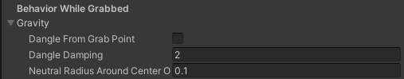

The **Dangle from Grab Point** setting specifies if gravity affects the carried object at all (default: off). Switching this on makes ForceTool rotate the object so that the object's center of mass ends up right below the grab point (see Grab Behavior settings).

The **Dangle Damping** setting applies additional damping to the angular motion when the carried object is dangling. If this is set to zero, no additional damping is applied – in this case, only the regular `Rigidbody` angular drag is used.

The **Neutral Radius Around Center of Mass** defines how close to the object's actual center of mass you must grab the object to avoid any rotation towards gravity. In all cases, if you grab an object _exactly_ at its center of mass, since there won't be any leverage to rotate towards gravity, it won't rotate (due to the **Gravity** settings, at least). The **Neutral Radius** extends this behavior to the given radius around the center of mass.

### Positional and Rotational Motion settings

These settings control the motion behavior (and through that, the perceived mass and inertia) of the object when it's being moved with ForceTool.

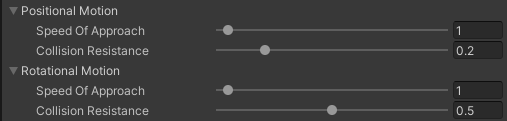

Both **Positional Motion** and **Rotational Motion** can be controlled separately.

- **Positional Motion** affects how the carried object's _position_ approaches the point you're aiming ForceTool at.
- **Rotational Motion** affects how the carried object rotates around its grab point (see Grab Behavior settings) to satisfy the constraints you've defined (see Constraint Setup and Reference settings).

In both sections, **Speed of Approach** controls how _quickly_ the goal position or rotation is being approached: greater values make the object move faster (making it appear lighter), lower values make it move more slowly (making it appear heavier).

The **Collision Resistance** setting specifies the ratio between the velocity imposed by the physics engine's influence&#8212;for example, to avoid solid objects penetrating one another&#8212;and the velocity applied by ForceTool to move the object. This setting has little effect on the object's observable behavior and changing it is discouraged; it's best to leave it at its default value.

### Tether settings

These settings control the appearance of the visual tether (a semi-transparent white line connecting the player and the carried object).

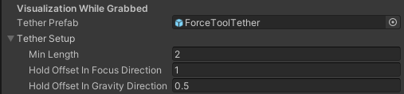

The **Tether Prefab** reference defaults to the bundled `ForceToolTether` prefab. To disable the visual tether, set it to **None**.

The **Tether Setup** settings control aspects of whether and where the tether is displayed:

- **Min Length** defines the minimum distance between the tether "hold" point on the player's end (subject to the **Hold Offset** settings below) and the grab point on the carried object's side (see Grab Behavior settings). If the distance is less than **Min Length**, the tether is hidden; otherwise, it's shown.
- **Hold Offset in Focus Direction** moves the "hold" point on the player's side in the player's look direction.
- **Hold Offset in Gravity Direction** moves the "hold" point on the player's side in gravity direction&#8212;for example, vertically down.

If you'd like to customize the tether, you can provide your own prefab for the **Tether Prefab** setting:

- One instance of this prefab is created (on each network client) each time an object is grabbed.
- The prefab instance is parented to the carried object, so it moves along with the object as it's being carried around.
- If the prefab has a `LineRenderer` (like the default `ForceToolTether` prefab), the line's vertices will be automatically positioned along a nice arc that extends from the player to the object, and its colors are made to fade in and out as the tether is created and destroyed.

You can use this to create additional client-side effects on the carried object's side (for example, particle effects like dust, sparks, or steam) and to adjust the look of the tether to the overall look of your scene (or the carried object).

### Event Handlers

ForceTool can fire certain events as the object is grabbed, carried, and released. To learn about how to attach to these events, see [Shared Events](#shared-events).

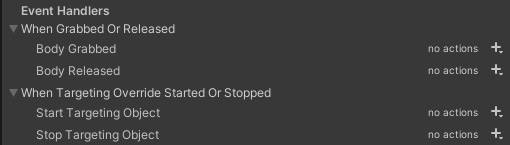

All events are fired only on the client of the player who is using ForceTool to interact with the object.

**Settings**

The **When Grabbed or Released** section covers events that are fired as the player starts and stops using ForceTool to interact with an object:

- **Body Grabbed** is fired when the object is grabbed.
- **Body Released** is fired when the object is released. (Unless the body is already resting on the ground, this is the point when it will start falling due to gravity.)

The **When Targeting Override Started or Stopped** section covers events that are fired when a targeting override (see Constraint Setup and Reference settings) becomes active or inactive:

- **Start Targeting Object** is fired when the carried object comes sufficiently close to an eligible target object for the targeting override to become active.
- **Stop Targeting Object** is fired when the targeting override becomes inactive. This includes the situation when the object is released while a targeting override is in effect – this means you can rely on each **Start Targeting Object** event being (eventually) followed by a corresponding **Stop Targeting Object** event.

## Recipes

The many `ForceToolConfig` options – especially around constraints – can be daunting, so here are several practical recipes (also seen in our _Dart Room_ sample scene) to illustrate how we've set up `ForceToolConfig` to arrive at different behaviors.

### Default – move and turn any object

The default configuration is designed to give the player some small amount of control over random objects.

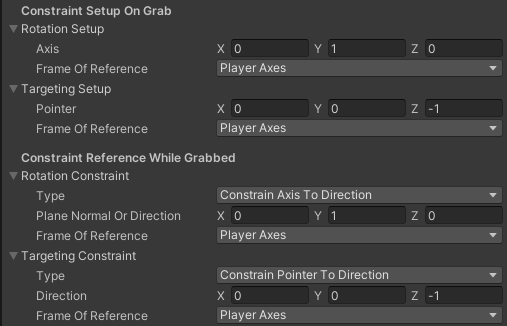

Since these could be any kind of object at all, ForceTool can't make any assumptions about their shape or preferred orientation, so it just allows the player to turn the body around its vertical axis (along with the player themselves turning) and otherwise keeps it in the same orientation in which it was picked up.

To maintain the vertical axis...

- Constraint setup: Define **Rotation** body axis to be vertical in the world – (X=0, Y=1, Z=0) in **World Axes** or **Player Axes**
- Constraint reference: Define **Rotation** reference axis the same and choose **Constrain Axis to Direction**
- To make the body always turn the same face towards the player...
- Constraint setup: Define **Targeting** body axis to point towards the player – (X=0, Y=0, Z=-1) in **Player Axes**
- Constraint reference: Define **Targeting** reference axis the same and choose **Constrain Pointer to Direction**

### Darts – pull close, point away

Darts have an additional `ThrowableBody` behavior attached to them that makes them fly away in the direction of their local Z axis when released from ForceTool's grip, and a `StickBody` behavior that makes them stick to whatever surface they hit.

These additional behaviors aren't the subject of this recipe. We want to show, however, how to configure ForceTool in such a way that the dart can be grabbed, gets pulled close to the player's eye, and aligns itself in the player's direction of aim. As a bonus feature, we'd like to give the dart a degree of freedom so it can freely spin while held.

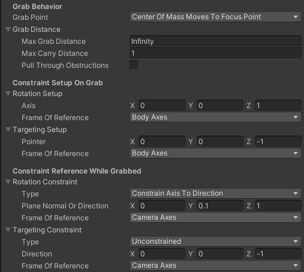

To make sure the center of the dart is in the center of the focus ray...

- Set **Grab Point** to **Center of Mass Moves to Focus Point**.

To align the dart's axis along the player's aim...

- Constraint setup: Define **Rotation** body axis to be along the dart's longitudinal axis – for the dart, (X=0, Y=0, Z=1) in **Body Axes**.
- Constraint reference: Define **Rotation** reference axis to be parallel to the player's aim – (X=0, Y=0, Z=1) in **Camera Axes** using **Constrain Axis to Direction**.

To pull the dart close to the player's eye...

- Set **Grab Distance > Max Carry Distance** to somewhere close (one meter from the camera's point of view).

It doesn't look all that great for the player if they're looking straight at the exact back end of the dart. It's nicer (and adds a bit of darts-throwing challenge) if they get to look at the dart from slightly above. To achieve that effect, the dart's **Rotation** reference axis is set up to be _not exactly parallel_ to the player's aim but instead angled up a little by defining it to be (X=0, Y=**_0.1_**, Z=1) in **Camera Axes**.

That's all there needs to be for constraints. The **Targeting** constraint is irrelevant here because the **Rotation** constraint, as set up above, sufficiently constrains the dart's orientation down to one degree of freedom (which allows it to spin freely around its length).

### Chairs and tables – return to upright orientation

Toppling over chairs and tables is lots of fun, but it'd be nice to be able to put them back in their proper upright position, too.

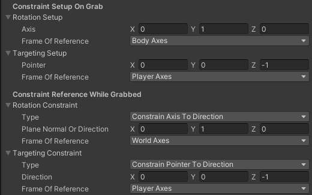

This is just a small variation of the default behavior: Instead of maintaining the vertical axis _as it was present_ when the chair or table is picked up, we're defining it in terms of the body's own frame of reference.

To rotate the body into an upright position...

- Constraint setup: Define **Rotation** body axis to be vertical in the body's frame of reference – for chairs and tables, (X=0, Y=1, Z=0) in **Body Axes**.
- Constraint reference: Define **Rotation** reference axis to be vertical in the world – (X=0, Y=1, Z=0) in **World Axes** or **Player Axes**.

The **Targeting** constraint is set up per default settings to allow the player to turn the chair or table around its vertical axis.

### Cabinets – dangle from the grab point

Cabinets could easily be set up just like chairs and cabinets, but to add a little twist to their behavior, you can turn them any way you like with ForceTool simply by grabbing them off-center and allowing them to dangle down.

To make sure the cabinets are grabbed at the focus point instead of their center of mass...

- Set **Grab Point** to **Focus Point**.

To enable gravity...

- Enable **Gravity > Dangle from Grab Point**.

To disable all other constraints to allow gravity to take over...

- Constraint setup: Not relevant because both constraints are getting disabled.
- Constraint reference: Set both **Rotation** and **Targeting** to **Unconstrained**.

Disabling the **Rotation** and **Targeting** constraints gives the cabinet all three degrees of rotational freedom, which are then taken over by gravity pulling the cabinet's center of mass downwards from the grab point.

# Developing enhanced Mesh Physics content

## Auto-play animations

You can add auto-play animations to the scene that interact with physics bodies. Those animations are automatically synchronized across clients by temporarily adjusting their playback speed (slowing them down or speeding them up) on each client until all clients are in the same animation state at the same time.

**Settings**

- **Play Automatically** enabled.
- **Animate Physics** recommended (but not required) if the animation affects colliders that interact with physics bodies.
- **Culling Type** set to "Always Animate" (automatically enforced by Mesh Physics) because the animation might affect physics bodies even when they're off-screen.

The animation clip used by the auto-play animation can use any **Wrap Mode**. Useful choices are "Loop" and "Ping Pong".

Optionally, you can add the Shared Animation script to control the potential speed adjustment range. We recommend that you set the minimum relative speed to significantly less than 1 and the maximum relative speed to signficantly greater than 1 to allow Mesh Physics to quickly approach the synchronized state and to get insight into which colliders and kinematic rigid bodies Mesh Physics views as part of the animation.

## Other (shared) physics behaviors

Adding one of the following `MonoBehaviour` components to an object will add the specific behavior to this object.

### Throwable Body

Allows you to throw bodies such as snowballs, balls, darts, bowling balls, and more. It has a fixed velocity so it cannot be used, for example, for tossing a basketball into a hoop. Right now, the throw direction is defined in body space, so you want to use the `ForceToolConfig` to align your body with the camera.

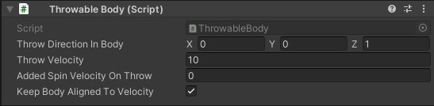

**Settings**

- **Throw Direction in Body:** The throw direction is specified in the body space of the body you grab. Note that you can use ForceToolConfig to control the body rotation and thereby the throw direction.
- **Throw Velocity:** A fixed velocity in meters/second to throw a body.
- **Added Spin Velocity on Throw:** Once the body is thrown, you can add an angular velocity around the throw axis, like the spin of a bullet shot from a real gun (degrees/second).
- **Keep Body Aligned to Velocity:** If set, the thrown body will rotate to match the path of its trajectory, like a flying arrow making a gently curve downwards.

### Sticky Body

Makes bodies stick to other bodies. It could be used to throw darts at other bodies or to attach a picture on a wall. This is implemented by creating a fixed constraint between the two bodies involved.
**Note:** This operation is performed on all clients and therefore is implemented as a special network message.

**Settings**

- **Stick:** Defines if the body will stick to dynamic or/and static bodies.
- **When:** Sometimes you want to stick a fast body when it just touches another body, and sometimes you want to stick a body when it is held against another body for a given time, like waiting for glue to harden when you glue a button on a wall.
- **Collision Control** To disable specific collisions between one body and another. Normally you can/should use collision layers. However, since there are only 32 hard-coded collision layers in Microsoft Mesh, this might not be an option. Here you can disable specific bodies.
- **Affected Bodies For Collision** Body filter applied for **Collision Control**.
- **Stickiness Events** Allows for triggering [Shared events](#shared-events) in response to stick/unstick events.

### Sticky Body Trigger

Attached to a trigger collider (for example, a collider whose **Is Trigger** option is switched on). Changes the behavior of any `StickyBody` that enters or leaves the trigger.

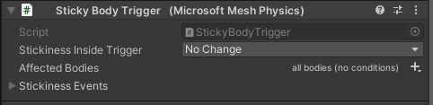

**Settings**

- **Stickiness Inside Trigger** overrides the "enabled" state of the `StickyBody` behavior while the object the `StickyBody` behavior is attached to is inside the trigger. You can use this to ensure that a body's stickiness is restricted to certain parts of your scene.
  - **No Change** leaves the "enabled" state unaffected.
  - **Sticky Body Enabled** enables any `StickyBody` that enters the trigger and disables it when it leaves the trigger.
  - **Sticky Body Disabled** disables any `StickyBody` that enters the trigger and enables it when it leaves the trigger.
- **Affected Bodies** is a body filter for **Stickiness Inside Trigger**
- **Stickiness Events** fires **On Stick** and **On Unstick** events corresponding to those of all `StickyBody` behaviors currently inside of the trigger. This is useful if you want these [events](#shared-events) to be only fired for bodies while they're within certain parts of your scene (for example, close to a certain wall).

### Reset Body Transforms

Simply resets a subscene. This is very handy for resetting a chess board or cleaning up a room after you made a mess. Gets triggered by a Unity message (send, for example, by the `BuzzerButton`). Simply create a Unity subscene that contains all the bodies that should be affected by the reset script (for example, a chess board) and attach this script to the root of this subscene.

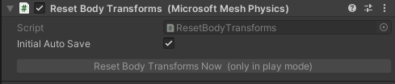

**Settings**

- **Initial Auto Save** automatically saves initial body transforms right after the scene starts. When disabled, body transforms are only saved when the `SaveBodyTransformsNow()` function is called explicitly.

**Functions** – call these through a [Shared Event](#shared-events) (automatically dispatched across all clients):
- `ResetBodyTransformsNow()` transitions the transformations of all bodies to their most recently saved state (subject to the **Transition** settings described above). Bodies that have no saved state are unaffected.
- `SaveBodyTransformsNow()` saves transforms of all bodies underneath the `ResetBodyTransforms` behavior in the transform hierarchy.

### Trigger Events Sensor

You can add this component to a trigger collider (in other words, a Game Object that has **Is Trigger** selected in its Collider component) to determine which events are fired when a Game Object enters and exits the trigger collider.

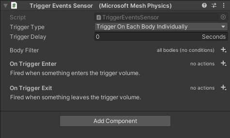

**Settings**

**Trigger Type**

You have two options for the Trigger Type:

**Trigger On Each Body Individually:** execute Enter and Exit events for each body that enters or exits the trigger volume individually.

**Trigger On Emptiness Change:** this can be useful for a scenario where several Game Objects might enter and exit the trigger volume at approximately the same time but you don’t want to fire events each time this happens. With this option selected, **On Trigger Enter** is fired when the first Game Object enters the trigger volume. Other Game Objects can enter and exit the trigger volume, but no other events are fired until the last Game Object exits, leaving the trigger volume empty. When that Game Object exits, **On Trigger Exit** is fired.

**Trigger Delay**

This is the delay (in seconds) between the moment a body enters or exits the trigger volume and the moment the corresponding event is executed.

**Body Filter**

Any Game Object that enters the trigger volume in its default state is eligible to trigger entry and exit events subject to the **Trigger Type** setting. You can use the **Body Filters** setting to make only Game Objects that meet certain conditions eligible for triggering events. To learn more, see the [Body Filter section](#body-filter).

**On Trigger Enter** and **On Trigger Exit**

These are considered to be [Shared Events](#shared-events). As the names imply (and the UI explains), these determine which Actions are fired when a Game Object enters or exits the trigger volume.

### Collision Events Sensor

You can add this component to a physics collider (in other words, a Game Object that does **not** have **Is Trigger** selected in its Collider component) to determine which events are fired when a Game Object enters and exits the collision with this collider.

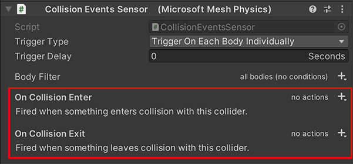

**Settings**

**Trigger Type**

You have two options for the Trigger Type:

**Trigger On Each Body Individually**: execute Enter and Exit events for each body that enters or exits the collision individually.

**Trigger On Emptiness Change**: this can be useful for a scenario where several Game Objects might collide at approximately the same time but you don’t want to fire events each time this happens. With this option selected, **On Collision Enter** is fired when the first Game Object collides with this game object. Other Game Objects can collide, but no other events are fired until the last Game Object exits collision. When that Game Object exits, **On Collision Exit** is fired.

**Trigger Delay**

This is the delay (in seconds) between the moment a body collides and the moment the corresponding event is executed.

**Body Filter**

Any Game Object that collides in its default state is eligible to trigger entry and exit events subject to the **Trigger Type** setting. You can use the **Body Filters** setting to make only Game Objects that meet certain conditions eligible for triggering events. To learn more, see the [Body Filter section](#body-filter).

**On Collision Enter** and **On Collision Exit**

These are known collectively as “Shared Events.” As the names imply (and the UI explains), these determine which actions are fired when a Game Object enters or exits the collision. To learn more, see the [Shared Events section](#shared-events).

### Containment Field

Ensures that rigid bodies stay within the boundaries of one or several trigger colliders.

For this component to work, it needs to be attached to one or several trigger colliders. (These trigger colliders can also be nested in the transform hierarchy below the `GameObject` that has this component attached.)

The rigid bodies affected by this component must already be within the boundaries of its trigger colliders (the "trigger volume") when the scene starts. The center of mass of each of these rigid bodies will then be constrained to stay within the boundaries of the trigger volume – it won't be possible to pull or otherwise move the centers of mass of these rigid bodies anywhere outside.

**Settings:**

- **Max Deviation From Containment** allows the center of mass of an affected rigid body to slightly go outside of the trigger volumes before it snaps back in. This is a performance optimization trade-off: if the allowed max deviation is large, the body might visibly leave the trigger volume and snap back, but the code can avoid having to check and verify the body's position very often when it's resting or moving slowly inside of the trigger volume.
- **Affected Bodies** defines [optional filtering conditions](#body-filters) for the bodies affected by this component. (By default, all bodies are affected.)

### Velocity Vector

Allows to accelerate/decelerate a rigid body until it reaches a specific target velocity.

This component controls both the magnitude and the direction of velocity. See [Velocity Magnitude](#velocityfield) to control only magnitude and [Velocity Direction](#steerfield) to control only direction.

This component has two modes of operation:

- If attached to a rigid body, this rigid body will be controlled.
- If attached to a trigger collider, all rigid bodies entering this trigger volume will be affected.

**Settings:**
- **Velocity Type** defines whether we are working on linear or angular velocity.  
- **Direction in Local Space** defines whether target velocity is specified in the local space of the object the component is attached to.  
- **Target Velocity** sets the desired velocity vector in meters/second (or radians/second in case of angular velocity).  
- **Max Acceleration** defines the maximum acceleration applied to reach target velocity.  
- **Acceleration Type** defines a type of acceleration to reach a target velocity.  
  - **Instantaneous** will reach the target velocity immediately (Same as **Constant Acceleration** with **Max Acceleration** = Infinity).  
  - **Constant Acceleration** will ensure the body reaches target velocity no matter what within the limits of the **Max Acceleration** setting.  
  - **Smooth Approach** reduces acceleration the closer you get to target velocity. This means that, in practice, you will never reach the target velocity. Also, should there be any external influence, like going uphill or downhill, this extra influence will not be completely overridden, resulting in going faster downhill than uphill.  
- **Affected Bodies** defines [optional filtering conditions](#body-filters) for the bodies affected by this component. (By default, all bodies are affected.)

### Scale Gravity Field

Changes how gravity affects rigid bodies within the boundaries of one or several trigger colliders.

For this component to work, it needs to be attached to one or several trigger colliders. (These trigger colliders can also be nested in the transform hierarchy below the `GameObject` that has this component attached.)

Any rigid bodies that touch or overlap the trigger colliders (the "trigger volume") behave according to the gravity settings of this component rather than global physics gravity. Rigid bodies that have **Use Gravity** disabled are ignored.

There is an interesting relationship between the perception of the player's own size in the world and gravity:
- If gravity is **less** than what we're used to (objects are slower when they fall), the player perceives themselves to be larger – like a giant.
- If gravity is **greater** than what we're used to (objects are faster when they fall), the player perceives themselves to be smaller – like a mouse.

**Settings:**

- **Gravity Preset** allows the selection of several interesting and useful presets for the **Gravity Scale** property: various celestial bodies (Moon, Mars, Earth, Jupiter), no gravity (Outer Space), or inverted gravity (Upside Down). You can always overwrite the **Gravity Scale** with any value you like.
- **Gravity Scale** sets the local gravity inside the trigger volume in relation to the default physics gravity affecting the scene. The default gravity scale of 1 leaves gravity unaffected; larger values increase gravity; 0 removes gravity; negative values switch the direction of gravity.
- **Affected Bodies** defines [optional filtering conditions](#body-filters) for the bodies affected by this component. (By default, all bodies are affected.)

### Orbital Gravity Field

Simulates the gravity of a "toy planet" in your scene.

For this component to work, it needs to be attached to one or several trigger colliders. (These trigger colliders can also be nested in the transform hierarchy below the `GameObject` that has this component attached.)

Any rigid bodies that touch or overlap the trigger colliders (the "trigger volume") are pulled towards the position of the object that has this component attached.

**Settings:**

- **Gravity** defines the magnitude of gravity. This is the acceleration of the orbiting body (the "moon") towards the central body at a one-meter distance. Since the orbital velocity is sqrt(gravity/radius), this value describes the velocity² of a moon in a stable orbit at a radius of one meter.
- **Disable Global Gravity** disables the scene's global physics gravity setting for bodies affected by this component. By default, the global scene gravity will still affect your planet and its moons.
- **Affected Bodies** defines [optional filtering conditions](#body-filters) for the bodies that can become moons in this gravity field.

- **Force Moons On Circular Orbit** is a cheat that applies some gentle forces to push the moon into a circular orbit. The motivation is that it is hard for a non-expert to set gravity and initial velocity of the bodies in a way to achieve a circular orbit. Additionally, if this option is enabled, any moons that are placed inside the gravity field in Unity Editor automatically start orbiting their central body when the scene is loaded.
- **Strength Of Forced Orbit** scales the acceleration applied to force the moon onto a circular orbit.
- **Set Forced Radius Where Placed** makes moons that are placed inside the gravity field in Unity Editor automatically adopt their initial distance from the central body as their preferred orbit.
- **Set Forced Radius Where Dropped** makes moons that are interactively grabbed and moved into the gravity field automatically adopt the distance from the central body at which they were dropped as their preferred orbit.
- **Default Force Radius** defines the default radius for the above cheat that's used unless overridden by any of the other options.

### Buoyancy Field

Simulates buoyancy of arbitrary rigid bodies on water: Bodies appear to float on the connected trigger volume.

For this component to work it needs to be attached to one or several trigger colliders. (These trigger colliders can also be nested in the transform hierarchy below the `GameObject` that has this component attached.)

Any rigid bodies that touch or overlap the trigger colliders (the "trigger volume") experience buoyancy forces (upthrust) to keep them afloat.

This component uses the shape of the rigid body's colliders to calculate its density (in other words, volume divided by mass), buoyancy, drag, and friction.

### Buoyancy Colliders

**Benefit**: Performance. The compute cost of the buoyancy calculations scales linearly with the number of collider vertices. Typical physics colliders for bodies, even if already simplified, are often significantly more complex (in terms of number of vertices) than requiresd for buoyancy to work well enough.

**How to use**: Add one (or several) additional colliders (they can be disabled) to a body. Mark the colliders as explicit buoyancy hulls by assigning a physics material named `BuoyancyHull` (exact spelling matters!) to them. The configuration details of this physics material don't matter--a suitable physics material is supplied with the Mesh Physics package. If a body has any colliders marked like that, only these colliders are used for buoyancy calculations; all other colliders are ignored.

**Best practices**: Explicit buoyancy hull colliders to any Rigidbody that can possibly be thrown into a *BuoyancyField*. It's best (and easiest) to use Cube colliders because they have the fewest vertices (eight per collider). Matching the exact visual shape of the buoyant body usually isn't required for a good result; a very coarse approximation is usually totally sufficient.

**Settings:**

- **Density** is the density of the simulated liquid that "fills" the trigger volume in kilograms per cubic meter. (The default represents the approximate density of water at room temperature.)
- **Surface Type** specifies how the component samples the shape of the water surface to calculate buoyancy forces.
  - **Static Flat** assumes that the water surface is perfectly planar and never moves from its initial position in the scene. The position and orientation of the water surface is determined just once, when the scene starts. This is the computationally cheapest option.
  - **Dynamic Flat** assumes that the water surface is perfectly planar but allows that it can move (for example, the water level can rise or sink). The position and orientation of the water surface is determined once per frame.
  - **Dynamic Flat Per Body** supports a water surface that isn't planar (for example, it can be wavy). For each rigid body floating on the water surface, a local planar approximation of the water surface underneath the rigid body is determined once per frame, which is then used to calculate buoyancy forces for this rigid body.
- **Affected Bodies** defines [optional filtering conditions](#body-filters) for the bodies that can float in this buoyancy field. (By default, all bodies are eligible.) 
- **Drag** controls movement resistance as the rigid body hits the water (in other words, friction orthogonal to the body's surface).
- **Skin friction** controls movement resistance as the rigid body is moved through the water (in other words, friction parallel to the body's surface).

**Important!** To allow the component to access a rigid body's collider mesh triangles, the "Read/Write Enabled" checkbox must be set in the collider mesh's Import settings. Otherwise the body will be ignored by the buoyancy field and fall through the field without being affected by it.

**Important!** Make sure that your physics bodies have plausible masses to ensure they behave as expected in a buoyancy field:
- If the mass of a rigid body is implausibly high compared to its volume, it will sink to the bottom.
- If the mass of a rigid body is implausibly low compared to its volume (for example, Unity's `Rigidbody` default of one unit of mass), it will just sit on top of the simulated liquid.

By default, the buoyancy field samples the surface of the trigger volume to determine the shape of the water surface (subject to chosen the **Water Surface Type** setting). Surfaces animated in CPU memory can be sampled that way, but surfaces animated by a GPU vertex shader are not visible to the script at runtime. The `BuoyancyField` component provides a script-accessible callback delegate named `GetDistanceFromSurface` that allows external scripts to supply information about a GPU-animated water surface shape.

See the `BuoyancyFieldWaves` component below for how to get a wavy water surface with a no-code approach.

### Buoyancy Field Waves

Add-on to the `BuoyancyField` component that works with a specific vertex shader, `BuoyancyFieldWaves_VertexPosition` (available both as a sub-shader graph and an HLSL include file), to create the visual effect of a wavy water surface together with corresponding behavior of objects floating on the water surface.

This component must be added to a game object that already has a `BuoyancyField` component added to it.

The water surface to be animated must be supplied as a flat, tesselated mesh whose boundaries are of the desired shape of the water surface when seen from the top down. The material used for the water surface must use a shader that incorporates the `BuoyancyFieldWaves_VertexPosition` sub-shader to determine the mesh's vertex positions. You can use the included sample `BasicWavyWaterSurface` material (and the shader graph with the same name) as a starting point for your own shader developments.

**Settings:**

- **Waves Mesh Renderer** references the `MeshRenderer` component that renders the water surface mesh.
  - **Material** shows which material is used by the renderer. This is for information only.
  - **Shader** shows which shader is used by the material. This is for information only.
- **Waves Shader Property Names** defines the names of required shader properties that must be exposed by the shader. These properties are accessed by this component at runtime to ensure that the buoyancy field's behavior stays in sync with the water surface visuals across all clients.
  - **Script Controlled Time** is the name of an exposed `float`-type shader property that will be _continually updated_ by this component every frame with a continually increasing time (measured in seconds) that is synchronized across all clients. The `BuoyancyFieldWaves_VertexPosition` sub-shader uses this shared time to create a wave pattern that remains in sync on all clients and in sync with the behavior of the buoyancy field.
  - **Wave Speed** is the name of an exposed `float`-type shader property that determines the _base speed_ at which the waves propagate horizontally. The property value itself must be set in the material applied to the wave surface mesh. Setting this to zero makes the wave surface become static and unmoving.
  - **Wave Length** is the name of an exposed `float`-type shader property that determines the _coarseness_ of the wave pattern. The property value itself must be set in the material applied to the wave surface mesh. Smaller values produce short ripples; larger values produce long, sweeping waves.
  - **Wave Height** is the name of an exposed `float`-type shader property that determines the _base height_ of the waves. The property value itself must be set in the material applied to the wave surface mesh. Setting this to zero makes the wave surface become completely flat.

The included sample `BasicWavyWaterSurface` shader graph (used by the material with the same name) uses the required `BuoyancyFieldWaves_VertexPosition` vertex sub-shader to produce the wavy 3D surface, but only includes a minimal stand-in implementation for the fragment shader, which makes it render the surface as an unshaded, plain-colored, semi-transparent mesh.

You can customize the **Fragment** path of a shader used with the `BuoyancyFieldWaves` component completely to your liking. However, it's essential that the **Vertex** path of your shader uses the `BuoyancyFieldWaves_VertexPosition` sub-shader graph and that it exposes the four inputs to this sub-shader graph as `float`-type shader properties of the overall shader graph so that the component can access them at runtime. If your shader fails to include the required sub-shader graph or if any of the required shader properties aren't exposed, the component's inspector will display an error message at design time and buoyancy will fail to work at runtime:

The sample `BasicWavyWaterSurface` shader graph can serve as a stand-in during content development and as a starting point for your own shader developments. Alternatively, you can take an existing water surface shader, keep its **Fragment** path, and only replace its **Vertex** path.

### Max Angular Velocity

Overrides the default maximum angular velocity of a physics body.

The physics engine won't allow the rigid body to exceed this angular velocity. This can be useful to either limit the rolling speed of a given rigid body or to allow it to roll faster than the physics default, which is 50 radians per second (approximately 8 revolutions per second).

The maximum angular velocity must be entered in radians per second. The entered value is also displayed in degrees per second (180 degrees ≈ 3.14 radians) and revolutions per second (1 revolution = 360 degrees ≈ 6.28 radians).

### Velocity Magnitude

Allows acceleration/deceleration of a rigid body until it reaches a speed that's within an allowable range.

This component controls the magnitude of the velocity and keeps the current direction. Should the object be still, it chooses a random direction for the duration of one frame.

This component has two modes of operation:

- If attached to a rigid body, this rigid body will be controlled.
- If attached to a trigger collider, all rigid bodies entering this trigger volume will be affected.

**Settings:**
- **Velocity Type** defines whether we are working on linear or angular velocity.
- **Speed Limits** sets the desired limits of minimum and maximum speed in meters/second (or radians/second in case of angular velocity). If the current speed is below the minimum it will accelerate, if it is more than the maximum the body will decelerate. If the current speed is already within the limits, the script has no effect. To set a specific target speed, set minimum and maximum to the same value.
- **Max Acceleration** defines the maximum acceleration applied to reach target velocity.
- **Acceleration Type** defines a type of acceleration to reach a target velocity.
  - **Instantaneous** will reach the speed limit immediately (Same as **Constant Acceleration** with **Max Acceleration** = Infinity).
  - **Constant Acceleration** will ensure the body reaches target velocity no matter what within the limits of the **Max Acceleration** setting.
  - **Smooth Approach** reduces acceleration the closer you get to target velocity. This means that, in practice, you will never reach the target velocity. Also, should there be any external influence, like going uphill or downhill, this extra influence will not be completely overridden, resulting in going faster downhill than uphill.
- **Affected Bodies** defines [optional filtering conditions](#body-filters) for the bodies affected by this component. (By default, all bodies are affected.)

### Align Field

Aligns the body to the specified axis.

This component adds torque to the body to align it to a specific direction. Note that torque is always applied in the direction that rotates the body towards the target.

**Setings:**
- **Target Alignment** sets the target direction of the alignment.
- **Align In Local Space** specifies whether **Target Alignment** is defined in a local space of the body.
- **Torque Multiplier** sets the amount of torque applied (between 1 and 1000).
- **Rigidbody Axis** sets the axis of the affected rigidbody which is to be aligned to the target.
- **Angular Drag** sets the damping factor.
- **Affected Bodies** defines [optional filtering conditions](#body-filters) for the bodies affected by this component. (By default, all bodies are affected.)

### Velocity Direction

Allows to steer a rigid body until the velocity reaches a target direction.

This component controls only the direction of the velocity and keeps the current speed.

This component has two modes of operation:

- If attached to a rigid body, this rigid body will be controlled.
- If attached to a trigger collider, all rigid bodies entering this trigger volume will be affected.

**Settings:**
- **Velocity Type** defines whether we are working on linear or angular velocity.
- **Follow Game Object** defines whether the target is a predefined direction or a direction towards a specific Game Object. Only works for linear velocity.
- **Target Body** sets the desired follow direction in case **Follow Game Object** is set to true.
- **Target Direction** sets the desired direction. This value is normalized, so magnitude has no effect.
- **Direction In Local Space** defines whether the direction is specified in a local transform of the explosion.
- **Max Acceleration** defines the maximum acceleration applied to reach target velocity.
- **Acceleration Type** defines a type of acceleration to reach a target velocity.
  - **Instantaneous** will reach the target direction immediately (Same as **Constant Acceleration** with **Max Acceleration** = Infinity).
  - **Constant Acceleration** will ensure the body reaches target velocity no matter what within the limits of the **Max Acceleration** setting.
  - **Smooth Approach** reduces acceleration the closer you get to target velocity. This means that, in practice, you will never reach the target velocity. Also, should there be any external influence, like going uphill or downhill, this extra influence will not be completely overridden, resulting in going faster downhill than uphill.
- **Affected Bodies** defines [optional filtering conditions](#body-filters) for the bodies affected by this component. (By default, all bodies are affected.) 

### Magnetic Body

Gives body a magnetic property which attracts or repels other bodies.

For this component to work, it needs to be attached to one or several colliders. (These colliders can also be nested in the transform hierarchy below the `GameObject` that has this component attached.)
Each collider exhibits a force on other rigidbodies that are close enough to this collider.

**Settings:**

- **Strength** defines the acceleration of the magnet at the point of contact (when the distance between colliders is zero).
- **Distance Of Influence** controls the range of the magnetic force. Magnetic force is applied only if the shortest distance between colliders is smaller.
- **Field Type** defines how the magnetic force weakens with the distance.
  - **Constant** assumes that the magnetic force is the same independent of the distance.
  - **Linear** assumes that the magnetic force drops linearly from **Strength** to zero (at the **Distance Of Influence**).
  - **Inverse** assumes an inversely proportional dependence to the distance.
  - **Inverse Squared** assumes an inversely proportional dependence to the distance squared (similar to a real magnet).
- **Magnetic Pole** controls which objects are attracted or repeled to this object.
  - **North Pole** attracts **South Pole** and repels **North Pole**.
  - **South Pole** attracts **North Pole** and repels **South Pole**.
  - **Magnetic** attracts both **South Pole** and **North Pole**.
- **Disable Gravity On Contact** If enabled **and** **Strength** of the magnet is two times bigger than gravity, gravity is disabled for bodies which are in contact with this magnet. One of the objects must be static for this to take an affect. This is often used to prevent sliding of bodies down the wall.

### Spherical Explosion

Creates an explosion which causes all bodies within a specific radius to move outwards.

The explosion force depends on the mass of a rigid body (and potentially the distance from the explosion center).

**Settings:**

- **Strength** defines the effect of explosion on bodies in meters/second. The actual velocity change is less depending on the **Explosion Type** and **Critical Mass** (see below).
- **Distance Of Influence** controls the range of the explosion force.
- **Field Type** defines how the explosion effect weakens with the distance.
  - **Constant** assumes that the effect is independent from the distance.
  - **Linear Drop** assumes that the effect drops from maximum to zero (at the **Distance Of Influence**).
- **Critical Mass** defines the mass of the body not affected by the explosion. Heavier bodies feel less effect than ligher bodies. For example rigidbody that weighes one third of **Critical Mass** will feel two thirds of the **Velocity Change**.
- **Angular Impulse Scale** defines where the force is applied.If 0, force is applied at the centre of mass which means no rotation. If 1, force is applied at the closest point to the explosion.
- **Occlusion** If enabled, objects hidden behind other objects do not feel explosion. Only a single ray between the center of explosion and the center of mass is checked for occlusion.

### Directional Explosion

Creates an explosion which causes all bodies within a trigger to move in a specific direction.

The explosion force depends on the mass of a rigid body.
For this component to work, it needs to be attached to a trigger colliders. All bodies within trigger collider are affected.

**Settings:**

- **Strength** defines the effect of explosion on bodies in meters/second. The actual velocity change is less depending on the **Critical Mass** (see below).
- **Direction** defines the direction of explosion. This value is normalized, so magnitude has no effect.
- **Direction In Local Space** defines whether the direction is specified in a local transform of the explosion.
- **Critical Mass** defines the mass of the body not affected by the explosion. Heavier bodies feel less effect than ligher bodies. For example rigidbody that weighes one third of **Critical Mass** will feel two thirds of the **Velocity Change**.
- **Angular Impulse Scale** defines where the force is applied.If 0, force is applied at the centre of mass which means no rotation. If 1, force is applied at the closest point to the explosion.
- **Affected Bodies** defines optional filtering conditions for the bodies affected by this component. (By default, all bodies are affected.)

### Joint Stabilization

Stabilizes constraint system by adjusting the rigidbody's inertia tensor.

The script works on all children with Rigidbody and Joint component attached.

**Settings:**

- **Stabilization Factor** defines how much you sacrifice physical correctness for stability. For example, 1 -> mostly physics correct, 4 -> compromise, 10 -> stable with atifacts.
- **Joint Projection** enables constraint projection on all children, this can dramatically improve stability but sacrifices physical correctness. (Only works on Configurable and Character Joints.)
- **Projection Distance** defines maximum allowed violation of constraints, try to set this value as high as possible to avoid physics issues.

### Bouncing Surface

Creates a bouncing surface which causes all colliding objects to bounce off with a predefined velocity.

**Settings:**

- **Bounce Velocity Magnitude** defines the min and max velocity magnitude of the object after the bounce. See **Bounce Effect** for how direction is determined. Set min and max to equal value if you want to specify a single target velocity.
- **Bounce Effect** defines the intended behaviour of bouncing objects
  - **Perfect Bounce** the angle of incoming velocity to the collision plane normal is the same as the angle of outgoing velocity.
  - **Set Velocity Magnitude** the angle of the outgoing velocity to normal is affected by friction.
  - **Set Normal Velocity** similator to **Set Velocity Magnitude** but the **Bounce Velocity Magnitude** defines the magnitude of the velocity perpendicular to plane (normal velocity).
  - **Bounce Towards Target Body** the direction of outgoing velocity is directed towards a target Body.
- **Target Body** has to be set if **Bounce Effect** is equal to **Bounce Towards Target Body**.
- **Friction** controls how much tangential velocity is lost upon collision. When set to 0, the bouncing object retains tangential velocity. When set to 1, the object bounces in direction perpendicular to the surface (tangential velocity is 0). For values more than 1, object bounces backwards.

### Center Of Mass Offset

Offsets the center of mass of a rigidbody.

**Settings:**

- **Offset In Local Coordinates** defines the offset in local coordinates.

### Teleport Body

Teleports rigidbody to a new position with optional new rotation, new linear velocity and new angular velocity.

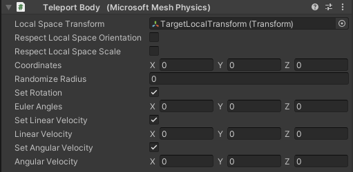

**Parameters:**

- **Local Space Transform** has to be set if teleporting in local space, otherwise, global space is used.
- **Respect Local Space Orientation** defines whether new coordinates, rotation and linear velocity are affected by local space oritentation. (Default is yes.)
- **Respect Local Space Scale** defines whether new coordinates and linear velocity are affected by local space scale. (Default is no.)
- **Coordinates** define the new position after the teleport.
- **Randomize Radius** specifies the radius of the unit sphere around **Coordinates** in which the body is randomly teleported.
- **Set Rotation** set this to true if you want to set the rotation of the body after the teleport. if not set, the object keeps the last orientation before the teleport.
- **Euler Angles** has to be defined if **Set Rotation** is set to true.
- **Set Linear Velocity** set this to true if you want to set the linear velocity of the body after the teleport. if not set, the object keeps the last linear velocity before the teleport.
- **Linear Velocity** has to be defined if **Set Linear Velocity** is set to true.
- **Set Angular Velocity** set this to true if you want to set the angular velocity of the body after the teleport. if not set, the object keeps the last angular velocity before the teleport.
- **Angular Velocity** has to be defined if **Set Angular Velocity** is set to true.

## Common Settings

There are some settings that are common to a number of behavior scripts: **Body Filters** and [**Shared Events**](#shared-events).

### Body Filters

Some components, such as the Trigger Events Sensor and Collision Events Sensor components, have a **Body Filter** setting (usually named **Affected Bodies**).

This setting makes only Game Objects that meet certain preconditions eligible to trigger events. There are four main preconditions&#8212;to view them, click the plus sign ("+") button to the right of **Body Filter:**

 
Some components may have one or more [Shared Events](#shared-events) that trigger an Action. The same preconditions that are available through the **Body Filter** setting can be applied to an Action.

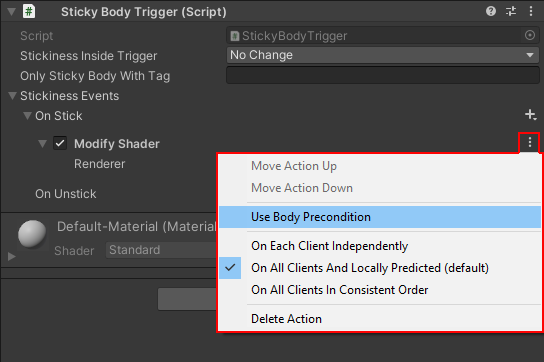

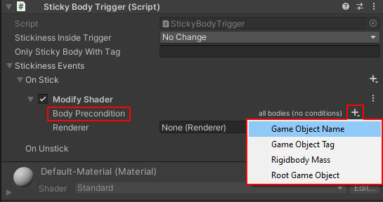

To understand the first precondition, **Game Object Name**, let’s imagine that there’s a dart game in your scene and you have numerous dart Game Objects that are named Dart01, Dart02, Dart03, and so on. You want any dart, but *only* darts, to be eligible to trigger events, so you filter for any Game Object that starts with the four letters "Dart".

1. Click the **Body Filter** "+" button and then select **Game Object Name**.  
1. In the text box next to **Starts With**, type in "Dart."

 
You aren’t restricted to just using **Starts With**. You can filter for exact names, or only names that *end* with certain letters, and more. To see all your options, click the **Starts With** drop-down.

 
**Notes**

- Having multiple instances of the **Game Object Name** condition can make sense in certain situations&#8212;for example, to filter for names that have a given prefix *and* a given suffix.

- Text is case-sensitive.

**To filter for bodies based on their tag:**
- Click the **Body Filter** "+" sign and then select **Game Object Tag**.

The options for this condition are similar to the options for Game Object Name.

**Note:** Tag comparison is case-**in**sensitive.

**IMPORTANT:** Unity allows you to create custom tags, but you can’t use custom tags in Mesh. You must choose one of the pre-defined tags that Unity provides.

**To filter for bodies based on their mass:**
1. Click the **Body Filter** "+" sign and then select **Rigidbody Mass**.
1. Enter the minimum and maximum mass values a Game Object must have in order to trigger events.
 
**Important:** We recommend that you *don’t* have more than one instance of this condition active at any time. You can accommodate all potential Game Objects using a single Min/Max range.

**To filter for bodies based on their root Game Object:**
Let’s say you have a root Game Object named "Robot" in your scene. Robot has numerous child objects&#8212;arms, legs, and so on&#8212;and these have their own child objects. You want Robot and any of the Game Objects in its hierarchy to be eligible to trigger events.

1. Click the **Body Filter** "+" sign and then select **Root Game Object**.
1. Do one of the following:
- Drag the Game Object from the **Hierarchy** and then drop it in the **Root Game Object** field.

-or-

- Click the round button in the **Root Game Object** field …

 
… then, in the **Select GameObject** window, type in the name of Game Object you want to add, and then, in the resulting list, double-click the name of the Game Object.

 
Note that in this example, there are two animal robot types in the scene. If you wanted *all* robots to be eligible for triggering, you could add a **Game Object Name** condition that contains the text "Robot" anywhere in the name. 

 
**Important:** We recommend that you *don’t* have more than one instance of this condition active at any time. This can cause conflicts.

**Filtering with Multiple Conditions**

You can have more than one filter in your condition. For example, let’s say you want only larger or heavier robots&#8212;ones with a higher Mass value&#8212;to trigger events. You could search for Game Object names that contain "Robot" that have a minimum mass value of 100:

 
**Note:** If multiple conditions are defined, a body must match *all* of the conditions to be eligible for triggering events.

**Options on the 3-dot menu**

Each condition has a 3-dot menu with several options.

**Move Condition Up:** Moves the condition one position higher in the **Body Filter** list.

**Move Condition Down:** Moves the condition one position lower in the **Body Filter** list.

**Delete Condition:** Removes the condition from the **Body Filter** list.

**To make a condition active or inactive:**
Select or clear the checkbox to the left of the condition name.

### Shared Events

An *event* is something that happens in the scene. Here are some examples of events:

- Two Game Objects collide.
- There's an ownership change.
- The user presses a button.
- A Game Object enters a [Trigger Volume](#trigger-volume).
- A [Sticky Body](#sticky-body) sticks to a wall.

When an event occurs across all clients rather than just locally, we call it a *Shared Event*. A Shared Event is what we previously called a "UnityEvent"; the differences are:

- Shared Events can be shared across all clients. UnityEvents cannot.

- Unity Events were "open-ended"; you could select a component and then access *any* public properties or methods the component provides. With Shared Events, there’s a standard set of up to a dozen different Actions that are safe to use in a multi-user setup.

There are different types of Shared Events in various components. Some examples:

#### Collision Events Sensor

#### Trigger Events Sensor

#### Stickiness events

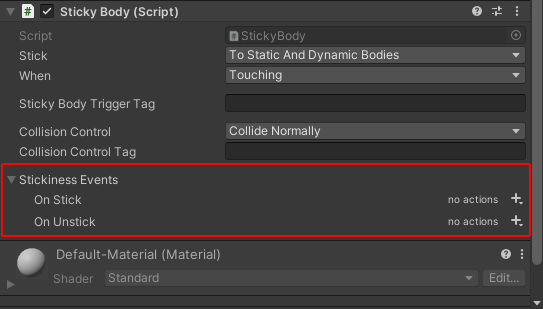

#### Shared Control events

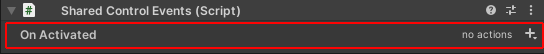

#### Shared Body events

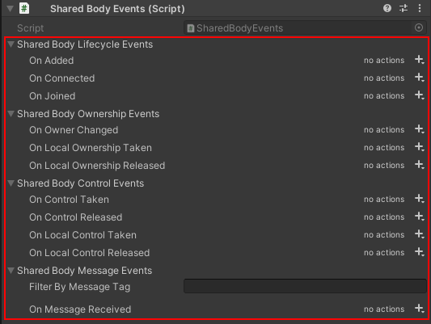

#### Shared Physics events

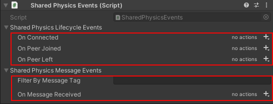

### Actions

By default, a Shared Event triggers no Actions. 

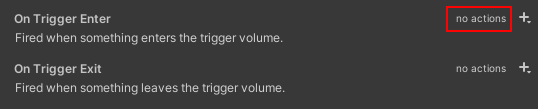

You can add Actions to a Shared Event by clicking the plus sign ("+") button for the event. There can be up to a dozen Actions in the drop-down list; the list will only contain Actions that make sense for that Shared Event. Here's the list for the Shared Events in the Trigger Volume component:

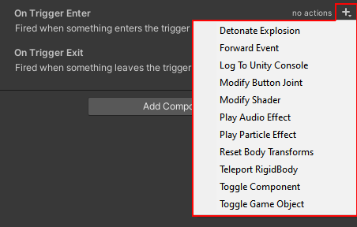

Actions may be influenced by other settings in the component. For example, in the Trigger Volume component, Actions are  subject to the **Trigger Type** setting.

Multiple Actions can be added for each event.

**Options on the 3-dot menu**

Each Action has a 3-dot drop-down menu. Here's the menu for the **Forward Event** Action:

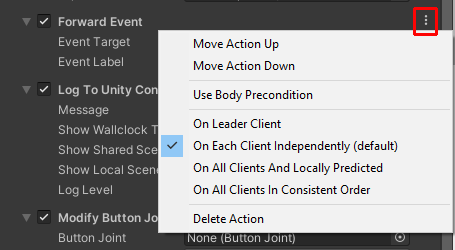

Every Action has the following four menu items:

**Move Action Up:** Moves the Action one position higher in the component.

**Move Action Down:** Moves the Action one position lower in the component.

**Note:** Since all Actions execute in the same frame, the movement menu items are primarily for appearance.

**Use Body Precondition:** Uses a per-Action body precondition to execute individual Actions conditionally. When you choose this menu item, a **Body Precondition** setting appears in your event with a drop-down menu that offers the [same conditions as the Body Filters setting](#body-filters) in [Shared Events](#shared-events). 

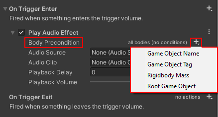

**Delete Action:** Deletes the Action.

An Action can have one to four of the per-Action dispatch modes below. These control when and how the Action is dispatched to all clients in the same room. An Action will only have the mode(s) that make sense for that Action.

**On Leader Client:** Action is executed on just one client (the arbitrarily chosen "leader client" in the room). This could be useful for things like the ResetBodyTransforms script; the Action is triggered on one client and it'll have an impact on all the clients. 

**On Each Client Independently:** Action is executed on each client independently when (and if) the event occurs locally on that client (avoids network latency between event cause and effect; avoids effect without apparent cause).

**On All Clients And Locally Predicted:** Action is predictively executed on the client where it initially occurs (avoids network latency between event cause and effect on that client) and is replicated over the network to make sure it's also executed on all other clients.

**On All Clients In Consistent Order:** Action is replicated over the network and executed on all clients (including the one where it initially occurs; this incurs network latency on all clients) in a consistent order relative to all other Actions executed in this mode.

**Note:** You'll see **(default)** inserted after one of the dispatch modes in the menu. The default varies depending on the type of Action.

### Action types in detail

#### Forward Event
 
**Forward Event** forwards the Trigger Enter event to a Shared Control Events component. This is useful when creating reusable interactive prefabs (for example, the Buzzer Button). 

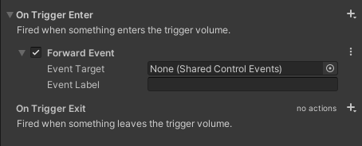

**Event Target:** The Shared Control Events component to forward the event to. Click the round button and then, in the **Select SharedControlEvents** window, search for and select the shared control event you want.

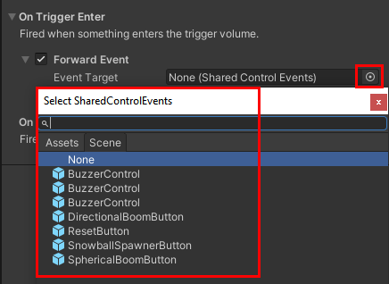
 
**Event Label:** The label of the event that’s configured in the target Shared Control Events component to be invoked.

#### Log to Unity Console

**Log to Unity Console** sends a log message to the Unity console.

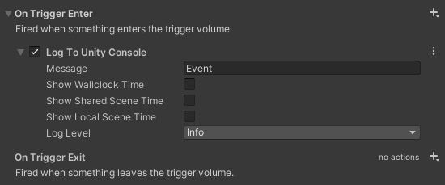
 
**Message:** The message to send. The message is always prefixed with the name of the body (if any) that caused the event.

**Show Wallclock Time:** Prefix the log message with the current Wallclock time (millisecond precision) and time zone suffix. Example:  

`[11:12:56.333+01:00]  (hours:minutes:seconds.millis+timezone)`

**Show Shared Scene Time:** Prefix the log message with the time elapsed since the shared scene started (millisecond precision), e.g. Example:

`[Shared 00:02:56.773] (hours:minutes:seconds.millis)`

**Show Local Scene Time:** Prefix the log message with the time elapsed since the local client joined the scene (millisecond precision). Example:

`[Local 00:00:28.560] (hours:minutes:seconds.millis)`

**Log Level:** Click the drop-down and then select **Info**, **Warning**, or **Error**. All these options work in Play mode; however, in Mesh, all "Info" messages are suppressed, and only "Warning" and "Error" messages show up in the Mesh log.

#### Modify Button Joint
 
**Modify Button Joint** modifies a property of a given Button Joint component. Only a small subset of Button Joint properties&#8212;the ones that make the most sense to modify at runtime&#8212;are exposed.

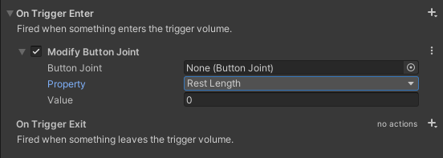

**Button Joint:** Select the Button Joint whose property should be modified. Click the round button and then, in the **Select ButtonJoint** window, search for and select the Button Joint event you want.

**Property:** Click the drop-down and then select **Rest Length**, **Spring**, or **Damper**. For details, see the Button Joint documentation.

**Value:** Updated value of the selected property.

#### Modify Shader

**Modify Shader** modifies a renderer's shader property. Initially, only the **Renderer** option is displayed until you select a specific renderer. 

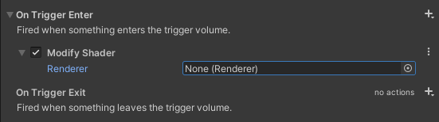
 
The rest of the UI is created dynamically based on the renderer's assigned materials and their respective shaders.

**Renderer:** Click the round button and then, in the **Select Renderer** window, search for and select the Renderer component (for example, "Mesh Renderer") whose shader properties you want to modify.

**Material:** Shows the first material assigned to the selected renderer. Beneath **Material** is a list of the material’s shader properties along with the default values that are in place when the Action is executed. The properties are initially unselected and their values are grayed out. To change a property’s value, select the check box to the left of the property name to make it editable, and then make your change. The screen shot below shows the shader properties for the **BasicWavyWaterSurface** material; the **WaveHeight** property is selected and is therefore editable.

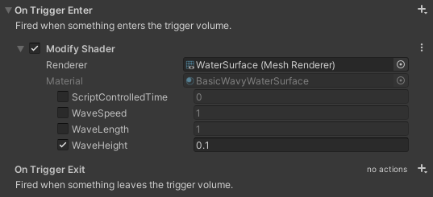
 
If the selected renderer has multiple materials assigned, this section is repeated for each assigned material.

#### Play Audio Effect

**Play Audio Effect** plays a transient sound effect. There are two possible scenarios:

**Scenario 1:** When the trigger event is fired, it causes the selected **Audio Source** object to play its attached **Audio clip**. The Audio Source object doesn't *have* to be the same object that triggered the event; it can be any object in the scene.

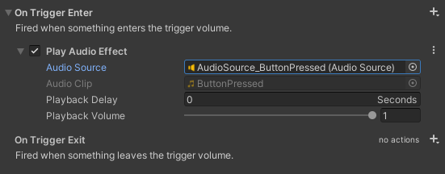

**Audio Source:** Click the round button and then, in the **Select Audio Source** window, search for and select the Audio Source Game Object you want to play.

**Audio Clip:** Shows the Audio Clip assigned to the selected Audio source. If you’ve chosen an Audio Source, this field can’t be edited. 
 
**Scenario 2:** Play an Audio Clip at the location of the body that caused the event.

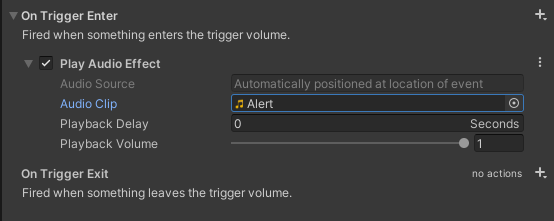

**Audio Source:** Keep this value at **None**.

**Audio Clip:** Click the round button and then, in the **Select AudioClip** window, search for and select the Audio clip you want to play.
 
For either of the above scenarios, the following options are the same.

**Playback Delay:** Delay (in seconds) between the moment the event is fired and the moment the audio clip plays.

**Playback Volume:** Relative volume (range 0 to 1) at which the audio clip is played back.

#### Play Particle Effect

**Play Particle Effect** plays a transient particle effect. There are two possible scenarios:

**Scenario 1:** When the trigger event is fired, it causes the selected **Particle System** component to play. The Particle System can be anywhere in the scene.

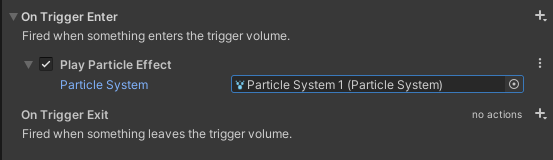

**Particle System:** Click the round button and then, in the **Select ParticleSystem** window, search for and select the Particle System you want to play.
 
**Scenario 2:** Play a particle system at the location of the body that caused the event.

**Particle System:** Select a prefab asset whose root transform has a Particle System component attached.

**Particle System Origin:** Click the drop-down menu and then select one of the following:

**Stay Where Instigated:** The particle system's origin is placed, and remains, at the location where the event was instigated.

**Stay With Body:** The particle system's origin remains attached to the body that caused the event and continues moving with that body.

#### Reset Body Transforms

**Reset Body Transforms** invokes the functionality of a Reset Body Transforms script placed in the scene. For more information, see the [ResetBodyTransform](#resetbodytransform) section.

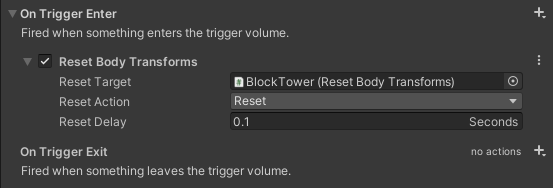

**Reset Target:** Click the round button and then, in the **Select ResetBodyTransforms** window, search for and select the Reset Body Transforms component you want to control.

**Reset Action:** Click the drop-down menu and then select **Save** or **Reset**. 

**Reset Delay:** Delay (in seconds) between the moment the event is fired and the moment the function is invoked.
 
#### Toggle Component

**Toggle Component** enables, disables, or toggles a given component in the scene.

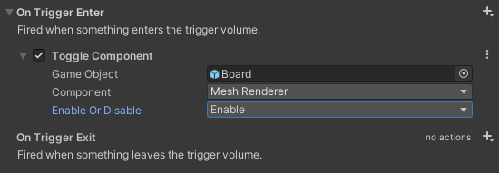

**Game Object:** Click the round button and then, in the **Select GameObject** window, search for and select the Game Object to which the component is attached.

**Component:** Click the drop-down menu and then select the component attached to the selected Game Object that should be enabled, disabled, or toggled.

**Enable Or Disable:** Click the drop-down menu and then select **Enable**, **Disable**, or **Toggle**.

#### Toggle Game Object

**Toggle Game Object** enables (shows), disables (hides), or toggles a given Game Object and its children in the scene.

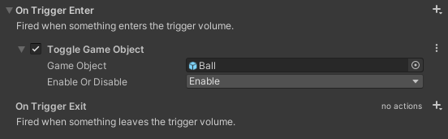

**Game Object:** Click the round button and then, in the **Select GameObject** window, search for and select the Game Object to affect.

**Enable Or Disable:** Click the drop-down menu and then select **Enable**, **Disable**, or **Toggle**.

**To make a setting active or inactive:**
Select or clear the checkbox to the left of the setting name.

#### Trigger Animator

**Trigger Animator** sets an Animator state machine's triggers and parameters.

**Settings**:

**Animator**: Select the Animator component whose triggers or parameters should be set. Nothing else is displayed until a specific Animator is selected; the reset of the UI is created dynamically based on the Animator's exposed triggers and parameters.

**Animator Controller**: Shows the Animator controller asset assigned to the selected Animator. This setting is for information only; it can't be edited. The list under **Animator Controller** contains triggers and parameters exposed by the selected Animator. The screenshot above shows an example with three triggers (**TransitionToEarth**,**TransitionToMoon**, and **TransitionToSpace**), one float parameter (**MovementSpeed**), one integer parameter (**NumberOfSteps**), and one boolean parameter (**DirectTransitions**).

Select a trigger to set it when the action is executed.

Select a parameter to edit the value it will be set to when the action is executed.

If a parameter isn't selected, the value shown next to the parameter's name is the parameter's default value.

## Other simple helpers

### BuzzerButton.prefab

A simple button which can be activated either by physical interaction or by clicking on it. Sends out a Unity message, which, for example, could be wired to a `ResetBodyTransform` script.

# Shared Physics event dispatch

Mesh Physics provides various events that can be connected to Unity Editor through two components:

- `Shared Body Events` provides events related to one specific body.
- `Shared Physics Events` provides events relating to the entire session.

## General concepts

### Shared Body Events

A `Shared Body Events` component can be attached to any `GameObject` (typically a `Rigidbody`) that is to be registered to the Mesh Physics system. As soon as Mesh Physics takes control of the body, [Shared Events](#shared-events) will be triggered in the respective situations.

### Shared Body Lifecycle Events

Called at various stages during system / body initialization:

- `On Added` (`SharedBodyHandle`) \
Called just after the `SharedBodyHandle` was added to the `PhysicsBridge`. Ownership of the `SharedBodyHandle` is undefined at this point.

- `On Connected` (`ShareBodyHandle`, `ClientId`) \
Called just after the `SharedBodyHandle` was connected with peers on the server including when the `SharedBodyHandle` was added at runtime while already connected to the server.  Ownership of the `SharedBodyHandle` is defined from this point on.

- `On Joined` (`SharedBodyHandle`, `ClientId[]`) \
Called on the client that owns the `SharedBodyHandle` when it is (or should be) added on other clients. Use this to initiate creation of the `SharedBodyHandle` on remote clients or to send late-join information.

### Shared Body Ownership Events

- `On Owner Changed` (`SharedBodyHandle`, `ClientId`, `ClientId`) \
Called just after body ownership changed (but not for initial ownership assignment). Listen to `OnSharedBodyConnected()` to get informed about initial ownership.

- `On Local Ownership Taken (SharedBodyHandle)` \
Called just after the current owner (local or peer) has taken control of the `SharedBodyHandle`.

- `On Local Ownership Released` (`SharedBodyHandle`) \
Called just after the current owner (local or peer) has released control of the `SharedBodyHandle`.

### Shared Body Control Events

Events about changes to the `controlled` state of an object. For example, whether the owning client is currently holding the body via the `ForceTool`.

- `On Shared Body Control Taken` (`SharedBodyHandle`, `ClientId`) \
Called just after the current owner (local or peer) has taken control of the `SharedBodyHandle`.

- `On Shared Body Control Released` (`SharedBodyHandle`, `ClientId`) \
Called just after the current owner (local or peer) has released control of the `SharedBodyHandle`.

- `On Shared Body Local Control Taken` (`SharedBodyHandle`) \
Called just after the local owner has taken control of the `SharedBodyHandle`.

- `On Shared Body Local Control Released` (`SharedBodyHandle`) \
Called just after the local owner has released control of the `SharedBodyHandle`.

### Shared Body Message Events

An event for custom communication&#8212;not yet useful in a no-code scenario...

- `Filter By Message Tag` \
String that allows filtering messages by tag.

- `On Shared Body Message Received`(`SharedBodyHandle`, `ClientId sender`, `string tag`, `byte[] payload`) \
Called when a message sent through `SharedBodyHandle.SendSharedBodyMessage()` is received. Use the tag to distinguish message types (there may be several handlers on the same `SharedBodyHandle`)

## Shared Physics Events

A `Shared Physics Events` component can be added anywhere in the scene, and it will [trigger events](#shared-events) in the respective situations.

### Mesh Physics Lifecycle Events

Events concerning the session as a whole:

- `On Connected` (`PhysicsClient`) \
Called just after this client was connected to the server

- `On Peer Joined` (`PhysicsClient`, `ClientId`) \
Called just after a new peer has connected to the server

- `On Peer Left` (`PhysicsClient`, `ClientId`) \
Called just after a peer has disconnected from the server

### Shared Physics Message Events

An event for custom communication - not yet useful in a no-code scenario...

- `Filter By Message Tag` \
String that allows filtering messages by tag.

- `On Shared Physics Message Received`(`PhysicsClient`, `ClientId sender`, `string tag`, `byte[] payload`) \
Called when a message sent through `SharedBodyHandle.SendSharedBodyMessage()` is received. Use the tag to distinguish message types.

# Example scene: Dart room

Mesh Physics comes with a simple example scene: dart room. It showcases most physics features. Simply inspect the scene and play with it.

## Features

- **Cups:** Simple objects to pick up.

- **Tables:** When grabbed, they try to align themselves with gravity.

- **Cupboards:** These should feel heavy. They use physics constraints.

- **Reset buttons (red):** Resets the transforms of a sub-scene.

- **Clock pendulums:** Powered by a physics hinge and velocity field.

- **Darts:** You can throw these in the camera direction. They're "sticky," so they'll stay attached to anything they hit.

- **Globe:** The globe rotates, demonstrating a motored hinge. The globe also has a gravity field which influences small objects entering a spherical trigger volume. Drag some cups close to the globe and watch them rotate around it like satellites.
