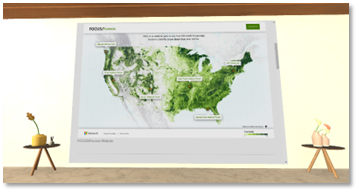
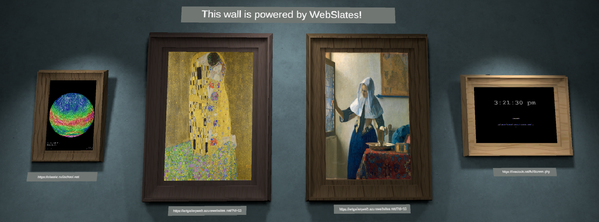
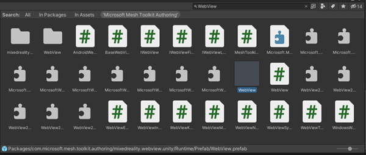
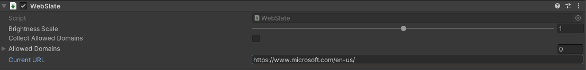
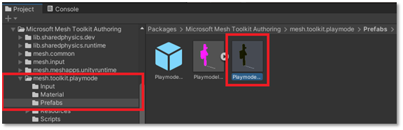
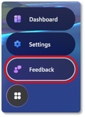
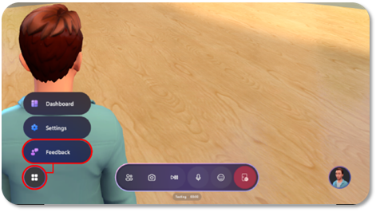

# Overview WebView

Use WebView to display Web content into your 3D Mesh Environment. Get a
full browsing experience on PC or Quest 2 with intuitive input,
customizability, security, and performance management. With WebViews you
can:

- Display rich web content

- Configure display quality, brightness, and aesthetic components

- Experience built-in input across devices without extra work to enable it

- Drag-and-drop prefabs to show simple WebViews or add scripted interactivity

- Manually authenticate to access secure content from within the experience

- Secure experiences with disabled local file access and cleared cookies, cache, and session state during initialization

In the Mesh Toolkit, the WebView prefab contains a URL parameter that
developers can specify to control the content displayed in their Mesh
Environment. WebView can display Web pages and supports interaction but
does not function as a browser and does not support bookmark, history or
travel back-forth. Envision using WebView in your custom Environment
for:

- Viewing dashboards, web pages, photos, and videos

- Showcasing content that highlights products and services,
    demonstrating expertise, customer stories, and brand identity

- Interacting with maps, diagrams, and data

To experience a WebView showcase within a Unity scene, see the
*HelloWorld-Unity.zip* sample on the EAP SharePoint site.

## Requirements/Dependencies

WebView depends on the *Unity.InputSystem* and
*Unity.XR.Interaction.Toolkit* Unity packages, located in the Mesh
Authoring package.

# Features

WebView loads an interactive page via a provided URL. The URL given to
it in the Environment will be the same one loaded in Mesh. WebView
offers the following features:

- When loaded on the Mesh App for PC and Quest, Web pages loaded by
    the WebView are interactable through mouse, keyboard, and Quest XR
    controller input.

- The size and shape of the WebView will match that of the quad
    GameObject on which it is placed, typically this is the quad baked
    inside of the prefab from the Mesh Authoring package.

- Multiple WebViews can be added to a scene. The number of users in
    your Mesh Environment does not affect WebView performance, as
    WebView resources are initialized locally on the user's machine.

- Configure WebViews with visual or cloud scripting to add interactive
    behaviors and synchronization across users.

- You can preview your WebView before uploading your scene to Mesh by
    hitting play in the Unity editor on your Environment project.

- For Web pages in which text rendering is more important, you can
    tune the image quality parameter to smooth out text. Note that an
    increase in quality can come at the cost of performance (memory
    consumption and frame rate). A good rule of thumb is to use high
    image quality for pages with lots of text that need to be read from
    a distance, low image quality for embedded images or videos, or text
    with fonts that are easily read from afar.

# Default Settings

By default, the WebView loads the preset URL. The URL should be replaced
with a desired one on each WebView in use. The image quality parameter
is set to "Low," and brightness is set to 1.0 (100% of the browser's
brightness).

# General Tips

- While WebViews can be placed on Game Objects other than a Quad by
    adding *WebView.cs* as a script component directly to your 3D object
    of choice, visual texture stretching, inversion, and/or rotation may
    be seen.

> **Performance**

- As a WebView is a loaded Web page, it is important to consider
    performance implications:

  - Scenes are typically performant at 60fps with up to 15 WebViews
        with Image Quality set to "Low." Framerate and general
        performance degradation may be observed in proportion to the
        number of WebViews placed in a scene, regardless of content.

  - Each Web page displayed in a WebView may have different
        performance characteristics based on its contents and Image
        Quality setting.

  - While content is loaded and executed in the WebView on a thread
        separate to the scene's update and rendering thread(s) (and is
        therefore unlikely to directly affect framerate), it's still
        important to consider the cost of JavaScript running on a Web
        page both in terms of runtime complexity and memory usage.

  - When Mesh is loaded on Quest using the Android build, it is
        advisable to keep the number of WebViews for which Image Quality
        is set to "High" under 5.

- Since WebViews don't have any external navigation UI by default, the
    best practice is to only load custom URLs, where the site navigation
    is cyclic and can be done inside the page. This can be done with a
    navigation sidebar, or links to a hub page, for example.

# Limitations/Issues

**Known issues**

- When working with WebViews in the Unity editor, the editor needs to
    > be restarted when updating the WebView or Mesh Toolkit packages
    > through the Unity package manager.

**General limitations**

- WebViews are currently supported in the Mesh App on PC Standalone, Quest 2, and for previewing in the Unity editor on Windows only.

- We are still working on automatic scaling and scale adjustments for content with different resolution requirements.

**Security restrictions**

- WebViews are locked to the URLs they navigate to, preventing malicious redirects. All unintended hyperlink navigations to outside domains are blocked.

- WebViews are restricted to navigation within the initial domain or
    the specified URL's and server\'s redirections.

- Device access to webcam, microphone, and geolocation are blocked.

**Windows / PC Standalone**

- When interacting with a WebView, Mesh may capture keyboard input causing unintended interactions with the Mesh app.

# Start with a sample

Did you know we have pre-made Mesh
Environments that you can download and use in Unity?

Check out the **Room Blue** scene in the **HelloWorld** sample! There
you can see WebViews like this one and much more.

# Add a WebView to your Mesh Environment

Adding a WebView to your Environment should be a relatively
straightforward process so long as you have a Unity project set up to
create Mesh Environments or artifacts.

## Prerequisites

- Understand project setup in Unity covered in the E2E Environment Creation Guide.

- A username and password for the Azure Portal so you can upload your work.

- Your account must be added as a Content Contributor in the Mesh World you're trying to publish to. If you're unsure about this, check with your IT admin. There's more information about this in the next section.

- There must be an existing World that contains a Space in the Azure Portal that you can upload your work to. To learn more about setting this up, see our document titled "Custom Worlds -- IT Admin User Guide.

## Import the Mesh Toolkit Packages

If you haven't already imported the Mesh Toolkit, import it:

**com.microsoft.mesh.toolkit-X.X.X.tgz**

## Add a WebView prefab to your project

### Mesh Toolkit Context Menu (Recommended)

Right-click the scene hierarchy, navigate to "Mesh Toolkit," and then
click "WebView." You can also click the "+" button at the top left of
the hierarchy window to see the same menu. Once you've added a WebView,
add a URL to display content in Mesh.\
\

Once you've added the WebView, position it and enter the URL you want to
be displayed.

### Authoring Package

You can also find the WebView manually by navigating or searching for it
inside the authoring package. Search for "WebView" in your project, and
make sure you're searching inside "Microsoft Mesh Toolkit Authoring":

Drag and drop the prefab into your scene, then add a URL to display on
the WebView:

# Preview WebView in Unity Play Mode

To view a URL displayed in your WebView more quickly, you can use Unity
Play Mode. Aside from using the Play Mode, the only other way to see
your WebView is to upload it using the Mesh Toolkit Uploader and view it
in a Mesh experience.

In the Inspector window, add a URL to the Web View (Script) via the
Current URL property:

Press the Unity editor Play button to view your Web page:

{width="6.001850393700788in"
height="2.675824584426947in"}

You can navigate to new URLs on your WebView while running in Playmode
by changing the "Current URL" property and clicking "Navigate":

{width="4.416666666666667in"
height="1.1150984251968503in"}

## Enable WebView interaction for Unity Play Mode

To enable interaction in the WebView, you have to set up a few things.

1. Navigate to the PlaymodeSetup object in the authoring package and
    drag it into your scene.

    
    
    Ensure you see it in your scene, as shown here:

    

2. Create a new **Plane** GameObject. {width="4.056788057742782in"
    height="3.384557086614173in"}

    This will be your floor. Ensure the Game Object is positioned at the
    origin (0,0,0).

3. Position the WebView so it sits in front of the PlaymodeSetup
    character:

    

4. Click the play button, and double click to interact with the Web
    page displayed in the WebView:

    

**Great job! You added a custom WebView to your Unity scene and tested
the interaction in Unity Play Mode.**

**Now you're ready to upload the Environment to Mesh and share your
creation with the world!**

# WebView in Visual Scripting

Visual Scripting offers a \"no-code\" approach to adding behavior to a
scene. This means that developers can now implement WebView
functionality and behavior without the need for traditional programming.
Instead, a visual interface is provided, enabling users to define and
connect various actions and events in a scene. This simplifies the
process of adding interactivity and behavior, making it accessible to
individuals without extensive programming knowledge or experience.

To enable visual scripting using WebView, you must set up a few things.

1. Go to **Edit** \> **Project Settings**.

2. Select **Visual Scripting**.\
    

3. Expand **Node Library**.

4. At the end of the assemblies list, select **Add** (+).

5. In the new assembly entry, select **(No Assembly)** to open the
    **Assembly** menu.

6. Select **Microsoft.MixedReality.WebView** from the **Assembly**
    menu\
    

    Visual Scripting adds the **Microsoft.MixedReality.WebView** and its
    nodes to the Node Library. To use the nodes in your project, add
    **WebView** type to your Type Options and regenerate the Node Library.

    

    After incorporating the WebView visual scripting node into your project,
    you can utilize it just like any other node in your visual script graph.
    Here\'s an example of a script graph that loads a new URL in WebView
    when the state of a graph variable changes.

    

# WebView in Mesh Scripting

Developers now can add a WebView to their scripted worlds. This means
that a WebView can be navigated through a MeshApp script and therefore
synchronized across users. For example, create an app containing a
WebView node and one or more TouchSensor nodes. Then, you can set up
your TouchSensor's click event handler to navigate the WebView to a
different URL. By adding a Mesh App script to WebView, your users now
can update the WebView contents interactively.

Refer to the [Visual scripting overview](../Scripting%20your%20scene%20logic/visual-scripting-overview.md) for further guidance on the WebView node in Mesh Apps.

# Feedback for WebView

We love feedback and bug reports! If you'd like to provide feedback, use the Feedback button inside any Mesh experience. This ensures that your feedback and bug reporting will be
triaged and incorporated quickly.

For WebView feedback, include "**\[WebView\]**" or **a mention of WebView**
in your feedback.

If you're not able to give feedback or report bugs using the Feedback button in Mesh, use the Teams chats with your Microsoft partners, or contact your Microsoft partners directly.
