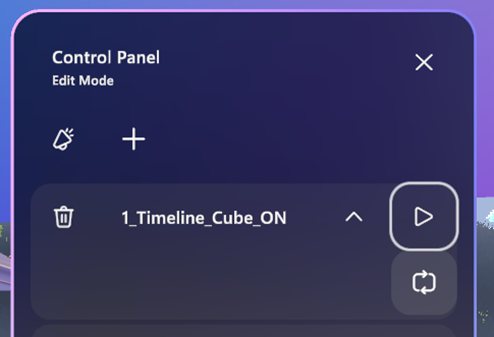

# Animations and timelines

## Event content integration

Events in Mesh can create powerful interactive experiences for hosting
all-hands meetings, social gatherings, showcases, or trainings. The
*EventProduction* folder offered in
*com.microsoft.mesh.toolkit.-X.X.X+X.tgz* includes scripts that
integrate into the Mesh event production system.

**To locate the scripts:**

In the Project panel, navigate to **Packages** \**Microsoft Mesh
Toolkit** \**mesh.toolkit.sharedcontent** \**Scripts** \>
**EventProduction**.

The scripts include:

-   *EmbeddedAudioBehavior*: For controlling Unity AudioSources with
    hard-coded/embedded audio clips

-   *EmbededVideoBehavior:* For controlling hard-coded video

-   *ObjectBehavior*: For marking GameObjects that can be
    enabled/disabled via the control panels

-   *StreamedVideoBehavior:* For playing online videos

-   *UnityPlayableBehavior:* For controlling a PlayableDirector

## Playables

*Playables* are Objects that are meant to be played, paused, looped, and
stopped. Example Playables include Unity-based timeline elements and
Unity Video Players.

Playables must also be included in your Unity scene to appear in the
Event Control Panel where they can be turned on or off.

To learn more about the Unity Playables API, please see [Unity - Manual:
Playables API
(unity3d.com)](https://docs.unity3d.com/Manual/Playables.html).

## Unity Video Players

Video playback for the Control Panel can be done using the **Unity Video
Player**. You'll first need to embed a video player in your Unity scene.
Once added, it will appear as an option in your **Control Panel**
content list and can be added to your **Control Panel** using the **+**
button. You can then toggle it **on/off** or adjust playback controls.
Learn more about how to use the **Control Panel** in the document named
*Mesh Event Producer Guide.pdf*, section: *Add Content with the Control
Panel*.

To learn more about the Unity Video Player component, see [Unity -
Manual: Video Player component
(unity3d.com)](https://docs.unity3d.com/Manual/class-VideoPlayer.html).

## Animate Timelines in Unity for Mesh

If you\'re unfamiliar with how **Timelines** work in Unity, watch this
Unity Tutorial series on using **Timelines**:

https://learn.unity.com/tutorial/timeline

#### To create a Timeline for Mesh:

1.  In the **Hierarchy**, add an empty GameObject and then rename it
    "Timelines."

2.  Add another empty GameObject, make it a child to **Timelines**, and
    then rename it "Timeline1."

**Notes**:

-   We suggest that you give this GameObject a more descriptive
    name---for example, *1_Entrance_Doors*. For this scenario, we'll
    stick with the name "Timeline1."

-   If you have a door-opening animation, selecting the Play button will
    open the door in your scene. Selecting the Stop button will reset
    the animation back to its original position. A Playable will *not*
    animate in reverse; to do this, you'll need to create a different
    animation.

**IMPORTANT**: Multiple timelines on a single GameObject will *not*
work and will cause issues in events.

3.  In the **Project** tab, navigate to the **Assets** folder and then
    create a new folder named *Animations*.

4.  In the **Hierarchy**, select **Timeline1**, and then select **Window
    \Sequencing \>Timeline**.

5.  We recommend that you move the **Timeline** tab next to the
    **Project** and **Console** tabs. This allows you to view the
    **Timeline** and the **Scene** or **Game** windows simultaneously.

6.  Select **Create**.

7.  In the **Save** window, change the name of the Playable to
    *Open_Doors* and then save it to the **Assets \Animations**
    folder**.\
    **

8.  You can now animate or customize your Timeline---for example, add
    animation clips, activation clips, and more. For more on how to do
    this, watch this tutorial series:

A Timeline with several tracks might look something like this:

9.  Once you\'re done animating, in the **Hierarchy**, select the
    **Timeline1** GameObject, and then in the **Inspector**, navigate to
    the **Playable Director** component.

10. In most cases you\'ll want to choose these settings:

**Play On Awake** = not selected
>
The timeline will be active when you upload it.
>
**Wrap Mode = Hold**
>
The last frame of your animation will be on hold indefinitely;
otherwise, your timeline will reset to the start. There's also a
**Wrap Mode** option named **Loop** which you may want to use in some
instances.
>

Now you can upload your content to Mesh using the **Mesh Toolkit
Uploader** and then see how it looks in your Mesh space. To learn more,
see the document named *Mesh Event Producer Guide.pdf*, section: "All
Content with the Control Panel."

## Controlling an Animation in an Event

As a Producer in an Event, you can select *play* to start your
animation, *pause* it, and select *play* again to resume the animation.
You can also select *stop* to reset the animation to the beginning or
set your animation to *loop*.

For example, if you have a door-opening animation, selecting the *play*
button will open the door in your scene. Selecting *stop* will reset the
animation back to its original position. A Playable will not animate in
reverse; to do this, you'll need to create a different animation.

For more information, see our document titled *Mesh Event Producer
Guide*.

## Save your work as a template

If you create an Environment + Event features combination that you think
Event Producers may want to repeat in the future, you can save the
combination as a template. To learn more about templates, see our
document named *Mesh Event Producer Guide*, section: *Event Templates*.

# Congratulations!

Using the instructions in this document, you created a new Mesh project
or upgraded a pre-existing one, and then uploaded an Environment to the
Mesh Browser. You also learned about the samples we provide that can
give you preloaded projects to use a foundation. Also, you may have
added Event Integration features. With the Playmode package, you reduced
iteration cycles during content development.\
\
We hope this has given you a good start to exploring more creative
possibilities in Mesh!

Here are some other documents that can help you learn more about using
Mesh:

-   **Creating Worlds and Spaces and other account activities in the
    Azure Portal:** *Mesh IT Admin guide.pdf*

-   **Integrate WebViews into your Unity Environment Environment:**
    *Mesh WebView Developer Guide.pdf*

-   **Artistic guidelines for designing Environments in Unity:** *Mesh
    3D Design and Performance Guide.pdf*

-   **Get started Producing Events in Mesh:** *Mesh Event Producer
    Guide.pdf*

-   **Get started as an end user in the Mesh Browser:** *Mesh End User
    Guide.pdf.*

-   **Learn about interactions:** *Mesh Object and Player
    Interactions.pdf.*