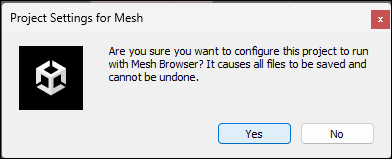
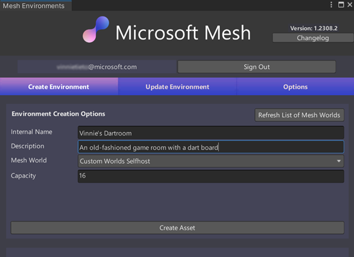
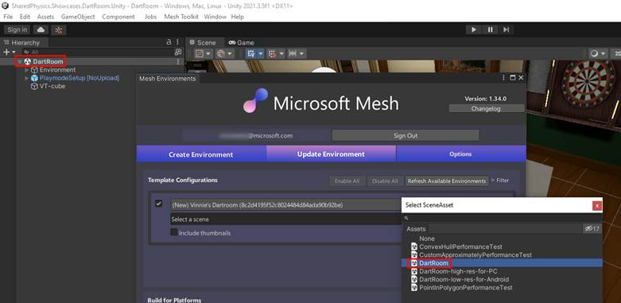
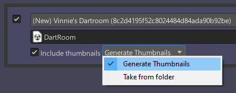
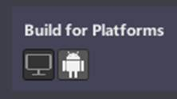
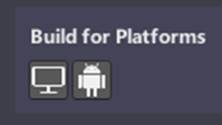
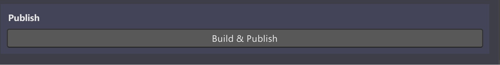
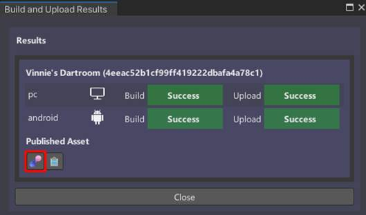

# Build and publish your Environment

After you finish adding all your scene content, the next step is to build the scene as an *asset* and then upload it to your chosen World in the Azure portal, where it's saved as an *Environment.* This is achieved by using the Mesh Uploader. Event producers with access to that World can then create an Event based on your Environment and invite participants to come and share in a *Mesh experience*.

1. On the menu bar, select **Mesh Toolkit** > **Configure Project
    Settings**.

    

2. Select **Yes** to configure project settings for Mesh.

    

3.  On the menu bar, select **Mesh Toolkit** > **Environments**.

4. In the **Mesh Environments** window, select **Sign In**.

5. Sign in with your account. The account must have *Content
    Contributor* access to the Mesh world you're uploading the
    Environment to. If you need help with Content Contributor
    privileges, see [*Become a Content
    Contributor*](#become-a-content-contributor). TBD

    Make sure you're in the **Create** **Environment** tab, and then fill
    in the **Internal Name** and **Description** fields. 
    
    > [!IMPORTANT]
    > The **Internal Name** field has a maximum of 40 characters, and the
    **Description** field has a maximum of 70 characters.

6. To ensure you have the latest worlds that are available in the Azure
    Portal, select the **Refresh List of Mesh Worlds** button.

7. Select the **Mesh World** drop down, and then select the world you
    want to upload your Environment to if it's not already selected.

8. In the **Capacity** field, enter the capacity for your Environment.
    The maximum is 16.

    

9.  Select **Create Asset** to create the Environment that you'll be
    uploading to the Azure Portal.

10. You'll receive a confirmation dialogue as shown below. Select
    **Close**.

    

    You should now be in the **Update Environment** tab of the **Mesh
    Environments** window.

    

    Note that in the **Environment Configurations** section, you already
    have an Environment configuration created which displays the name you
    added in the **Create Environment** tab: *Vinnie's Dartroom*.

## Configure the Environment for build and publish

1. Select the field that displays **Select a Scene** and then, in the
    **Select** **SceneAsset** window, double-click the scene in your
    project that you want as the Environment. In this example, we're
    using the Mesh sample project *Dartroom*, so our chosen scene will be the scene also named *DartRoom*.

    

2.  Select **Include thumbnails** and then, in the popup menu, choose
    **Generate Thumbnails**.

    

3. In the **Build for Platforms** section, you choose which platforms
    to build for. Note that when a button background is gray, the button
    is "on"; when the background is black, the button is "off." Do one
    of the following:

    - To build for PC only, make sure that only the PC button ("Mesh
        app on PC", the button on the left) is "on."

        

    - To build for Android only, make sure that only the Android button ("Mesh app on Quest", the button on the right) is "on."

        

    - To build for both PC and Android, make sure that both buttons are "on."

        

## Build and publish the Environment

1. In the **Publish** section, provide some information in the **Upload
    notes** box if you wish.

1. Select the **Build and Publish** button.

    

1.  If the Environment builds and uploads successfully, the **Build and
    Upload Results** dialog appears and confirms the results.

    

    If the build and upload process fails, this is confirmed in the **Build and Upload** Results dialog:

    

    You can test out the PC version of the Environment: select the left button under **Published Asset**. This takes you to a test version of the Mesh app on PC.

    

