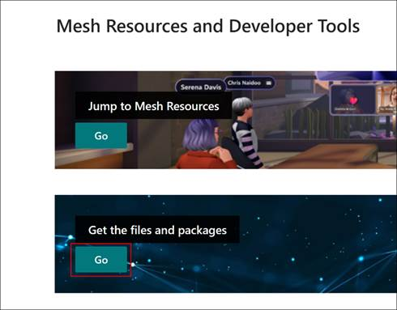
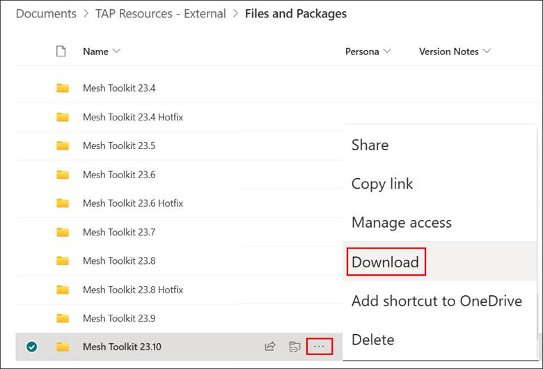
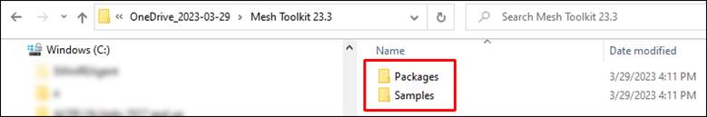

# Download the Mesh Toolkit

The Mesh Toolkit holds all packages and samples, as detailed in the [Package Overview](#package-overview). Once downloaded and unzipped, import the packages to your new project.

**Note**: Setting up a new project or updating an existing one both have the same steps for adding packages.

1. In your browser, navigate to the **Microsoft Mesh EAP Onboarding Resources** website:

[Microsoft Mesh EAP Onboarding Resources - Home
(sharepoint.com)](https://microsoft.sharepoint.com/teams/MicrosoftMeshEAPOnboardingResources/?OR=Teams-HL&CT=1660599435162&clickparams=eyJBcHBOYW1lIjoiVGVhbXMtRGVza3RvcCIsIkFwcFZlcnNpb24iOiIyNy8yMjA4MDcwMTAwMCIsIkhhc0ZlZGVyYXRlZFVzZXIiOmZhbHNlfQ%3D%3D)

2. On the main page, scroll down to the **Mesh Resources and Developer
    Tools** section, and then, under **Get the Files and Packages**,
    select the **Go** button.

    

3. On the **Files and Packages** page, download the latest version of the Mesh Toolkit. Select the three-dot button and then select **Download**.

    

4. Place the downloaded zip file in a location where the file path won't be too long, such as the Windows desktop.

    **Note**: The downloaded zip file's name may vary depending on your computer setup.

5. Unzip the file, and then navigate through the unzipped folder
    hierarchy until you see folders named *Packages* and *Samples*.

    