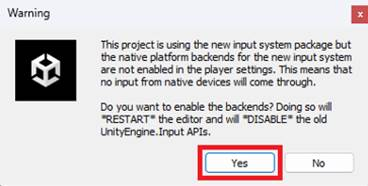
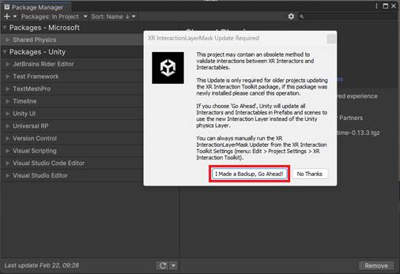

# Installing and upgrading tools

There are a host of tools that empower you to build a range of experiences for Microsoft Mesh.

## Package Overview

**Package:** Microsoft Mesh Toolkit /
*com.microsoft.mesh.toolkit.-xxx.tgz*

**Description:** Toolkit contains a selection of shared content
packages. It includes (but isn't limited to):

- Cloud Scripting, used to add business logic to Mesh events via cloud
    hosted .NET applications.

- Graphics Tools, a package with scripts, shaders, assets, and samples
    created to help improve the visual fidelity of Mesh worlds while
    staying within performance budgets.

- Mesh Physics, used to create enabling and engaging dynamic content.

- The WebView prefab, to enable designers to add a panel that displays
    a given web page.

- Mesh.Toolkit.Playmode package, offering the possibility to press
    Play in a Mesh content project get a preview of what the content
    will look like running in Mesh.

- EventProduction scripts can be added to show hard-coded and online
    videos in an Event.

- Mesh Toolkit Uploader: used to build Mesh-compatible asset bundles
    from your Unity content and upload them to your Mesh World.

- Content Performance Analyzer (CPA): automatically reports content
    optimization issues and opportunities before content is uploaded to
    the Mesh catalog.

- Visual Scripting, which lets you add interactivity and dynamic
    runtime behavior to your Mesh environments without writing code. For
    more information, see our document titled "Mesh Visual Scripting
    Guide."

## Prerequisites

### Unity version 2021.3.21f1+

Unity version 2021.3.21f1+ is suggested for this tutorial. Later
versions will work, but you may see errors which can be bypassed.

[Get help installing Unity Template\
](https://docs.unity3d.com/hub/manual/InstallEditors.html)

Your installation should include modules for Android and Windows. When
you create a new project, we recommend using the URP 3D Core template.

### Intermediate to advanced Unity skills

This document assumes you have intermediate to advanced Unity skills and
are familiar with the fundamentals of Unity.

*We can't guarantee that all steps will work as expected due to your
unique Unity and computer configuration. There may be extra work needed
on your end to triage errors or issues.*

[Learn Unity & Review fundamentals](https://learn.unity.com/)

### Azure portal access or Content Contributor permissions

To upload an Environment to a Mesh world, there are two things that must
be enabled for your work account.

1. **Mesh world already created.** There must be a Mesh world to upload
    to from Unity. If there isn't one, your Azure Admin or Mesh world
    resource owner should make one for you.

    ***For more information, see the document named [Set up M365 for Mesh](../../Setup/Content/setup-m365-mesh.md#creating-mesh-world) and its section named "Creating a Mesh world."*

2. **Content Contributor role.** Your Azure Admin or Mesh world owner
    must add your work account as a content contributor for each Mesh
    world you want to upload an Environment to.

    *For more info, see [Becoming a Content
    Contributor](#become-a-content-contributor).*

## Terminology

In Unity, you create a new *project* which can contain one or more
*scenes*. In Mesh terms, your scene will be viewed as an *Environment*
which you must convert into an *asset* before uploading it to the Mesh
Browser.

## Download the Mesh Toolkit

The Mesh Toolkit holds all packages and samples, as detailed in the
[Package Overview](#package-overview). Once downloaded and unzipped,
import the packages to your new project.

**Note**: Setting up a new project or updating an existing one both have
the same steps for adding packages.

1. In your browser, navigate to the **Microsoft Mesh EAP Onboarding
    Resources** website:

[Microsoft Mesh EAP Onboarding Resources - Home
(sharepoint.com)](https://microsoft.sharepoint.com/teams/MicrosoftMeshEAPOnboardingResources/?OR=Teams-HL&CT=1660599435162&clickparams=eyJBcHBOYW1lIjoiVGVhbXMtRGVza3RvcCIsIkFwcFZlcnNpb24iOiIyNy8yMjA4MDcwMTAwMCIsIkhhc0ZlZGVyYXRlZFVzZXIiOmZhbHNlfQ%3D%3D)

2. On the main page, scroll down to the **Mesh Resources and Developer
    Tools** section, and then, under **Get the Files and Packages**,
    select the **Go** button.

3. On the **Files and Packages** page, download the latest version of
    the Mesh Toolkit---as of August 10, 2023, it's 23.10. Select the
    three-dot button and then select **Download**.

4. Place the downloaded zip file in a location where the file path
    won't be too long, such as the Windows desktop.

**Note**: The downloaded zip file's name may vary depending on your
computer setup.

5. Unzip the file, and then navigate through the unzipped folder
    hierarchy until you see folders named *Packages* and *Samples*.

## Upgrading packages in your Mesh project

### Prerequisites for your Unity project

- Project uses a 3D (URP) project template.

- Unity v. 2021.3.21f+.

### Importing packages into a Mesh project

Import your packages into a new project or a pre-existing project. The
process is mostly identical, but you may encounter some configuration
notifications with upgrading and replacing older packages.

### Prerequisite for a pre-existing project

- Unity v. 2021.3.21f1+.

### Import packages

1. In Unity, open the Package manager, then select the "+" drop-down,
    and then select **Add package from tarball**.

2. Navigate to the folder named *Packages* in the unzipped file you
    downloaded earlier, and then add the *toolkit* file outlined in red
    in the image below.

3. If you get a Warning, as shown below, select **Yes** to allow the
    packages to properly configure your project.

    

    You may see other dialogues, such as this one:

    

If you see a dialog box named **Project Settings for Mesh** with a
**Configure Settings** button, select that button.

Unity may restart during this process.

4. Once you've installed the package, verify that you see it in the
    Package Manager.

If so, great job -- you're now ready to develop for Mesh and upload
Environments to a Mesh world.

## Next steps

Go to the [Create new Mesh project to](create-new-mesh-project.md) learn how to upload and test your environment.