# Mesh 101 Tutorial

The Mesh 101 tutorial is a great way to learn about adding Mesh features
to a Unity project to create an interactive learning experience. Created
for intermediate to advanced Unity developers, the tutorial will give
you a solid understanding of the power of Mesh, spanning Mesh Physics,
Scripting, and more. You'll start with a pre-built Unity project, add
custom interactivity and other Mesh features, and then deploy the
project as a metaverse *Environment* to Microsoft Mesh. Customers can
attend an Event based on your Environment where they'll learn about wind
turbines by visiting a series of interactive stations and experience
multi-user interaction and communication.

The tutorial project is named *Mesh101.Unity* and is included in the
Mesh Toolkit.

The tutorial is structured as follows:

- [Mesh 101 Tutorial](#mesh-101-tutorial)
  - [Terminology](#terminology)
  - [Prerequisites](#prerequisites)
    - [Hardware requirements](#hardware-requirements)
    - [Unity version 2022.3.7f1](#unity-version-202237f1)
    - [Previous Unity experience](#previous-unity-experience)
    - [Azure portal access](#azure-portal-access)
      - [Content Contributor permissions](#content-contributor-permissions)
  - [Chapter 1: Set things up for Mesh](#chapter-1-set-things-up-for-mesh)
    - [Download the Mesh desktop app](#download-the-mesh-desktop-app)
    - [Download the Mesh Toolkit](#download-the-mesh-toolkit)
    - [The Packages](#the-packages)
  - [Chapter 2: Prepare the tutorial project](#chapter-2-prepare-the-tutorial-project)
    - [Scenes in the tutorial project](#scenes-in-the-tutorial-project)
    - [About the Scenes](#about-the-scenes)
    - [Exploring the `StartingPoint` scene](#exploring-the-startingpoint-scene)
    - [Add the PlayModeSetup prefab](#add-the-playmodesetup-prefab)
    - [Check the scale of your GameObjects](#check-the-scale-of-your-gameobjects)
    - [Add the Mesh Thumbnail Camera](#add-the-mesh-thumbnail-camera)
  - [Chapter 3: Add interactivity with Mesh Visual Scripting](#chapter-3-add-interactivity-with-mesh-visual-scripting)
    - [Choose the NavMesh layer](#choose-the-navmesh-layer)
    - [Station 3.1: Create an Interactable Button](#station-31-create-an-interactable-button)
      - [Create the Visual Script for the button](#create-the-visual-script-for-the-button)
      - [Putting the script graph together](#putting-the-script-graph-together)
      - [Get a reference to the PlayVideoButton GameObject](#get-a-reference-to-the-playvideobutton-gameobject)
      - [Add your new variable to the graph](#add-your-new-variable-to-the-graph)
      - [Triggering the button](#triggering-the-button)
      - [Set a variable to let you know if the button is selected](#set-a-variable-to-let-you-know-if-the-button-is-selected)
      - [Create a group for the nodes](#create-a-group-for-the-nodes)
      - [Define the Play action](#define-the-play-action)
      - [Play the video when the Play button is pressed](#play-the-video-when-the-play-button-is-pressed)
      - [Stop the video if the Play button (now labeled the "Stop" button) is pressed while the video is playing](#stop-the-video-if-the-play-button-now-labeled-the-stop-button-is-pressed-while-the-video-is-playing)
      - [Changing the button label](#changing-the-button-label)
      - [Test your work](#test-your-work)
    - [Station 3.2: Trigger an info dialog](#station-32-trigger-an-info-dialog)
      - [Test your work](#test-your-work-1)
    - [Station 3.3: Teleport to the turbine generator](#station-33-teleport-to-the-turbine-generator)
      - [Update the script graph](#update-the-script-graph)
      - [Create a Travel Point and add a reference to it](#create-a-travel-point-and-add-a-reference-to-it)
      - [Test your work](#test-your-work-2)
    - [Chapter 3: Summary](#chapter-3-summary)
  - [Chapter 4: Move objects and trigger animations with Mesh Physics](#chapter-4-move-objects-and-trigger-animations-with-mesh-physics)
    - [Reconfigure the Hierarchy](#reconfigure-the-hierarchy)
    - [Change the view to display the Chapter 4 Sphere Terrace](#change-the-view-to-display-the-chapter-4-sphere-terrace)
    - [Station 4.1: Grab and Release](#station-41-grab-and-release)
      - [Test your work](#test-your-work-3)
    - [Station: 4.2 Animation Trigger](#station-42-animation-trigger)
      - [Test your work](#test-your-work-4)
    - [Station 4.3: Constraining Bodies](#station-43-constraining-bodies)
    - [Summary](#summary)
  - [Chapter 5: Create and upload your Environment](#chapter-5-create-and-upload-your-environment)
    - [Create your environment](#create-your-environment)
    - [Build and publish your environment](#build-and-publish-your-environment)
    - [Building for single and multiple platforms](#building-for-single-and-multiple-platforms)
    - [Create the Environment](#create-the-environment)
    - [Build and publish your Environment](#build-and-publish-your-environment-1)
    - [Test the PC version of your Environment](#test-the-pc-version-of-your-environment)
    - [View your Environment in Azure](#view-your-environment-in-azure)
    - [Summary](#summary-1)
  - [Chapter 6: Share your Mesh experience with others](#chapter-6-share-your-mesh-experience-with-others)
    - [Create an event](#create-an-event)
    - [Summary](#summary-2)
- [Conclusion](#conclusion)

## Terminology

In Mesh terms, the project you create in Unity and then upload to the
Azure Portal is called an *Environment*.

## Prerequisites

### Hardware requirements

Minimum PC requirements: 4 CPU cores, 8Gb RAM

### Unity version 2022.3.7f1

Unity version 2022.3.7f1 is required for this tutorial.

[Get help installing Unity](https://docs.unity3d.com/hub/manual/InstallEditors.html)

Your installation should include modules for Android and Windows.

Unity supports three IDEs: VS, VS Code, and JetBrains Rider. We
recommend Visual Studio, but other supported IDEs will work. You'll be
using this for Mesh Scripting.

**IMPORTANT**: Mesh Scripting requires Visual Studio *2022*, but certain versions of Unity install with Visual Studio *2019* by default. If you're
using Visual Studio, make sure you have version 2022 installed. To learn
more, see the [Unity documentation](https://learn.unity.com/tutorial/get-started-with-visual-studio-and-unity).

### Previous Unity experience

This tutorial assumes that you have intermediate to advanced Unity
skills.

### Azure portal access

You'll need a username and password for the Azure Portal so you can
upload your work.

#### Content Contributor permissions

To upload an Environment to a Mesh world, there are two things that must
be enabled for your work account:

1. **Mesh world already created.** There must be a Mesh world to upload
    to from Unity. If there isn't one, your Azure Admin or Mesh world
    resource owner should make one for you.

2. **Content Contributor role.** Your Azure Admin or Mesh world owner
    must add your work account as a Content Contributor for each Mesh
    world you want to upload an Environment to.

For more information, see our IT Admin Guide*.

## Chapter 1: Set things up for Mesh

### Download the Mesh desktop app

To download the app (codenamed **Project Napili**), you can visit the link below.


> [Project Napili - Microsoft Store Apps](https://apps.microsoft.com/store/detail/project-napili/9P0B5VMS9RTQ?hl=en-us&gl=us)

**If the app isn't available, talk to your IT** **admin about making the
app visible to you.**

### Download the Mesh Toolkit

The Mesh Toolkit contains the *Mesh 101* tutorial project.

1. In your browser, navigate to the **Microsoft Mesh TAP Onboarding
    Resources** website
    [Microsoft Mesh TAP Onboarding Resources - Home (sharepoint.com)](https://microsoft.sharepoint.com/teams/MicrosoftMeshEAPOnboardingResources/?OR=Teams-HL&CT=1660599435162&clickparams=eyJBcHBOYW1lIjoiVGVhbXMtRGVza3RvcCIsIkFwcFZlcnNpb24iOiIyNy8yMjA4MDcwMTAwMCIsIkhhc0ZlZGVyYXRlZFVzZXIiOmZhbHNlfQ%3D%3D)
2. On the main page, scroll down to the **Mesh Resources and Developer
    Tools** section, and then, under **Get the Files and Packages**,
    select the **Go** button.

    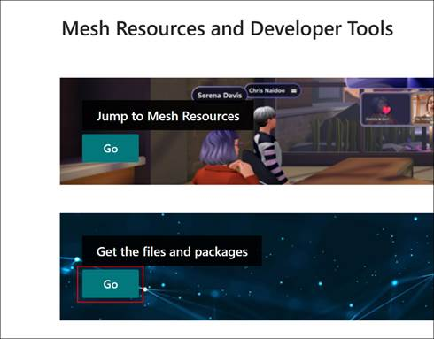
3. On the **Files and Packages** page, download the latest version of
    the Mesh Toolkit (it may be more recent than what you see here). Select the three-dot button and then select
    **Download**.

    

    > [!NOTE]
    > The downloaded zip file's name may vary depending on your
    > computer setup.
4. On your C: drive, create a folder with a one-word name (for example,"Mesh101") and then move or copy the downloaded Mesh Toolkit Zip file to that folder. This is done to avoid running into a problem with the Windows path length limit which is 256 characters. **IMPORTANT**: *Don't* place the Zip file on the Windows desktop. Behind the scenes, this creates a very long path name.
   In the example below, the user created a folder on their C: drive named *Mesh101.* Next, they moved the downloaded Mesh Toolkit Zip file, which their system renamed *OneDrive_2023-07-24.zip*, to the *Mesh101* folder

    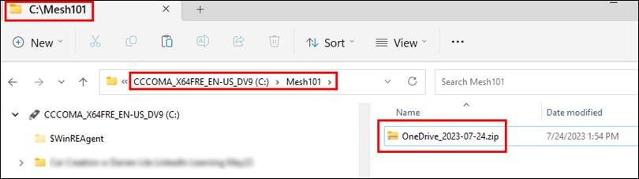
5. In the new folder you created, unzip the Toolkit file, and then
    navigate through the unzipped folder hierarchy until you see folders
    named **Packages** and **Samples**.

    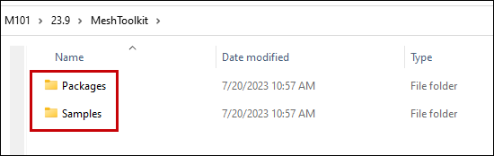

6. Open the **Samples** folder. The tutorial project, named
    **Mesh101.Unity**, is located there and is packaged as a Zip file.

7. Unzip the **Mesh101.Unity.zip** file into the **Samples** folder.
    This creates a **Mesh101.Unity** project folder which you'll open in
    Unity.

    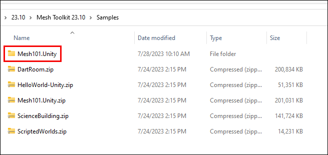

> [!IMPORTANT]
> Don't move the **Mesh101.Unity** project folder or the
> **Packages** folder after you unzip!

To ensure that the manifest file for the project (or any of the sample projects) configures project settings and loads the required packages correctly, you must maintain  this folder and file structure:  

```csharp
Mesh Toolkit 23.x 

├──Packages

├──Samples

    ├──DartRoom

    ├──Mesh101.Unity

    ├──HelloWorld-Unity

    ├──ScienceBuilding

    ├──ScriptedWorlds
```

> [!TIP]
> One sign that packages weren't loaded properly is pink surfaces
> in your scene. Pink indicates that a material didn't load correctly. If
> this happens, check to ensure that the folder structure described above
> is correct.

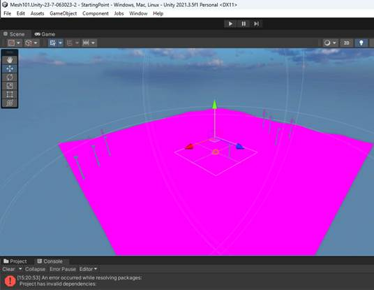

### The Packages

For this tutorial, you don't need to install any packages---they're
already pre-loaded into the tutorial project. If you were creating your
own project from scratch, you would need to install the Mesh Toolkit
package. To learn more about this, see our article titled *Download the Mesh Toolkit*.

## Chapter 2: Prepare the tutorial project

### Scenes in the tutorial project

> [!NOTE]
> [jovaneen] May be worth nothing that the first load is expected to take a really long time.

1. Open the **Mesh101.unity** project in Unity. If you have more than
    one version of Unity installed, be sure to open the project with `Unity 2022.3.7f1` which is required for this tutorial:

    > [!NOTE]
    > In the **Assets** folder, there are two scenes available: **Starting Point** and **Finished Project**.

    

2. Open the **StartingPoint** scene. You should see the **TMP Importer** window.

3. Select **Import TMP Essentials**, and then close the window.

    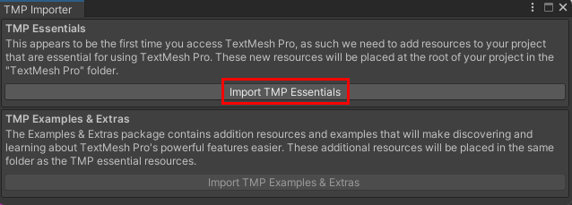

    In the **Scene** window, the letter "T" appears over every object that
    contains Text Mesh Pro. You can turn these off to achieve a less
    cluttered view. To do so:

4. In the toolbar above the upper right corner of the **Scene** window,
    select the Gizmos drop-down.

5. In the **Scripts** section, scroll down to **TextMeshPro**, and then
    select its **icon** toggle button. This turns off the display of
    "T"s in the **Scene** window.

    

### About the Scenes

**StartingPoint**: This is the scene you'll do the tutorial in. It
contains a pre-built setting that includes the wind turbines and
stations you'll be visiting and adding Mesh features to.

**FinishedProject**: As the title implies, this scene contains an
accurate completed version of the tutorial. You can refer to this at any
time to confirm that you've completed tutorial steps in the
*StartingPoint* scene correctly. Always save your work in the
*StartingPoint* scene before switching scenes.

### Exploring the `StartingPoint` scene

Feel free to move around in the **Scene** window to get familiar with
the scene's contents. If we zoom out a little, we can see that there are
a number of wind turbines in our wind farm. Those two white rounded
items at the bottom of the window are called *Sphere Terraces*.


If you navigate to the front of the Sphere Terraces and take a closer
look, you can see that each Sphere Terrace contains a space inside that
you'll soon be walking around in.


You'll be visiting the Sphere Terraces starting in the next
chapter---they each contain a series of stations where you'll learn how
to implement Mesh features. The first Sphere Terrace (covered in Chapter
3) is where you'll learn about Mesh Visual Scripting ...


... and the other Sphere Terrace, covered in Chapter 4, is where you'll
learn about Mesh Physics.


### Add the PlayModeSetup prefab

Adding the PlayModeSetup prefab will allow you to run the project in
*Playmode*. This gives you a preview of what the content will look and
feel like when it runs in the *Mesh app*. A key feature of Playmode is
the ability to run multiple clients within the same process; this allows
you to easily get a first impression of a multi-user scenario.

1. Right-click inside the **Hierarchy** and then, in the context menu, select **Mesh Toolkit** > **PlaymodeSetup**.

    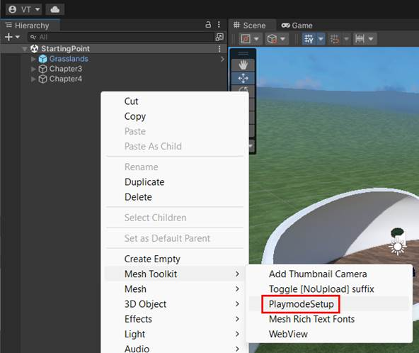

    Note that this adds the **PlaymodeSetup [ NoUpload]** prefab to the
    scene.

    

    This prefab provides you with a highly stylized avatar that has a camera attached, so now we can play the project and have a look around.

    

2. Select the Unity Editor Play button.

3. In the **Game** window, note that you now have a view from the
    avatar's position. Use the WASD keys to walk around inside the
    Sphere Terrace. You can also drag the right mouse button to pan in
    any direction. When you're done experimenting, click the Unity
    Editor Play button again to exit Play mode.

### Check the scale of your GameObjects

The tutorial project uses default Unity scale values: 1 unit = 1 meter.
The *PlaymodeSetup* avatar is the same height as an average human. When
you're creating your own Environment, you can compare its size to any
custom GameObjects you add to your project to ensure that those objects
are the size you want.

### Add the Mesh Thumbnail Camera

Adding the Mesh Thumbnail Camera provides a thumbnail image that will be
added to your Environment's listing in the Azure Portal and its
selection button in the Mesh app. This comes in handy when you're
selecting Environments in either place because it gives you a visual
reminder of what the Environment looks like.

**To add the thumbnail camera to the scene and set its view:**

1. In the **Scene** window, adjust the view so that it shows what you
    want to display in the thumbnail (the Thumbnail Camera's view will
    be based on the **Scene** window).

2. Select the "+" drop-down located below the **Hierarchy** tab, and
    then select **Mesh Toolkit** > **Thumbnail Camera**.

3. To confirm that the view in the Thumbnail Camera is what you want,
    in the **Hierarchy**, select **MeshThumbnailCamera**. The Camera's
    view appears in a small window in the lower right of the **Scene**
    window.

> **Note**: If you decide you want a different view for the Thumbnail
> Camera, you can adjust the Camera GameObject directly in the **Scene**
> window or change its **Position** and **Rotation** values in the
> **Inspector** prior to uploading your Environment to Mesh.

There are no set rules for how your thumbnail should look---it's totally
up to you. For the example below, we chose a close-up front view of a
wind turbine.


## Chapter 3: Add interactivity with Mesh Visual Scripting

Now that we've completed the setup phase, let's move on to making your GameObjects interactive! In this chapter, we'll dive into Mesh Visual Scripting, which you can use to add custom logic to your Environment.

> [!NOTE]
>
> - There are two types of Mesh Scripting: Mesh Cloud Scripting, which uses C# code, and Mesh Visual Scripting, where you create a Script Graph and then add nodes (also called *units*) in a sequence to create your coding logic. This version of the Mesh 101 tutorial uses Mesh Visual Scripting; the previous version used Mesh Cloud Scripting.
>
> - Mesh Scripting isn't required for every Environment, but you'll need it for the features we'll be adding here: making a button interactive, triggering an informational text popup, and teleporting around the scene.

### Choose the NavMesh layer

For this project, we want our avatar to be able to walk around only on
the floors inside the *Sphere Terrace* objects and the floor of a
platform that's attached to one of the wind turbine generators. For
these areas to be walkable, they must be on the *NavMesh* layer. Let's
add the *Sphere Terrace* in Chapter 3 to the NavMesh layer.

1. In the **Hierarchy**, expand the **Chapter 3** GameObject.

2. Select the **Sphere Terrace** GameObject that's a child object to
    the **Chapter3** GameObject.

    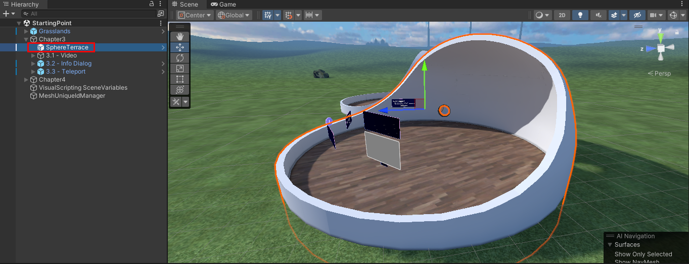

3. In the **Inspector**, select the **Layer** drop-down and then choose
    **NavMesh**.

    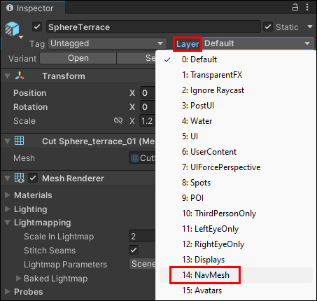

You don't have to add the other walkable GameObjects to the NavMesh
layer---we've already done it for you.

### Station 3.1: Create an Interactable Button

For our first task, we want to create a button that will play a video
when it's pressed by a participant.

- In the **Scene** window, navigate to the Sphere Terrace that
    contains the stations for Chapter 3, and adjust the view so that
    you're looking at the first station, **3.1 -- Video Playback**, as
    shown below.

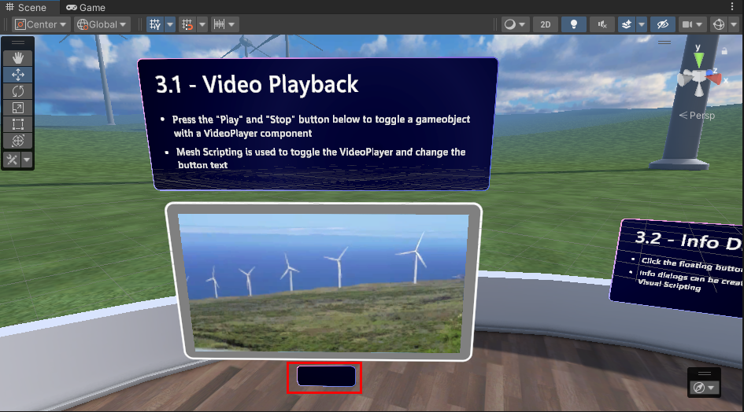

We already have a backplate for the button in the correct location in
our scene, but we need to build up the button a little more and add a
label to it. As the text box for the station explains, we'll create a
Script Graph with some button logic so that the button can be used to toggle the VideoPlayer on
and off and change the button text.

**Add the button to the scene**

1. In Unity, make sure the GameObject named **Chapter3** and its child object named **3.1 - Video** are expanded.

    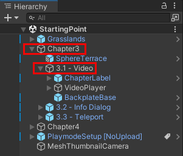

2. Search for the **ButtonBase** prefab.

    

3. Drag **ButtonBase** from the **Project** window and then, in the
    **Hierarchy**, drop it on the GameObject named **3.1 -- Video** so
    that **ButtonBase** is placed as a child to **3.1 -- Video**.

    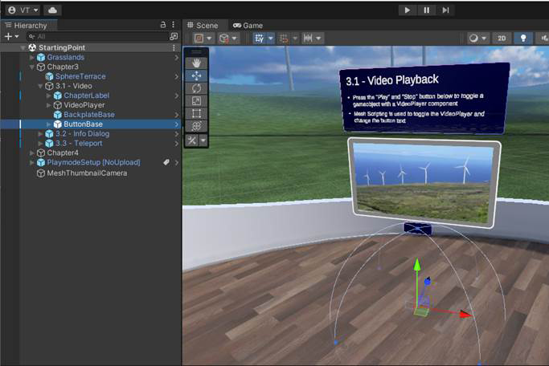

    Make sure the **Transform** > **Position** values for **ButtonBase** are 0, 0, 0.

**ButtonBase** is placed in the scene a little lower than where we want it.

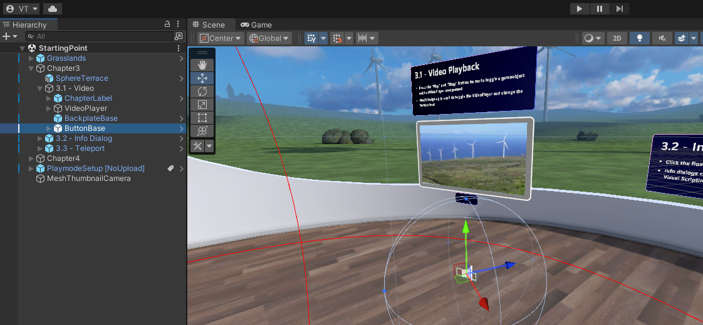

Let's fix that.

1. Ensure that **ButtonBase** is selected in the **Hierarchy**.

2. In the **Inspector**, change the **Transform** > **Position** >
    **Y** value to "1".

Perfect! Now **ButtonBase** is correctly located just in front of the **BackplateBase** object.

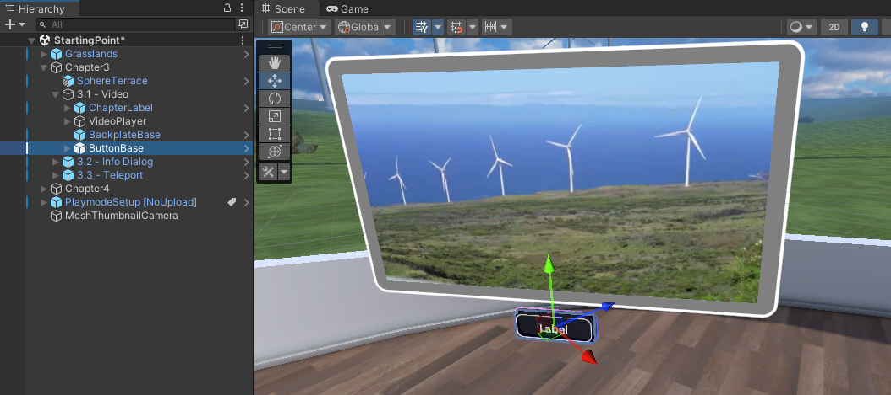

**Rename the button**

- With **ButtonBase** selected, in the **Inspector**, change the name
    of **ButtonBase** to "PlayVideoButton".

    

**Change the label of the button**

Right now, the text on the button says "Label." Let's change that to
"Play."

1. In the **Hierarchy**, expand the **PlayVideoButton** GameObject to
    display its child objects, and then select the **Label** child
    object.

    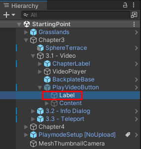

2. In the **Inspector**, navigate to the **TextMeshPro -- Text**
    component, and then, in the **Text Input** box, change the text to
    "Play."

    

#### Create the Visual Script for the button

Before we add our first visual script, in the **Hierarchy**, collapse **PlayVideoButton** and then expand **VideoPlayer**.

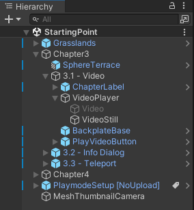

1. In the **Hierarchy**, select **VideoPlayer**.
1. In the **Inspector**, click **Add Component**, and then select **Script Machine**.

Note that two new components have been added in the **Inspector**: **Script Machine** and **Variables.** There's also a new window named *Mesh Visual Scripting Diagnostics* at the bottom of the **Inspector**. This window will give you feedback on your visual script and can be useful for troubleshooting.


Note that in the **Script Machine** component, the **Source** is set to **Graph**. Let's keep that setting. This means that we'll be creating a new script graph as an asset and saving it in the project.

1. In the **Script Machine** component, click the **New** button.
1. Navigate to the **Chapter3** > **StartingPointVisualScripts** folder.

Note that there are already two existing assets: **SPShowInfoDialog.asset** and **SPTeleportToOpenAir.asset**.

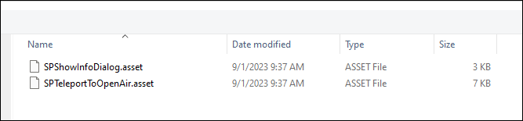

We'll be using these as starting points for the other two features in this chapter. For the feature we're working on right now, the interactable button, we'll create a new script graph.

1. In the **File name** box, enter "SPVideoPlayerBehavior" and then click the **Save** button.
1. In the **Script Machine** component, enter a name in the *Title* field for the graph: "Video Player Behavior."
1. Enter a description in the *Summary* field for the graph: "Video player behavior definition."

#### Putting the script graph together

1. In the **Script Machine** component, click **Edit Graph**. This opens the **Script Graph** window. Dock it next to the **Project** and **Console** tab so that we can see the script graph and **Scene** window at the same time. As we add nodes, you may want more space in the window; you can click the three-dot button and then select **Maximize** for achieve this, or click the **Full Screen** button in the upper right corner of the window.

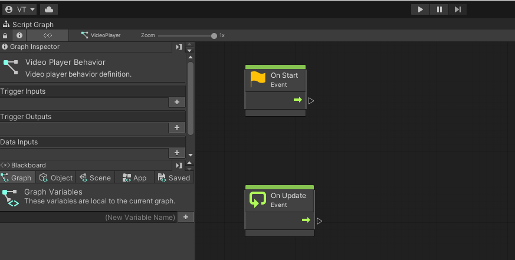

1. We don't need the **OnStart** and **OnUpdate** events; delete them.

#### Get a reference to the PlayVideoButton GameObject

1. In the **Blackboard** section of the **Script Graph**, select the **Object** tab.
1. Enter the variable name "PlayVideo" in the text box and then press the Enter key or click the + button.

    

1. Click the **Type** drop-down for the variable and then select **Game Object**.

    

1. Click the circle button next to **Value** and then, in the **Select GameObject** window, search for and select **PlayVideoButton**.

    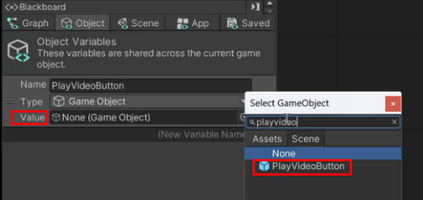

#### Add your new variable to the graph

1. In the **PlayVideo** variable, click and hold on the double lines to the left of **Type**, and then drag the variable and drop it in the graph, where it appears as a node.

> [!NOTE]
> A node is also called a *unit* in Visual Scripting. In this tutorial, we'll be using the term *node*.


**TIP**: You may want to take a moment here to examine some of the components for the PlayVideoButton GameObject:

- *Mesh Interactable Properties*: This makes *PlayVideoButton* an object that you can interact with. This component helps to track interactions--note that in the image below it has some "hover" settings chosen. You can learn more about this component in our article named *Mesh Object and Avator Interactions*.

- *Script Machine*: This has a script graph named *Button Base Behaviour.*

    

If you go into Play mode, you'll see that a new component named **Mesh Interactable Body** is added to **PlayVideoButton**.


This component is added automatically at runtime to interactable bodies; it exposes various properties to Visual Scripting such as *IsHovered* and *IsSelected*, which will come in handy in a moment.

Back in the script graph, we'll add a node that lets us know when the button is selected.

1. Click and hold on the outport port of the **PlayVideo** variable, and then release the mouse button. This opens the Fuzzy Finder.

    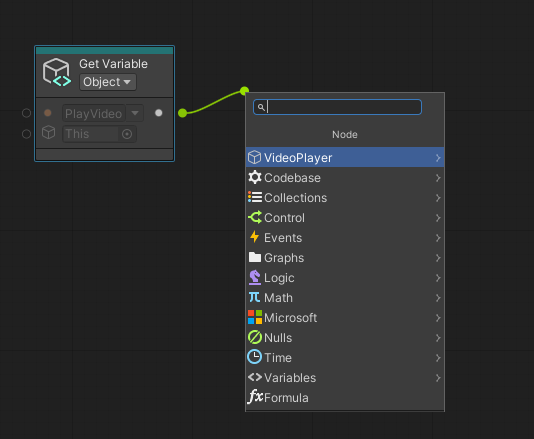

1. Search for "Mesh Interactable Body," click it, and then select "Is Selected." **Note**: This generates a Boolean value; you can confirm this in the **Graph Inspector**.

    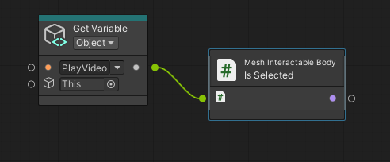

> [!TIP]
> The Graph Inspector can help you to better understand the makeup of all your nodes.
>
>

#### Triggering the button

At this point, nothing is triggering the button yet. We need to add a node that ensures that every time the button is selected, the visual script runs.

1. Connect the output port of the "Is Selected" node to a new node that you create called "Microsoft Mesh: On State Changed." (In the Fuzzy Finder, search for "on state changed.")

    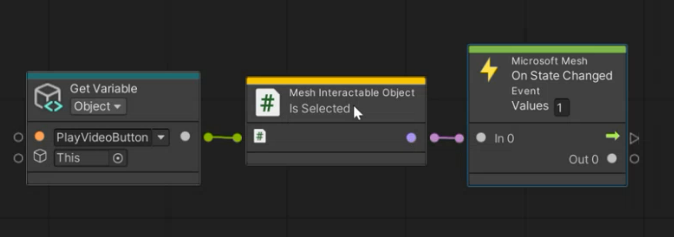

In addition to knowing when the button is selected, we also want to be able to set the player mode.

1. Connect the output control port of the "On State Changed" node to the "True" input control port of a new "If" node that you create.

    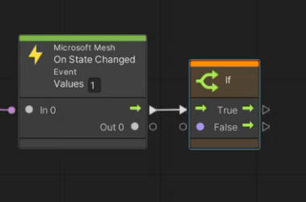

1. Connect the second output port of "On State Changed" to the second input port of the "If" node. Note that this points to the "False" value.

    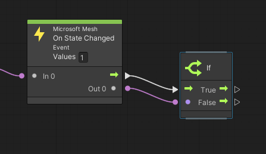

#### Set a variable to let you know if the button is selected

1. Add a "Set Object Variable" node to the "True" output port of the "If" node.

    

1. In the **Blackboard**, go to the **Object** tab, and then create a variable named "isPlaying." Make the **Type** "Boolean" and the value false (the default).

    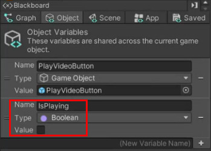

1. In the **Set Object Variable" node, click the variable name drop-down and then select "isPlaying."

    

1. Drag the the "isPlaying" variable from the **Blackboard** to the graph to create a new "Get Object Variable" node.

    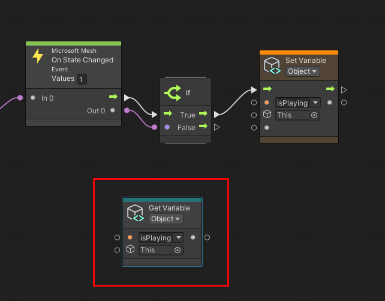

1. Connect the outport port of the "Get Object Variable" node to a new node you create called "Negate*.
1. Connect the output port of the "Negate" node to the bottom input port of the "Set Variable Object" node.

    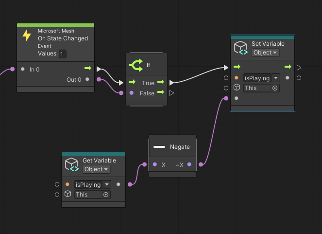

If the video is playing, set to true. If it's not playing, set to false. The "Negate" node negates whatever the value of "IsPlaying" is.

All the nodes you just added basically do one thing: tell you when the button is pressed.

#### Create a group for the nodes

1. Ctrl-drag over the nodes to add them to a group.

    

1. Select the group title and then change it to "Check Button Press."

#### Define the Play action

In the following steps, we enable and disable two GameObjects: "Video" and "VideoStill."

When we want the video to play, we invoke "Video." It has an animation attached.

When we want the video to stop and just have the video screen show an image, we invoke "VideoStill."

We want this flow to be triggered every time the value of "isPlaying" changes.

1. In the portion of the graph below the "Check Button Press" group, add the "isPlaying" variable.
1. Attach a new "On State Changed" node to "isPlaying."

    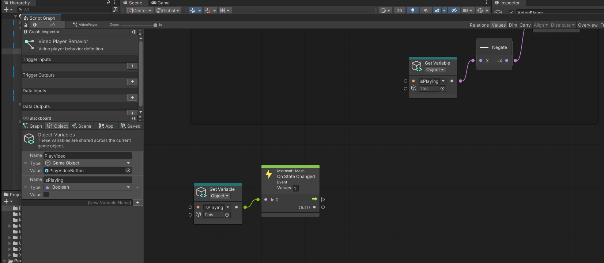

#### Play the video when the Play button is pressed

1. Connect the control output port of the "On State Changed" node to the "True" input port of a new "If" node that you create.
1. Connect the remaining output port of the "On State Changed" node to the "False" input port of the "If" node.

    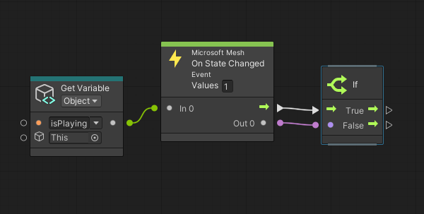

1. Attach the "True" output control of the "If" node to the control input port of a new "Game Object: Set Active" node that you create.

    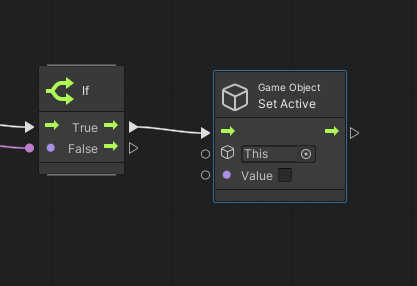

If true (in other words, if the button has been pressed), we want the video to play, so let's set it up as follows:

1. Create two new Object variables as shown here:

    

1. Add the two new variables to the graph.

    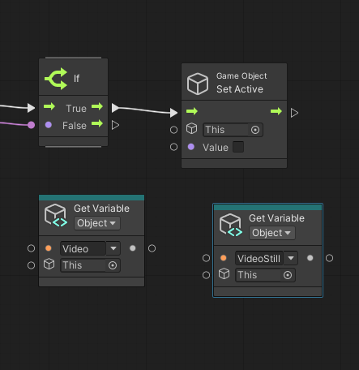

We want the "Video" GameObject to be active because it has the video animation attached to it. (Note that in the "Set Active" node attached to "Video, **Value** is selected.)


Simultaneously, if the "If" node's value is true, we set the "VideoStill" GameObject to inactive.

1. Add a new "Game Object: Set Active" node to the graph.
1. Connect the output port of the first "Get Object: Set Active" node to the input control port of the new "Game Object: Set Active" node.
1. Connect the output of the "VideoStill" node to the next available input port of the second "Game Object: Set Active" node.

 (Note that in the "Set Active" node attached to "VideoStill", **Value** is *not* selected.)

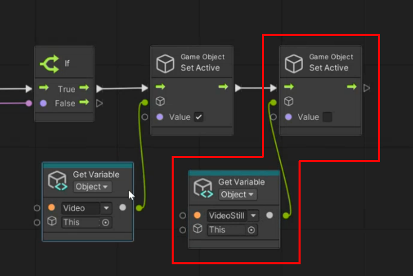

#### Stop the video if the Play button (now labeled the "Stop" button) is pressed while the video is playing

This is similar to what we just did, but in reverse: if the "If" node is false, we make the "VideoStill" GameObject the active object.

1. Select the four nodes that follow the "If" node.

    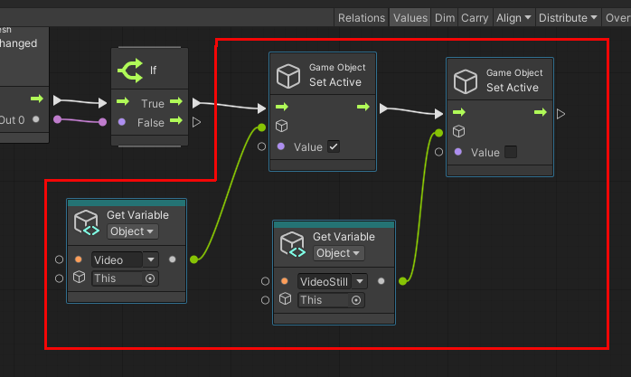

1. Right-click on a selected node and then choose **Duplicate Selection.**
1. Drag the duplicated nodes to an empty space towards the bottom of the graph.

    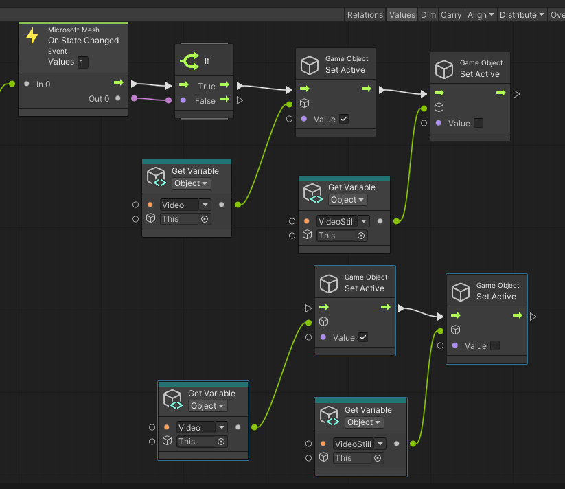

1. Connect the "False" control output of the "If" node to the control input of the first "Game Object: Set Active" node in our duplicated set of nodes.

    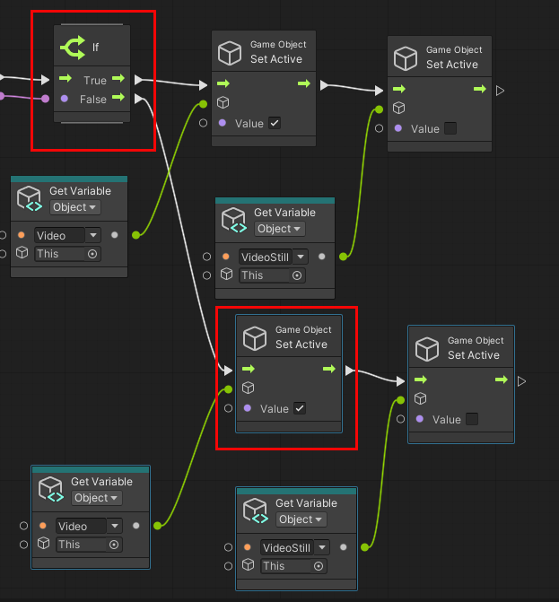

1. In the first "Game Object: Set Active" node of the duplicate set, deselect "Value."
1. In the second "Game Object: Set Active" node of the duplicate set, select "Value."

    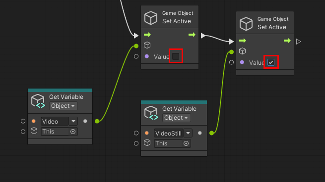

#### Changing the button label

1. In the **Blackboard**, go to the **Object** tab, and then create a variable named "VideoPlayerButtonLabel." The type should be TM Pro / "TextMeshPro".

For the Value, you need to add the "Label" GameObject that's a child to the "PlayVideoButton" GameObject. If you click the round button next to the **Value** field, the popup menu shows many GameObjects named "Label" and it's unclear which one you should choose. Here's a better way to ensure you're making the right choice:

1. In the **Hierarchy**, navigate to **Chapter 3** > **3.1 - Video** > **PlayerVideoButton** > **Label.**
1. Drag this **Label** GameObject from the **Hierarchy** and drop it in the **Value** field of your new variable.

    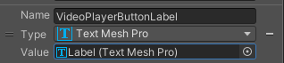

1. In the graph, drag a connection from the output control port of the second "Game Object: Set Active" node in the "if: True" sequence, and then drop it in empty space to open the Fuzzy Finder.

    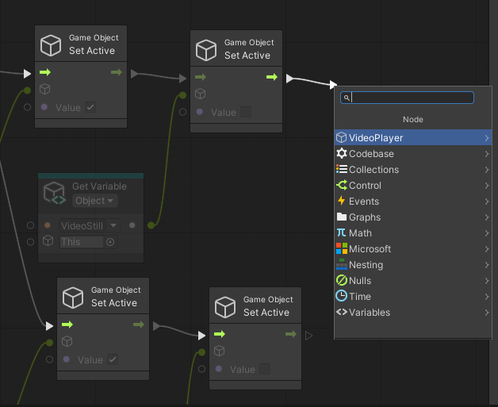

1. Search for "set text" and then select "Text Mesh Pro: Set Text."

    

1. Drag the "VideoPlayerButtonLabel" from the **Blackboard** and drop it in the graph to create a new node.
1. Connect the outport port of the new "Get Object Variable" node to the next available input port on the "Text Mesh Pro: Set Text" node.
1. In the "Text Mesh Pro: Set Text" node text field, type in "Pause."

    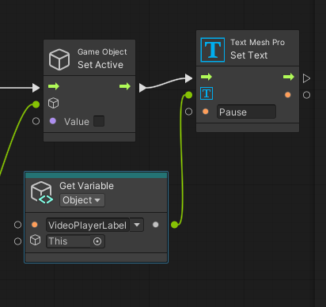

1. Repeat the steps above to create a label for the "If: False" sequence of nodes. This time, type in the label text "Play."

    

#### Test your work

1. In Unity, save the project and then press the Unity Editor Play
    button.

1. In the **Game** window, click the **Play** button you just worked
    on. This causes a brief video about wind turbines to play on the
    screen above the button.

    

1. When you've finished watching the video, press the button you've
    been editing again (it now has the label "Stop").

1. Press the Unity Editor Play button to exit Play mode.

### Station 3.2: Trigger an info dialog

For this feature, we'll enhance an existing visual script that causes an info dialog to appear when the avatar presses a button.

1. In the **Hierarchy**, collapse the **3.1 -- Video** GameObject.
1. In the **Scene** window, note that the Info Dialog Trigger station is to the right of the **3.1 -- Video Playback** station. Adjust the view so that you can clearly see Station 3.2.

    

1. In the **Inspector**, expand the GameObject named **3.2 -- Info Dialog**.

1. In the **Hierarchy**, select **Information_Button**.


1. In the **Inspector**, navigate to the **Script Machine** component with the **Show Dialog** graph and then click the **Edit Graph** button.

    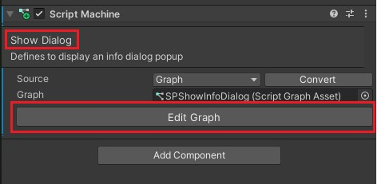

1. In the graph, connect the "True" output control port of the "If" node to the input control port of a new "Microsoft Mesh: Show Dialog" node that you create.

    

1. In the **Show Dialog** node, click the **Message** field and then add this sentence:

Did you know that the world's largest wind turbine has blades longer than a football field?

This is the message that will appear in the info dialog.


1. Select the drop-down that currently displays **OK**, and then, in the popup list, deselect **OK** and select **Continue**. This will add a "Continue" button to the info dialog that the user can click to close the dialog and continue in the experience.

    

#### Test your work

1. In the Unity Editor, save the project and then press the Unity Editor Play button.

1. Use the navigation keys to make your avatar back away from the button. Note that when your avatar is a certain distance away, the button rotates and isn't selectable.

1. Walk towards the button. At a certain point, the button stops rotating, signaling that you can now select it.

1. Select the button. The info dialog appears and displays the message you added to the **Show Dialog** node earlier.

1. When you're finished with info dialog, click its **Continue** button. Note that after you click the button, it disappears. To use the button again, you must exit and then re-enter Play mode.

    > [!TIP]
    > The distance and triggering elements in effect here are determined by the components of the **ProximityDetector** GameObject.

    

1. Press the Unity Editor Play button to exit Play mode.

### Station 3.3: Teleport to the turbine generator

For this feature, we'll add some nodes to a script graph that allows participants
in the scene to teleport. When a participant presses the button, they're
teleported from their current location at Station 3.3 to an elevated
platform that's attached to a wind turbine generator. They can then
examine the generator.


#### Update the script graph

1. In the **Scene** window, note that the **3.3 -** **Teleport to Turbine** station is to the right of the **3.2 -- Info Dialog  Trigger** station. Adjust the view so that you can clearly see Station 3.3.
1. In the **Hierarchy**, collapse the **3.2 - Info Dialog** GameObject, and then expand the **3.3 - Teleport** GameObject.

    

The button is all set up for you---we just need to add the nodes in the script graph that
give it the teleport behavior.

1. In the **Hierarchy**, select the **ChapterLabel** GameObject.

    

    Note that in the **Inspector**, there's a **Script Machine** component named *Teleport to Open Air Platform* that contains a script graph named *SPTeleportToOpenAir*.

    

1. Click the **Edit Graph** button. Just as in the previous chapter, our graph already have some variables and nodes set up for you.

    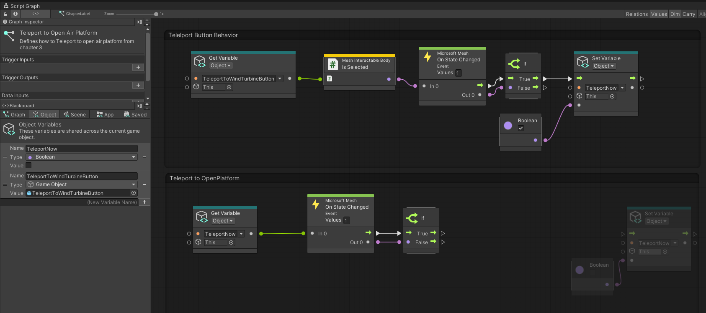

In the **Teleport Button Behavior** group, the logic is similar to what you saw in Chapter 3.1: "If the button is selected, do something." We don't need to anything further to this group. We're going to make our changes to the second group, **Teleport to OpenPlatform**.

#### Create a Travel Point and add a reference to it

So what's a "Travel Point", you might be asking ... ? Basically, it's a component that you can use to define a point in space to spawn or teleport to. Normally, you would first create a *Travel Group*, and then add one or more Travel Points to it. We've already created the Travel Group for you in this project, so in the steps below, we'll add a Travel Point to that group. We'll then use that Travel point as the location the avatar will go to when they click the "Teleport" button. To learn more, see our article named *Mesh object and avatar interactions*.

1. In the **Hierarchy**, create a new empty GameObject as a child object to **TravelGroup** and then rename it "TeleportLocationWindTurbine".

    

1. Click the **Add Component** button and then search for and add the *Travel Point* component.
1. In the **Inspector**, in the **Transform** component, enter the following values:

    Position: X = 6, Y = 58, Z =61
    Rotation: X = 0, Y = -270, Z = 0

    The avatar will teleport to this location.

1. Make the "TeleportLocationWindTurbine" GameObject inactive by deselecting the check box next to its name. If you have more than one TravePoint object active at runtime, the system won't spawn the avatar correctly.
1. In the script graph, go to the **Blackboard** and then select the **Object** tab.
1. Create a new Object variable named "TeleportLocationWindTurbine."
1. For the variable **Type**, select *GameObject."
1. For the **Value**, select the "TeleportLocationWindTurbine" GameObject.

    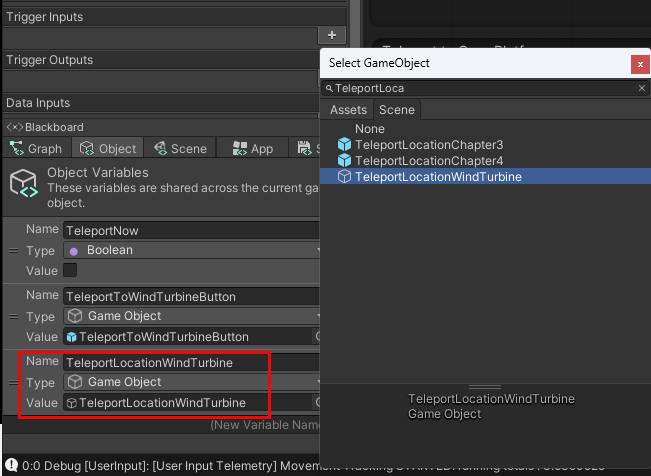

1. Drag the new "TeleportLocationWindTurbine" variable to the graph to add it as a node.

    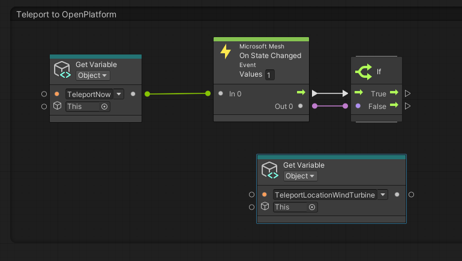

1. Connect the "True" outport control port of the "If" node to a new "Game Object: Set Active" node that you create.

    

1. Connect the output data port of the *TeleportLocationWindTurbine* node to the first available input data port of the new "Get Object: Set Active" node.

    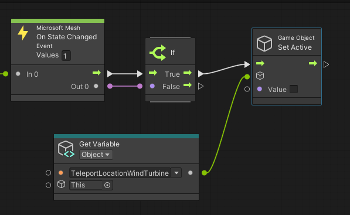

1. Click the **Value** check box in the "Game Object: Set Active" node to set its value to "True."
1. Connect the output control port of the "Game Object: Set Active" node to a new "Travel Point: Travel to Point" node.

    

1. Connect the output data port of the "TeleportLocationWindTurbine" node to the first available data input port on the "Travel Point: Travel to Point" node.

    

1. Connect the output control port of the "Travel Point: Travel to Point" node to the input control port of the "Set Object Variable" node located on the far right of the graph.

    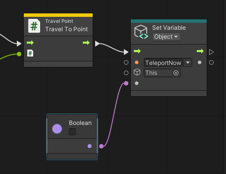

#### Test your work

1. In the Unity Editor, save the project and then press the Unity Editor Play button.

1. Go to Station 3.3 and then click the "Teleport" button to teleport up to the wind turbine generator.

    

    

1. In the **3.3 -- Generator** information box, select the **Show/Hide Generator** button. A window opens up in the side of the wind turbine and you can see the generator inside.

    

Feel free to step up close to the generator and have a look. It's pretty
cool! When you've finished, navigate back out and then press the
**Show/Hide Generator** button. This closes the window.

**Go to Chapter 4**

At this point, the participant in the experience would be ready to move
on to Chapter 4 and learn about wind turbine activities related to
physics. Just like with Chapter 3, there's a Sphere Terrace that
contains the stations for Chapter 4. To get there:

1. Rotate around in the opposite direction from the wind turbine
    generator and walk towards the **3.3 -- Go to Chapter 4**
    information box.

    

2. Press the **Teleport to Chapter 4** button.

    

    As advertised, this places the avatar in front of the stations for Chapter 4 and Mesh Physics.

    

### Chapter 3: Summary

In this chapter, you used Mesh Visual Scripting to add features that empower participants in
your experience to do the following:

1. Press a button that causes an educational video about wind turbines
    to play.

2. Press a button that triggers the display of an info dialog
    about wind turbines.

3. Press a button that teleports the participant from the ground up to
    a platform attached to a wind turbine generator, where they can
    examine the generator up close.

## Chapter 4: Move objects and trigger animations with Mesh Physics

In Chapter 4, you'll work with a model of the wind farm. You'll learn
how to use Mesh Physics to grab and release Rigidbodies (in this case,
wind turbines) and set up an animation trigger using Visual Scripting. You'll wrap things up by
constraining the wind turbines so they can only be moved within a
specified area.

This chapter is a little more straightforward than what you did in
Chapter 3---there's no scripting, and all the networking is done for
you, which means that the physics will look the same to all avatars in
the session.

There are a couple of things we need to do before getting started with the first station.

### Reconfigure the Hierarchy

- In the **Hierarchy**, collapse the **Chapter3** GameObject and then
    expand the **Chapter4** GameObject.

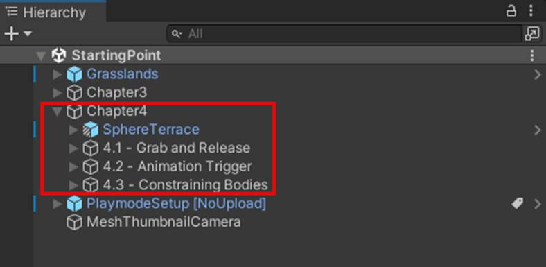

### Change the view to display the Chapter 4 Sphere Terrace

In the experience in Mesh, the participant will move smoothly from the
end of Chapter 3 to the beginning of Chapter 4 and will be properly
located to begin the Chapter 4 learning activities. However, when you
exited Play mode at the end of Chapter 3, you were *not* automatically
placed with a view to the Chapter 4 model in the **Scene** window. Let's
set up that view.

1. In the **Hierarchy**, select the GameObject named **4.1 -- Grab and
    Release**.

    

1. Move the cursor over the **Scene** window and then press the F key
    on your keyboard.

This centers the view on the **4.1 -- Grab and Release** object, but you'll most likely not be in quite the position we need.

1. Drag, rotate and/or zoom the view until you see the model in front
    of you, as shown below.

    

### Station 4.1: Grab and Release

The goal for the participant in this chapter of the training is to move
wind turbines from the tabletop to the ocean. Once located there, the
turbines will catch the ocean wind, making their blades turn and
generating power.

1. In the **Hierarchy**, expand the **4.1 -- Grab and Release**
    GameObject. Note that it contains three Wind Turbine GameObjects
    that are located on the tabletop in the scene.

    

Let's add "grab and release" capabilities to **WindTurbine1** so that participants will be able to move it around in Mesh.

1. In the **Hierarchy**, select **WindTurbine1** -- in the
    **Scene** window, it's the one farthest in the back and has red
    blades.

    We want the avatar to be able to grab and manipulate this object.

1. In the **Inspector**, click the **Add Component** button and then search for and add **Mesh Interactable Properties**.

    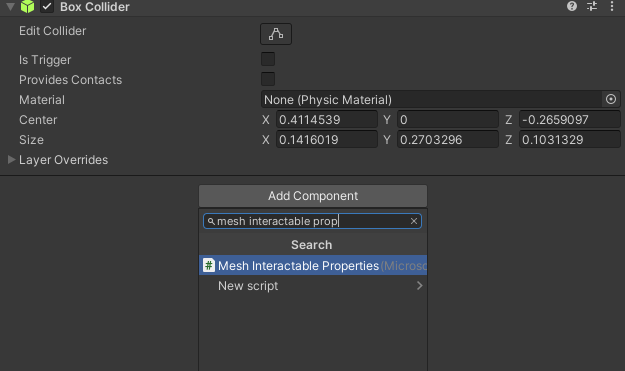

1. In the same component, select **Manipulable**.
1. Ensure that the component is active.
1. In the **Rigidbody** component, expand the **Constraints** option if
    needed, and then for the **Freeze Rotation** settings, select **X,**
    **Y**, and **Z**.

    

This will prevent the turbine moving tipping over if you place it on an
uneven surface.

#### Test your work

1. Save the project and then select the Unity Editor Play button.

    Note that whenever you enter Play mode, your starting point in the **Game** window is the Chapter 3 Sphere Terrace. We want to be in the other Sphere Terrace---the one for the Chapter 4 features. Fortunately, there's an easy way to get there.

2. Rotate the view to the right until you see the **Go to Chapter 4**
    information box.

    

3. Walk up to the information box and then select the **Teleport to
    Chapter 4** button.

    

4. After you arrive at the Chapter 4 Sphere Terrace, drag **WindTurbine1** until the cursor's shape changes, and then
    drag the turbine around the scene and drop it in the ocean.

    The turbine will stay upright as a result of turning on its *Freeze Rotation* constraints. Notice that the wind is blowing, but the turbine's blades don't turn. This is because we haven't triggered the blade-turning animation yet. We'll do that at the next station.

    

5. Click the Unity Editor Play button to exit Play mode.

You don't need to update the other two wind turbines---we've already
done that for you.

### Station: 4.2 Animation Trigger

The idea here is that when you drag a wind turbine over the ocean, the "wind" causes the turbine's blades to spin. What actually happens is that the **Animation Trigger** GameObject is located over the ocean and acts as a trigger volume. If you drag a wind turbine into the trigger volume, it sets off an "On Trigger Enter" event  that starts a spinning-blade animation.

1. In the **Hierarchy**, expand the **4.2 -- Animation Trigger** GameObject, and then select its child object named **Animation Trigger**.

    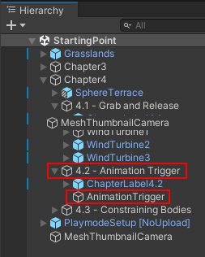

1. In the **Inspector**, navigate to the **Box Collider** component and then select **Edit Collider**. This shows you the boundaries of the trigger volume in the **Scene** window. When you're finished, click **Edit Collider** again to hide the boundaries.

    

1. In the **Box Collider** component, select **Is Trigger**.

    

1. In the **Hierarchy**, navigate to **Chapter 4** > **4.1 - Grab and Release** and then select **WindTurbine1**.
1. Click the **Add Component** button, and then search for and add **Script Machine.**
1. In the **Script Machine** component, click the round button next to **Graph**, and then in the **Select ScriptGraphAsset** window, search for and select "WindTurbineScript".

    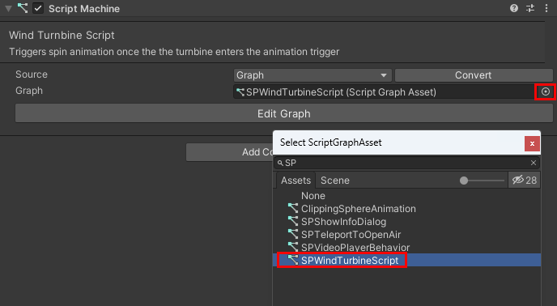

1. Click the **Edit Graph** button to open the script graph. Note that there are no custom Mesh nodes here; it's all standard Unity.

    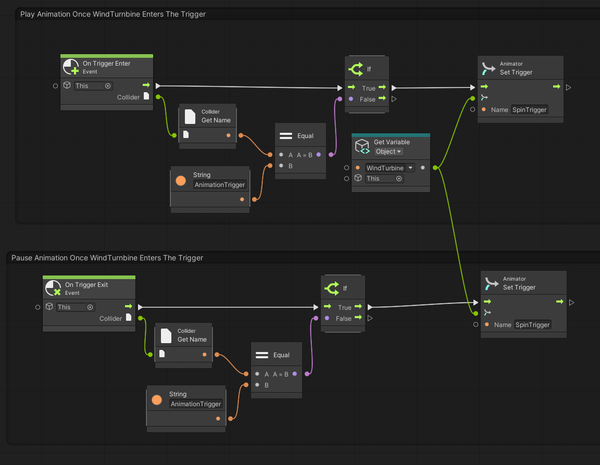

Note that the **Get Object Variable** node, it lists a variable called "WindTurbine"--but we don't actually have that variable in the graph yet. Let's create it now.

1. In the **Blackboard** section of the **Script Graph**, select the **Object** tab.
1. Enter the variable name "WindTurbine" in the text box and then press the Enter key or click the + button.
1. For the **Type**, select "Game Object."
1. In the **Hierarchy**, navigate to the GameObject **Chapter 4** > **4.1 - Grab and Release** > **WindTurbine1** > **WindTurbineBody** > **Windmill_Turbine_001:Propellors10**.
1. Drag **Windmill_Turbine_001:Propellors10** from the **Hierarchy** and then drop it in the **Value** field for the *WindTurbine* Object variable.

    

#### Test your work

1. Save the project, and then press the Unity Editor Play button.

2. As noted earlier, entering Play mode places your avatar in the
    **Chapter3** Sphere Terrace. Rotate the scene to the right, and then
    walk over to the **Teleport to Chapter 4** button and press it.

    

3. Now in the **Chapter4** Sphere Terrace, drag **WindTurbine1**
    (reminder: it's the furthest one in the back, with the red blades) over the ocean. Note
    that the turbine's blades are now spinning.

    

4. When you've finished observing the animation, press the Unity Editor
    Play button to exit Play mode.

You don't have to update the other wind turbines---we've already done it for you.

### Station 4.3: Constraining Bodies

Right now, there's no constraint on where a participant can drop a wind
turbine. The goal is to place the turbines in the ocean so they catch
the wind, but a participant could, for example, accidentally drop a
turbine on the floor. We want to avoid this, so to ensure that the
turbines can only land on the tabletop or in the ocean, we can set up a
containment field. This is basically a transparent box---the turbines
will be restricted to the inside of the box.


1. In the **Hierarchy**, expand the **4.3 -- Constraining Bodies**
    GameObject and select its child object named **Containment Field**.


1. In the **Inspector**, select the **Add Component** button and then
    add the **Containment Field** component.

    

1. In the **Containment Field** component, select the "+" button to the
    right of the **Affected bodies** option, and then, in the popup
    menu, select the **Game Object Name** condition.

    

4. In the **Starts With** box, type "WindTurbine." Since all three wind
    turbines in our scene start with "WindTurbine," they'll all be
    restricted to the **Containment Field**.

    

###Test your work

1. Save the project, and then press the Unity Editor Play button.

1. As noted earlier, entering Play mode places your avatar in the
    **Chapter3** Sphere Terrace. Rotate the scene to the right, and then
    walk over to the **Teleport to Chapter 4** button and press it.

    

1. Now in the **Chapter4** Sphere Terrace, grab one of the wind
    turbines and drag it around in the scene. Try to drag it away from
    the tabletop and ocean and drop it on the floor. The containment
    field prevents you from doing so.

### Summary

In this chapter, you added Mesh features that empower participants in
your experience to do the following:

- Grab and move an object

- Trigger an animation when the participant drags an object into a
    trigger volume

- Drop an object only in a particular area that you specified

## Chapter 5: Create and upload your Environment

You've completed adding all the features you need for your Mesh
experience using Mesh Physics and Scripting. So far, we've been working
in a Unity *project*; now you'll turn the *StartingPoint* scene into a
Mesh *Environment* and upload it to your Mesh World in the Azure Portal.

**Configure your project settings and sign in**

1. On the menu bar, select **Mesh Toolkit** > **Configure** >
    **Project Settings**.

    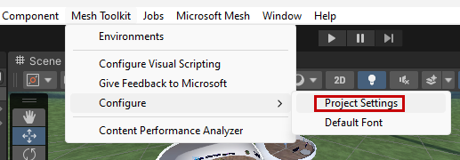

2. Select **Yes** to configure project settings for Mesh.

    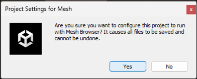

3. On the menu bar, select **Mesh Toolkit** > **Environments**.

4. In the **Mesh Environments** window, select **Sign In**.

Sign in with your account. **Note**: As mentioned in the Prerequisites
section, the account must have Content *Contributor* access to the Mesh
World you're uploading the Environment to.

### Create your environment

1. Make sure you're in the **Create** **Environment** tab, and then, in
    the **Internal Name** field, type "Wind Turbine Tutorial."

    

2. In the **Description** field, type "An interactive Mesh experience
    that teaches you about wind turbines."

    > [!NOTE]
    > For future projects, keep in mind that the **Internal Name** field has a maximum of 40 characters, and the **Description** field has a maximum of 70 characters.

3. To ensure you have the latest worlds that are available in the Azure
    Portal, select the **Refresh List of Mesh Worlds** button.

4. Select the **Mesh World** drop down, and then select the world you
    want to upload your Environment to if it's not already selected.

5. In the **Capacity** field, enter the capacity for your Environment.
    The maximum is 16.

    

6. Select **Create Asset** to create the Environment that you'll be
    uploading to the Azure Portal.

7. You'll receive a confirmation dialogue as shown below. Select
    **Close**.

    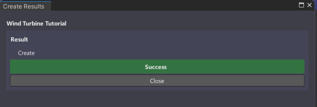

### Build and publish your environment

You should now be in the **Update Environment** tab of the **Mesh
Environments** window.

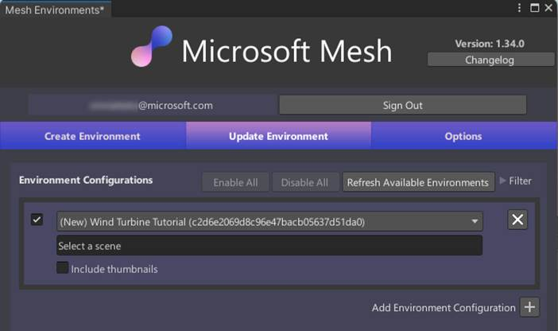

> [!NOTE]
> In the **Environment Configurations** section, a new Environment configuration has been created that displays the name you  added in the **Create Environment** tab: *Wind Turbine Tutorial*. If you see any other Environment configurations, close them.

- Select **Include Thumbnails**. Leave the setting as **Generate
    Thumbnails**.

    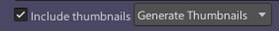

### Building for single and multiple platforms

It's good to keep in mind that Mesh events can be experienced on two
different platforms: desktop PC and Android, which powers the Meta Quest
headset. Since desktop PCs typically have far more power than mobile
devices using Android, when you're creating your own project, there are
several potential scenarios to consider: build and publish your scene
for PC only, Android only, or both PC and Android. This tutorial follows
option #3: build and publish for PC and Android. To learn more about
building for single and multiple platforms, see our document titled *Get
Started with Mesh Environments*.

### Create the Environment

1. In the **Update Environment** tab, click the **Select a scene**
    field, and then, in the **Select SceneAsset** dialog, select
    **StartingPoint**.

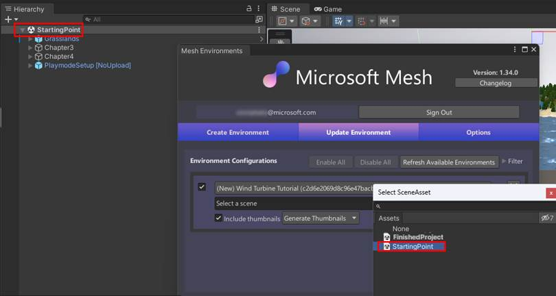

In the **Build for Platforms** section, you choose which platforms to
build for. Note that when a button background is gray, the button is
"on"; when the background is black, the button is "off." We're building
for both PC and Android, so make sure that both buttons are "on."

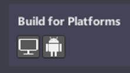

### Build and publish your Environment

1. In the **Publish** section, provide some information in the **Upload
    notes** box if you wish.

- Select the **Build and Publish** button.

    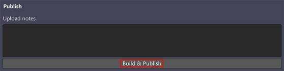

- If the Environment builds and uploads successfully, the **Build and
    Upload Results** dialog appears and confirms the results.

    

    If the build and upload process fails, this is confirmed in the **Build and Upload** **Results** dialog.

### Test the PC version of your Environment

In the **Build and Upload Results** dialog, select the left button under
**Published Asset**. This opens the Environment in the Mesh App.

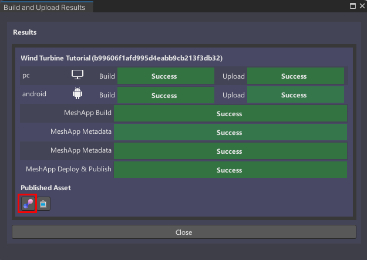

### View your Environment in Azure

If you navigate to the **Environments** page for your World in the Azure
Portal, you'll see that your Environment has been saved there. Its type
will be listed as "Custom Environment."


Your saved custom Environment will be available to anyone who creates a
new event in that Mesh world.

### Summary

In this chapter, you learned how to create an Environment based on your
scene and then build it and publish it to your World in the Azure
Portal.

## Chapter 6: Share your Mesh experience with others

Now that you've uploaded your Mesh101 Environment to Mesh, you can
create and produce an Event based on that Environment that participants
can experience through the Mesh app for PC or Quest.

See our document titled *Mesh Event Producer Guide* to create an Event
via the in-app event producer experience.  

### Create an event

1. Open the Mesh app and then log in.

2. In the left-side vertical button bar, click the icon for your World,
    or click the ["All Worlds" button](#_Mesh_dashboard_overview) at the
    bottom left, and then select the world you want.

    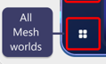

> **Notes**:

- You may have to scroll to view all the worlds.

- You can pin worlds to the left nav bar for easy access.


3. In your Mesh World, select the **Manage** button.

    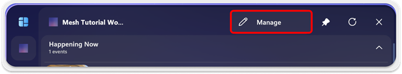

    > [!NOTE]
    > If you don't see the **Manage** button, then you aren't a Content contributor for this World.

4. Select the **Create** button, and then, in the drop-down menu,
    select **Create event**.

5. Add your event details (**Name**, **Date**, **Time**,
    **Description**, etc.).

    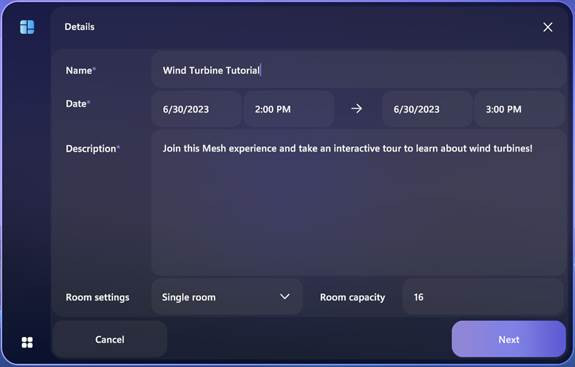

6. When you're finished, click **Next**.

7. On the **Template** page, press **Skip**.

8. On the **Environment** page, select the **Custom** tab.

9. Find the **Wind Turbine Tutorial** Environment, then select it, and
    then click **Next**.

    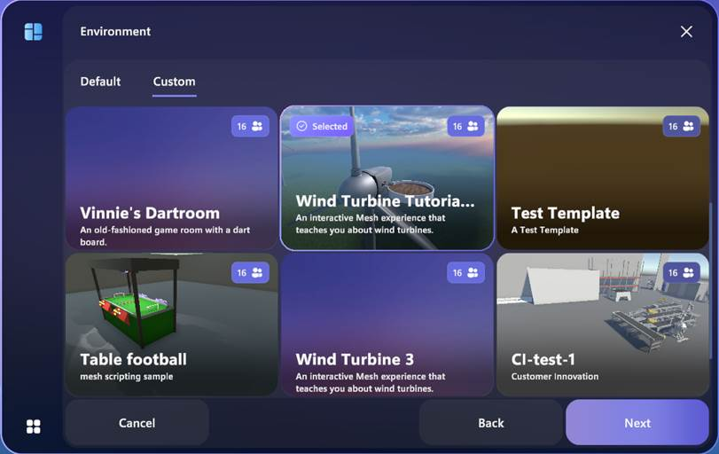

10. On the **Review** page, review your event details. Click **Back** if
    you need to go back and change anything.

    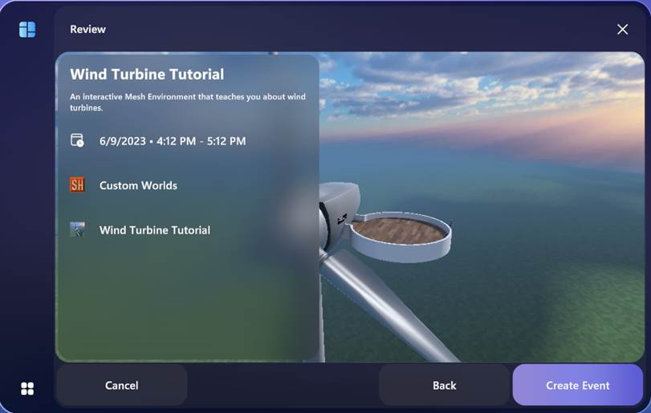

11. When you're ready to move forward, select **Create Event**. This
    saves your event and takes you to the **My Events** page.

    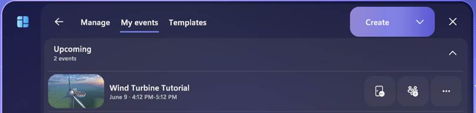

### Summary

In this chapter, you learned how to create an Event that's based on your
Environment. Participants can join the Event and then use the Mesh
features that you enabled in Chapters 3 and 4 to learn about wind
turbines.


# Conclusion

Congratulations! Now that you've learned some of the basics of Mesh, you
can create a Unity project using your own 3D assets and build a
collaborative Mesh experience that best fits your business goals.
