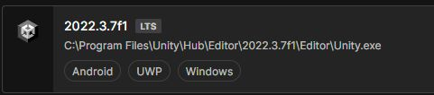

# Prerequisites for Mesh Development

## Unity version 2021.3.21f1+

We recommend that you use Unity version 2021.3.21f1+. Later versions will work, but you may see errors which can be bypassed.

[Get help installing Unity Template](https://docs.unity3d.com/hub/manual/InstallEditors.html)

Your installation should include modules for Android and Windows. When you create a new project, we recommend using the URP 3D Core template.

## Intermediate to advanced Unity skills

This document assumes you have intermediate to advanced Unity skills and are familiar with the fundamentals of Unity.

*We can't guarantee that all steps will work as expected due to your unique Unity and computer configuration. There may be extra work needed on your end to triage errors or issues.*

[Learn Unity & review fundamentals](https://learn.unity.com/)

## Azure portal access or Content Contributor permissions

To upload an Environment to a Mesh world, there are two things that must be enabled for your work account.

1. **Mesh world already created.** There must be a Mesh world to upload to from Unity. If there isn't one, your Azure Admin or Mesh world  resource owner should make one for you. For more information, see the Mesh IT Admin Guide and the article named Creating a Mesh world.

2. **Content Contributor role.** Your Azure Admin or Mesh world owner must add your work account as a content contributor for each Mesh world you want to upload an Environment to. For more information, see [Becoming a Content Contributor](#become-a-content-contributor).

