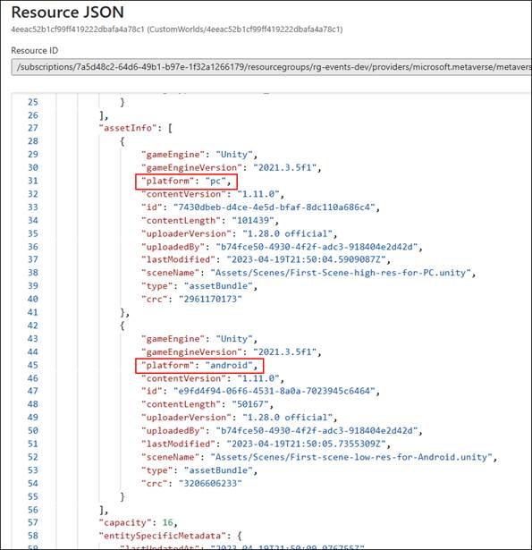
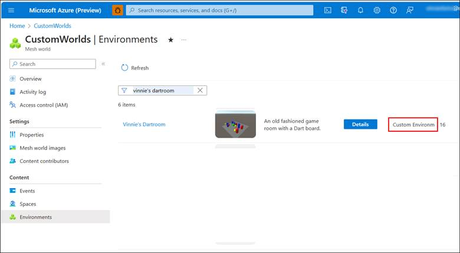

===================================

## Add the Mesh Thumbnail Camera

## Create the Environment

1. On the menu bar, select **Mesh Toolkit** \**Configure Project
    Settings**.

    

2. Select **Yes** to configure project settings for Mesh.

    

3.  On the menu bar, select **Mesh Toolkit** \**Environments**.

4. In the **Mesh Environments** window, select **Sign In**.

5. Sign in with your account. The account must have *Content
    Contributor* access to the Mesh world you're uploading the
    Environment to. If you need help with Content Contributor
    privileges, see [*Become a Content
    Contributor*](#become-a-content-contributor).

    Make sure you're in the **Create** **Environment** tab, and then fill
    in the **Internal Name** and **Description** fields. **IMPORTANT**:
    The **Internal Name** field has a maximum of 40 characters, and the
    **Description** field has a maximum of 70 characters.

6. To ensure you have the latest worlds that are available in the Azure
    Portal, select the **Refresh List of Mesh Worlds** button.

7. Select the **Mesh World** drop down, and then select the world you
    want to upload your Environment to if it's not already selected.

8. In the **Capacity** field, enter the capacity for your Environment.
    The maximum is 16.

    

9.  Select **Create Asset** to create the Environment that you'll be
    uploading to the Azure Portal.

10. You'll receive a confirmation dialogue as shown below. Select
    **Close**.

    

    You should now be in the **Update Environment** tab of the **Mesh
    Environments** window.

    

    Note that in the **Environment Configurations** section, you already
    have an Environment configuration created which displays the name you
    added in the **Create Environment** tab: *Vinnie's Dartroom*.

## Configure the Environment for build and publish

1. Select the field that displays **Select a Scene** and then, in the
    **Select** **SceneAsset** window, double-click the scene in your
    project that you want as the Environment. In this example, we're
    using the Mesh sample project
    *SharedPhysics.Showcases.Dartroom.Unity*, so our chosen scene will
    be *DartRoom*.

    \

2.  Select **Include thumbnails** and then, in the popup menu, choose
    **Generate Thumbnails**.

    

3. In the **Build for Platforms** section, you choose which platforms
    to build for. Note that when a button background is gray, the button
    is "on"; when the background is black, the button is "off." Do one
    of the following:

    - To build for PC only, make sure that only the PC button ("Mesh
        app on PC", the button on the left) is "on."

        

    - To build for Android only, make sure that only the Android button ("Mesh app on Quest", the button on the right) is "on."

        

    - To build for both PC and Android, make sure that both buttons are "on."

        

## Build and publish the Environment

1. In the **Publish** section, provide some information in the **Upload
    notes** box if you wish.

1. Select the **Build and Publish** button.

    

1.  If the Environment builds and uploads successfully, the **Build and
    Upload Results** dialog appears and confirms the results.

    

    If the build and upload process fails, this is confirmed in the **Build and Upload** Results dialog:

    

    You can test out the PC version of the Environment: select the left button under **Published Asset**. This takes you to a test version of the Mesh app on PC.

    

## Get information about your Environment

You should now be able to find your uploaded Environment on the
**Environments** page for your world in the Azure Portal.

To see more information about your Environment, select its **Details**
button. The resulting window *won't* tell you which platforms the
Environment is built for. To see that:

1. Select the name of the Environment (circled in red in the image
    above).

2. On the next page, select the **JSON View** button for the
    Environment.

    

3.  In the JSON view, the information about platforms is contained in
    the *assetInfo* object.

    

## Create an Event with your custom Environment

Now that you've uploaded your custom Environment to Mesh, you can
create and produce an Event based on that Environment that participants
can experience through the Mesh app for PC or Quest.

Go to *Custom Worlds - Mesh Event Producer Guide.pdf* to create an Event
via the in-app event producer experience.  

View your Environment in Azure

If you navigate to the **Environments** page for your World in the Azure
Portal, you'll see that your Environment has been saved there. Its type
will be listed as "Custom Environment."

Your saved custom Environments will be available to anyone who creates a
new event in that Mesh world.

To learn more about IT administration, see the document named *Mesh IT
Admin Guide.pdf*.

# Add more features

Now that you have a basic Environment, you can go further by
incorporating Mesh Scripting, Mesh Physics, Events integration features,
and WebViews.

- With the **WebView** prefab, designers can add panels to their scene
    that display static or interactive webpages. Learn more at *Custom
    Worlds --* *WebView Developer Guide.pdf*

- **Event content** integration: You can set up objects within your
    Environment to be controlled during an Event. When you use scripts
    in the Event Production folder of the Toolkit package, certain
    features will become available. See the [Event Production
    Integration](#event-content-integration) section below to set this
    up in Unity. To learn more, see the document named *Mesh Event
    Producer Guide.pdf\
    *

- With **Mesh Cloud Scripting** or **Mesh Visual Scripting**, you can
    assign behaviors to objects in the Environment, and the template
    itself, via C# scripts. To learn more, see the document named *Mesh
    Scripting Developer Guide.pdf\
    *

- **Shared Physics** simulation is key to enabling engaging dynamic
    content. The Mesh Physics system offers developers a productive
    workflow for creating custom content that will provide Mesh users
    with high-quality Mesh Physics experiences. To learn more, see the
    document named *Mesh Physics Developer Guide.pdf\
    *

- **Graphics Tools** is a package providing scripts, shaders, assets,
    and samples created to help improve the visual fidelity of Mesh
    worlds while staying within performance budgets. To learn more, see
    the document named *Mesh 3D Design and Performance Guide.pdf.*

**Note**: For information on installing the Mesh app for PC or Oculus
Quest, see our document named *Custom Worlds -- End User Guide*.

### Event content integration

Events in Mesh can create powerful interactive experiences for hosting
all-hands meetings, social gatherings, showcases, or trainings. The
*EventProduction* folder offered in
*com.microsoft.mesh.toolkit.-X.X.X+X.tgz* includes scripts that
integrate into the Mesh event production system.

**To locate the scripts:**

In the Project panel, navigate to **Packages** \**Microsoft Mesh
Toolkit** \**mesh.toolkit.sharedcontent** \**Scripts** \>
**EventProduction**.

The scripts include:

- *EmbeddedAudioBehavior*: For controlling Unity AudioSources with
    hard-coded/embedded audio clips

- *EmbededVideoBehavior:* For controlling hard-coded video

- *ObjectBehavior*: For marking GameObjects that can be
    enabled/disabled via the control panels

- *StreamedVideoBehavior:* For playing online videos

- *UnityPlayableBehavior:* For controlling a PlayableDirector

### Playables

*Playables* are Objects that are meant to be played, paused, looped, and
stopped. Example Playables include Unity-based timeline elements and
Unity Video Players.

Playables must also be included in your Unity scene to appear in the
Event Control Panel where they can be turned on or off.

To learn more about the Unity Playables API, please see [Unity - Manual:
Playables API
(unity3d.com)](https://docs.unity3d.com/Manual/Playables.html).

### Unity Video Players

Video playback for the Control Panel can be done using the **Unity Video
Player**. You'll first need to embed a video player in your Unity scene.
Once added, it will appear as an option in your **Control Panel**
content list and can be added to your **Control Panel** using the **+**
button. You can then toggle it **on/off** or adjust playback controls.
Learn more about how to use the **Control Panel** in the document named
*Mesh Event Producer Guide.pdf*, section: *Add Content with the Control
Panel*.

To learn more about the Unity Video Player component, see [Unity -
Manual: Video Player component
(unity3d.com)](https://docs.unity3d.com/Manual/class-VideoPlayer.html).

### Animate Timelines in Unity for Mesh

If you\'re unfamiliar with how **Timelines** work in Unity, watch this
Unity Tutorial series on using **Timelines**:

<https://learn.unity.com/tutorial/timeline>

#### To create a Timeline for Mesh

1. In the **Hierarchy**, add an empty GameObject and then rename it
    "Timelines."

2. Add another empty GameObject, make it a child to **Timelines**, and
    then rename it "Timeline1."

    

**Notes**:

- We suggest that you give this GameObject a more descriptive
    name---for example, *1_Entrance_Doors*. For this scenario, we'll
    stick with the name "Timeline1."

- If you have a door-opening animation, selecting the Play button will
    open the door in your scene. Selecting the Stop button will reset
    the animation back to its original position. A Playable will *not*
    animate in reverse; to do this, you'll need to create a different
    animation.

**IMPORTANT**: Multiple timelines on a single GameObject will *not*
work and will cause issues in events.

3. In the **Project** tab, navigate to the **Assets** folder and then
    create a new folder named *Animations*.

4. In the **Hierarchy**, select **Timeline1**, and then select **Window
    \Sequencing \>Timeline**.

5. We recommend that you move the **Timeline** tab next to the
    **Project** and **Console** tabs. This allows you to view the
    **Timeline** and the **Scene** or **Game** windows simultaneously.
    

6.  Select **Create**.
    

7.  In the **Save** window, change the name of the Playable to
    *Open_Doors* and then save it to the **Assets \Animations**
    folder.
    
    

8.  You can now animate or customize your Timeline---for example, add animation clips, activation clips, and more. For more on how to do this, watch this tutorial series:

A Timeline with several tracks might look something like this:

    

9.  Once you\'re done animating, in the **Hierarchy**, select the **Timeline1** GameObject, and then in the **Inspector**, navigate to the **Playable Director** component.

10. In most cases you\'ll want to choose these settings:

**Play On Awake** = not selected

The timeline will be active when you upload it.

**Wrap Mode = Hold**

The last frame of your animation will be on hold indefinitely;
otherwise, your timeline will reset to the start. There's also a
**Wrap Mode** option named **Loop** which you may want to use in some
instances.
>

Now you can upload your content to Mesh using the **Mesh Toolkit
Uploader** and then see how it looks in your Mesh space. To learn more,
see the document named *Mesh Event Producer Guide.pdf*, section: "All
Content with the Control Panel."

## Controlling an Animation in an Event

As a Producer in an Event, you can select *play* to start your
animation, *pause* it, and select *play* again to resume the animation.
You can also select *stop* to reset the animation to the beginning or
set your animation to *loop*.

For example, if you have a door-opening animation, selecting the *play*
button will open the door in your scene. Selecting *stop* will reset the
animation back to its original position. A Playable will not animate in
reverse; to do this, you'll need to create a different animation.

For more information, see our document titled *Mesh Event Producer
Guide*.

## Save your work as a template

If you create an Environment + Event features combination that you think
Event Producers may want to repeat in the future, you can save the
combination as a template. To learn more about templates, see our
document named *Mesh Event Producer Guide*, section: *Event Templates*.

# Testing with the Playmode package

## Purpose

The Mesh.Toolkit.Playmode package gives you the capability to
select *Play* in a Mesh Environment building project and get an
approximate preview of what the content will look and feel like when it
runs in the Mesh app. This greatly speeds up the iteration cycle during
content development and allows developers of advanced interactive
content to deeply debug the logic with all the powerful tools that Unity
offers. From this point forward, we\'ll refer to this feature
as *Playmode*.

The look and feel in Playmode are similar but not identical to those in
the Mesh app. It\'s an ongoing effort to reduce the differences where
possible without sacrificing the lightweight Environment necessary for
quick iteration. A key feature of Playmode is the ability to run
multiple clients within the same process; this allows a single developer
to easily get a first impression of a multi-user scenario.

If you followed the instructions in the [Import
Packages](#import-packages) section, you added the tarball named
*com.microsoft.mesh.toolkit-.xxx* which includes the Playmode package.

1. Add a *PlaymodeSetup \[NoUpload\]* prefab to the scene: right-click
    in the **Hierarchy** and then select **Mesh Toolkit** \>
    **PlaymodeSetup**.
    

2.  Ensure that the scene contains a piece of solid floor below the
    origin that's set to the *NavMesh* layer.

3. Press the Play button.

## Teleport Player on Play

When working in a large scene, you may find it valuable to move to a
specific location at startup.

Playmode Split Screen

This feature lets you run multiple clients within the same process and
show them side-by-side within the same window. The
*Mesh.Toolkit.Playmode* package itself implements a very minimal
emulated *PlaymodeNetwork* component that\'s sufficient to communicate
the player position between the clients, allowing the different players
to see each other as heavily stylized avatars:

This is sufficient for previewing static content. When developing
interactive content Mesh Scripting and/or WebView, keep in mind that the
packages for those features each contain their own networking mechanisms
which provide a Playmode preview of a synchronized experience with
multiple users.

Do one of the following:

- Increase the initial screen count before entering Play mode by
    setting the value on the **PlaymodeSetup \[NoUpload\]** component:

-or-

1. Start Play mode.

2. In the **DontDestroyOnLoad** scene, navigate to the
    **PlaymodeSplitScreen** component and then select **Add player**.

Now you can quickly test your Unity Scene without going through the
build and upload process each time you make an iteration.

# Congratulations

Using the instructions in this document, you created a new Mesh project
or upgraded a pre-existing one, and then uploaded an Environment to the
Mesh Browser. You also learned about the samples we provide that can
give you preloaded projects to use a foundation. Also, you may have
added Event Integration features. With the Playmode package, you reduced
iteration cycles during content development.\
\
We hope this has given you a good start to exploring more creative
possibilities in Mesh!

Here are some other documents that can help you learn more about using
Mesh:

- **Creating Worlds and Spaces and other account activities in the
    Azure Portal:** *Mesh IT Admin guide.pdf*

- **Integrate WebViews into your Unity Environment Environment:**
    *Mesh WebView Developer Guide.pdf*

- **Artistic guidelines for designing Environments in Unity:** *Mesh
    3D Design and Performance Guide.pdf*

- **Get started Producing Events in Mesh:** *Mesh Event Producer
    Guide.pdf*

- **Get started as an end user in the Mesh Browser:** *Mesh End User
    Guide.pdf.*

- **Learn about interactions:** *Mesh Object and Player
    Interactions.pdf.*

# Troubleshooting

## Become a content contributor

To upload your Environment to a Mesh World in the Azure Portal, you must
be listed as a Content contributor for that World. In most cases, this
should be handled by your IT Admin and the process is explained in our
document titled *Mesh IT Admin Guide.pdf*.

## Get help with Mesh Toolkit and Uploader issues

To better serve you, provide your Microsoft representative with the
following information when experiencing issues with the Mesh developer
experience.

- Uploader Version

- Metaverse ID

- Environment ID (if relevant)

- Is the issue consistent, intermittent or a one-off?

- Are there any errors or warnings in the Unity console?

- Have you restarted the Uploader and/or Unity?

**The Unity Editor log\
**\
The Unity Editor log contains some extra logging that may not show up in the **Console**. The
log can be retrieved with the following steps:

1. In Unity, navigate to the **Console** window.

2. Select the
    the three-dot button on the top right of the **Console** area, and
    then select **Open Editor Log**.

3. **Save** the file.
