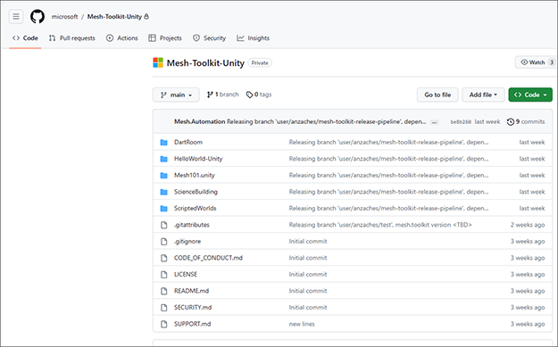
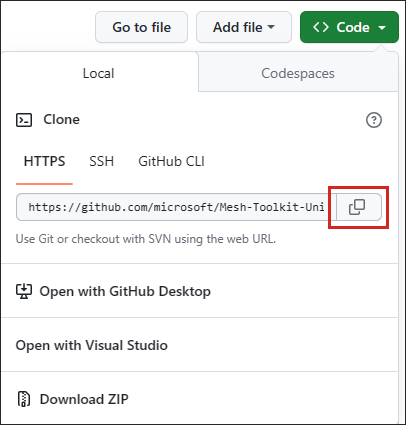
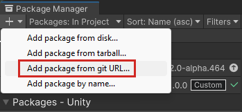
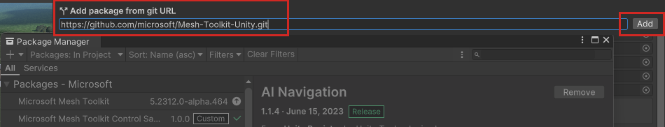

# Importing the Mesh Toolkit

The [Mesh Toolkit](../../Create/development-overview.md#develop-in-unity-with-mesh-toolkit) contains the packages you need to create your Mesh experience.

1. In your browser, go to GitHub, and then navigate to the [*Mesh-Toolkit-Unity* repository](https://github.com/microsoft/Mesh-Toolkit-Unity).

    

1. Select the **Code** button, and then select the Copy button for the URL.

    

1. In Unity, open the Package manager, then select the "+" drop-down, and then select **Add package from git URL**.

    

1. In the **Add package from git URL** field, paste the URL, and then select the **Add** button.

    

> [!div class="nextstepaction"]
> [Build for single and multiple platforms](build-for-single-and-multiple-platforms.md)    