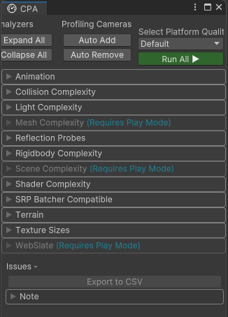

# Content Performance Analyzer

## What is the Content Performance Analyzer?

You can use the Content Performance Analyzer (CPA) to automatically catch content optimization issues and opportunities before you upload content to the Mesh catalog.

## Using the CPA tool

**To open the CPA tool**:
In Unity, on the menu bar, select `Mesh Toolkit > Content Performance Analyzer`.

    

This opens the CPA tool in its own window. 

**To run all analyzers**: 
In the CPA tool, click the **Run All** (▶) button. Your content is analyzed based on the project's current quality settings.

**To audit other platform quality settings**:
Click the **Select Platform Quality** droop-down and then select the platform.

> [!IMPORTANT]
> For best results, make sure you play the Unity scene you wish to analyze. Some tests only work in Play mode, while some work in either Play or Edit mode.

## Analyzers

- __Animation__ (visibility culling)
- __Collision Complexity__ (dense mesh colliders)
- __Light Complexity__ (real time lights, shadow casters, and avatar lights)
- __Mesh Complexity__ (triangles and vertices)
- __Reflection Probes__ (realtime vs baked probes)
- __Rigidbody Complexity__ (rigidbody counts)
- __Scene Complexity__ (batches and draw calls)
- __Shader Complexity__ (vertex and fragment shader math instruction counts, variant counts)
- __SRP Batcher Compatible__ (compatibility check with the SRP batcher)
- __Terrain__ (terrain component settings)
- __Texture Sizes__ (memory usage for lightmaps and other **textures**)
- __WebSlate__ (runtime render time for WebSlate)

**Scene Complexity** and **Mesh Complexity** results are based on camera position and orientation. The CPA tool will search for all cameras within your scene, including disabled ones, and run tests from each camera. If your scene doesn't have a camera, the CPA tool will add a camera when testing so it can view the bounds of your scene.

> [!TIP]
> Place a few cameras in your scene (disable them if you need to) that mimic real vantage points a user might experience. If you're unsure about where to add cameras by hand, you can click the **Auto Add** button in the **Profiling Cameras** section of the UI. This will automatically add cameras to the navigable space.

## How to interpret the results

After you click **Run All**, the words "Passed" or "Failed" will be added to each analyzer's title. To gain more insight into why an analyzer failed, look in the **Report** > **Issues** section of the analyzer.

> [!TIP] 
You can export results to a .CSV file and then open it in Microsoft Excel by clicking the **Export to CSV** button.

Most restrictions for each analyzer are detailed in the [*Designing for Mesh*](../design/overview.md) series of articles or the [*Mesh Physics*](../enhance-your-environment/physics-interactions.md) article.