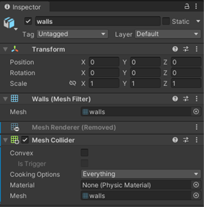

# Designing for Mesh: Overview

This is a guide for artists, designers and developers who want to create
Mesh experiences using Unity and possibly other design tools such as 3D
modeling programs. Mesh has unique style and development guidelines that should be reviewed
to ensure that Attendees at Mesh events are provided with the best experiencese possible.

In Unity, you create a project from scratch or use
one of our existing samples as a starting point, then add content, and
then publish the project as an *Environment* to a World in the Mesh 
portal. When an Event Organizer creates a Mesh event, they can choose
to hold their Event in the custom Environment you created.  

Mesh is a new product and is always evolving to meet the needs of our
partners. This and other articles cover the design guidelines for creating 3D
Environments for various use cases.

It's important to consider that your design and performance needs may be
more expansive than what our documentation provides. For example, needs may
differ based on the scale of your Mesh Experiences; a 16-person
Environment has different performance requirements from a 200-person
Environment. This doc provides principles and guidelines that should
satisfy most needs for businesses deploying Mesh.

A Microsoft Mesh Experience can allow multiple users to simultaneously experience the content you
create. Because of this, we deliberately restrict some of the features
available in Unity to a subset that are supported in Microsoft Mesh.
Here are some things to consider when creating content:

- Microsoft Mesh controls the camera in the scene.

- Microsoft Mesh controls users' movements and interactions in the
    scene.

- For security reasons, C# behaviors are restricted to a limited set
    of the behaviors provided in the Mesh Toolkit. Any unsupported
    behaviors you include in your content won't be loaded or executed.

In general, Unity Packages downloaded from the Unity Asset store aren't
expected to work unless they conform to the restrictions above.

## Prerequisites

Before creating Mesh Environments, it's important to have a strong
foundation in the following disciplines:

- 3D modeling skills or a source for obtaining the models you need

- Texturing and light-mapping (UVs)

- Performance and model optimization

## Recommended tools

To design assets for use in Mesh Environments, you should have some
experience with 3D modeling software such as Maya, 3DS Max, Cinema 4D,
Houdini, ZBrush, or Blender. For painting and texturing models, you can
use the features built into those apps or use a dedicated tool such as
Adobe Substance Painter.

## Your Experience on the Mesh app

The Mesh app has been designed to help boost fidelity through
the following:

- Final render texture size

- Anti-aliasing and post effects settings

- Maximum texture sizes

- Number of dynamic lights

- Number of dynamic shadows

# Sharing Unity projects

Currently, sharing Unity projects with other parties is not guaranteed.
Be aware that sharing can raise some errors and is **not** fully
validated for Mesh-related projects.

<!-- New article -->

## Getting Started

You can create Mesh Experiences for two different platforms:

- Android, which is used on the Oculus Quest headsets.

- PC Desktops and Future Higher End Platforms

There are several ways to create Mesh Environments in Unity:

- Open and build upon an existing sample.

- Upgrade packages in a pre-existing Mesh project.

- Start a new project from scratch.

To learn about each of these approaches, see our article titled [Choose your journey](../getting-started/choose-your-journey.md). This will introduce you to the tools, show you how to create your first Mesh environment, and
teach you how to deploy it to users.

## Try our Mesh 101 tutorial

If you're new to Mesh and like the idea of learning through a
step-by-step tutorial, we recommend that you try our Mesh 101 tutorial.
It starts you off with a pre-built Unity project and then walks you
through the process of creating an educational windfarm experience.
You'll learn how to use Mesh scripting and physics to add interactivity,
and then you'll deploy the project as a metaverse Environment to your
Mesh World. To get started with the tutorial, see our article named [Mesh 101 tutorial: overview and setup](../getting-started/mesh-101-tutorial/mesh-101-01-overview-and-setup.md).

<!-- new article -->

# Project Structure

### Naming conventions

*ProjectName_category_assetName_subcategory_iteration_type.format*

*Here are some naming convention examples:*

### Unity folder structure

### Perforce folder structure

## Unity file hierarchy

Keep the **Hierarchy** clean by removing disabled objects.

**Disabled objects still add to the file size of the root
object/project.**

Embedding Prefabs into Prefabs is okay, especially if multiple people
are working within a workstream.

<!--------------- New article -->

## Unity Prefabs

### Prefabs

We recommend that you start each project with Prefabs; this will allow
your scene to be accessible to multiple people at once without worrying
about overriding others' work. Splitting each scene up into common
sub-disciplines is a great place to start.

Using Prefabs allows easier collaboration within a single Unity scene
and is preferred for Microsoft Mesh projects.

 
When editing the scene, always make sure
the Prefab you're working in has its overrides applied.

If there are overrides waiting to be applied on a Prefab, that means
those changes are **not yet associated with the Prefab**. In the
screenshot here, the changes are at the scene level and, when saved,
will modify the scene file only.

Applying the override will remove the changes from the scene file and
apply them to the Prefab file.

**Prefab Overrides and GIT**

Note what happens if you save the project **without** applying the
overrides and commit the project files to a GIT repository:

When you eventually apply the overrides to the Prefab, you'll have to
commit the Prefab file and the parent object file to the GIT repo. In
this scenario, you're adding the changes to the Prefab file while
removing the changes from the parent file.

When you're making a new Prefab, make sure the empty GameObject node is
zeroed out **before** turning it into a Prefab.

**CORRECT**

**INCORRECT**

+-----------+--------------------+-----------+------------------------+
| The FLOOR | {width="2. | mesh      | .png){width="2.4625in" |
| have its  | 462962598425197in" | should    | height="               |
| Tag set   | height="2.         | leave its | 2.5058245844269464in"} |
| to        | 49167104111986in"} | Tag and   |                        |
| T         |                    | Layer set |                        |
| eleporter |                    | to its    |                        |
| and its   |                    | defaults, |                        |
| Layer set |                    | u         |                        |
| to        |                    | nchanged. |                        |
| NavMesh.  |                    |           |                        |
|           |                    | This      |                        |
| This      |                    | object    |                        |
| object    |                    | doesn't   |                        |
| doesn't   |                    | have a    |                        |
| have a    |                    | Mesh      |                        |
| Mesh      |                    | Renderer  |                        |
| Renderer  |                    | c         |                        |
| c         |                    | omponent. |                        |
| omponent. |                    |           |                        |
|           |                    | This      |                        |
| This      |                    | object    |                        |
| object    |                    | needs a   |                        |
| needs a   |                    | Mesh      |                        |
| Mesh      |                    | Collider  |                        |
| Collider  |                    | c         |                        |
| c         |                    | omponent. |                        |
| omponent. |                    |           |                        |
+===========+====================+===========+========================+
+-----------+--------------------+-----------+------------------------+

<!-- New article -->

# Creating models

### Clean geometry

Each polygon needs to have a purpose and help sell the believability of
the Environment. If edge flow creates confusing shadows or
hard-to-understand shapes, you can simplify. If a mesh won't be seen up
close and has dense polygons, you can reduce its complexity.

A clean and easy-to-understand silhouette goes a long way towards
amplifying an environment or prop. A properly optimized mesh goes a long
way towards driving polish and enhancing the user's experience.

### Unseen faces

Make sure you delete faces the user will never see. Not only will this
save on polycount and increase performance, it also has a huge benefit
when creating optimized light map UVs.

### VR users

VR users can 'escape' collision boundaries by physically moving the
headset, with approximately up to two meters of wiggle room.

Plan for this and don't delete faces as aggressively when they're close
to the collision boundaries.

## Aliasing 

When modeling and designing, avoid straight lines and aliasing-producing
materials. This will save technical overhead later and create a better
experience for users.

Use matte, smooth, and larger shapes when possible. Avoid bevels, hard
edges, and metallic materials.

Consider the distance a user could be from an object and the lighting of
your Environments. Thin objects render as straight lines and metallic
objects produce specular artifacts when lit. It's best to avoid these
outcomes, when possible, with careful modelling.

## Resources for minimizing aliasing in levels & materials

**Level design:** [Advanced VR Graphics Techniques
(arm.com)](https://developer.arm.com/documentation/102073/0100/Level-design)

**Banding:** [Advanced VR Graphics Techniques
(arm.com)](https://developer.arm.com/documentation/102073/0100/Banding)

## Minimizing polycount for props

Increase performance of your final scene by minimizing the polycount of
your props before exporting them. This will reduce the resource cost to
render objects and maximize performance in your final scene.

## Resources for minimizing polycount

**Maya polycount reduction how to**: [HOW TO REDUCE POLYCOUNT IN MAYA -
YouTube](https://www.youtube.com/watch?v=xWYEXj_Cemc)

**Maya polygon modeling tips:** [Maya Help: Polygon modeling preferences
and tips
(autodesk.com)](https://help.autodesk.com/view/MAYAUL/2016/ENU/?guid=GUID-4A9B7918-06B9-4BDD-80DE-DD6D756B09B3)

## Materials

 
Name each material in your .fbxfile to
closely match its corresponding material inside Unity. Avoid exporting
default material names.

## Stairs

To optimize performance and to prevent visual artifacts in both camera
and character, we recommend representing stair **collision** geometry as
a sloped plane without modifying render geometry.

The character controller is represented by a capsule with a small radius
which does allow it to effectively climb up stepped geometry. However,
this approach can cause jittering0F[^1] in both the camera and character
movement.

<!-- New article --->

# Exporting models and environments

- **Do not** export multiple prop meshes in one .fbxfile. Each prop
    should have its own .fbxfile.

- **Do not** export props with values in transforms in your modeling
    package. **Make sure to zero out transforms.**

- **Do not** export props with off-center pivot points. Make sure
    pivot points are at world origin (0,0,0) and properly snapped to the
    base of the mesh.

### Exporting environments

- **Do not** plan to move meshes inside Unity. For environment FBX's,
    adjust inside your modeling program before export.

<!-- New article-->

# Working with UVs

## UVs and lightmaps

Setting up optimized and clean lightmap UVs is one of the most important
aspects of achieving a clean and immersive VR environment.

**Note: The** Unity Auto-Generate Lightmaps option doesn't easily give
the control needed to accomplish this, and we recommend that you avoid
using it.

Each mesh object that makes up an .fbx needs its **own** optimized UV
channel 2 layout.

### Why?

Unity light bake grabs each individual mesh and packs it on its own. If
you pack together in your 3D program, you'll end up with wasted space.

Setting up optimized and clean light map UV's is one of the most
important aspects of achieving a clean and immersive VR environment.

Splitting lightmap UV seams where there's a hard edge on the mesh will
give you crisp edges with the Unity light bake.

If there isn't a UV seam at the hard edge, and with the light bake
resolution constraints we have, the hard edges will turn soft and lose
their impact.

 
This version of the elephant has bigger UV
shells with no cuts at the hard edges.

Unity light bake smoothed it out.

Light bake aliasing is an issue with our resolution constraints.

Straighten UV shells to cut out unwanted aliasing

Aliasing in the UVs will cause aliasing in the light map textures.
Aliasing baked into textures hurts immersion and presence.

The aliasing seen here is due to the UV shell being a circle.

 
Aliasing will be gone regardless of the
lightmap texture resolution.

Even a small amount of aliasing can be problematic for VR users since
they can view the mesh from any distance.

Introducing a small amount of warping in the light bake is okay if it
means ridding shell of aliasing

## Resources for lightmapping

[Unity - Manual: Generating lightmap UVs
(unity3d.com)](https://docs.unity3d.com/Manual/LightingGiUvs-GeneratingLightmappingUVs.html)

## Packing UV shells

With our focus on lightweight and optimized projects, UV layouts need to
be as efficient as possible.

Once texel size is determined in Unity, make sure to go back and adjust
any shells that are too closely packed to cut out texture bleed or have
room for smaller padding.

 First
pass, before the scene texel scale is determined.

 
Second pass, after the scene texel scale is
determined.

<!-- New article-->

## Model textures

Using flat colors and a clean light bake instead of custom textures is a
very efficient and performant route to take for prop textures.

These props don't have custom textures, but instead rely on the
URP/Baked Lit shader's Base Map color value and a clean light bake.

Not using textures also eliminates texture artifacts like pixelization
and aliasing, which is a big boost to VR immersion.

When
a custom texture is used, like on these purple plants, green leaves, and
the red leaves of the tree, keeping the detail simple and clean goes a
long way towards hiding the textures' low resolution.

Tiling textures should be authored at 3x3 meter scale.

All tiling textures should be authored left to right.

## Unity model importer

Utilizing the Unity Importer for material management not only speeds up
iteration time, it also has a positive impact on performance. As of
Spring 2022, when the Importer lists the On Demand Remap slot as 'None
(Material)', Unity embeds the default URP/Lit material into the asset.

**Even one material set to 'None (Material)' has a performance cost.**

**Ensure that all slots have corresponding Unity materials loaded in, as
shown below.**

## Unity shaders

### Quick Links

- Universal Render Pipeline overview \| Universal RP \| 12.1.4
    (unity3d.com)

- Baked Lit Shader \| Universal RP \| 12.1.4 (unity3d.com)

- Complex Lit Shader \| Universal RP \| 12.1.4 (unity3d.com)

### Shaders

Microsoft Mesh utilizes the URP renderer. Unity has multiple built-in
URP shaders available to use.

+-----------------------------------+-----------------------------------+
| **For Android-focused projects**, | **For PC / High-end focused       |
| we only use the following:        | projects**, we recommend that you |
|                                   | use the following:                |
+===================================+===================================+
| -   **URP/BakedLit**              | -   **URP/ComplexLit (if advanced |
|                                   |     materials are need)**         |
| -   **URP/Unlit**                 |                                   |
+-----------------------------------+-----------------------------------+

#### Resources for Unity shaders

**Complex Lit Shader:** [Complex Lit Shader \| Universal RP \| 10.2.2
(unity3d.com)](https://docs.unity3d.com/Packages/com.unity.render-pipelines.universal@10.2/manual/shader-complex-lit.html)

### Shader graph

Unity Shader Graph is okay to use; however, performance could be
negatively impacted if the custom shader isn't properly optimized. **For
Android projects:** we highly recommend that you stick to \~30 math
operations in vertex, \~120 math operations in fragment, and \~2 texture
look ups..

### Shader Features

Most shader and renderer features are available to every platform, but
some platforms disable features for performance considerations.

  -----------------------------------------------------------------------
                                **Android**       **PC**
  ----------------------------- ----------------- -----------------------
  **\_CameraDepthTexture**      ❌                ❌

  **\_CameraColorTexture**      ❌                ❌

  **HDR**                       ❌                ❌

  **MSAA**                      2x                2x

  **Reflection Probe Blending** ❌                ✔

  **Post Processing**           ❌                ❌
  -----------------------------------------------------------------------

When unsure if a setting is enabled or disabled for a platform you are
developing for, reference the URP assets contained within the Mesh
Toolkit Uploader's URP folder:

Note, that altering render pipeline settings or adding renderers is not
supported.

<!--- New Article -->

## Lighting

For Microsoft Mesh environments, utilize Unity Baked Lighting.

To include a mesh object in the light bake, make sure you check the
**Static** checkbox in the **Inspector**.

 
All Unity light types are available when
using baked lighting.

**Make sure you set the mode to "Baked". Realtime lights** **aren't
supported for use in the environment.**

To include a mesh object in the light bake, make sure you check the
**Static** checkbox in the **Inspector**.

 
If this isn't checked, lighting won't be
applied to the mesh, nor will it cast any shadows in the scene.

The Scale in Lightmap value increases/decreases the size of the selected
mesh's UVs in the Unity light map bake. If you need to change a specific
mesh's resolution, this is where to do it.

Leave **Scale in Lightmap** at its default (1) while setting up your
scene.

If you need to increase overall scene light map resolution, don't do it
on a mesh-by-mesh basis; do it in the scene Lightmapping Settings.

### Quick tips for lighting

- The further a mesh object is from the scene's playable space, the
    smaller its Scale in Lightmap value can be.

> Deemphasizing far away objects in the light bake is a great way to
> save light bake texture space and use resolution on objects that
> players can get up close to.

## Dynamic lighting

Most environments use baked lighting, but there are a handful of objects
in your environment that need to be dynamically lit. For example,
avatars, user content, and physics objects. To ensure these objects are
properly lit add a single directional light that is:

- Type: Directional

- Mode: Real time

- Culling Mask: includes "Avatars" and "UserContent"

Color and intensity can be any values that suit the environment. The
[Content Performance
Analyzer](https://microsoft.sharepoint.com/teams/MicrosoftMeshEAPOnboardingResources/Shared%20Documents/Forms/Mesh%20%20Custom%20Worlds%20%20Organized%20View.aspx?id=%2Fteams%2FMicrosoftMeshEAPOnboardingResources%2FShared%20Documents%2FEAP%20Resources%20%2D%20External%2FFiles%20and%20Packages%2Fcom%2Emicrosoft%2Emesh%5Ftoolkit%5Fcpa%2D0%2E1%2E4%2Ezip&parent=%2Fteams%2FMicrosoftMeshEAPOnboardingResources%2FShared%20Documents%2FEAP%20Resources%20%2D%20External%2FFiles%20and%20Packages)
will also display an error if a light like this is not found.

## Light Mapper Settings

*Unity Lighting settings (Window/Rendering/Lighting)*

| +---------------------------------------+------------------------------+ |
|--------------------------------------------------------------------------|--|
| scene**.                                                                 | Parameters file and setting |
|                                                                          | BackfaceTolerance to a very |
|                           | low number keeps backface |
|                                                                | errors out of the light |
|                                                                          | bake. |
|                                                                          |  |
| {width="4.159027777777778in"                                   | width="3.1304505686789152in" |
| height="1.7048611111111112in"}                                           | h |
|                                                                          | eight="3.398043525809274in"} |
| Ambient Occlusion is project                                             |  |
| dependent. We recommend that you                                         |  |
| don't use it since it does introduce                                     | {width="2.613636264216973in" |
| artifacts in light bake.                                                 | he |
|                                                                          | ight="2.3652679352580925in"} |
| **Non-Directional is required for                                        |  |
| WebGL environments.**                                                    | { |
|                                                                          | width="2.6131944444444444in" |
| {width="3.8333333333333335in"                                   | ight="2.1761450131233597in"} |
| height="1.4270067804024498in"}                                           |  |
| +=======================================+==============================+ |
| +---------------------------------------+------------------------------+ |

# Troubleshooting

# Known issues & limitations

Mesh is still in development, with new features and updates to existing
features ongoing. You may find that some features or
experiences are not polished or fully functional.

Look at the Release notes for details on features, bug fixes, and known
issues.

If you find new issues, file a bug or speak to your Microsoft partners.

# Release notes

Look at the Release notes for details on features, bug fixes, and known
issues.

We love feedback and bug reports! If you'd like to provide feedback, use
the Feedback button inside any Mesh experience. This ensures that your
feedback and bug reporting will be triaged and incorporated quickly.

If you're not able to give feedback or report bugs using the Feedback
button in Mesh, use the Teams chats with your Microsoft partners or
contact your Microsoft partners directly.

<!--------------- end of article -->

