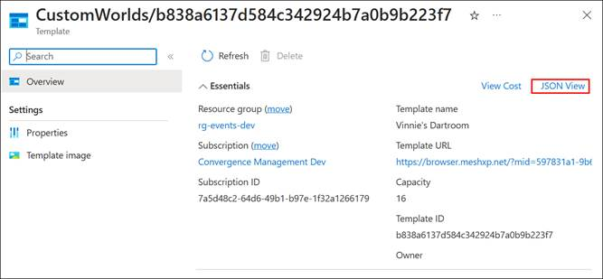

# Get information about your Environment

After you've uploaded your Environment to the Azure Portal, you may want to view information about it. You can find such information on the **Environments** page for the World you uploaded the Environment to.

To see more information about your Environment, select its **Details**
button. The resulting window *won't* tell you which platforms the
Environment is built for. To see that:

1. Select the name of the Environment (circled in red in the image
    above).

2. On the next page, select the **JSON View** button for the
    Environment.

    

3. In the JSON view, the information about platforms is contained in
    the *assetInfo* object.

    
