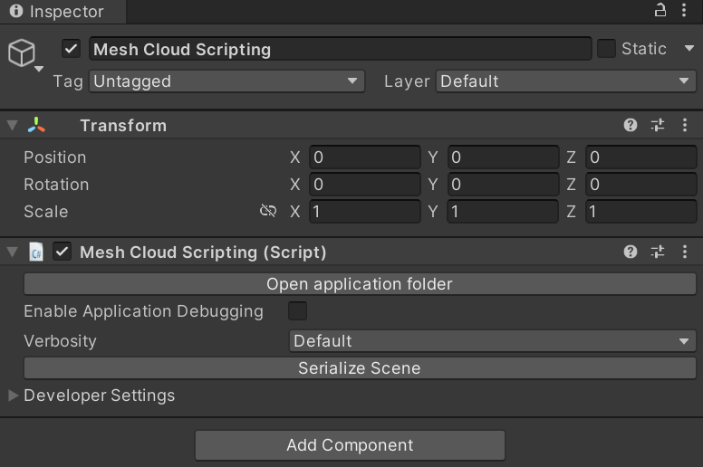
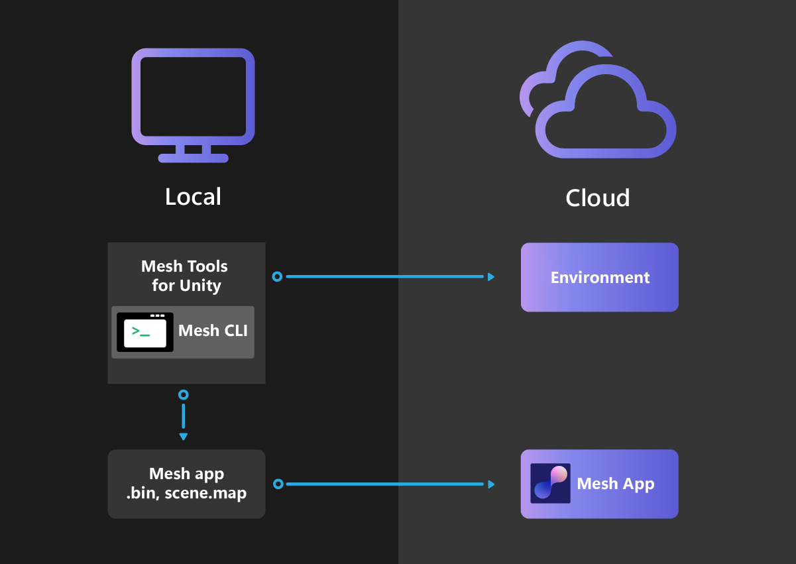

# Cloud scripting basic concepts

Read an [overview of Mesh Cloud Scripting and Mesh Visual Scripting](mesh-scripting-overview.md)

## Differences between Mesh scripts and MonoBehaviours

There are several major differences between Mesh scripts and MonoBehaviours:

- Mesh Scripts are written against the Mesh API (as opposed to the Unity API).
- Mesh Scripts run in the cloud in a separate process (as opposed to on the client), and their effects are automatically synchronized to all connected clients.

## Architecture Overview

To enable Mesh Cloud Scripting, you must build and deploy an app service called *MeshApp* to a particular resource group that you specify in your Unity project. MeshApp runs on the Azure back end and consists of a set of server C# scripts running in a container with an endpoint that the clients connect to. In the diagram below, you can see that there are two clients that connect to MeshApp. MeshApp has its own authoritative scene graph (marked "A" in the diagram). MeshApp scripts interact with this scene graph through the Mesh scene graph API.

The Mesh scene graph is automatically synchronized from the cloud to all connected clients. Each client has an identical copy of the Mesh scene graph (marked "B" on the diagram), which is kept in sync with the authoritative cloud version. When the server scripts make changes to the Mesh scene graph in the cloud, these changes are propagated to the copies on all the clients. 

On each client, the Unity Mesh runtime reacts to changes in the client's instance of the Mesh scene graph and updates the Unity scene to reflect its state. Although the Mesh scene graph API and the Unity scene graph API are different, they map closely to each other and have the same or similar structure.

### MeshApp, Game Objects, and the Mesh Scene Graph

Objects that eventually appear in your Space in the Mesh Browser can be divided into two categories:

1. Objects that you add to your Environment in Unity.

1. Objects that Mesh adds after you upload your Environment to the Mesh app—for example, avatars, teleporters, dialogs, artifacts, and UI elements. Since these weren’t part of the Environment, MeshApp is unaware of them.

## Building a scene

In order to provide interactive capability for game objects (in other words, make them "scripted objects"), you must first add a game object named *MeshApp* to the scene. This object has a component that's also named *MeshApp*." 

The component is responsible for managing the scripts you create and binding them to the Unity scene both at edit time and runtime in the Mesh Browser. MeshApp is a standalone technology but it has a tight integration with Unity. You can find instructions for adding the MeshApp GameObject in the *Getting Started Guide* section and more detailed information about scripting in the *Programmer's Guide* section. TBD

Any further GameObjects that you add to the scene must be added as child objects to the MeshApp GameObject.

Although MeshApp can't directly see the scene hierarchy of the rest of the scene, it can access APIs that the Mesh Browser provides--for example, it can get a list of Users in the scene or react to an object being selected.

### Components and the Mesh Scene Graph

In the diagram below, note that the hierarchy for the Unity Scene and Mesh Scene are identical. The blue nodes in the Unity Scene section represent GameObjects; every GameObject has a corresponding TransformNode in the Mesh Scene Graph. When a TransformNode is updated, it causes the transform of the game object it corresponds to in the Unity Scene to update to the same value.

The Mesh API has types that map to only a *subset* of the full set of Unity Components. It's still valid to create a Unity Scene with components the Mesh API can't map to; they'll simply be invisible to  MeshApp. In the diagram, a white-colored component has a corresponding node in the Mesh Scene Graph; a green-colored component doesn't. The Mesh scene graph doesn't have a particle system node, so in our example, the particle system component in the Unity scene won't show up in the corresponding Mesh Scene. However, its surrounding components and owning game object *are* in the Mesh Scene Graph. This means that  MeshApp will be able to move the particle system around the scene by moving its owning game objects even though the particle system itself is invisible to MeshApp.

The Mesh API allows cloning of nodes. If the app makes a clone of "A" (which corresponds to the "A" node, **GameObjectParent**, in the Unity scene), this will clone the entire sub tree of **GameParentObject** *including* the particle system MeshApp can't see.

## Authoring Mesh Cloud Scripting

Detailed instructions on Mesh Cloud Scripting can be found in the *Getting Started* and *Programmer's Guide* articles TBD. Here, we give a brief overview.

A typical Unity project containing a scene with an associated MeshApp would look as follows on disk (the folders are shown as bold):

- **Unity project**
	- **Assets**
		- **Scenes**
			- *MyScene.unity*
		- **.MeshCloudScripting**
			- **MyScene**
				- *MyScene.csproj*
				- *Program.cs*
				- *scene.map*
				- *App.cs*
  
Each scene in your Unity project that contains the MeshApp component has a corresponding folder of the same name in a ".MeshCloudScripting" folder in your Assets directory. The MeshApp component creates this folder and its initial set of files which will compile to a fully working, though empty, MeshApp. Some of the initial files are shown above. `Program.cs` contains boilerplate code that takes care of:

- configuring an [IHostBuilder](https://learn.microsoft.com/dotnet/api/microsoft.extensions.hosting.ihostbuilder) to launch the `App` [service](https://learn.microsoft.com/dotnet/api/microsoft.extensions.hosting.ihostedservice).

- building an [IHost](https://learn.microsoft.com/dotnet/api/microsoft.extensions.hosting.ihost) instance.

- running the `IHost` instance to completion.

`App.cs` is the class that hosts your application logic. It implements the [IHostedService](https://learn.microsoft.com/dotnet/api/microsoft.extensions.hosting.ihostedservice) interface, so it has two entrypoints: `StartAsync` and `StopAsync`. `StartAsync` is triggered once, when the `IHost` is ready to start the `App` service. As well, `StopAsync` is triggered when the `IHost` is performing a graceful shutdown.

**Note**: The ability to attach scripts (like MonoBehaviours) to objects in the scene is in progress and planned for a future release.

### Scene representation

Note the Scene.map file in the above list. This is an internal detail but it's useful to understand. When manually triggered in the UI, or when the Unity scene plays in the Editor, the MeshApp component writes a scene.map file into the corresponding MeshApp folder.  This is a representation of the scene as a Mesh Scene Hierarchy; the Unity types are converted into Mesh types. When the app is deployed to the cloud, it doesn't need the original Unity scene to run. Instead, it loads the scene.map file which defines the initial scene hierarchy. When a Mesh client connects to MeshApp, it receives the Mesh Hierarchy and updates its Unity scene to match. To allow this, we additionally store IDs in our Mesh nodes that are used to map to the corresponding Unity objects in the Scene.

**Note**: In order for the above to work, the scene.map file and the Unity scene must match. If for some reason they don't, for example, as the result of an export error, this will be detected and the app and client won't connect.

## Deploying Environments with Mesh Cloud Scripting

When you create an Environment with Mesh Cloud Scripting, you must create *both* the Environment and the corresponding MeshApp and deploy them to the cloud. This is shown in the diagram below:

When you make a change to your scene you should press **Play** in Unity to preview the scene with the newly built and locally running MeshApp. Then upload the modified environment using the Mesh Uploader. Uploading is described in more detail in the *Getting Started* section.

## Auth in MeshApps

A MeshApp can keep a list of who its users are. Once a user is authenticated, the MeshApp has a persistent identifier for the user across multiple sessions.

That said, **the Auth flow in MeshApps doesn't require any extra effort from your end**. It's entirely implicit and the parties involved work to get the token and validate it automatically.

Here are the parties involved in the Auth flow:

**Mesh Uploader**: As the tool through which MeshApps are deployed to the cloud, you could choose the `mode` your MeshApps uses in validating the auth token. This can be done in the Mesh Uploader Settings located in your Unity project's settings. It defaults to "Dev", and could be set to "Prod" if you wish to enable auth for your MeshApp server.

**Microsoft Mesh Service**: Responsible for issuing a token. Without a token, users can't interact with a MeshApp.

**Mesh app**: The entry point for how users interact with MeshApps. The Mesh app is responsible for requesting an access token from Microsoft Mesh Service on behalf of the user.

**MeshApp Server**: Validates the token it receives from connect requests against Microsoft Mesh Service and then picks out a persistent user identifier from the token.

The parties work together as illustrated below:

Once you've tested from Unity, and you're ready to go live with your MeshApp, update the **Mode** option to **Prod** in the Mesh Uploader Settings located in your Unity project's settings. Select the "Force Deployment" option and use the Mesh Uploader to **Build and Publish** your MeshApp and Environment.

## Next steps

> [!div class="nextstepaction"]
> [Cloud scripting getting started](cloud-scripting-getting-started.md)