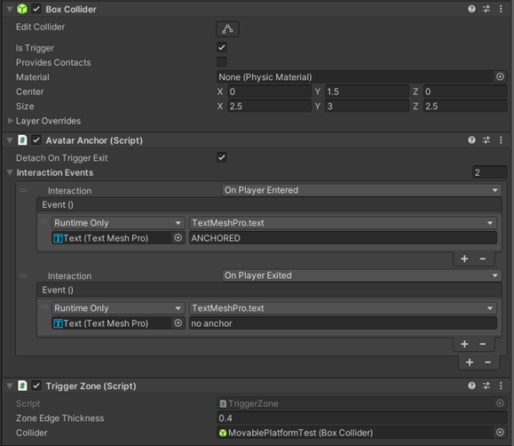
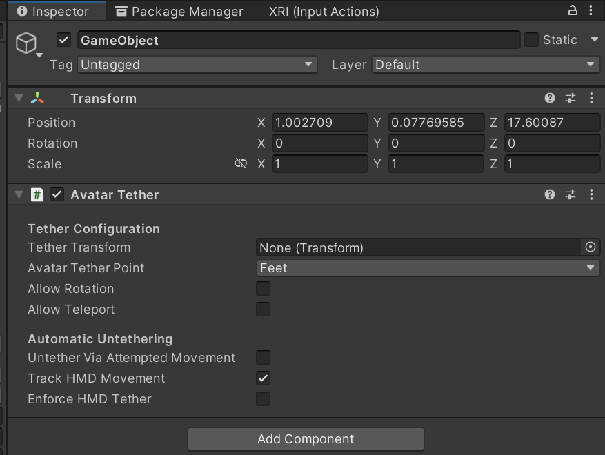

# Anchors and tethers

## AvatarAnchor

An object that the avatar will anchor to when they’re inside the object’s trigger volume so that the avatar moves along with the object. Inherits from AvatarTrigger. Networked avatars will anchor as well so movement is smooth across the network. Any number of players can be anchored to a single object.

#### Settings

**[Required Component] Collider:** A Collider is required to know what the trigger volume is. This should have IsTrigger set to true.

### *Billboard2D*

Script to make an object always face the camera.

## AvatarTether

An object that tethers the avatar to its transform. This does a one-time position change for the local avatar and puts them into a tethered locomotion state based on the object's settings. Only one avatar at a time can be tethered.

#### Settings

- **Tether Transform:** The point to tether the avatar to. Will default to the transform the component is attached to.  
- **Avatar Tether Point:** The point on the avatar to place them at the transform.  
- **Allow Rotation:** Whether or not the avatar can rotate when they’re tethered.  
- **Allow Teleport:** Whether or not the avatar can teleport when they’re tethered.  
- **Untether Via Attempted Movement:** Whether or not the avatar will untether after a small amount of time trying to locomote.  
- **Track HMD Movement:** Whether or not the avatar will untether after physically walking away.  
- **Enforce HMD User Tether:** What to do when the avatar exceeds physical movement range. If true, the avatar will be teleported back to tether position; if false, the avatar will be untethered.  

#### Visual Scripting

- **Properties:** 
    - **AvatarIsTethered** – Whether or not any avatar is tethered  
    - **LocalAvatarIsTethered** - Whether or not the local avatar is tethered  
- **Methods:**
    - **TetherLocalAvatar(bool)** – Tether or untether the local avatar to this tether  
    - **ToggleTether()** – Tether the avatar when they are not tethered or untether when they are

