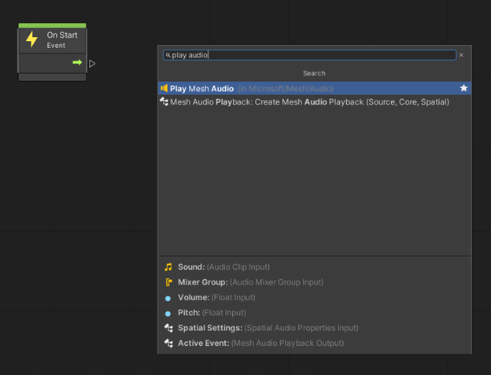
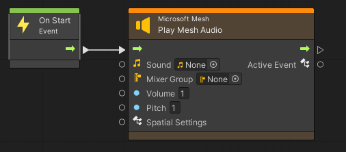
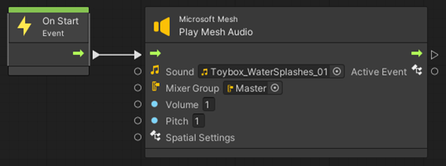
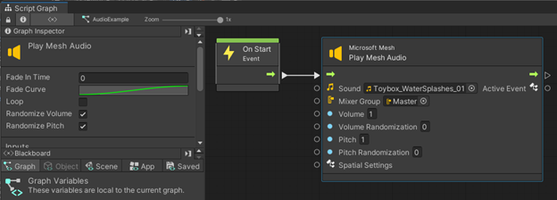
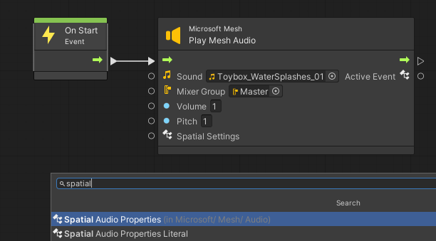
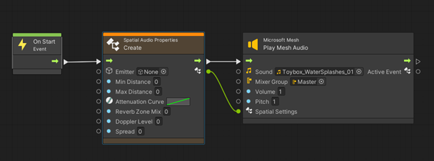
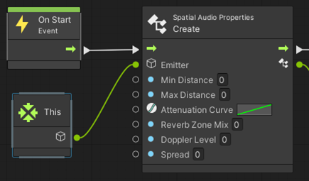
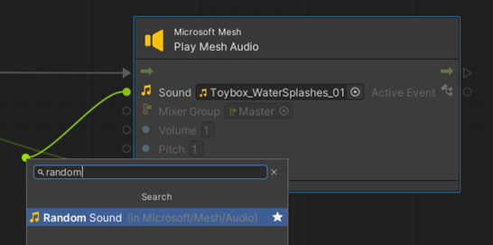
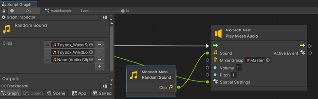

# Play audio in Mesh

## Mesh Audio Manager and Visual Scripting

There are two ways to play audio in Mesh: direct calls to a Unity *AudioSource*, and the Mesh *Audio Manager* via the *Play Mesh Audio* [visual scripting](../script-your-scene-logic/visual-scripting/visual-scripting-overview.md) node.

There are several benefits to using the Mesh Audio Manager.

•	It's faster than setting up an AudioSource from scratch.
•	It contains a pool of AudioSources to be reused as necessary, so there's no need to add additional AudioSources to your Environment or interactions.
•	It includes a set of simple settings to maintain greater control over how your AudioClips are played, such as a fade in and out. It also randomizes certain properties to give sounds more variation each time they’re played.
•	It ensures that audio is routed properly so users have better control over their audio mix.
•	It provides a way to create reusable properties for spatial audio settings so you can easily ensure consistency in your audio experience.

The safest and most efficient way to play a sound event in Mesh is through the *Play Mesh Audio* node.
 

 
When you first add the node, it will show up with an orange title.
 

 
This is because there are two requirements that need to be met for the node to work.
 

 
Once the Sound and Mixer Group fields are filled in (or the nodes connected), the title will clear up, and the node can be used. By default, this will play the sound at full volume in stereo (not spatialized). You can change the volume and pitch to your needs, and even randomize the values in the Graph Inspector.
 

With the "Randomize Volume" and "Randomize Pitch" boxes checked, new values appear to control the amount of randomization to apply each time the node is triggered. You can also assign a Fade In Time if you want a smooth volume ramp when the sound is played.
 
To make your sound play from a particular location, add a Spatial Audio Properties node and connect it to the Spatial Settings input.
 

 
Select Spatial Audio Properties and then Create Spatial Audio Properties.
 

 
You will need to create the Spatial Audio Properties before you play the audio event. The Spatial Audio Properties will also have an orange title by default because you need to connect a GameObject reference to the Emitter property so the sound knows the location at which to play the sound.
 

 
While any GameObject reference will work, most often you will probably want to use the This node to play the sound on the GameObject that this script is attached to. You will also want to change the Attenuation Curve to slope down instead of up so that the volume goes down as you move away from the object playing the sound.
 

 
The properties here are as follows:
 
**Min Distance**: the distance at which the sound will start attenuating. The sound will play at full volume within this distance. "1" is the recommended starting value.

**Max Distance**: the distance past which the sound will no longer attenuate. If the Attenuation Curve ends at volume 0, the sound will not be heard beyond this distance. "20" is the recommended starting value.

**Attenuation Curve**: the volume ramp applied as you move away from the source of the sound. Apply a downward slope from 0 to 1 to start.

**Reverb Zone Mix**: the volume sent to the reverb effect if you have *Reverb Zones* in your scene. "0" is the recommended starting value.

**Spread**: the angle in degrees that the sound will spread over the speakers. "0" is the recommended starting value.
 
Instead of placing a single sound on the *Play Mesh Audio* node, you can create a randomized sound from several AudioClips by using the *Random Sound* node.
 

 
When you select the *Random Sound* node, the Inspector will show an array of AudioClips you can add to.
 

Each time the *Play Mesh Audio* node is triggered, a new AudioClip will be selected.

