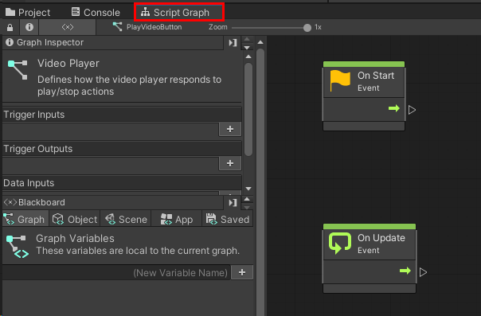
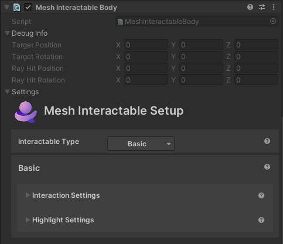
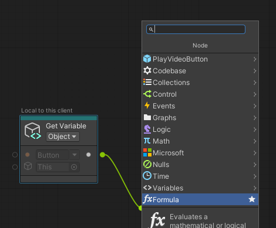
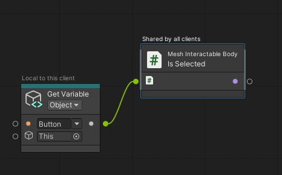
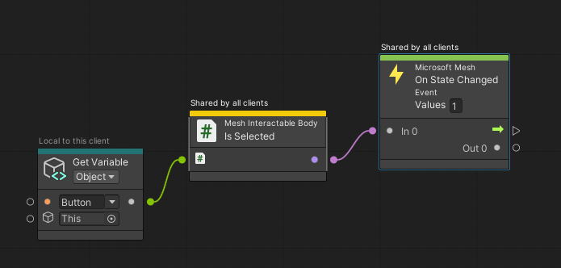
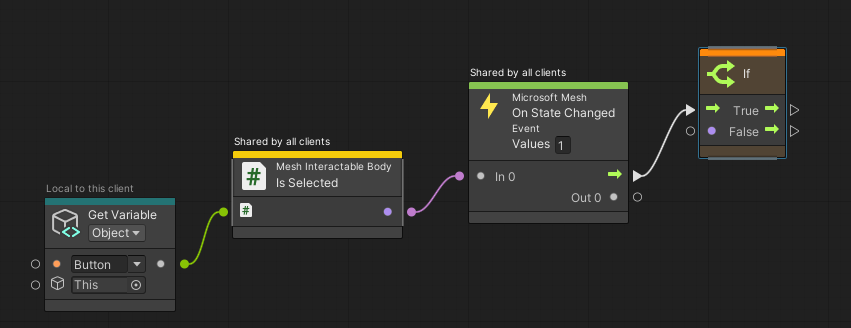
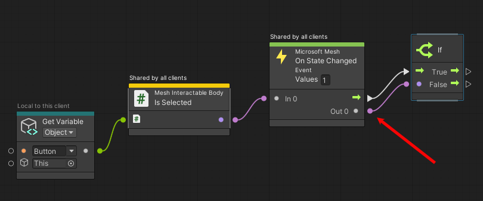
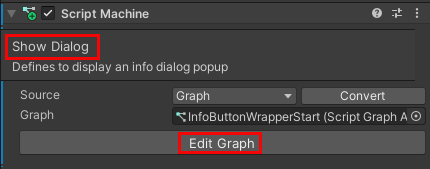
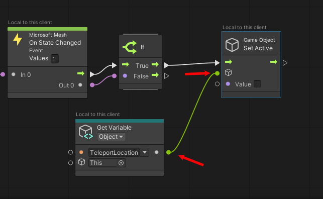

# Mesh 101 Tutorial Chapter 3: Add interactivity with Mesh Visual Scripting

Now that we've completed the setup phase, let's move on to making your GameObjects interactive! In this chapter, we'll dive into Mesh Visual Scripting, which you can use to add custom logic to your Environment.

> [!NOTE]
>
> - There are two types of Mesh Scripting: Mesh Cloud Scripting, which uses C# code, and Mesh Visual Scripting, where you create a Script Graph and then add nodes (also called *units*) in a sequence to create your coding logic. This version of the Mesh 101 tutorial uses Mesh Visual Scripting; the previous version used Mesh Cloud Scripting.
>
> - Mesh Scripting isn't required for every Environment, but you'll need it for the features we'll be adding here: making a button interactive, triggering an informational text popup, and teleporting around the scene.

## Choose the NavMesh layer

For this project, we want our avatar to be able to walk around only on
the floors inside the *Sphere Terrace* objects and the floor of a
platform that's attached to one of the wind turbine generators. For
these areas to be walkable, they must be on the *NavMesh* layer. Let's
add the *Sphere Terrace* in Chapter 3 to the NavMesh layer.

1. In the **Hierarchy**, expand the **Chapter 3** GameObject.

1. Select the **Sphere Terrace** GameObject that's a child object to
    the **Chapter3** GameObject.

    

1. In the **Inspector**, select the **Layer** drop-down and then choose
    **NavMesh**.

    

You don't have to add the other walkable GameObjects to the NavMesh
layer---we've already done it for you.

## Station 3.1: Create an Interactable Button

For our first task, we want to create a button that will play a video
when it's pressed by an avatar. The avatar can then press the same button to stop the video.

- In the **Scene** window, navigate to the Sphere Terrace that
    contains the stations for Chapter 3, and adjust the view so that
    you're looking at the first station, **3.1 -- Video Playback**, as
    shown below.

As you can see, there's already a video screen in place, but it needs a Play/Stop button. As the text box for the station explains, we'll create a Script Graph with some button logic so that the button can be used to toggle the VideoPlayer on and off and change the button text.

### Add the button to the scene

1. In Unity, make sure the GameObject named **Chapter3** and its child object named **3.1 - Video** are expanded.

    

2. Search for the **ButtonBase** prefab.

    

3. Drag **ButtonBase** from the **Project** window and then, in the
    **Hierarchy**, drop it on the GameObject named **3.1 -- Video** so
    that **ButtonBase** is placed as a child to **3.1 -- Video**.

    

    Make sure the **Transform** > **Position** values for **ButtonBase** are 0, 0, 0.

**ButtonBase** is placed in the scene a little lower than where we want it.Let's fix that.

1. Ensure that **ButtonBase** is selected in the **Hierarchy**.

2. In the **Inspector**, change the **Transform** > **Position** >
    **Y** value to "1".

Perfect! Now **ButtonBase** is correctly located just in front of the **BackplateBase** object.

## Rename the button

- With **ButtonBase** selected, in the **Inspector**, change the name
    of **ButtonBase** to "PlayVideoButton".

    

**Change the label of the button**

Right now, the text on the button says "Label." Let's change that to
"Play."

1. In the **Hierarchy**, expand the **PlayVideoButton** GameObject to
    display its child object **Button**, then expand **Button** to display its child objects and then select the **Label** child object.

    

2. In the **Inspector**, navigate to the **TextMeshPro -- Text**
    component, and then, in the **Text Input** box, change the text to
    "Play."

    

## Create the Visual Script for the button

1. In the **Hierarchy**, ensure that **PlayVideoButton** is selected.
1. In the **Inspector**, click **Add Component**, and then select **Script Machine**.

Note that two new components have been added in the **Inspector**: **Script Machine** and **Variables.** There's also a new window named *Mesh Visual Scripting Diagnostics* at the bottom of the **Inspector**. This window will give you feedback on your visual script and can be useful for troubleshooting.

Note that in the **Script Machine** component, the **Source** is set to **Graph**. Let's keep that setting. This means that we'll be creating a new script graph as an asset and saving it in the project.

1. In the **Script Machine** component, click **Source** and then select **Embed**.

> [!TIP]
> You have two choices for **Source**: *Graph* and *Embed*. Each has advantages and disadvantages; you can learn more about them in the [Unity Script Machine artice](https://docs.unity3d.com/Packages/com.unity.visualscripting@1.8/manual/vs-graph-machine-types.html). We're choosing to use *Embed* here because, among other things, you can directly reference your scene nodes without making intermediate Object variables.

1. In the **Script Machine** component, enter a name in the *Title* field for the graph: "Video Player Behavior."
1. Enter a description in the *Summary* field for the graph: "Video player behavior definition."

## Setting up the script graph

1. In the **Script Machine** component, click **Edit Graph**. This opens the **Script Graph** window. Drag and place it next to the **Project** and **Console** tab so that we can see the script graph and **Scene** window at the same time.

    

 As we add nodes, you may want more space in the window; you can click the three-dot button and then select **Maximize** for achieve this, or click the **Full Screen** button in the upper right corner of the window.

1. We don't need the **OnStart** and **OnUpdate** nodes; delete them.

## Detect if the button is clicked

We can think of this script graph as having three main goals:

    (1) Detect if the Play/Stop button is clicked.
    (2) If it's clicked, play the video.
    (3) When it's clicked again, stop the video

The first goal, detect if the button is clicked, will require three nodes. The GameObject that actually "listens" for and reacts to a click is called **Button**. Let's add that to the script graph.

> [!NOTE]
> A node is also called a *unit* in Visual Scripting. In this tutorial, we'll be using the term *node*.

1. Drag **Button** from the **Hierarchy** and then drop it in the script graph.

    

1. In the **Node** menu, select **Button**. A *Game Object Literal* node referencing that object is added to the graph.

    

> [!TIP] You may want to take a moment here to examine some of the components for the **Button** GameObject:
>
>- *Mesh Interactable Properties*: This makes *Button* an object that you can interact with. This component helps to track interactions--note that in the image below it has some "hover" settings chosen. You can learn more about this component in our article named *Mesh Object and Avatar Interactions*.
>
> - *Script Machine*: This has a script graph named *Button Base Behaviour.*
>
>   
>
> If you go into Play mode, you'll see that a new component named **Mesh Interactable Body** is added to **Button**.
>
>   
>
> This component is added automatically at runtime to interactable bodies; it exposes various properties to Visual Scripting such as *IsHovered* and *IsSelected*, which will come in handy in a moment.

In the script graph, add a node that lets us know when the button is selected.

1. Click and hold on the outport port of the **PlayVideo** variable, and then release the mouse button. This opens the Fuzzy Finder.

    

1. Search for "Is Selected", and then, in the list, select *Mesh Interactable Body: IsSelected*." **Note**: This outputs a Boolean value; you can confirm this in the **Graph Inspector**.

    

1. Drag a connector from the output port of the "Is Selected" node and create a new node called "Microsoft Mesh: On State Changed." (In the Fuzzy Finder, search for "on state changed.")

    

These are our three button-click detection nodes. The *Is Selected* node starts out with a value of False, but when the button is clicked, the value is changed to True and is passed to the *On State Changed* node. This node then triggers the play/stop nodes that follow.

### Play or stop the video

If *On State Changed* has a value of true, the video will play. If it's already playing and the button is pressed, *On State Changed* will have a value of false and this will stop the video. Our next step is to add an *if* node to determine this flow.

1. Drag a connector from the output control port of the "On State Changed" node and create a new *if* node. (In the Fuzzy Finder, search for "if.")

    

1. Drag a connector from the output data port of the "On State Changed" node to the input data port of the *if* node. 

    

## Create a variable to determine if the video is playing or not

1. In the **Blackboard**, go to the **Object** tab, and then create a variable named "isPlaying." Make the **Type** "Boolean" and the value false (the default).

    

1. Add a "Set Object Variable" node to the "True" output port of the "If" node.

    

1. In the **Set Object Variable" node, click the variable name drop-down and then select "isPlaying."

    

The *isPlaying* variable has to perform double-duty here. We can ensure that that *isPlaying* always had the correct value by attaching it to a *Negate* node.

1. Drag a connector from the data input port of the "Set Object Variable: isPlaying" node and create a new *Negate* node. (In the Fuzzy Finder, search for "negate.")

    

1. Drag a connector from the data input port of the "Negate" node and create a new *Get Object Variable* node. (In the Fuzzy Finder, search for "get object variable".)
1. In the **Set Object Variable" node, click the variable name drop-down and then select "isPlaying."

    

The *Negate* does some math to make the value of *IsPlaying* become opposite of what it currently is. When the scene starts, *isPlaying* is false (the default). When the Play/Stop button is clicked, the *Negate* node causes *isPlaying* to be set to true and this makes the video play. When the button is clicked again, the *Negate* node causes *isPlaying* to be reset to false and this makes the video stop.

## Turning the video on or off

Now we'll add the nodes that detect if *isPlaying* changes and plays or stops the video based on that change.

1. In the lower part of the graph, add a *Get Object Variable* node and set its value to *isPlaying*.

    

1. Drag a connector from the data output port of the "Get Object Variable: isPlaying" node and create a new *On State Changed* node. (In the Fuzzy Finder, search for "on state changed".)

    

1. Drag a connector from the control output port of the "On State Changed" node and create a new *if* node. (In the Fuzzy Finder, search for "if".)
1. Drag a connector from the data output port of the "On State Changed" node and connect it to the data input port of the *if* node.

    

## Making the video play

If you look in the **Hierarchy**, you'll see that the GameObject named **Video** has a **Video Player** component attached. When **Video** is active, **Video Player** plays a video called "WindTurbine".

    

Look again and you'll see that the **Video** GameObject is inactive. This is the default state; we don't want the video playing as soon as the participant enters Play mode! The scene also has an object named **VideoStill** which simply displays a still image on the video screen. 

    

This GameObject is active when the scene starts. When the participant presses the Play/Stop button, it makes **Video** active, which causes the video to play, and simultaneously makes **VideoStill** inactive, which hides the still image. When the participant presses the button again, the opposite happens: **Video** is made inactive, stopping the video, and **VideoStill** is made active again, which makes the video screen display the still image. The remaining nodes in our graph make all of this happen.

1. Drag a connector from the True output control port of the "if" node and create a new *Game Object: Set Active* node. (In the Fuzzy Finder, search for "set active".)
1. In the *Game Object: Set Active* node, click the round button in the GameObject field, and then, in the **Select GameObject** window, search for and select **Video**.
1. Select the node's **Value** check box, which makes the node active.

    

1. Drag a connector from the output control port of the "Game Object: Set Active" node and create another new *Game Object: Set Active* node.
1. In the new *Game Object: Set Active* node, click the round button in the GameObject field, and then, in the **Select GameObject** window, search for and select **VideoStill**.
1. Keep the **Value** check box unselected. This makes the node inactive.

Now when the button is clicked, the video will play and the still image will be hidden. We just need one more thing in this sequence. Since the Play/Stop button is a toggle, we have to make sure that after the participant clicks "Play," the button's label changes to "Stop," and then when clicked again back to "Play," and so on.

1. Drag a connector from the output control port of the last "Game Object: Set Active" node and create a new *Text Mesh Pro: Set Text* node. (In the Fuzzy Finder, search for "set text".)

    

    For this node, we need to set its target GameObject to "Label". There are lots of "Labels" in the project, though, and they all look the same in the node's popup list, so let's do this with the drag and drop method.

1. Drag the **Button** child object **Label** from the **Hierarchy** and then drop it in the *Set Test* node.

    

1. In the text field for the node, type in "Stop."

    

### Making the video stop

Just three more nodes to go for this graph! We need to set up the false condition for the button: "If the button is clicked while the video is playing, *isPlaying* becomes false and it causes the video to stop and the button to display "Play" again.

We can take a shortcut here.

1. Control-click the last three nodes you added to select them.
1. Right-click in the script graph and then, in the popup menu, select **Duplicate Selection**.
1. Drag the duplicated notes to an empty space in the graph just below the nodes you duplicated.

    

1. Drag a connector from the False output control port of the last "if" node and connect it to the control input port of the first *Game Object: Set Active* node in the duplicated set of nodes.
1. In that same first *Game Object: Set Active* node, deselect **Value**.
1. In the second *Game Object: Set Active* node in the duplicated set, select **Value**.
1. In the **Set Text** node, change the text from "Stop" to "Play."

    

### Share the video player interactions with others in the experience

There may be times when you want a script's events to be experienced only by the participant triggering the events, and other times when you want the events to be experienced by everyone in the scene. You can control this with the **Local Script Scope** component.

1. In the **Hierarchy**, ensure that **PlayVideoButton** is selected.
1. In the **Inspector**, click the **Add Component** button and then add **Local Script Scope**.

    

For this tutorial, we want every other participant in the experience to be able to see any interactions with the video player and see the video itself play and pause. To ensure this, make sure the "Share visual script variables on this Game Object" option is selected. The information box below this option tells you what's shared and what remains local.

    

## Test your work

1. In Unity, save the project and then press the Unity Editor Play
    button.

1. In the **Game** window, click the **Play** button you just worked
    on. This causes a brief video about wind turbines to play on the
    screen above the button.

    

1. When you've finished watching the video, press the button you've
    been editing again (it now has the label "Stop").

1. Press the Unity Editor Play button to exit Play mode.

### Station 3.2: Trigger an info dialog

For this feature, we'll enhance an existing visual script that causes an info dialog to appear when the avatar presses a button.

1. In the **Hierarchy**, collapse the **3.1 -- Video** GameObject.
1. In the **Scene** window, note that the Info Dialog Trigger station is to the right of the **3.1 -- Video Playback** station. Adjust the view so that you can clearly see Station 3.2.

    

1. In the **Inspector**, expand the GameObject named **3.2 -- Info Dialog**.

1. In the **Hierarchy**, select **InfoButtonWrapper**.

    In the **Inspector**, note that **InfoButtonWrapper** has the **Local script scope* component attached and that its "Share visual script variables on this Game Object" option isn't selected. 
    
    
    
    This is because after a participant clicks the button that makes the info dialog appear, the button becomes hidden to them. If this option was selected, the button would become hidden to everyone in the scene, and we don't want that.

1. In the **Inspector**, navigate to the **Script Machine** component with the **Show Dialog** graph and then click the **Edit Graph** button.

    

1. In the graph, connect the "True" output control port of the "If" node to the input control port of a new "Microsoft Mesh: Show Dialog" node that you create.

    

1. In the **Show Dialog** node, click the **Message** field and then add this sentence:

    "Did you know that the world's largest wind turbine has blades longer than a football field?"

    This is the message that will appear in the info dialog.

    

1. Select the drop-down that currently displays **OK**, and then, in the popup list, deselect **OK** and select **Continue**. This will add a "Continue" button to the info dialog that the user can click to close the dialog and continue in the experience.

    

#### Test your work

1. In the Unity Editor, save the project and then press the Unity Editor Play button.

1. Use the navigation keys to make your avatar back away from the button. Note that when your avatar is a certain distance away, the button rotates and isn't selectable.

1. Walk towards the button. At a certain point, the button stops rotating, signaling that you can now select it.

1. Select the button. The info dialog appears and displays the message you added to the **Show Dialog** node earlier.

1. When you're finished with info dialog, click its **Continue** button. Note that after you click the button, it disappears. To use the button again, you must exit and then re-enter Play mode.

    > [!TIP]
    > The distance and triggering elements in effect here are determined by the components of the **ProximityDetector** GameObject.

    

1. Press the Unity Editor Play button to exit Play mode.

### Station 3.3: Teleport to the turbine generator

For this feature, we'll add some nodes to a script graph that allows participants
in the scene to teleport. When a participant presses the button, they're
teleported from their current location at Station 3.3 to an elevated
platform that's attached to a wind turbine generator. They can then
examine the generator.

#### Update the script graph

1. In the **Scene** window, note that the **3.3 -** **Teleport to Turbine** station is to the right of the **3.2 -- Info Dialog  Trigger** station. Adjust the view so that you can clearly see Station 3.3.
1. In the **Hierarchy**, collapse the **3.2 - Info Dialog** GameObject, and then expand the **3.3 - Teleport** GameObject.

    

The button is all set up for you---we just need to add the nodes in the script graph that
give it the teleport behavior.

1. In the **Hierarchy**, expand the **ChapterLabel** GameObject and then select the **TeleportToWindTurbineButton** GameObject.

    

    Note that in the **Inspector**, there's a **Script Machine** component named *Teleport to Open Air Platform* and **Source** is set to **Embed**, which means the script graph is embedded in the scene.

    

    Note also that there's a **Local Script Scope** component attached and its "Share" option is *not* selected. When a participant clicks the teleport button, we only want *them* to teleport, not everyone in the scene!

    

1. Click the **Edit Graph** button. Just as in the previous chapter, our graph already have some variables and nodes set up for you. They're contained inside two groups: **Teleport Button Behavior** and **Teleport to OpenPlatform**:

    

In the **Teleport Button Behavior** group, the logic is similar to what you saw in Chapter 3.1: "If the button is selected, do something." We don't need to do anything further to this group. We're going to make our changes to the second group, **Teleport to OpenPlatform**.

#### Create a Travel Point and add a reference to it

So what's a "Travel Point", you might be asking ... ? Basically, it's a component that you can use to define a point in space to spawn or teleport to. Normally, you would first create a *Travel Group*, and then add one or more Travel Points to it. We've already created the Travel Group for you in this project, so in the steps below, we'll add a Travel Point to that group. We'll then use that Travel point as the location the avatar will go to when they click the "Teleport" button. To learn more, see our article named *Mesh object and avatar interactions*.

1. In the **Hierarchy**, create a new empty GameObject as a child object to **TravelGroup** and then rename it "TeleportLocationWindTurbine".

    

1. Click the **Add Component** button and then search for and add the *Travel Point* component.
1. In the **Inspector**, in the **Transform** component, enter the following values:

    Position: X = 6, Y = 58, Z =61
    Rotation: X = 0, Y = -270, Z = 0

    The avatar will teleport to this location.

1. Make the "TeleportLocationWindTurbine" GameObject inactive by deselecting the check box next to its name. If you have more than one TravelPoint object active at runtime, Unity randomly picks one of the active Travel Points as the spawning point for the avatar. We want to ensure that the avatar spawns at the point indicated by the **TeleportLocationChapter3** GameObject, so that should be the only active Travel Point.

    

### Adding the teleport nodes

1. In the **Teleport to OpenPlatform** script graph, drag a connector from the True output control port of the "If" node and then create a new node called "Game Object: Set Active." (In the Fuzzy Finder, search for "set active".)

    

1. Drag the **TeleportLocationWindTurbine**  object from the **Hierarchy** and then drop it in the *Game Object: Set Active* node.

    

1. Select the node's **Value** option to make it active.

### Add the Travel Point node

1. Drag a connector from the output control port of the "Game Object: Set Active" node and then create a new node called "Travel Point: Travel to Point." (In the Fuzzy Finder, search for "travel point: travel".)

1. In the "Travel Point: Travel to Point" node, click the round button in the field that displays **This**, and then, in the **Select TravelPoint** window, select "TeleportLocationWindTurbine".

    

There's just one thing left to do in this graph: reset the *TeleportNow* object variable to false. So far, *TeleportNow* has only been used in the part of the graph that was already set up for you so we haven't talked about it. Let's take a look at it now so you can understand what's happening.

The *TeleportNow* object variable is type *Boolean* and has a default value of False.

    

The initial sequence of the graph, **Teleport Button Behavior**, detects if a participant clicks the teleport button. If they do, the *TeleportNow* variable is set to True.

    

The "trueness" of *TeleportNow* is what triggers the sequence of nodes in the **Teleport to OpenPlatform** group that makes the teleport happen.

    

After the teleport has occurred, *TeleportNow* needs to be reset to False so that the whole process can be repeated the next time the button is clicked. We've already set up the nodes for this; all you need to do is make the connection.

1. Drag a connector from the output control port of the "Travel Point: Travel to Point" node and then connect it to the input control point of the "Set Object Variable: TeleportNow" node.

    

#### Test your work

1. In the Unity Editor, save the project and then press the Unity Editor Play button.

1. Go to Station 3.3 and then click the "Teleport" button to teleport up to the wind turbine generator.

    

    

1. In the **3.3 -- Generator** information box, select the **Show/Hide Generator** button. A window opens up in the side of the wind turbine and you can see the generator inside.

    

Feel free to step up close to the generator and have a look. It's pretty
cool! When you've finished, navigate back out and then press the
**Show/Hide Generator** button. This closes the window.

**Go to Chapter 4**

At this point, the participant in the experience would be ready to move
on to Chapter 4 and learn about wind turbine activities related to
physics. Just like with Chapter 3, there's a Sphere Terrace that
contains the stations for Chapter 4. To get there:

1. Rotate around in the opposite direction from the wind turbine
    generator and walk towards the **3.3 -- Go to Chapter 4**
    information box.

    

2. Press the **Teleport to Chapter 4** button.

    

    As advertised, this places the avatar in front of the stations for Chapter 4 and Mesh Physics.

    

### Chapter 3: Summary

In this chapter, you used Mesh Visual Scripting to add features that empower participants in
your experience to do the following:

1. Press a button that causes an educational video about wind turbines
    to play.

2. Press a button that triggers the display of an info dialog
    about wind turbines.

3. Press a button that teleports the participant from the ground up to
    a platform attached to a wind turbine generator, where they can
    examine the generator up close.

## Next steps

> [!div class="nextstepaction"]
> [Chapter 4: Move objects and trigger animations with Mesh Physics](mesh-101-04-physics)