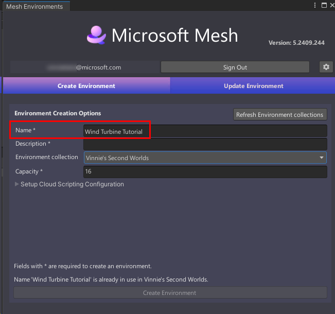
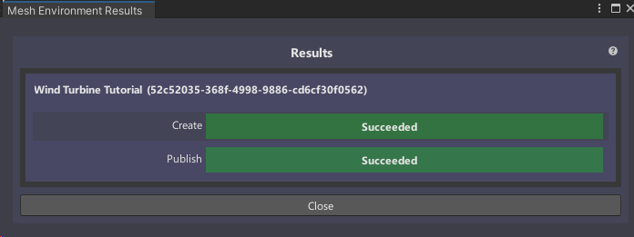
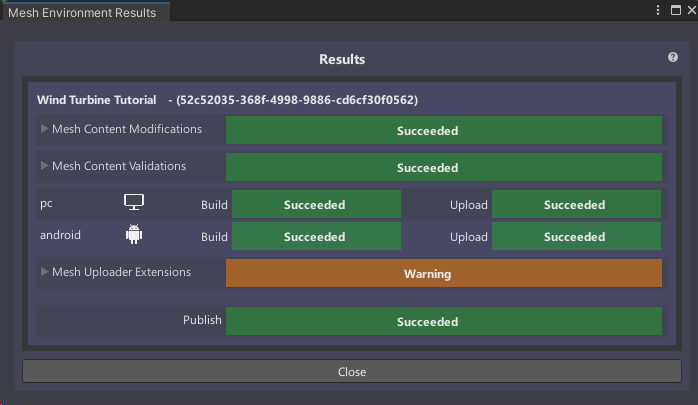

# Mesh 101 Tutorial Chapter 5: Make your Environment available for Events

You've completed adding all the features you need for your Mesh
experience using Mesh Interactables, Physics and Scripting. So far, we've been working
in a Unity *project*; now you'll turn the *StartingPoint* scene into a
Mesh *environment* and upload it to a Mesh *world* in the Mesh Portal. At that point, this version of your environment is ready for you to test, as you prepare to schedule an *event*.

> [!IMPORTANT]
> A Teams Premium license is required for using the Mesh application for custom immersive spaces in Mesh on PC and Quest. A license isn't required to develop with the Mesh Toolkit, but you'll be blocked from building and publishing Environments to Mesh and organizing or joining events in Mesh if you and your users don't have Teams Premium licenses. For more information, see [Set up M365 for Microsoft Mesh](../../../Setup/Content/setup-m365-mesh.md).

## Sign in

1. On the menu bar, select **Mesh Toolkit** > **Environments**.
1. In the **Mesh Environments** window, select **Sign In**.
1. Sign in with your account.

## Create your environment

1. Make sure you're in the **Create** **Environment** tab, and then, in
    the **Internal Name** field, type "Wind Turbine Tutorial."

    

2. In the **Description** field, type "An interactive Mesh experience
    that teaches you about wind turbines."

    > [!NOTE]
    > For future projects, keep in mind that the **Internal Name** field has a maximum of 40 characters, and the **Description** field has a maximum of 70 characters.

3. To ensure you have the latest worlds that are available in the Mesh Portal, select the **Refresh List of Mesh Worlds** button.

4. Select the **Mesh World** drop down, and then select the world you
    want to upload your Environment to if it's not already selected.

5. In the **Capacity** field, enter the capacity for your Environment.
    The maximum is 16.

    

6. Select **Create Asset** to create the Environment that you'll be
    uploading to the Mesh Portal.

7. You'll receive a confirmation dialogue as shown below. Select
    **Close**.

    

## Build and publish your environment

You should now be in the **Update Environment** tab of the **Mesh
Environments** window.

> [!NOTE]
> In the **Environment Configurations** section, a new Environment configuration has been created that displays the name you  added in the **Create Environment** tab: *Wind Turbine Tutorial*. If you see any other Environment configurations, close them.

### Building for single and multiple platforms

It's good to keep in mind that Mesh events can be experienced on two
different platforms: desktop PC and Android, which powers the Meta Quest
headset. Since desktop PCs typically have far more power than mobile
devices using Android, when you're creating your own project, there are
several potential scenarios to consider: build and publish your scene
for PC only, Android only, or both PC and Android. For this tutorial, we'll build for both PC and Android. To learn more about
building for single and multiple platforms, see our article titled [Build for single and multiple platforms](../../build-your-basic-environment/build-for-single-and-multiple-platforms.md).

### Update your Environment

1. In the **Update Environment** tab, click the **Select a scene**
    field, and then, in the **Select SceneAsset** dialog, select
    **StartingPoint**.

    

1. Select **Include Thumbnails**. Leave the setting as **Generate
    Thumbnails**.

    

In the **Build for Platforms** section, you choose which platforms to
build for. Note that when a button background is gray, the button is
"on"; when the background is black, the button is "off." We're building
for both PC and Android, so make sure that both buttons are "on."

> [!NOTE]
> If you don't see two buttons here, it means that your Unity installation doesn't include modules for both PC and Android and you won't be able to build for both of these platforms. This won't stop you from completing the tutorial, but in the future, you should make sure you [have the required modules](https://docs.unity3d.com/hub/manual/AddModules.html) for platforms you're building to.

### Build and publish

Select the **Build & Publish** button.

- If the Environment builds and uploads successfully, the **Build and
    Upload Results** dialog appears and confirms the results.

    

- If the build and upload process fails, this is confirmed in the **Build and Upload** **Results** dialog.

## View your Environment in the Mesh Portal

If you navigate to the **Environments** page for your World in the Mesh Portal, you'll see that your Environment has been saved there. 

1. Go to the [Mesh 
Portal](https://portal.mesh.microsoft.com).

1. In the left-side navigation bar, select **Worlds**.

1. On the **Mesh Worlds** page, select the World that you uploaded your Environment to.

    The following page displays your new Environment along with any other Environments that have been uploaded to that World.

    

You can now test your Environment in the Mesh app on your PC or Quest headset to ensure that it looks and performs as you expect.

## Summary

In this chapter, you learned how to create an Environment based on your
scene and then build it and publish it to your World in the Mesh 
Portal.

## Next steps

> [!div class="nextstepaction"]
> [Chapter 6: Test your environment within the Mesh app](mesh-101-06-test-your-environment.md)
