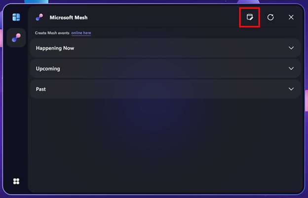
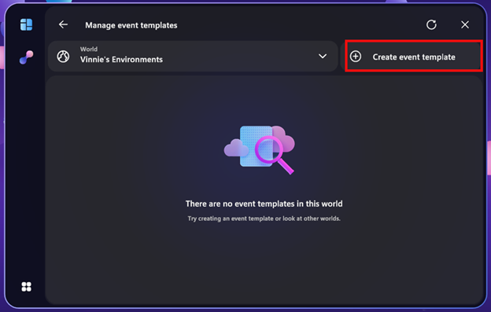
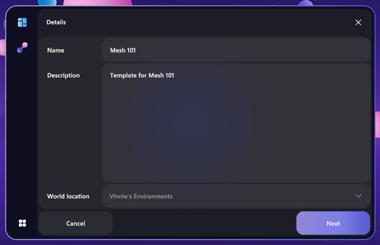
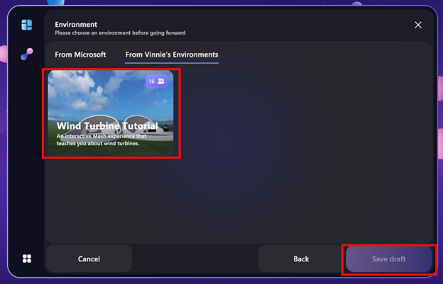
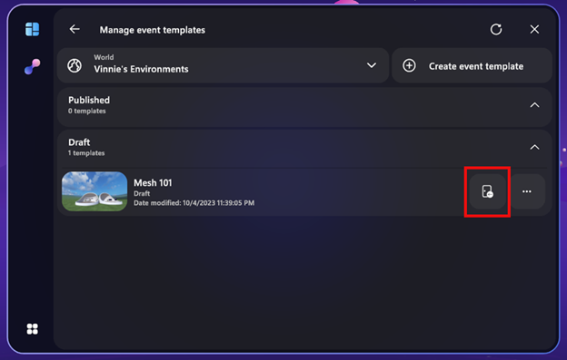
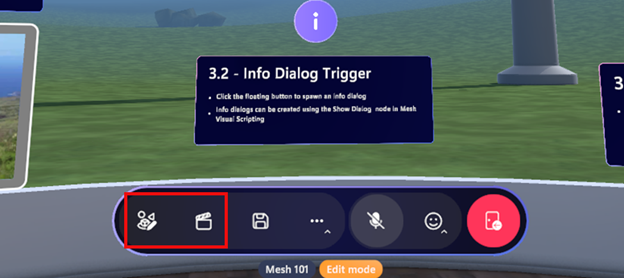

# Mesh 101 Tutorial Chapter 6: Test your environment within the Mesh app

While [Mesh Play Mode](../../debug-and-optimize-performance/playmode.md) is great for trying out your environment as you build it, at some point you will want to see how your creation feels in a headset or with multiple human participants. At that point, it's time to launch the Mesh app and create a **developer template** you can use to test and iterate on your environment.

## Testing your environment in Mesh

1. After publishing your environment, open the Mesh app on your desktop PC or Quest headset.
1. Log in with your corporate account.
1. Click the **Manage event templates** button in the upper-right of the Mesh dashboard:

     

1. Select your Mesh world and click **Create event template**:

     

1. Give your developer template a name and description. In this example we will name the template **Mesh 101** and describe it as **Template for Mesh 101**. The world location will populate for you. Click **Next**.

     
 
1. Make sure the tab **From *(your world)*** is selected at the top. You will then see your published Wind Turbine Tutorial environment! Now select this template and click **Save draft**: 

    
 
1. You should get a confirmation that your developer template was created! Click **OK**.

    
 
1. Click the **Customize** button (the door icon). This will join a new customization session for your developer template to let you see your environment in Mesh.
 
    
 
1. You can now test the appearance and performance of your environment in the Mesh app on your desktop PC or Quest headset! You can use the **Environment editor** and **Control panel** tools to place artifacts see how your environment works when it's customized, or simply explore your environment to ensure it works as expected!

    

## Testing your environment with others

Others can join you in testing your developer template by launching the Mesh app on their own device and clicking **Manage event templates**. If you both click **Customize** on the same template, you'll end up in a customization session together! Inviting others lets you test the performance of your environment when multiple avatars are present in your view.

## Testing new iterations of your environment

As you continue to work on building your environment, your developer template is always ready for you! When you publish an update to your environment, come back to the Mesh app, click **Manage event templates**, and click **Customize** again to view your new changes.

## Summary

In this chapter, you learned how to create a developer template to test and iterate on your environment. You entered a customization session for your developer template to experience your environment as attendees will, and you verified that it looks and performs as you expect. Others could join you to help you ensure any multi-user activities work as expected and your performance stays good even with their avatars present. This developer template stays ready for you over time as you continue to iterate on your environment and make any final tweaks.

With your environment ready to go, it's time to create an event and invite attendees to join you for real in Mesh!

## Next steps

> [!div class="nextstepaction"]
> [Chapter 7: Create an Event and invite others](mesh-101-07-create-an-event-and-invite-others.md)