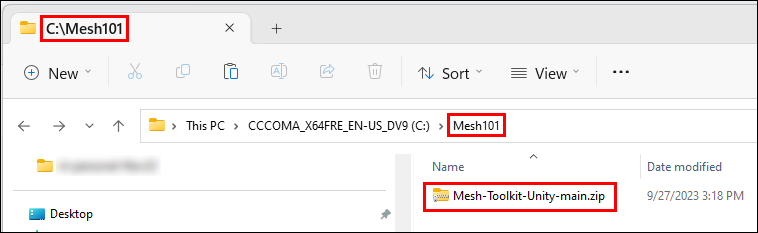

# Downloading the Mesh Toolkit

The Mesh Toolkit holds all packages and samples, as detailed in the [Mesh Toolkit overview](../../mesh-toolkit-overview.md). If you want to open and explore the samples, you must download the Toolkit.

> [!NOTE]
> In the past, if you wanted to create a new Mesh Environment or make an existing Unity project Mesh-enabled, you were required to download the Mesh Toolkit. This is no longer necessary; now you can [set up access to the Toolkit](../../build-your-basic-environment/access-the-mesh-toolkit-package.md). 

1. In your browser, go to GitHub, and then navigate to the [*Mesh-Toolkit-Unity* repository](https://github.com/microsoft/Mesh-Toolkit-Unity).

    

1. Select the **Code** button, and then select **Download ZIP**.

    

1. On your C: drive, create a folder with a one-word name (for example,"Mesh101") and then move or copy the downloaded Mesh Toolkit Zip file to that folder. This is done to avoid running into a problem with the Windows path length limit, which is 256 characters. **IMPORTANT**: *Don't* place the Zip file on the Windows desktop. Behind the scenes, this creates a very long path name.

    In the example below, the user created a folder on their C: drive named *Mesh101.* Next, they moved the downloaded Mesh Toolkit Zip file to the *Mesh101* folder

    

1. Unzip the Toolkit Zip file into the same folder.

## Next steps

> [!div class="nextstepaction"]
> [Samples overview](samples-overview.md)