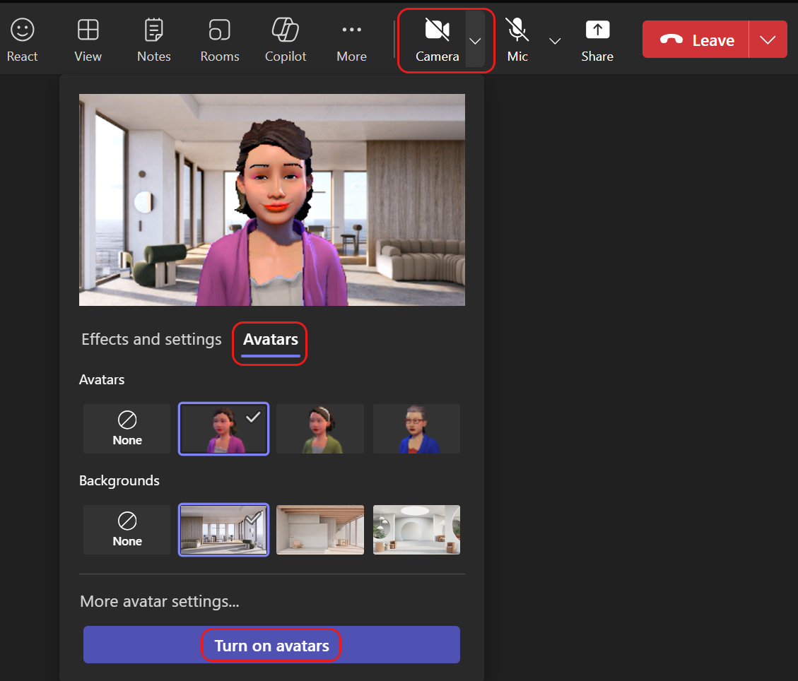

# What's new - Avatars in Teams

## Platform support

| Platform   | Interface | Supported |
| -------- | ------- | ------ |
| Windows  | Desktop (Teams Client)    | Yes |
|  | Web     | View other avatars only |
| Mac    | Desktop (Teams Client)    | Yes |
|  | Web  | View other avatars only |
| Mobile | Teams mobile | View other avatars only |
| VDI | Teams | View other avatars only |

## Jan 26, 2024

* When inside a Teams meeting, you can now turn on your avatar from the **Camera** drop down menu.

    

* More Avatars options can now be found in the Teams meeting menu under **More ... > Video effects and settings > Avatars**.

    

## Sept 30, 2023

* Avatars in Microsoft Teams is now available on the [new Teams client](https://www.microsoft.com/microsoft-teams/download-app) for Mac Desktops.

## Sept 18, 2023

* Avatars in Microsoft Teams is now available on the [new Teams client](https://www.microsoft.com/microsoft-teams/download-app) for WindowsDesktop Only. Mac Desktop support is not yet available.

## June 21, 2023

This release is published June 21, 2023.

* Light mode is now supported in the UI of the Avatars app. It will be automatically applied for users who have this theme selected as the default in their Teams settings.
* Improved application of makeup and pigmentation for all skin tones.
* Fixed an issue where some text characters failed to render in the Avatars app.
* Fixed an issue where the avatar’s zoom level would reset when an item filter is applied.

## Next steps

* [See what's coming for Microsoft Mesh](https://aka.ms/meshdocs)