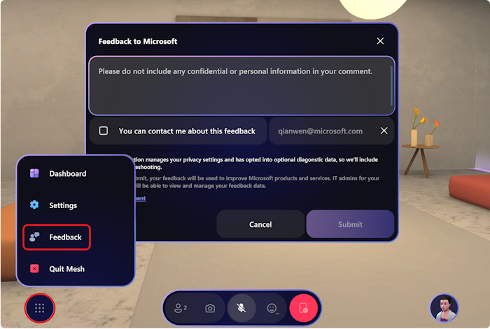

# Feedback and support

We would love for you to provide us with feedback and bug reports!

There are two ways to provide feedback for Mesh:

## Product feedback for Mesh

For product feedback, use the **Feedback** button inside your Mesh experience. This ensures that your feedback and bug reporting will be triaged and incorporated quickly.

## Developer feedback for Mesh

For feedback on the development experience, once you've [downloaded the Mesh toolkit](../develop/build-your-basic-environment/add-the-mesh-toolkit-package.md), use the **Mesh Toolkit** > **Give Feedback to Microsoft** menu option to provide feedback.

We truly appreciate feedback!

## Get support

> [!div class="nextstepaction"]
> [Here's how to get support for developers](https://aka.ms/meshdevsupport)

> [!div class="nextstepaction"]
> [Here's how to get support for IT admins](https://admin.microsoft.com)
