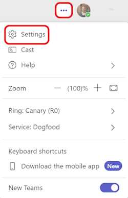
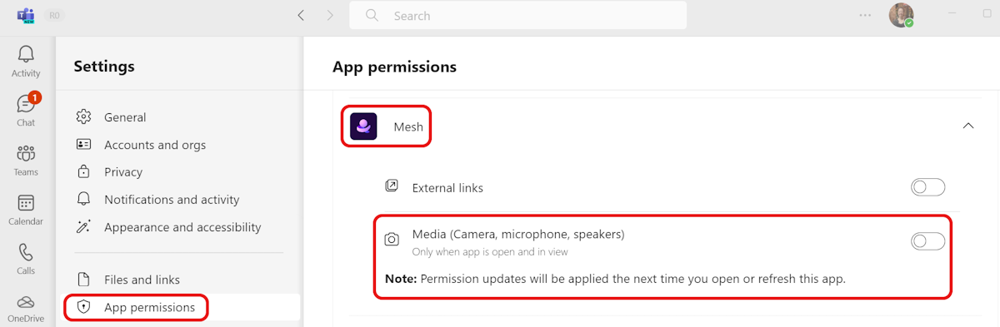

# Immersive spaces in Teams release notes

**Release notes for the Immersive spaces in Microsoft Teams on PC & Quest 2**

## Version 5.2405.0 (May 13, 2024)

* More professional wardrobe styles are coming to the Avatar builder. Customize your avatar to see all the new and updated looks available to freshen up your avatar for your next meeting.
    :::image type="content" source="media/Avatar-wardrobe-update.png" alt-text="Screenshot of Avatar wardrobe updates. ":::
* Immersive spaces in Teams is now supported on Mac devices for customers in the [Teams Public Preview program](/MicrosoftTeams/public-preview-doc-updates?tabs=new-teams-client) in Rings 0, 1, 1.5, 2, and 3. 

## Version 5.2403.0 (April 18, 2024)

### What's new

### Resolved product issues

* In high contrast mode, the descriptions for Topics now don't disappear. (28695)

* On Quest, while loading an immersive meeting, the screen may go black and take longer than expected, causing users to become disoriented and hear other users before they enter the space. This has been fixed. (32893)

## Version 5.2401.0 (February 20, 2024)

### What's new

**Default Mic/Speaker Settings:** When going to the immersive space, Mesh will now sync with your Teams' audio device selection, resolving the previous potential misalignment with your system default audio device selection.

* Icebreaker activity with spheres is localized (translated) into 20+ different languages.

* Admins can now enable immersive spaces for users using service plans, instead of the previous method of using OCPS. Please refer to the [Mesh setup for admins](../Setup/Content/setup-m365-mesh.md) for more detail.

## Version 5.2315.0

### What's new

* The Meeting zone is now called the Teams screen share area. For more information, please see the immersive spaces documentation on [Spatial audio in Microsoft Teams meetings](https://support.microsoft.com/en-us/office/spatial-audio-in-microsoft-teams-meetings-547b5f81-1825-4ee1-a1cf-f02e12db4fdb?preview=true).

### Resolved product issues

The following product issues have been fixed for this release:

* Keys for dropping interactables, like marshmallow sticks in the Lake House, are the middle mouse button (scroll wheel) and space bar. This is communicated via a short pop up that users might overlook.

* Pressing Mesh buttons + the **Enter** key on the keypad produces no action. The same **Enter** key on the main keyboard selects the button and executes the associated action. (26462)

* If a user declines to give Mesh access to their microphone upon first launch in immersive spaces, they'll be completely muted without additional notification. 

    *Workaround:* If this occurs, you need to first switch to the new Teams client, and then try either of the following:
    
    - go into your Teams **Settings -> App permissions**. Select the **Mesh** app, and switch the **Media permissions** on.

        

        

    - or [clear the Teams cache](/microsoftteams/troubleshoot/teams-administration/clear-teams-cache).

* When clicking the Immersive view in Teams, the user isn't able to get into the immersive space, and gets an error instead. (29271)

* In the new Teams client, when the presenter changes shared content, an error dialog pops up and displays: "Can't display content". (22587)

* In the new Teams client, going from immersive view back to the Teams gallery and then back to immersive space for the second time will crash Teams. (22854)

* When pressing the right mouse button inside the viewport and releasing it outside the viewport, whichever keyboard button pressed at the time of release will continue to trigger as soon as the user re-enters the immersive space. As a result, the user might walk or rotate (and possibly do other things) even when it's unintended. To resolve the issue, the user needs to trigger the same button again. (27944)

## Version 5.2314.0

### Resolved product issues

* Fixed: On Quest, two different mics are shown and both are named *Quest*. The second one won't capture audio, and no error is shown. (20795)

* The **Prejoin** dialog now show a thumbnail picture of the event. (20071)

* When trying to throw an object by clicking on the object, the cursor no longer shows. (25542)
* On the Teams meeting details page, event dates and times according now align with the Mesh event list to account for all-day or multiday events. (28309)

* All-day event times are no longer being converted to local time zones. (26665)

* Seats in the immersive spaces no longer show as blue and available even when there's another user sitting on it. (21535)

* When joining a Teams meeting, users on Quest no longer see a screenshare instead of the default background wall in the Lakehouse environment. (27425)

* The settings dialogs now show the current selected state for many settings. (17308)

* On Quest: the Mesh UI no longer locks with the user's head view. As you turn your head, the Mesh UI will now remain stationary. (13061)

* On Quest, you'll no longer be disconnected from a meeting when you remove your headset. (25764)

* Fixed the issue: On PC and Quest, when attempting to delete any Objects in the Environment Editor will crash Mesh while running. (28903)

## Version 5.2313.0

### What's new

New interactions for [equippable objects](/mesh/develop/enhance-your-environment/avatar-and-object-interactions/interactables#equippable-objects) in the Bean Bag Toss and Marshmallow social games and activities.

#### For Bean Bag Toss on PC (in Teams)

* Left mouse click on the bean bag to pick it up (same behavior as before).

* Once you click on a bean bag, you'll go into aim mode:  

    * You can move the mouse cursor around to aim where you want to throw.

    * If you want to drop the bean bag, click **Space bar** on your keyboard. 

* Left mouse click to throw the bean bag.

#### For Marshmallow Roasting on PC (In Teams)

* Left mouse click on the marshmallow stick to pick it up (same behavior as before)

* To roast the marshmallow, you simply walk up to the firepit so the marshmallow is over the fire.  

    >[!Note]
    >It's no longer required to left mouse click to extend the marshmallow into the fire.

* To drop the marshmallow, click **Space bar** on your keyboard

