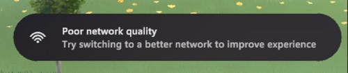
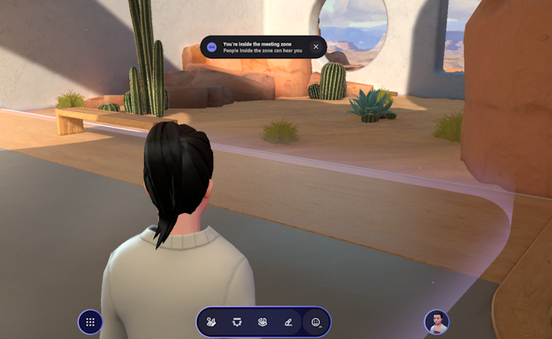
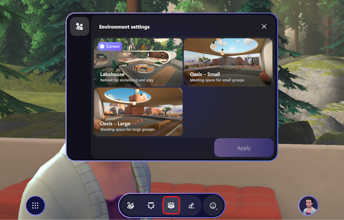

# Release notes - Immersive Spaces for Teams

## Version 5.2312.0

### What's new

<mark>Note, for spatial audio improvements, and new environments, we can update the End user documentation once we have a link, and summarize in release notes, link to the documentation.

<mark>Putting info here as we currently don't have a link available.

* The keyboard shortcut for toggling between 1st and 3rd person views have been changed from **C** to **V**.
* There's now a pop up notification when you're experiencing poor network quality, which may negatively impact your experience in the immersive space.

    

#### Spatial audio

Spatial Audio replicates how we hear audio in real life by projecting sound from a point in space around you.  As a result, you can perceive the audio distance and direction of those around you and differentiate multiple audio sources like in a physical space. The perception of sound increases with proximity and increases when facing the direction of the audio source.

>[!Note]
>We recommend wired headsets for a full spatial audio experience.

<mark> Are the bullets here redundant with the "What to expect..." section below?

* Meeting zones are enabled in the **Lakehouse**, **Oasis - Large**, and **Oasis - Small** environments.

* A visually translucent meeting zone boundary has been enabled to visualize the meeting zone location.
* There will be notifications and UI sounds when entering and exiting a meeting zone.
* We're using <mark> Skype Audio Healer for improved audio quality for lower latency and improved quality on lossy networks. (note comment from Stephen Kennedy)
* FRE Panels will explain Spatial Audio user experiences in Mesh.
* User who're denying Mic Permissions will be shown a warning dialogue.
* <mark> Mic selection ( Is my preferred mic being remember at Pre-join Menu.  While in meeting, falls back to default mic when changes in the meeting- and Toast Notification to show)

**What to Expect when collaborating in Mesh** <mark>Is it immersive spaces or Mesh standalone?

* **Meeting zones**  To facilitate group conversations, voices will not fall off with distance, within the boundary of the immersive space meeting zone area; however audio directionality will be preserved.

* **Meeting zone boundary:** Meeting Zone is defined by a visible translucent boundary that surrounds the Teams gallery, screen and seating area.

* **Spatial audio:** Audio direction will be perceived inside the meeting zone, enabling participants to be spatially aware of those around them. Immersive participants inside the meeting zone will see Teams participants in the Gallery and perceive sounds of Teams participants from that source.  Teams participants will hear everyone equally inside the meeting zone and can enable spatial audio using Teams settings. <mark> Do we have instructions on how to do this?

* **Outside the meeting zone:**  Participants can hold side conversations outside the Meeting zone. Participants outside the meeting zone will not be aware of the participants and conversation inside of the meeting zone.

    * Participants inside the Meeting Zone will not be able to hear participants outside of the meeting zone. 

    * Likewise, participants outside the meeting zone will not be able to hear those inside the meeting zone.  

    * Participants can choose to remain in the meeting zone or move outside of it to enable side conversations.

* Meeting zone is enabled in all immersive spaces environments: **Lakehouse**, **Oasis - Large**, and **Oasis - Small**.

* Participants will get notified when entering or exiting a meeting zone. This provides participants the awareness of who can hear and be heard.

* UI Sounds will be present when entering or exiting a meeting zone, providing participants an increased awareness of who can hear and can be heard.

* **Outside the Meeting Zone:**  Participants can maximize the use of Immersive Space by enabling additional conversations with other participants. <mark> redundant with the above?

* **Spatial audio outside the meeting zone:** Sound distance and direction can be perceived.  

    * The closer you are to audio sources, participants and ambient, the louder the sounds. 

    * The farther away a participant is from an audio source, the softer the sound.

* **Joining an Immersive Space:**  Participants are provided brief instructions on spatial audio expectations. 

    * While choosing audio source in the pre-join dialog, participants are encouraged to use wired headsets to enhance the spatial audio experience.

    * FRE Panels indicate distance and directional sound enabled with spatial audio.

* **Improved audio quality:**  Audio Healer is used to reduce audio artifacts such as squeaky voice and static; AEC enabled. <mark> what's AEC stand for?

#### New environments

* New environments are available. To see these environments, select **Environment settings** option on the app bar: **Lakehouse** (default), **Oasis - Small**, and **Oasis - Large**.

    

    <mark> See Immersive spaces end user documentation for detailed updates.

### Resolved product issues

#### Spatial audio

* Cannot hear or being heard by participants in Teams.
* Fixed audio quality issues: Echoes/ Chipmunk Voice/ Minor Audio Artifacts.
* Fixed double audio while in the immersive space.
* Adjusted audio attenuation to improve user experience.

## Version 5.2311.0

### What's new

* Users can now use the **Submit Feedback** button provided in an error pop-up dialog to submit a bug to the Mesh team. 

### Resolved product issues

* On Quest, there’s a crackling sound when you try to click on the **Customize** button under **Profile**.
* In the Mesh user profile dialog box, switching avatars will cause the avatar preview to briefly flash.