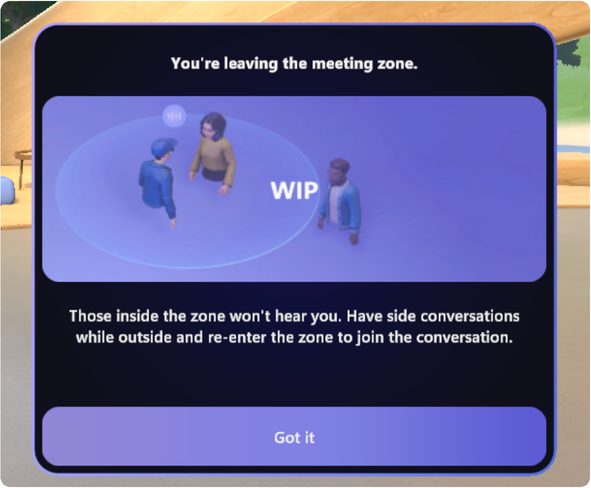

# Immersive spaces release notes

## Version 2023-8-25

### What's new

* When a participant steps out of the Meeting Zone for the first time in immersive spaces, a dialogue will appear to guide the first run experience:

    

### Resolved known issues

* On Quest, there’s a crackling sound when you try to click on the **Customize** button under **Profile**.
* In the Mesh user profile dialog box, switching avatars will cause the avatar preview to briefly flash.

## Next steps

* See currently active known issues for Immersive spaces