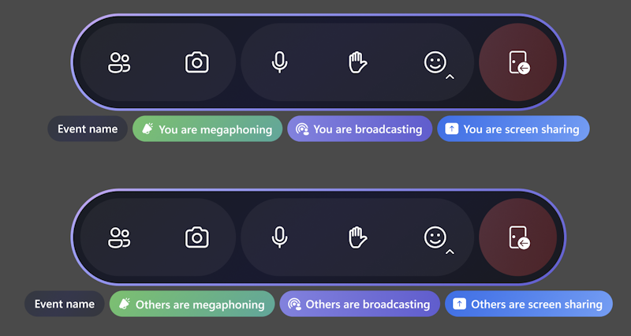
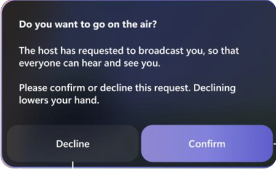
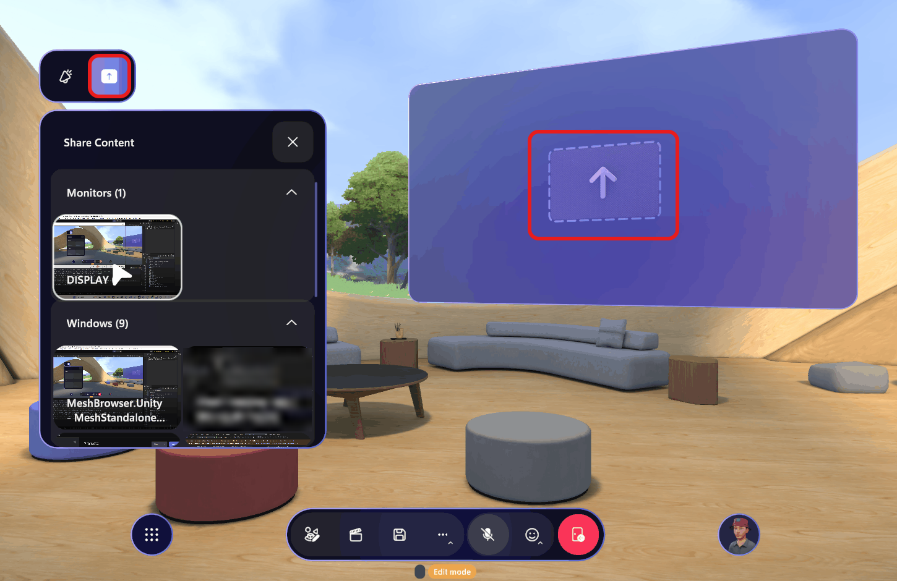
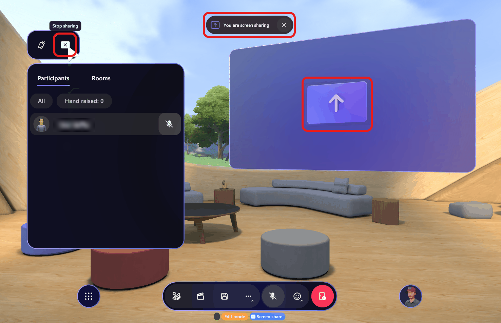
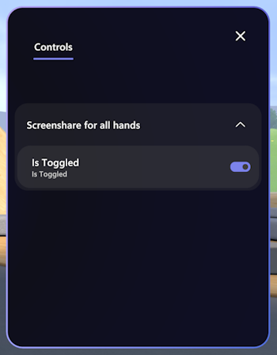

# Mesh release notes

**Release notes for Microsoft Mesh on PC & Quest 2**

## Version 5.2402.0 (Preview)

### What's new

* Presenters can now see their own screenshare when sharing content in Mesh. Previously, screenshared content was only visible to participants other than the presenter, requiring the presenter to navigate out of Mesh to see the content being shared.

## Version 5.2401.0

### Resolved product issues

The following product issues have been fixed for this release:

* Unexpected startup failure when launching Quest app related to conditional access now provides a more relevant error message: "Either your Quest device or Mesh app is currently blocked by your organization's AAD Conditional Access policies. Please contact your IT administrator for assistance."

    This should provide more clarity when conditional access is blocking usage of the quest application, helping customers better understand why the app failed to load. (38252)

## Version 5.2315.0

### What's new

* The new Microsoft Mesh trial license offering is now publicly available for enterprise customers to access Mesh for 6 months! For more information on how to sign up, see [IT admin-led trials for Microsoft Mesh](/mesh/setup/content/it-admin-led-trials). You can also find additional licensing requirements in [Troubleshooting and FAQ](/mesh/resources/mesh-troubleshooting).

* Controls in the **Environment Editor** and the **Control Panel** are now ordered based on relevance or priority, so it's easier for users to find the controls they need.

* If a user joins an event with a different tenant ID from that of the event organizer, we now show the following error dialog: **Join space from different tenant than the meeting owner is not allowed. Please use a different account to join this space.**

* We have improved ambient indicators as to who is megaphoning, broadcasting, or screen sharing.

    

### Mesh on the web

Mesh on the web is moving to cloud.microsoft with the [Microsoft 365 apps and services](https://techcommunity.microsoft.com/t5/microsoft-365-blog/introducing-cloud-microsoft-a-unified-domain-for-microsoft-365/ba-p/3804961). Currently, we are providing two links for Mesh on the web to ensure a smooth transition. For the new [cloud.microsoft](https://mesh.cloud.microsoft) link, make sure you have allowed the proper endpoints. See [Preparing your organization](../Setup/Content/preparing-your-organization.md#ensure-endpoints-can-be-allowed-for-immersive-spaces-in-teams) for details.

The two Mesh on the web links are:

- Old: https://portal.mesh.microsoft.com 
- New: https://mesh.cloud.microsoft

If you have any issues with the new Mesh on the web experience, you can continue to use [portal.mesh.microsoft.com](https://portal.mesh.microsoft.com).

### Resolved product issues

The following product issues have been fixed for this release:

* On Quest, the user is disconnected from an event if headset is removed. (25764)

* Searching for co-organizers on the Invite page yields no results. (29365)

## Version 5.2314.0

### What's new

#### New UI termonlogy

| UI terms previously used   | New terms  |
|---|---|
| Event template   | Template   |
| Mesh World, World   | Environment collection, collection  |
| Artifact   | Object  |
| Environment Editor | Editor |
| App Menu |  Menu bar |
| Mesh Portal | Mesh on the Web |

#### Avatar customizer

* Users are now prompted to confirm if they're sure they'd like to lose their changes before exiting the avatar customizer.

#### Event production

* New hand raise functionality:

    * Hosts can now see who raised their hand, and then enable **Broadcast** and **Megaphone** for them. **Broadcast** allows the user to be visible in multiple rooms,  and **Megaphone** allows them to be heard.

    * Users can now raise their hand and wait to be called on by the host(s) in an event. Once called, their avatar will be **Broadcasted** (in multiple-room events) and **Megaphone** will be turned on.

* Updated the dialog box for when an attendee is invited to accept broadcast. You can either choose to **Decline** or **Confirm** to start broadcasting. (24459)

    

* New screen share UI:

    * Before starting a screen share, the dotted line indicates you can share to that screen.

        

    * Once screen sharing is started, you see a **You are screen sharing** toast notification, and the **Stop sharring** option. The solid line indicates you're currently sharing a screen.

        

* New **Control panel** dialog where the **Controls** list is now on a separate tab:

    
  
* Save customizations in a customization session using the **Save** buttton.

    :::image type="content" source="../media/mesh-event-producer-guide/Customize-event-object-save-changes.png" alt-text="Screenshot of save dialogue and button in a customization session.":::
        
#### New controls for interactive objects

* Throwable (for example: [the bean bag toss](https://support.microsoft.com/en-us/office/use-in-meeting-controls-for-immersive-spaces-in-microsoft-teams-ccf689d0-b47e-4e11-9eff-2ca0ce87f422#bkmk_social_games)):

    * Aim and left mouse click to throw

    * Press **Space bar** to drop

* Activatable (for example: [the marshmallow stick in the Lakehouse environment](https://support.microsoft.com/en-us/office/use-in-meeting-controls-for-immersive-spaces-in-microsoft-teams-ccf689d0-b47e-4e11-9eff-2ca0ce87f422#bkmk_social_games)):

    * Click to use

    * Press **Space bar** to drop

* [Equippable objects](/mesh/develop/enhance-your-environment/avatar-and-object-interactions/interactables#equippable-objects) without any special interactions:

    * Press **Space bar** to drop

### Resolved product issues

* On Quest, when running multiple video players will cause the videos to flicker intensely. (24490)

* On Quest: the Mesh UI no longer locks with the user's head view. As you turn your head, the Mesh UI will now remain stationary. (13061)

* While a seating layout change is in progress, the seats are no longer clickable. (27509)

* You will no longer feel a slight bump in your position after teleporting to an inclined surface. (24915)

* The settings dialogs now show the current selected state for many settings. (17308)

* When trying to throw an object by clicking on the object, the cursor no longer shows. (25542)

* On Quest devices: to pick up an [equippable object](/mesh/develop/enhance-your-environment/avatar-and-object-interactions/interactables#equippable-objects), you can simply bring your hand close to the object and click the Grip button.  

    Previously, you need to point the controller ray at the object and click the **Grip** button. This feels very unnatural for interaction with objects that are near.  When you're very close to an object, it's hard to point your controller ray at it to interact. (24187)

* Fixed the issue: On PC and Quest, when attempting to delete any artifacts in the Environment Editor will crash Mesh while running. (28903)

#### Events

* In the case of a failure to connect to Mesh services when joining an event, we now show an error dialog asking users to contact their IT admin. Consult the Mesh admin documentation, and in particular the details about [configuring firewalls](/mesh/setup/content/preparing-your-organization#work-with-your-organizations-security-team), to ensure traffic to and from Mesh services are allowed. (27527) 

* For users with a license for Teams Premium but without Teams Core, we do not block their entrance into Mesh on PC, however they will not be able to access any events. We have provided the user with a more accurate error why they are not able to see events. (25623)

* All-day event times are no longer being converted to local time zones. (26665)

* Fixed the issue: on template name update, changes are not immediately reflected in customization session. (25153)

* In the **Control Panel** dialog, the **Video Player** URL box no longer incorrectly displays the text "Placeholder" (14889)

## Version 5.2313.0

### Resolved product issues

* On Quest, there’s a crackling sound when you try to click on the **Customize** button under **Profile**. (16203)
* In the Mesh user profile dialog box, switching avatars will cause the avatar preview to briefly flash. (12762)
* On Quest, the **Event details** dialog and the **Invite list** for an event will show up as blank when accessed through the Dashboard Homepage. (13085)
* For some microphones, the user may sometimes need to speak louder than normal to trigger both lip-sync and background highlighting of the name plate. (48816)
