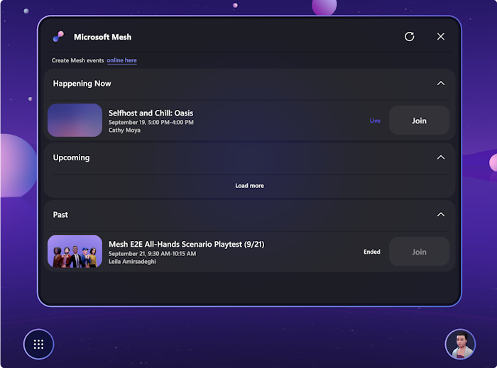
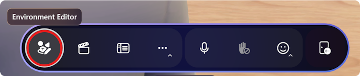
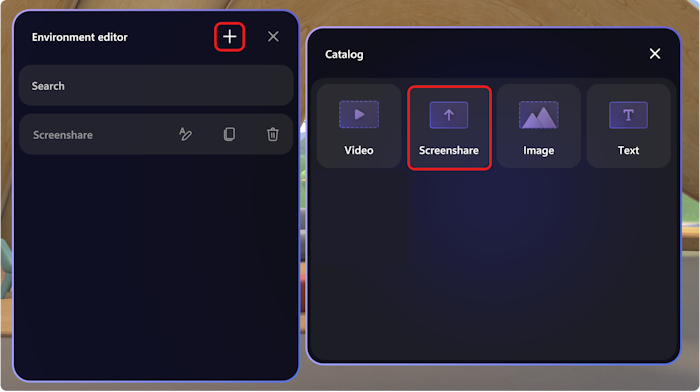
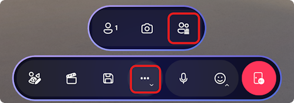
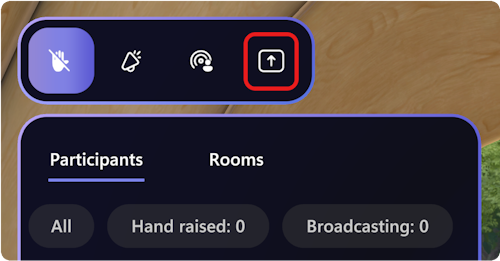
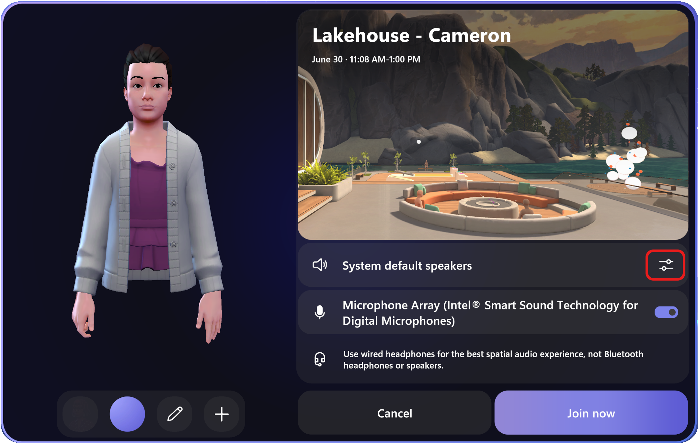
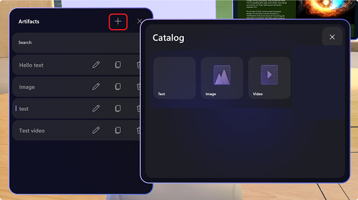
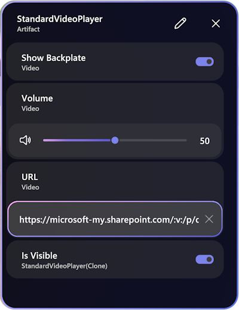

# Mesh release notes

**Release notes and known issues for the Microsoft Mesh App on PC & Quest 2**

## Version 5.2312.0

### What's new

* The keyboard shortcut for toggling between 1st and 3rd person views have been changed from **C** to **V**.
* There's now a pop up notification to show up when you're experiencing poor network quality, which may negatively impact your experience in a Mesh event.

    

#### New M365 Dashboard

Public preview customers will see the new M365 Dashboard. 

#### Screen share

Screen sharing is now available to event hosts. To add a screen share window to your event, select the **Environment Editor** on the app bar:

In the **Environment Editor** dialog, select the **+** button to bring up the artifacts **Catalog** dialog and find the **Screenshare** artifact.
    

Once the **Screenshare** artifact has been added to the event, you'll see the **screen share** button from the **Host panel**.

You can now share screen with the participants of your event:

>[!Note]
>For event hosts the **Screenshare** artifact currently won't display the screen content being shared, but participants to your event will be able to see the full screen share.
>  
>If you have added multiple **Screenshare** artifacts to your event, all these artifacts will display the same screen share content.

### Resolved product issues

## Version 5.2311.0

### What's new

* There's a new audio device test dialog, which can be accessed from the **Prejoin** dialog to an event.

    

    And here's the new audio device test dialog:

    

#### Environment Editor panel is now available

The **Environment Editor** panel can help to add content to your Event or Template. 

1. Open the **Environment Editor** panel from the app bar, then you can add images, videos, and text to your environment. These are called Artifacts.  

    

2. In the **Artifacts** dialog, you can select the **+** button to add images, videos, and text to the environment.

    

    Artifacts can be used to add branding to make the event environment unique to your event. Also, artifacts can be used with the **Control Panel** to highlight content as part of your presentations or serve as moments to your event flow.

    For example, as you welcome new members to your team during your event, you can post a few pictures of them around the stage so everyone can put a name to the new faces.

3. Once you have added an artifact to the scene, your artifact will appear in front of your avatar and you can configure it in the Artifact Details panel that will appear on the right side of the screen. 

    

    >[!Note]
    >The video artifact in a Mesh event currently supports only direct links to video files (such as .MP4) stored on SharePoint or direct HTTPS URLs. Links to video services like YouTube or Vimeo are not supported.
 
    The parameters you set here will determine your artifact configuration when your event starts. If you want to change the configuration live during your event, for example, show a different image or video as the event progresses. Or if you would like to make the artifact invisible until the right moment in your experience and then have it appear at the right moment you can do so using the [**Control Panel**](../use/events-guide/customize-event.md#prepare-content-with-the-control-panel).

4. Anywhere you see a URL parameter, you should be able to copy and paste a share link from SharePoint or OneDrive for the image or video you would like to share. Make sure you either make the link accessible to anyone at your organization or set the permissions so that everyone who attends your events will have access. 
1. To position your artifact - with the environment editor open:

    1. Select and drag your artifact to move it left, right, up, or down. 
    1. **Alt + Select** and drag up or down to move the artifact toward and away from you.
    1. **Shift + Select** and drag up or down to make the artifact bigger or smaller. 
    1. You can also use the rotation and scale handles on the artifact to rotate and scale your artifact. Just select the handle and drag to rotate or scale. 
 
    Make sure you check out the position from different angles to verify you’ve placed it properly. 
    
    >[!Tip]
    >While you are moving an artifact, you’ll see a small line drawn from your artifact down to the floor. This can help you position your artifacts relative to landmarks in the scene such as the edge of a stage or a piece of furniture. 

### Resolved product issues

* On Quest, there’s a crackling sound when you try to click on the **Customize** button under **Profile**. (16203)
* In the Mesh user profile dialog box, switching avatars will cause the avatar preview to briefly flash. (12762)
* On Quest, the **Event details** dialog and the **Invite list** for an event will show up as blank when accessed through the Dashboard Homepage. (13085)
* For some microphones, the user may sometimes need to speak louder than normal to trigger both lip-sync and background highlighting of the name plate. (48816)
