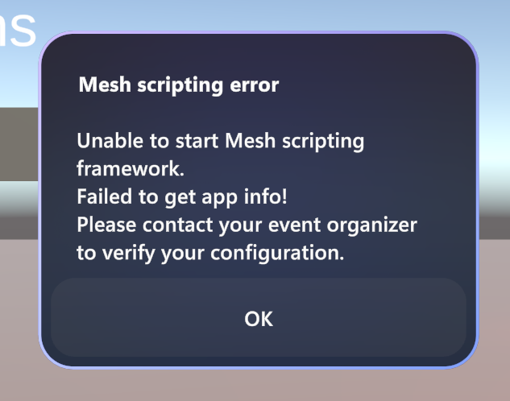
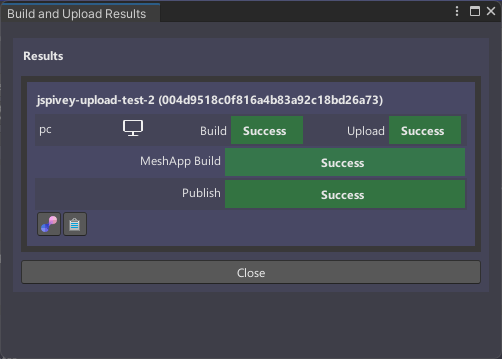

# Acitive known issues - Mesh Toolkit

## Version 2023-9-8

### Scripting

* New `meshapp` deployments will fail to create `diagnosticSettings` on the `appService`. (19508)

    

    1. Use the uploader to deploy a new `meshapp`. The diagnostic setting resource fails to create with the **Diagnostic settings does not support retention for new diagnostic settings** error.
    1. The Uploader will mark the deploy operation as failed because the expected success message won't be in the output. It'll also break the Mesh Uploader.
    1. The other resources will be created in Azure.

    *Additional details:*

    The first time when you attempt an upload, you'll see the `meshapp` deploy and publish to fail.

    

    This is the diagnostic logs retention issue described above. If you attempt to upload again, you will see what looks like a success:

    

    If you're careful, you'll notice that the **MeshApp Deploy & Publish** step is no longer listed in the status dialog.  Attempting to connect to an event in this seemingly successful environment will result in mesh scripting failures.

    The reason this occurs is that the earlier failure modified a file in such a way that subsequent uploads are not attempted.  This is why you'll need to remove the `"mode": ""` line.

    *Here's the workaround:*

    1. Uncheck **Enable App Monitoring** until 23.11.
    1. Open the `meshapp.manifest.json` file in a text editor and delete the line that reads `"mode":""`. 

### WebSlate

* After upgrading, WebSlate game objects may encounter an internal shader error. If so, navigate to the **Inspector** view of your WebSlate and ensure that the selected shader is set to `UnlitWebSlate`.
* After upgrading, your visual scripting graph may still reference the legacy `WebView` type. If so, manually update this reference to the correct `WebSlate` type.

