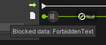

# Mesh toolkit release notes

For purposes of this document, there are two categories of users:

* Creators: Technical artist and developers building with the Mesh toolkit
* IT admins: Managers working in Azure or M365

## Version list and dates

These are the offerings and packages currently available. There may be slight differences in the list you see here and the packages you have or see.

>[!Note]
>The version number for your environment project's Mesh toolkit package **must** be equal to or older than the Mesh app (PC or Quest) your environment is targeting, otherwise the environment will not load. You can generally ensure this is true by using the non-preview Mesh toolkit package, which releases only after the matching Mesh app is available in stores.

| Mesh offering/package      | Version  | Date released |
|----------------------------|----------|---------------|
| Mesh toolkit               | 5.2315.0 | 2024-2-02     |
| Mesh toolkit (preview)     | 5.2401.0 | 2024-2-16     |
| Mesh on PC/Quest           | 5.2401.0 | 2024-2-20     |
| Mesh on PC/Quest (Preview) | 5.2402.0 | 2024-2-20     |

## Mesh toolkit 5.2402.0 (Preview)

>[!Caution]
>This is a preview release of the Mesh toolkit noted by a **-preview** tag at the end of the version number.  Environments published with this preview version of the Mesh toolkit will only work with the preview version of Mesh, and **are not compatible with the stable public version of Mesh**. Do not upgrade to this version of the Mesh toolkit until a stable public version is released; stable public versions won't have a **-preview** tag at the end of the version number.  
>
> **Be careful that you don't overwrite environments currently in use by your company with the preview version.**

### What's new

#### Mesh 201 Tutorial

* Mesh 201 is released for the Mesh Toolkit version 5.2402.0 (Preview). In this tutorial, you build on that knowledge and learn how to use WebSlates to display web content in your experience. The tutorial includes an interactive globe; when a person in your experience clicks on the globe, the latitude and longitude of the clicked location are captured and these coordinates are incorporated into a Bing Maps URL as parameters. An HTTP request is executed using this URL; Bing Maps provides a map of the chosen area and sends it to a nearby WebSlate.

#### Visual scripting

* Visual scripts are no longer completely disabled if the environment contains a ScriptMachine with a broken ("Missing") or unassigned ("None") asset graph reference. (36795)

* Fixed the String | Create node, which previously only worked in the Emulator but failed to work in standalone builds. (37040)

* The script node selector (Fuzzy Finder) in the script graph UI no longer includes nodes that access inherited properties or methods through types that cannot be accessed directly. (37824)

* Fixed sharing tags shown in the Visual Scripting graph UI for the following Mesh Interactable Body script nodes to correctly say Shared by all clients (instead of incorrectly Local to this client):
    - Mesh Interactable Body | Is Activated
    - Mesh Interactable Body | Get Equipped At
    - Mesh Interactable Body | Is Equipped
    - Mesh Interactable Body | Get Equip Time

    The functionality of these visual script nodes is unchanged. If you need a local version of these properties, you can combine them with the Mesh Interactable Body | Is Mine property. (38589)

* Fixed Script Stats panel in Mesh Emulator not displaying anything if the visual script graph UI hasn't ever been opened for that Unity project on the local machine yet. (40526)

* Fixed Mesh Visual Scripting Diagnostics panel not displaying anything if the visual script graph UI hasn't ever been opened for that Unity project on the local machine yet. (40527)

* Fixed the On Interval node occasionally triggering twice in short sequence after an interval has elapsed. (40894)

* Several useful Render Settings properties are now exposed to visual scripts:

    * For environments whose Environment Lighting Source is set to Skybox:
        * Render Settings | Get Skybox – see [Unity docs](https://docs.unity3d.com/ScriptReference/RenderSettings-skybox.html)
        * Render Settings | Get/Set Ambient Intensity – see [Unity docs](https://docs.unity3d.com/ScriptReference/RenderSettings-ambientIntensity.html)
    * Note that in order to see the effects of skybox material updates on dynamic lighting, include the Dynamic GI | Update Environment script node after modifying the skybox material.

    * For environments whose Environment Lighting Source is set to Color:
        * Render Settings | Get/Set Ambient Light – see [Unity docs](https://docs.unity3d.com/ScriptReference/RenderSettings-ambientLight.html)

    * For environments whose Environment Lighting Source is set to Gradient:
        * Render Settings | Get/Set Ambient Sky Color – see [Unity docs](https://docs.unity3d.com/ScriptReference/RenderSettings-ambientSkyColor.html)
        * Render Settings | Get/Set Ambient Equator Color – see [Unity docs](https://docs.unity3d.com/ScriptReference/RenderSettings-ambientEquatorColor.html)
        * Render Settings | Get/Set Ambient Ground Color – see [Unity docs](https://docs.unity3d.com/ScriptReference/RenderSettings-ambientGroundColor.html)

* Several Line Renderer component methods and properties are now exposed to visual scripts:
    * Methods:
        * Line Renderer | Get Position – see [Unity docs](https://docs.unity3d.com/ScriptReference/LineRenderer.GetPosition.html)
        * Line Renderer | Get Positions – see [Unity docs](https://docs.unity3d.com/ScriptReference/LineRenderer.GetPositions.html)
        * Line Renderer | Set Position – see [Unity docs](https://docs.unity3d.com/ScriptReference/LineRenderer.SetPosition.html)
        * Line Renderer | Set Positions – see [Unity docs](https://docs.unity3d.com/ScriptReference/LineRenderer.SetPositions.html)

    * Properties:
        * Line Renderer | Get/Set Position Count – see [Unity docs](https://docs.unity3d.com/ScriptReference/LineRenderer-positionCount.html)

* Many useful Video Player component methods and properties are now exposed to visual scripts.
    * Methods:
        * Video Player | Play – see [Unity docs](https://docs.unity3d.com/ScriptReference/Video.VideoPlayer.Play.html)
        * Video Player | Pause – see [Unity docs](https://docs.unity3d.com/ScriptReference/Video.VideoPlayer.Pause.html)
        * Video Player | Stop – see [Unity docs](https://docs.unity3d.com/ScriptReference/Video.VideoPlayer.Stop.html)
        * Video Player | Step Forward – see [Unity docs](https://docs.unity3d.com/ScriptReference/Video.VideoPlayer.StepForward.html)

    * Properties – which can all be observed using an *On State Changed* event node:
        * Video Player | Is Prepared – see [Unity docs](https://docs.unity3d.com/ScriptReference/Video.VideoPlayer-isPrepared.html)
        * Video Player | Is Playing – see [Unity docs](https://docs.unity3d.com/ScriptReference/Video.VideoPlayer-isPlaying.html)
        * Video Player | Is Paused – see [Unity docs](https://docs.unity3d.com/ScriptReference/Video.VideoPlayer-isPaused.html)
        * Video Player | Is/Set Looping – see [Unity docs](https://docs.unity3d.com/ScriptReference/Video.VideoPlayer-isLooping.html)
        * Video Player | Get/Set Time – see [Unity docs](https://docs.unity3d.com/ScriptReference/Video.VideoPlayer-time.html)
        * Video Player | Get/Set Playback Speed – see [Unity docs](https://docs.unity3d.com/ScriptReference/Video.VideoPlayer-playbackSpeed.html)
        * Video Player | Get Length – see [Unity docs](https://docs.unity3d.com/ScriptReference/Video.VideoPlayer-length.html)
        * Video Player | Can Set Time – see [Unity docs](https://docs.unity3d.com/ScriptReference/Video.VideoPlayer-canSetTime.html)
        * Video Player | Can Set Playback Speed – see [Unity docs](https://docs.unity3d.com/ScriptReference/Video.VideoPlayer-canSetPlaybackSpeed.html)

#### Mesh uploader

* The ContentVersion has been incremented to 1.25.0; Newly published content will only be visible in recent MeshBrowsers.

* Improved handling and reporting of failures during Environment creation.

* Add a prompt to open the Mesh Portal if we failed to find any collections for the user.

* Improved message when cancelling the dialog to select a new thumbnail folder.

## Mesh toolkit 5.2401.0 (Preview)

### What's new

#### Toolkit

* The `ContentVersion` has been incremented to 1.24.0: Newly published content will only be visible in the recent Mesh app.

* Some errors that came from the Mesh services did not have enough information in them. For example, some errors were just reported as "BadRequest" or "BadGateway". We've improved error messages from the service to include more useful details.

* Simplified discovery of options by moving the **Settings** in the **Options** tab into the **Project Settings/Mesh Uploader Settings** pane with the other **Uploader** settings.

* Improved error handling when thumbnail generation fails.

* Improved error handling on asset validation.

* If we fail to create a copy of the asset, the build and publish operation won't proceed.

* Fixed an issue where the **Require Ground Collision Layer** won't have the correct value when changed while a window was open.

##### Diagnostics and debug tools are now easier to discover and use in the Mesh Emulator:

* In the Unity editor, click the **Enter Split Screen** button to enable split-screen mode, which allows you to test and debug multi-user issues. 

* In the split-screen mode, click **Add** or **Leave** to add more split-screen clients to the session or to make them leave the session.

* Select **Script Stats** to show a panel of real-time visual script performance statistics, such as:

    * which visual script flows require the most per-frame time to execute

    * which shared properties and variables are updated (and replicated over network) most often

    Clicking on an entry brings you straight to the corresponding scene object in the **Hierarchy** panel.

* Select **Perf Stats** to show to **Visual Profiler** (only in single-screen mode) to display real-time CPU and GPU performance statistics for the scene you're running.

#### Scripting and physics

* It's now possible to use the **On State Changed** visual script event to observe the transform of a physics body. The event fires whenever the physics body is moved directly on the local client or by a remote client. (31869)

* During an environment upload, issues detected by the Visual Scripts validation step now log significantly improved diagnostics and extended guidance on how to avoid the reported issues. (34450)

## Version 5.2315.0

### Version list and dates

These are the offerings and packages currently available. There may be slight differences in the list you see here and the packages you have or see.

>[!Note]
>The version number for your environment project's Mesh toolkit package **must** be equal to or older than the Mesh app (PC or Quest) your environment is targeting, otherwise the environment will not load. You can generally ensure this is true by using the non-preview Mesh toolkit package, which releases only after the matching Mesh app is available in stores.

| Mesh offering/package   | Version | Date released
| ----------- | ----------- | ----------- |
| Mesh toolkit package      |   5.2315.0     | 2023-2-2  |
| Mesh (PC/Quest)   |  5.2315.0       |  2023-2-2  |

### What's new

#### Toolkit

* The `ContentVersion` has been incremented to 1.22.0. Newly published content will only be visible in recent versions of the Mesh app.

* Added new prebuild validation which will only allow GameObjects on certain layers.

* Renamed the **Create Asset** button to **Create Environment**.

* Fixed build status in the result report when there are invalid assets during the build phase.

* If the level of diagnostic data is not set by the tenant admin, then by default the Uploader will send optional diagnostics.

* Renamed the menu item from **Mesh Toolkit/Configure/Default Font** to **Mesh Toolkit/Configure/Apply Default Font Settings**.

* Renamed the menu item from **Mesh Toolkit/Configure/Project Settings** to **Mesh Toolkit/Configure/Apply Project Settings**.

* In the Mesh Uploader **Update Environment** tab, when you click the the **Thumbnail** drop-down and select **Take from folder**, a button appears with a label that used to say **Add Provisional Thumbnails** but now says **Add guidance thumbnails**.

* We now show an error dialog when the user picks a folder outside of the project.

* Fixed bugs in the Uploader extensions system:

    * Metadata stages were accidentally being run multiple times.

    * Metadata results were being ignored in certain cases.

* We now return to an empty default scene after building when there was no active scene.

* We now avoid displaying collections that could not be validated in Mesh.

* We now show the toolkit package version in the Uploader Window.

* Uploader build platforms are now stored as per project settings instead of per computer settings.

* Improved how the uploader handles an operation being cancelled.

* Prevent refreshing asset list when changing window focus.

* Added an updated title and warning when using the preview version of the toolkit.

* We cleared a confusing progress bar when Unity reloads assembly during an operation.

* We now prompt the user to re-authenticate if authentication has expired when retrying an operation.

* Sometimes the Uploader would hit a `UserInteractionNeeded` exception when authenticating the user. We now mitigate this problem when it occurs by delegating the user to a Web Browser based authentication.

* Breaking changes to layers: we renamed several layers, moving currently unused layers into reserved layers, and updated cross-layer interactions. See [Configuring for avatar movement and teleportation](/mesh/develop/build-your-basic-environment/configuring-for-avatar-movement-and-teleportation).

* Moved the setting from `RequireNavMeshLayer` to `RequireGroundCollisionLayer`.

* Fixed failure message in the result dialog for successful publishes.

#### Scripting

* The NavMesh layer is now called the GroundCollision layer. For more information on the uses of the GroundCollision layer, see [Configuring for avatar movement and teleportation](../develop/build-your-basic-environment/configuring-for-avatar-movement-and-teleportation.md).

* Shared properties and script variables set on dynamic targets--for example, target component instances read from script variables or otherwise deduced at script runtime--now reliably work on all viable targets throughout the scene. (32730)

    Previously, only a subset of viable target instances throughout the scene worked reliably when a target was deduced dynamically during script runtime. This doesn't include target instances that were placed in sibling branches of the transform tree.
    
    * anything on the implicit `This` scene object

    * anything below it
    
    * anything on any of its parents 
    
    The `This` scene object is the GameObject the `ScriptMachine` executing the visual script is attached to.
    
    For example, if you were trying to set a shared property of a `Foo`-type component and you were using a variable to dynamically reference a specific `Foo` instance to turn that property on, this would only have worked reliably for any for the following `Foo` instances:

    * was attached to `This` = the same GameObject as the `ScriptMachine` running the visual script

    * was attached to any parent/ancestor GameObject of `This` in the transform hierarchy

    * was attached to any child/descendant GameObject of This in the transform hierarchy

* Using Timer nodes in subgraphs no longer causes repeated error messages related to `OptimizedTimerUnitUpdateScheduler` to be logged. (31866)

* The visual script graph UI now includes usage notes and helpful hints on Mesh's and Unity's visual script nodes. (25922)

* It's no longer necessary to add `Microsoft.Mesh.VisualScripting.xml` to version control. If it has been previously deployed into your Unity project, it can be safely deleted and removed from version control. (25922)

* In the **Local Script Scope** component, the **Share visual script variables on this GameObject** setting now defaults to being off when a new instance of this component is added to the scene. Existing instances are unaffected. (26551)

* The special script nodes injected by Mesh at runtime have significantly improved visuals and handling now (30925):

    * The visual footprint of injected nodes has been reduced to remove visual clutter and to make script flows easier to follow while they're executing. They're now firmly attached to one of the neighboring user-defined nodes.

    * New visuals of injected nodes:

        | New visuals | Injected nodes |
        | -------- | ------- |
        |   | profiling (start of flow)    |
        |  | data filtering   |
        |     | state tracking    |

    * When the data filtering node blocks data and passes on a `Null` value instead, its icon changes and its tooltip shows diagnostic information on what data is blocked most recently:

        

    * When you edit script graphs at runtime in the Emulator, injected nodes are now automatically injected and removed as required.

* Script graphs were saved with redundant type and versioning information in some object references. This will not visibly impact user experience. This redundant information is no longer included. (30688)

* The **Mesh Visual Scripting Diagnostics** panel now correctly displays diagnostics for all selected `ScriptMachine` components if more than one is selected in the transform hierarchy. Previously, only diagnostics for the first selected ScriptMachine were displayed. If several were selected at the same time, errors were logged to the console panel. (30873)

* Accessing **Travel Point** methods and properties now works in all cases. Previously, when the **Travel Point** was set up in isolation and not nested in an explicit **Travel Point Group**, and a reference to it was passed to the method or property node from another script node (for example, from a **Get Variable** node), the **Travel Point** reference was incorrectly filtered out at runtime and the method call or property access would fail to work. (31414)

#### WebSlate

* Added the option to prevent the WebSlate from suspending when users are at a distance, or when it is offscreen. Useful for slates that need to keep running in the background, but can cause performance issues if overused. Normally, to save resources, WebSlates suspend 30 seconds after going offscreen or becoming too small to be useful.

    This option can be seen in Unity's inspector when a WebSlate is selected, as a checkbox on the WebSlate script called **Prevent Suspension**.

#### Mesh 101 Tutorial

* The **Create Asset** button is now **Create Environment**.  See [Mesh 101 Tutorial Chapter 5: Make your environment available for testing](/mesh/develop/getting-started/mesh-101-tutorial/mesh-101-05-make-environment-available).

## Version 5.2314.0

### Version list and dates

These are the offerings and packages currently available. There may be slight differences in the list you see here and the packages you have or see.

>[!Note]
>The version number for your environment project's Mesh toolkit package **must** be equal to or older than the Mesh app (PC or Quest) your environment is targeting, otherwise the environment will not load. You can generally ensure this is true by using the non-preview Mesh toolkit package, which releases only after the matching Mesh app is available in stores.

| Mesh offering/package   | Version | Date released
| ----------- | ----------- | ----------- |
| Mesh toolkit package      |   5.2314.0     | 2023-12-4  |
| Mesh (PC/Quest)   |  5.2314.0       |  2023-12-4  |

### What's new

#### Scripting

* The **On State Changed** event node now works correctly after its `ScriptMachine` is disabled and later re-enabled. Previously, the node incorrectly stopped triggering completely and indefinitely after it had been disabled for the first time. (26333)

* In the script graph, the per-node annotations **Local to this client** and **Shared by all clients** now reliably update in real time when the scene is changed while the script graph window is visible. (26334)

* The **Mesh Interactable Body | Is Selected property** property is now correctly networked in Mesh Emulation Mode. Previously, it incorrectly behaved as if it was a local property even though it is networked in the Mesh client. (26792)

* Mesh's injected framework nodes (for example, **Track Object State** and **Sanitize Data**) no longer persist in second-level subgraphs after running a scene in Mesh Emulation Mode. (28966)

* When the **On State Changed** event node is used to observe a shared property or variable, it now triggers immediately after the property or variable is changed locally. Previously, for shared properties or variables, it triggered only after the local change had been sent to and received back from the server, incurring network delay even on the sending client. (28968)

* Available script nodes in the script graph editor now reliably represent what's supported in Mesh, and it's no longer necessary to add `UnitOptions.db` to version control as it's automatically re-generated if necessary when the Unity project is opened. (26109)

    Previously, the list of available script nodes can easily be auto-populated with incompatible (default) project settings or without having been filtered to include only nodes supported by Mesh. For example, this could happen if users chose not to apply Mesh project settings before starting to work on visual scripts, or if they manually edited Visual Scripting's **Type Options** or **Node Library** and selected **Regenerate Nodes**.

##### Physics

* The physics event nodes **On Trigger Enter**, **On Trigger Exit**, **On Collision Enter**, and **On Collision Exit** are now reliably networked. By default, these events reliably trigger on all clients in the room. However, if the physics collider observed by these event nodes is in scope of a **Local Physics Scope** component, the events reliably trigger on exactly one client, which makes it possible for the script flows they trigger to reliably read and write shared state (for example: update a shared score variable). (27635)

#### Interactables

* [Equippable objects](/mesh/develop/enhance-your-environment/avatar-and-object-interactions/interactables#equippable-objects) now respond to a mouse button down as opposed to the mouse button release. (27858)

* On Quest devices: to pick up an [equippable object](/mesh/develop/enhance-your-environment/avatar-and-object-interactions/interactables#equippable-objects), you can simply bring your hand close to the object and click the Grip button.  

    Previously, you need to point the controller ray at the object and click the **Grip** button. This feels very unnatural for interaction with objects that are near.  When you're very close to an object, it's hard to point your controller ray at it to interact. (24187)

* **Validate Unique ID** added to environment upload. To verify the interactables in your scene that have valid unique ids go to **Mesh Toolkit -> Validate Unique IDs**. (25151)

* Throwable objects have a new setting for **Throw Direction Offset**. This is added to the direction the object is being thrown. (26308)

* `MeshInteractableSetup` will no longer allow objects to be both manipulable and equippable. Objects that were previously defined as both will only be equippable and you may change it back to manipulable if that's not intended. (26632)

#### Uploader

* The ContentVersion has been incremented to 1.21.0: Newly published content will only be visible in the recent Mesh build.

* The environment thumbnail will be automatically generated based on travel point when no thumbnail camera is found in the scene.

* Renamed **Mesh World** to **Environment collection** on the uploader user interface and logs.

* Updated the Mesh logo.

* Fixed the **Feedback** window which was previously blank.

* Added tooltips to the **Uploader** dialog which can contain useful information in case of failures.

* Making the **Results** section for **Extension tools** an expandable area.

* Fixed a bug where the Uploader could appear to open in a valid state but also show a dialog claiming the user's license is not valid.

* Fixed a bug where missing TMP settings will not setup default font.

* Fixed `ArgumentNullException` when using **Toggle [NoUpload] suffix** without selecting a GameObject.

* Added handler for the graph error when the Uploader fails to find the OneDrive folder.

* Failed to upload Thumbnails will now report correctly as an error and fail before trying to publish an asset.

* Fixed an issue which displayed a warning before uploading disabled entries.

#### WebSlate

* Fixed this issue: On Quest, if the user resumes from sleep, entering an event will crash if the event has WebSlate. (27705)

#### Error messages

* A new `TravelExceptionReason` and localized error message for  `RelayServerUnreachableException`:

    Oops! We failed to connect. Please check your internet connection and try again. If you continue to experience this problem, check with your IT department and mention: the client didn't receive a response from the Relay server within the connection timeout. (29004)

* A new `TravelExceptionReason` and localized error message for `RelayNetworkException`:

    Oops! We failed to connect. Please check your internet connection and try again. (29004)

## Version 5.2313.0

### Version list and dates

These are the offerings and packages currently available. There may be slight differences in the list you see here and the packages you have or see. We are working to create better transparency and standardization of versions of offerings and packages to make upgrading easier.

>[!Note]
>The version number for Mesh (PC or Quest) **must** match the Mesh toolkit authoring package version you're using otherwise you may get errors or unexplained behavior. Please hold off on upgrading the Mesh toolkit authoring package until the Mesh client version for your target platform (PC or Quest) is available.

| Mesh offering/package   | Version | Date released
| ----------- | ----------- | ----------- |
| Mesh toolkit Package      |   5.2313.0     | 2023-11-13  |
| Mesh (PC/Quest)   |  5.2313.0       |  2023-11-13  |

### What's new

#### Scripting

**Restrictions on UnityEvents and animation events in Unity**

UnityEvents and animation events must call into visual scripts. They are not allowed to directly manipulate properties or invoke methods. This restriction applies to the following:

* in a Timeline `SignalReceiver`
* in Animation Events

Here's what to do for UnityEvent in a `SignalReceiver` as the starting point:

1. For Animation Events, it's the same except you can use the **Animation Event** visual script trigger and the corresponding `TriggerAnimationEvent` function on the `ScriptMachine` object, where the *Function* in the Animation Event and the `Float`, `Int`, `String` parameters can be used or filled arbitrarily.

1. Create a `ScriptMachine` for a visual script that uses an UnityEvent trigger and that performs the action you'd like to do.
 
1. Choose a descriptive name for the UnityEvent trigger, for example `DoThing`:

    
 
1. In the `SignalReceiver`, set up the UnityEvent by the following steps:

    1. Target the `ScriptMachine` you've created for the visual script.

    1. For the function to call, select `ScriptMachine > TriggerUnityEvent (string)`.
    1. In the parameter field, enter the name of the UnityEvent trigger (for example, `DoThing`).

    

#### Physics

* Added the component `LocalPhysicsScope`to create a part of the scene hierarchy where rigidbodies are not synced among clients.

* Added the component `ThrowTrajectory` to calculate future positions of the rigidbody trajectory.

#### WebSlate

* We fixed an issue where it would allow scripting ([Visual scripting](/mesh/develop/script-your-scene-logic/visual-scripting/visual-scripting-overview) and [Cloud scripting](/mesh/develop/script-your-scene-logic/cloud-scripting/cloud-scripting-basic-concepts)) to correctly control WebSlate at start-up.

    Before this fix, if the scripting navigate or push HTML content to WebSlates at start-up, it would not show up correctly due to a race-condition.
  
* Added the option to prevent the WebSlate from suspending when users are at a distance, or when it is offscreen. Useful for slates that need to keep running in the background, but can cause performance issues if overused. Normally, WebSlates suspend 30 seconds after going offscreen or becoming too small to be useful, to save resources.
  
    This option can be seen in Unity's inspector when a WebSlate is selected, as a checkbox on the WebSlate script called "Prevent Suspension".

#### Uploader

* The `ContentVersion` has been incremented to 1.20.0: Newly published content will only be visible in recent Mesh app.

* Fixed a rendering issue at World List and Environment dropdowns.

* Fixed a bug where create tab UI will draw incorrectly when the text overflowed out of the window boundaries.

* Fixed a bug where the Uploader was throwing regex exceptions after a failed build.

* Added a check for potential null reference exception when publishing assets.

#### Content Performance Analyzer (CPA)

* Batch counts reported by the Content Performance Analyzer and the Mesh Performance Profiler are now more accurately counted based on Unity's SRP batcher markers. 

    >[!Note]
    >Batch counts will no longer be reported outside of the Unity editor because they can't be accurately counted in release builds.

### Resolved product issues

* This issue: "a privacy statement for the `com.microsoft.mesh.toolkit` package gets truncated when viewed in the **Unity Package Manager** in the package description section" -- has been fixed.
