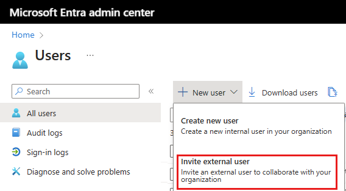
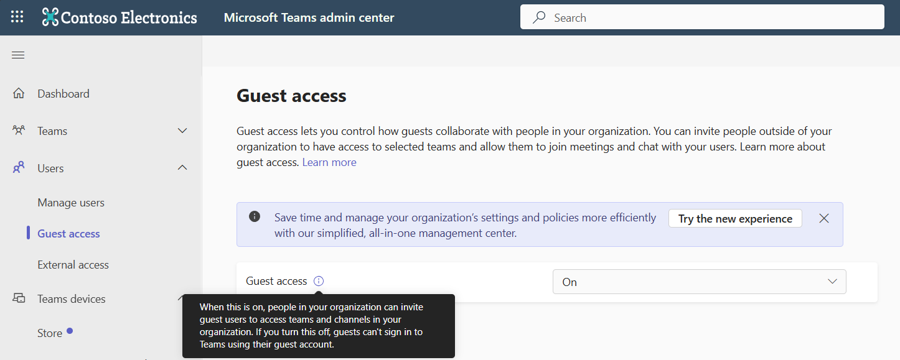

---
# Required metadata
# For more information, see https://review.learn.microsoft.com/en-us/help/platform/learn-editor-add-metadata?branch=main
# For valid values of ms.service, ms.prod, and ms.topic, see https://review.learn.microsoft.com/en-us/help/platform/metadata-taxonomies?branch=main

title:       # Add a title for the browser tab
description: # Add a meaningful description for search results
author:      Sean-Kerawala # GitHub alias
ms.author:   sekerawa # Microsoft alias
ms.service:  # Add the ms.service or ms.prod value
# ms.prod:   # To use ms.prod, uncomment it and delete ms.service
ms.topic:    # Add the ms.topic value
ms.date:     10/28/2024
---

# Invite guest attendees to Mesh events

> [!NOTE]
> **Guest access is currently limited to Mesh Technology Adoption Program (Mesh TAP) customers.** The capability is rolling out to broader audiences starting in November 2024, in accordance with the **[Microsoft 365 roadmap](https://www.microsoft.com/microsoft-365/roadmap?msockid=36ab16f6af646d611d69025aaede6c56&filters=&searchterms=guest%2Caccess)**.

Mesh events allow for even better collaboration for more people by supporting guest user attendees into the Mesh PC app. Event organizers can invite guest users outside their organization, providing an opportunity for broader collaboration and networking in Mesh events. Guests can sign in to the Mesh app to join events, participate in discussions, and experience the same interactive features as internal users, all while maintaining secure access control. Guest user creation follows the existing process for tenant guest user creation (outside of Mesh). 

- Admins (Global Admins, User Admins, Guest Inviters) add Guests via the Microsoft Admin Center 

- Guests need licenses (any Teams Premium prerequisite + Teams Premium or Mesh Trial) 

- Guests log in securely and enter the Event link in the Mesh app

- To successfully join an event, a base tenant user must join before Guest 

- If the Guest meets your organization's criteria, attendees and organizers will not need to accept Guest users into events

### What you'll need 

- Teams Premium prerequisite license *and* Teams Premium or Mesh Trial license seat for the Guest user. For more info, see [license requirements for Mesh events](/mesh/setup/content/preparing-your-organization).

- Guest users' existing email address

- Admin access role that allows adding Guests to a tenant (level greater than or equivalent to User Administrator)

### Invite external guest users to a Mesh event

1. Sign in to the [Microsoft Entra admin center](https://entra.microsoft.com/) as at least a User Administrator, then browse to **Identity > Users > All users.**

1. In **All users**, select **New user > Invite external user** to add a guest to the tenant. Repeat this step for all Guests you want to add.  
For more detail, follow the existing process for [tenant guest user creation using Microsoft Entra ID](/entra/external-id/b2b-quickstart-add-guest-users-portal).  

1. Navigate to the **[Microsoft 365 admin center](https://admin.microsoft.com/)**, then go to **Users > Guest users** and assign a Teams Premium prerequisite license *and* a Teams Premium or [Microsoft Mesh Trial](/mesh/setup/content/it-admin-led-trials) license.

1. The new Guest user will receive an email invitation notifying them of an invite to access your tenant. To save time, request the Guest(s) to login to their account before their first Mesh event to set up Multi-Factor Authentication (MFA) and any other required account details. 

Congrats! You now have Guest users ready to join Mesh events. Next, Mesh event organizers will need to create an event, invite attendees, and share the join link directly with the guests. See [Join events as a guest](https://aka.ms/MeshGuests) for more details. 

#### Optional configurations

- Apply [conditional access policies](/entra/identity/conditional-access/concept-conditional-access-policies) and configure [cross-tenant access settings](/entra/external-id/cross-tenant-access-settings-b2b-collaboration) in the Microsoft Entra admin center to suit your security and business needs. 

- (Recommended) Enable Guests to use Teams. Learn more about [why we recommend this](/microsoftteams/guest-access). Navigate to the [Teams admin center](https://admin.teams.microsoft.com/), then go to **Users > Guest access** to turn On the Guest user experience in Teams. Note that Teams Admin Center Guest access configurations do not apply to Mesh directly, but accessing Teams helps for guests who may need to receive Mesh event deep links (some may prefer to share links via Outlook).  

> [!TIP]
> When no longer needed, delete guest users via the Microsoft Entra admin center. [Learn more](/entra/external-id/b2b-quickstart-add-guest-users-portal)
### Limitations and known issues

- Organizers must share event links with Guests 

- Guests can only be Attendees, not Organizers 

- Guests cannot schedule or customize events 

- Guests won't see Mesh events in their calendar 

- Guest access not supported for Mesh in Teams or Quest 

- Images and Video links must be properly permissioned for Guest sharing

- Guest users may need to sign in twice 

## Next steps

> [!div class="nextstepaction"]
> [Create a Mesh event](create-event-mesh-portal.md)

or 

> [!div class="nextstepaction"]
> [Join events as a Guest](join-an-event.md#join-as-a-guest)
