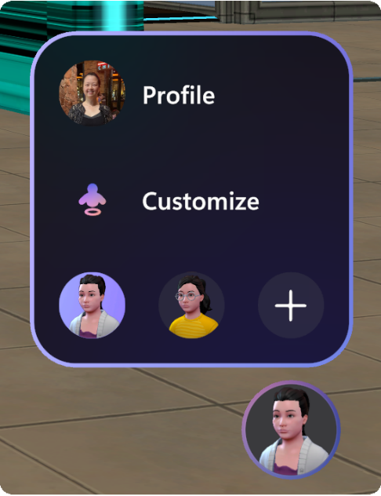
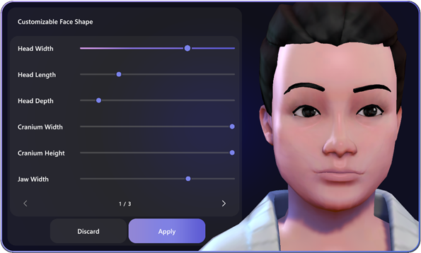
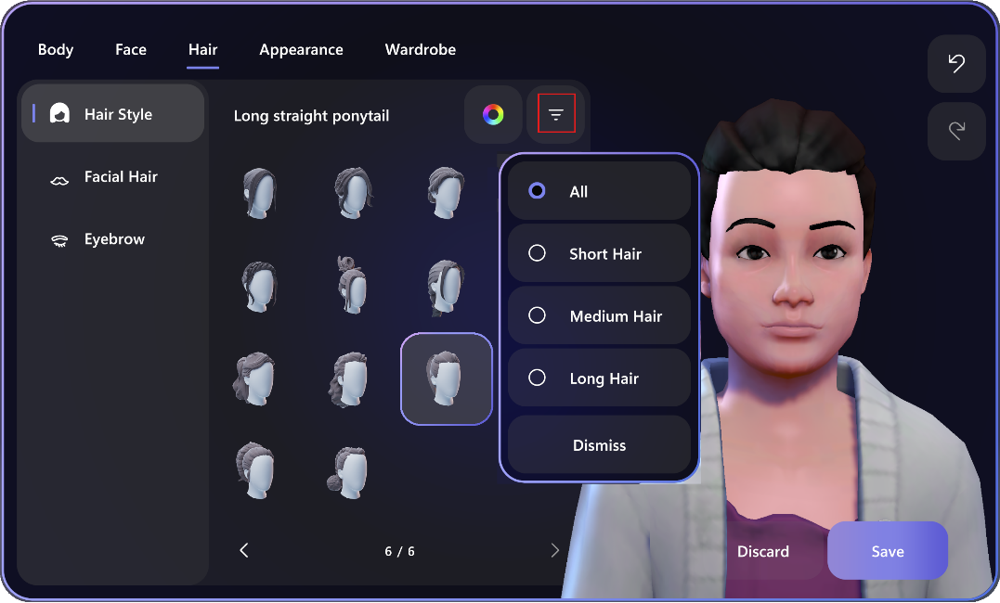

# Mesh user guide

## Introduction to Microsoft Mesh

Microsoft Mesh offers a host of powerful features that enhance
communication and collaboration in remote and hybrid workplaces. With
Microsoft Mesh, you can feel the presence of coworkers in shared
experiences on PC or Quest 2, collaborate in 3D environments, and
startup side-conversations with ease.

See *Introduction to Mesh.pdf* for more information.

## Mesh scenarios

Microsoft Mesh is made for corporate events wherein curated experiences
and specific environments can be made to serve business needs -- whether
serving external customers, creating for clients, or hosting internal
employee events.

## Key features

Check out the highlighted features of Mesh below:

- **Join Events from Microsoft Mesh PC app and Quest 2.** Microsoft
    Mesh can be accessed in 2D and 3D, bringing teams together to
    collaborate in environments with intuitive and natural human
    interaction.

- **Customize your avatar.** You can customize your own life-like
    avatars and express yourself with realistic facial features, body
    shapes, hair styling, makeup, and wardrobe.

    [See more details in the section named "Build your personalized
    avatar](#build-your-personalized-avatar)."

    

- **Spatial audio**. Users in events
    will hear other participants' voices depending on their distance and
    spatial orientation.

    Spatial audio allows multiple localized conversations to happen
    within the same environment. This provides a natural way to
    virtually socialize which isn't possible without the Mesh-powered
    online events.

## Prerequisites of Microsoft Mesh

For Microsoft Mesh to run on your system, you'll have to first meet
licensing, subscription, and the minimum PC hardware requirements.

## License or subscription requirements for Mesh

Ensure that you have proper licenses to access Mesh.

**Mesh Custom Worlds**

- Azure subscription with storage

*Need assistance? Contact your Microsoft partner for clarification.*

## Hardware requirements

- Minimum PC requirements: 4 CPU cores, 8Gb RAM

- Quest 2 Device for Mesh on Quest

# Getting started with Microsoft Mesh

Users of Mesh for Custom Worlds can access events through the Mesh app
with the following access points:

- [Mesh app for PC](#microsoft-mesh-app-for-pc)

- [Mesh for Oculus Quest 2](#microsoft-mesh-on-quest-2)

In this section, we'll show you how to download and install the Mesh app
on PC and the Meta Quest 2 devices.

## Microsoft Mesh app for PC

Download the Microsoft Mesh app on PC (codenamed **Project Napili**)
from the Microsoft Store for Business to access Events and to customize
your Avatar. Visit the link below:

[Project Napili -- Microsoft Store
Apps](ms-windows-store://pdp/?productid=9P0B5VMS9RTQ)

*If the above link does not work, please use [this
link](https://apps.microsoft.com/store/detail/project-napili/9P0B5VMS9RTQ?hl=en-us&gl=us).*

**Note:** If the app isn't available in the Microsoft Store, speak to
your Intune admin to make the app visible to you.

## Microsoft Mesh on Quest 2

Disclaimer

There may be problems with accessing your corporate data through the
Mesh app on Quest 2. To gain access to Meta enterprise support, check
your corporate security policies or contact your IT admin.

#### Mesh on Quest 2 available through App Lab

*Napili on the Quest store is deprecated in lieu of Mesh on Quest via
App Lab.*

If you had previously downloaded the **Napili** app on your Quest 2
device, you should move to the new app available at the link below.
**Napili** will be deprecated in lieu of the new Microsoft **Mesh
(Preview) app**.

Important: These features are still in Mesh TAP and usage is covered
under NDA. This link is only intended for Mesh TAP audiences and
shouldn't be shared outside of Mesh TAP.

1. On your PC, visit the link below to download Mesh on Quest 2.

    [Microsoft Mesh (Preview) on Oculus Quest 2 \|
    Oculus](https://www.oculus.com/experiences/quest/8919580184782498/)

If the URL doesn't work, use a new private window in your browser.

2. Sign in with your **Meta device account** (*not* your corporate AAD
    account). This could be your Meta ID, Facebook account, or another
    email.

    [Can't find your Meta account associated with your Quest 2
    device?](\l)
3. Once authenticated, select the **Get** button.

    
4. You'll see the button grey out and change from **Get** to
    **Purchased** which indicates that the app has been acquired.

    
    **Note:** You may need to restart your headset to ensure the app
    loads.

#### How do I find my Meta ID?

Log in to Oculus in a web browser, go to **Profile**, and get your
email.

1. Go to the Oculus login page on your web browser: [Log in with
    Facebook \| Meta](https://auth.oculus.com/login/)

2. Continue with your Facebook account or log in with your Oculus
    account.

3. It should bring you to your **Profile** page. If not, click your
    **Profile** icon in the top right corner.

    
4. Select **Profile**. From there you should see your Email.

#### Open Mesh on Quest 2

1. Start up your Quest. Use the Oculus button to open the dashboard menu.

2. Select the **App library** button.

    
3. Find the **Microsoft Mesh (Preview)** app in the App library.

    
4. Select** **to **Install** then **Open** the app by selecting it
    again**.**

5. Complete the device login flow using [the](This%20link) link below
    on your computer (*this requires a mobile phone for verification)*:

     <https://login.microsoftonline.com/common/oauth2/deviceauth>

    **Note:** If the code doesn't work, quit the Microsoft Mesh app and
    restart it.

    You'll see a window like this when the authentication is complete:

6. Select to **Allow** any **Terms of service & Allow Diagnostic
    data**.

7. As the app loads, you\'ll see the Mesh startup screen. It may load
    slowly but be patient. It will load eventually.

8. Accept the **Terms of service & Allow Diagnostic data**.

**Congratulations! You\'re all set to start using Mesh on Quest 2!**

## Build your personalized avatar

### Introduction to Avatars for Teams

Avatars for Microsoft Teams enables you to build connections in events
without turning your video on. Include more people in the
conversation--- whether they need a break due to video fatigue or just
feel more comfortable with their video off. Add a new layer of choice to
your events.

- **Choose how you're represented** --
    Select from hundreds of combinations to customize an avatar that
    represents your physical attributes, wardrobe, accessories, and
    more. Choose how you express yourself with reactions. Save up to
    three avatars for different event types, such as casual,
    professional, or day-to-day.

- **Build connections your way** -- In addition to joining an event
    with your camera on and off, you can also join with an avatar.
    Combat video fatigue and include more people in the conversation,
    even those who are less comfortable with their video on. Avatars for
    Microsoft Teams gives you that much-needed camera break while still
    allowing you to collaborate effectively.

- **Stay in Teams -** Available within the Microsoft Teams experience.
    Once your avatar is created, it's just a few clicks away.

## How to start customizing avatars

You can access avatar customization from the following entry points:

- Mesh app on PC

- Mesh app on Quest

You can create up to three different versions of your avatar to show off
your personas in Mesh experiences.

To create a new avatar, select **+** in the bottom right corner of your
Mesh App. 

You'll be asked to select a base avatar to start creating.

Select your desired avatar and click **Use Avatar**, and you're ready to
start customizing your avatar.

## Customizing your avatars

Once you're inside of an event, hover over your **profile bubble** and
select **Customize** to start customizing your avatar.

There's a horizontal toolbar with five options: **Body, Face, Hair,
Appearance,** and **Wardrobe.**

The initial screen shows you the **Body** section. Note there are three
buttons in the far left-side column: **Body Shape**, **Prosthetic**, and
**Skin tone**. For **Body Shape, Face Shape,** and other subsections, we
offer presets for quick customization. Users can fine-tune a preset by
clicking the **sliders** button.

### Avatar body shape

To the left of the avatar, there's a palette with various shape options.
Select any shape option to see how your avatar would look.  

**Note:** Selecting the **slider** button will customize your current
body shape. You can begin by selecting a body shape preset and click the
**slider** button to fine tune it.

#### To fine tune avatar Body Shape

1. Click the **sliders** button.

    
2. Drag the **sliders** for the various body areas to adjust their
    proportions. To see more options, use the arrows below the
    sliders.

    
3. Do one of the following:

    - If you're satisfied with your choices, click **Apply**.

    - If you want to abandon your choices, click **Discard**.

        Selecting either button returns you to the main **Body Shape**
        dialog box.

#### Adjust Skin Tone

Click the **Skin Tone** button in the **Body** tab. Select a tone or
adjust it with the slider at the bottom.

#### Change facial features

Select the **Face** tab and then the **Face Shape** option. Select one
of the default shapes and then click the **sliders** to customize facial
features.

We've added many facial features for fine-tuning with **sliders**, such
as **Cranium** width/height, **Cheek Bone** width and fullness, **Cheek
Fullness**, and so much more. These customizable options offer even more
precision when crafting your avatar. Be sure to click through each page
to see all the options for **Face Shape** customization!

Under the **Face** setting, the left menu bar shows the five
customizable subsections that are related to the face. Click the
**Eyes** button.

In the **Eyes** palette, select from various eye shapes until you have
the one you want. Select the **Custom Color Wheel** button and choose
your favorite eye color.

Tip:** *Select a color preset you like and use the slider bar at the
bottom to adjust for lightness or darkness**.***

You can continue to adjust facial features using similar steps in the
other sections in the left vertical menu, including **Nose**, **Mouth**,
and **Ears**. Choose a feature, select the one you want from the
palette, use the **sliders** to fine-tune, and then **Save** or
**Discard**.

#### Change Hair

Now go to the **Hair** section, where you can customize your avatar's
**Hair Style**, **Facial Hair**, and **Eyebrow(s)**. With **Hair
Style**, you can filter for short or long hair styles by clicking on the
filter button as shown below:

Once you've customized your avatar, click **Save.**

#### Change Appearance

Apply makeup and **wrinkles** to your face in the **Appearance** setting
by adjusting the following: **Lip Color**, **Blush**, **Eyeshadow**,
**Lashline**, **Face Lines**, or **Bindi**.

#### Change your wardrobe

In the **Wardrobe** section, you're provided a wide selection of **Underlayer**, **Outerwear**, **Headwear**, and **Eyewear** to dress your avatar.

### Useful customization tools

#### Filters

To help you quickly find your desired styles, filtering is available for
the **Hair, Underlayer, Outerwear,** and **Headgear** sections:

#### Zoom in/out and rotate your avatar preview

Within the avatar customizer, you can change your avatar's preview by
doing one of the following:

- With your left mouse button, click and drag to rotate your avatar
    preview to see how it looks from different angles.

- With the scroll wheel of your mouse, zoom in or out on your avatar
    preview.

**Congrats! Your unique personalized avatar is now ready to attend your
events.**

## Join an Event

### Mesh App

In the Mesh App on PC or Quest, you can attend social gatherings,
conferences, and all-hands events all within a wide selection of
Environments. In these events, you can view content, interact with
physical objects, and meet or network with your colleagues while
representing yourself with your personalized avatars.

Follow the steps below to see a list of events and join an event.

1. Open the Mesh App and view the Mesh Dashboard.\
    
2. In the horizontal menu bar at the top, select **Events**. This shows
    you a list of events you can join.

Hover the cursor over the Event, and then click the **Join now** button.
>
> 
3. A **Pre-join** dialog box will appear. You can now select your audio
    device from the **Pre-join** dialog.\
    \
    {width="4.342086614173228in"
    height="3.0695647419072616in"}\
    \
    and the **Devices** dialog box appears:\
    \
    {width="4.4003969816272965in"
    height="3.1498556430446194in"}\
    \
    **Note:** In the Mesh app on PC, the Windows default speaker will
    always be used by Mesh. You can change the speaker settings in the
    Windows **Settings** -\> **System** -\> **Sound settings** dialog
    box.

4. For upcoming events, you can view event details by clicking the
    **View Info** button.\
    \
    
### Teams Hub on Quest 2

If you're running the Mesh app on Quest, you can use the **Dashboard**
shown below to find and join your Teams events.

1. Open the Mesh app on Quest 2.

2. Log in with your corporate email account.

3. Select the **Teams hub** in the left-side navigation on the Mesh
    dashboard.

    
4. Select **Join event** or **Start event** on any of the events.

> Go through the Mesh pre-join screen to setup/select/customize your
> avatar and select **Join** when ready.

## Enjoy your event

You can now view content, communicate with other users, listen to guests
speaking, emote, and take selfies.\
\
You can interact with any games, puzzles, or interactive elements in the
event environment.

See the [Mesh UI & user controls](#_Mesh_UI_&) section to learn about
what you can do while in an event.

## Mesh UI & user controls

### Mesh Dashboard

The Mesh Dashboard displays all Mesh events available to you. The Mesh
Dashboard is the main interface you can use to explore what Mesh has to
offer.

The Dashboard is viewable using the Mesh App on PC or Quest.

#### Dashboard vertical navigation bar

On the left-side vertical navigation bar, there are mainly three types
of items. From here you can open the **Home** view, see your Teams
events, or browse and join event(s) and events in Mesh worlds that have
been set up by your IT admin.

The **Home** button at the top left shows you the events happening now
and upcoming events for all worlds you have access to.

Select a pinned world in the left-side vertical navigation to see events
for that specific world. All pinned worlds will be visible in this left
navigation beneath the **Home** button.

**Note:** On the Dashboard, the changes from upcoming to live events are
updated automatically in the **Events** view.

#### All Mesh Worlds

The **All Mesh Worlds** button can be found in the lower left corner of
the Dashboard. Use this button to explore Mesh worlds that are available
to you. Also, you can choose to **Pin** or **Unpin** a Mesh World to the
left vertical navigation bar of the Dashboard.

### Move around in your event

#### On PC

You can look around, walk, run, teleport around, or just sit at the
table with other avatars. To move around, press the **WASD** keys.

**Other keyboard controls:**

- **Q** to rotate left

- **E** to rotate right

- Press and hold on **W, S, A,** or **D** to leave your chair when
    sitting

- **C** to toggle between direct view and avatar view (1st and 3rd
    person views)

Here are some keyboard shortcuts for moving around in your event:

#### On your Quest headset

You can look around, walk, run, turn, teleport around, or just sit at
the table with other avatars all with the Quest controllers!

## Mesh controls overview

Now that you're in an event, explore the interface to see what controls
are available. To the left, we have the **System Menu** with
**Dashboard**, **Settings**, **Feedback**, and **Quit Mesh**. The app
bar in the middle holds the **Participants**, **Selfie**, and
**Reactions** buttons. The **Profile** button in the lower right corner
holds the **Customize** button for customizing your avatars.

### Adjust settings

The **Settings** menu helps you to set up the app according to your
preferences. There are many options available here. It can be accessed
directly from the bottom left menu button of the Mesh menu bar.

### Participants

The **Participants** button will show the number of participants in an
event.

### Avatar selfies and photos

Take a selfie of yourself with friends or snap a picture from the POV of
your avatar!\
\

**Note:** Avatars nametags are turned off by default when taking a photo
or selfie. You can still turn on the nametag by clicking on **...** in
the App bar.

Clicking on the photo icon in the menu will take you to the SharePoint
folder where your photos are stored.

### React with emotes

In the app bar, you can trigger **Reactions**, that cause your avatar to
react with body gestures as well as emotes.

### Profile

The **Profile** button in the lower right corner gives you access to
your personal details and avatar customization options.

Select **Customize** to fine tune your Avatar's appearance while in an
event!

### Nametag and contact card

To find out about another participant in your event, click the nametag
above an avatar, and then select the **Contact card** icon.

## Feedback for Mesh?

We would love for you to provide us with feedback and bug reports!

For documentation feedback, click this link: [*Mesh TAP Documentation Feedback*](https://forms.office.com/pages/responsepage.aspx?id=v4j5cvGGr0GRqy180BHbRzFnuK83QapOmAXDLf57ZE9UMzdVSlNDU0NRSFozSlNXWDBNSUhDNDYzQy4u).

For product feedback, use the **Feedback** button inside your Mesh
experience. This ensures that your feedback and bug reporting will be
triaged and incorporated quickly.

If you're not able to give feedback or report bugs using the
**Feedback** button in the Mesh App, you can chat with your Microsoft
partners in Teams, or contact your Microsoft partners directly.

## Known issues & limitations

Mesh is still in development, with new features and updates to existing
features ongoing. As an EAP partner, you may find that some features or
experiences are not polished or fully functional.

*See the latest Release Notes for details on new features, feature
updates, known issues, and resolved known issues.*

If you find new issues, file a bug, or speak to your Microsoft partners.

+-----------------------------------------------------------------------+
| This is a preliminary document and may be changed substantially prior |
| to final commercial release of the software described herein.         |
|                                                                       |
| The information contained in this document represents the current     |
| view of Microsoft Corporation on the issues discussed as of the date  |
| of publication. Because Microsoft must respond to changing market     |
| conditions, it should not be interpreted to be a commitment on the    |
| part of Microsoft, and Microsoft cannot guarantee the accuracy of any |
| information presented after the date of publication.                  |
|                                                                       |
| This onboarding documentation is for instructional purposes only.     |
| Microsoft makes no warranties, express or implied, in this document.  |
|                                                                       |
| Complying with all applicable copyright laws is the responsibility of |
| the user. Without limiting the rights under copyright, no part of     |
| this document may be reproduced, stored in, or introduced into a      |
| retrieval system, or transmitted in any form or by any means          |
| (electronic, mechanical, photocopying, recording, or otherwise), or   |
| for any purpose, without the express written permission of Microsoft  |
| Corporation.                                                          |
|                                                                       |
| Microsoft may have patents, patent applications, trademarks,          |
| copyrights, or other intellectual property rights covering subject    |
| matter in this document. Except as expressly provided in any written  |
| license agreement from Microsoft, the furnishing of this document     |
| does not give you any license to these patents, trademarks,           |
| copyrights, or other intellectual property.                           |
|                                                                       |
| © 2023 Microsoft Corporation. All rights reserved.                    |
|                                                                       |
| Microsoft, list Microsoft trademarks used in your white paper         |
| alphabetically are either registered trademarks or trademarks of      |
| Microsoft Corporation in the United States and/or other countries.    |
+=======================================================================+
+-----------------------------------------------------------------------+
