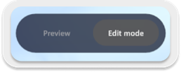
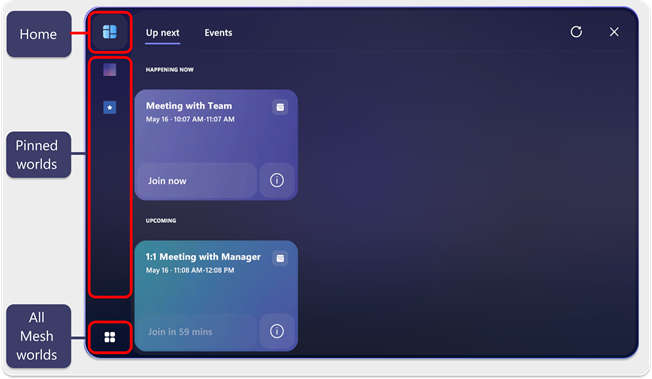
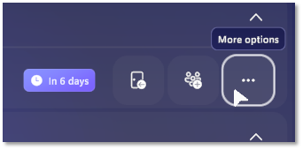
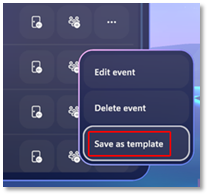
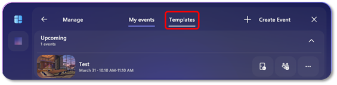

## Customize your event

Now that you've created your event, it's time to customize your event to add any run-of-show tools you'd like to use during your event. 

## Considerations before starting your event

### Customize before the event

To ensure the event runs smoothly, ensure that you customize the event
at least one hour before the event should start.

#### Provision Multiple Rooms before the Event

If you've chosen a Multiple rooms event, ensure that you've provisioned
your Multiple Rooms event at least 30 minutes before the event start
time.

*Provisioning is necessary to enable broadcasting between rooms as the event host.*

> [!TIP]
> **Who should customize an event?**
>
> Anyone with **Content contributor** privileges and invited to
> collaborate for an event can also customize an event. Do this with
> caution, knowing that any edits you make will affect the environment
> that event participants will join in.

## Event Producers tools

The major tools you'll use to produce your event are the:

- ([Control Panel](#prepare-content-with-the-control-panel)) -- control the elements you add
    to the environment with scripted sequences of events. Imagine a
    curtain raise to signal the start of the event!

- [Event templates](#event-templates) -- create a template of your event with all customizations that you add to reuse in future events

- [Environment editor](#add-content-with-the-environment-editor) -- add content to your environment like a video player.
    :::image type="content" source="../../media/mesh-event-producer-guide/image-environment-editor-video-player.png" alt-text="Video player showing while avatar is customizing it":::

## Add content with the Environment editor

Use the environment editor to add content to your environment that can be controlled during your run-of-show. 

1. Go to your pinned world, or search for it using the **All Mesh
    worlds** button.

1. . You will see the **Manage** button.

    

1. Click the **Customize event experience** button and enter the event.
Once you've joined, you can begin [adding content with the Control
Panel](#_Add_Content_with).

    

1. Click the **Join now** button.

1. Select the **Environment editor** button.
    :::image type="content" source="../../media/mesh-event-producer-guide/image-environment-editor.png" alt-text="Environment editor button in Mesh":::
1. Select the **+** button to open the Catalog of artifact you can add.
    :::image type="content" source="../../media/mesh-event-producer-guide/image-environment-editor-catalog.png" alt-text="Environment editor catalog of artifacts you can add to your event.":::
1. Browse the available artifacts that you can add then select one to add it.
1. Once you've added an artifact, you'll see it show up in the Artifacts window as shown below:
    :::image type="content" source="../../media/mesh-event-producer-guide/image-environment-editor-added-artifact.png" alt-text="Video player artifact shown in list of artifacts":::

    Note the **Copy**, **Edit**, and **Delete** buttons available for the selected artifact.

1. Now you can manipulate the artifact as you'd like by selecting it with your cursor, dragging it to another location, or using the edges of the artifacts to scale them as you see fit.
    :::image type="content" source="../../media/mesh-event-producer-guide/image-environment-editor-video-player.png" alt-text="Video player showing while avatar is customizing it":::

### Configure content controls for artifacts

Once you've added an artifact to the Artifact panel, you can select the artifact edit its controls.

1. Select an added artifact to open up the controls window.
    :::image type="content" source="../../media/mesh-event-producer-guide/image-environment-editor-open-controls-window.png" alt-text="Controls window showing for artrifact that hsas been added to an environment":::
1. Configure the controls for the artifact. For example, you can add the URL for your video:
    :::image type="content" source="../../media/mesh-event-producer-guide/image-environment-editor-URL-add.png" alt-text="Adding URL for a video to play during your event.":::

## Prepare content with the Control Panel

Use the **Control Panel** to prepare your artifacts to be used during an event. Like having a technical booth for theatrical technicians, it's designed to give the Event Producer the ability to orchestrate a performance in real time.

1. After you've joined the session, click
    the "Control panel" button.
    

    > [!NOTE]
    > Adding content takes place in **Edit mode**. 
    >
    > 
    >
    > You should be in this mode by default (look at the top/middle of the window).

1. Click the **+** button.

    

1. In the **Select content** window, select the artifact then select  **Add**. You will see it show up in the Control Panel.

    :::image type="content" source="../../media/mesh-event-producer-guide/Add-content-to-control-panle.png" alt-text="Select video player in to add it to the control panel for producing your event.":::

**Control Panel Notes**:

- For the playable content to be available, it must have been added to
    the original Unity project used to create the environment. If the
    environment contains no playable content, the **Select content**
    window will be empty. Reference the [Choose your journey](../Create/Getting%20started/choose-your-journey.md)
    to get started with adding custom content.

- For a VideoPlayer, the URL needs to be a publicly accessible
    webpage, or static hosted MP4.

- In the **Select content** window, select the content you want to
    add, and then click the **Add** button.

    The added content appears in the **Control Panel** window:

### Preview the live run of your event

Within a Customize event experience, open the Control Panel, then Toggle
to Preview Mode.

While in preview mode, you can test out using the control panel to play your video or interact with your content.

:::image type="content" source="../../media/mesh-event-producer-guide/Video-player.png" alt-text="Video playing while in preview mode in a customization session":::

When you're done configuring content for the event, you can exit the
customization session and it will automatically save your changes.

# Event templates

Now that you've created an event and customized it to your liking,
create an Event template! Event templates to easily reproduce curated
experiences in other events, saving time and effort. Create a template
once and use it again and again!

Simply use a custom or pre-created environment then add Event
integration features (via the Control Panel, Unity Timelines, and Unity
Video Player) to that event. That event can be saved and become a
Template, used across future events with no additional work needed.

## Manage events page

To manage your events, you must be in the Manage events page.

1. Go to your pinned world, or search for it using the **All Mesh
    worlds** button.

2. Once in your world, select **Event** in the top bar.

3. You will see the **Manage events** button.

## Create a template

1. In the left-side vertical button bar, click the icon of your World,
    or click the **All Mesh worlds** button to find your world.

    

2. In the horizontal menu bar at the top, click **Events**.

3. Click the **Manage Events** button.

4. Select the event you want to create a template of, and then click
    the **Options** button.

    

5. In the popup menu, select Save as template to save an event template
    with the same name as the event you selected.

    

## Deleting templates

1. Go to the **Manage Events** page.

2. Click the **Templates** tab.\
    

3. In the Template list, select the template you want to delete, and
    then click its Trash Can icon. This deletes the template for you and
    everyone in your world.

   > [!div class="nextstepaction"]
   > [Customize your event](produce-event.md)

   > [!div class="nextstepaction"]
   > [Event help](events-help.md)
