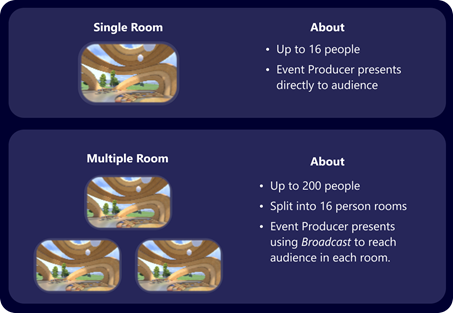
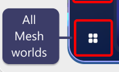
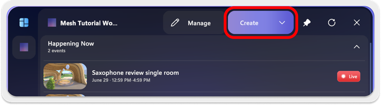
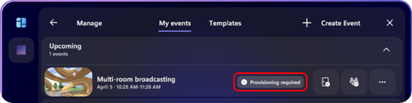
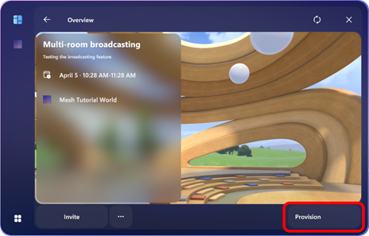
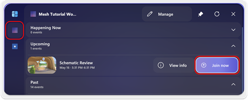
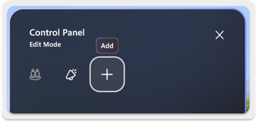
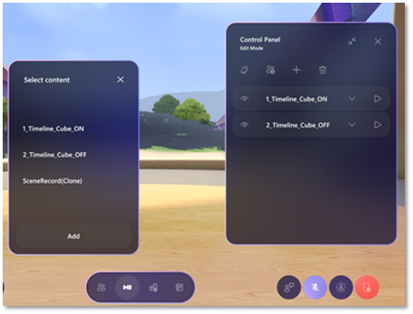

# Mesh events guide

# Event Producer Guide

Detailed instructions for setting up, managing, and producing events in Mesh.

## Introduction

This user guide is intended for the lead Producer or whoever is hosting
an event in Mesh. Events in Mesh are a great way to host an all-hands
meeting, social gathering, showcase, or training in the metaverse.

## Event production features

Mesh offers the following features for the Events attendance and
production:

- **[Event Creation](#events):** Users can now create and manage
    events in the Mesh app.

  - [**Single Room or Multiple room
        events**:](#single-vs-multiple-room-events) Host an event in a
        single room with 16 people or create a multi-room event with
        up-to 200 people overall, split into 16 person
        rooms.

  - [**Invite participants**](#to-invite-a-guest) to join your
        meeting in Mesh.

  - [**Invite collaborators**](#_To_invite_collaborators:) to help
        manage or customize the event.

- **[Event Production](#producing-your-event):** Use several host
    tools via the Control Panel to run the event.

  - **Broadcasting**: In the multi-room scenario, the Event Producer
        can broadcast to each room at the same time

  - **Megaphone:** Use the megaphone to make your audible to all
        participants.

  - **Mute All:** Mute the participants to hone focus in on what
        matters.

  - **Custom:** Control your customizations during a meeting to
        create a scripted experience and wow your audience.

- **[Event Customization](#customize-your-event):** Join event
    customization sessions with other Event Producers to create scripted
    experiences with custom component that are added by developers to
    the environment.

  - [**Customize event experience**](#customize-event-experience)
        allowing multiple Event Producers to simultaneously customize an
        immersive event experience.

  - **[Control Panel](#_Add_Content_with)** to create scripted
        events that you can trigger during a meeting.

  - Live Event playthrough of Unity Timelines & Video Players

- **[Event Templates](#_Event_templates):** Producers can use custom
    or pre-created environments for creating events, add event content
    via the Environment Editing Tools and Control Panel, then save it as
    a Template for use in future events. The content elements added or
    removed from the Control Panel will be saved in your Template but
    still require manual execution.

- **Custom environments:** A custom environment with features created
    using the Mesh Toolkit, including Event content integration
    features. See *"Get started with Mesh environments.pdf" for
    developer guidance.

    *Event content integration added to custom environments are exposed
    to event producers (with content contributor privileges) in a Mesh
    event customization session. These can then be controlled and reused
    by event producers in events. All these are configured via the
    Control Panel, saved as a template, and used in any future events.*

## Prerequisites for producing events

### Content contributor Role in Azure

To create, manage, or customize events for a Mesh world, your account
must be added as a Content contributor. Speak to your Azure or IT Admin
to get added as a Content contributor for a Mesh world if you haven't
been already. "*Mesh IT Admin Guide.pdf"*

### Create the event or be invited to collaborate on it

To create, manage, or customize events you must have created the event
yourself or be a collaborator for the event.

## Mesh dashboard overview

The dashboard home is where all Mesh content and experiences live. From
here, you can **discover** events, go to your favorite worlds that
you've **pinned**, or explore **all worlds**.

## Events

Create an event to host a Mesh experience! Once an
event is created in a World, people with access to the world will see
the event in Mesh. Creating an event is the first step. Then you can
invite people to collaborate as hosts or designers and customize the
event.

## Single vs Multiple room Events

You can host a single room event with 16 people, or multiple room event
with up to 200 people, split into 16 person rooms.

## Create an event

1. Open the Mesh app and login with an account that has
    Content contributor privileges to create and manage events.

2. In the left-side vertical button bar, click the icon for your World,
    or or click the [**All Mesh worlds**
    button](#mesh-dashboard-overview) at the bottom left and then select
    the world you want.

    

    > [!NOTE]
    >
    > You may have to scroll to view all the worlds.

    > [!TIP]
    > You can pin worlds to the left nav bar for easy access!
    > 

3. In your Mesh world, select the **Create** button.

    

    > [!IMPORTANT]
    > If you don't see **Manage** or **Create**, then you aren't a [Content contributor](#content-contributor-permissions) for this world. Please speak to your IT Admin to get Content contributor privileges.

4. Add your event details (**Name**, **Date**, **Time**,
    **Description**, etc.). 
5. Choose your Room settings: **Single room** or **Multiple Rooms.**

    

    > [!NOTE]
    > **If you choose Multiple room:**
    >
    > - You must fill in the Room capacity and Total participants fields.
    >
    > - You must [provision your meeting](#multiple-rooms-event). Detail provided after this section.

6. When **you're** finished, click **Next**.

7. On the **Template** page, this is where you can reuse any event
    templates that you create. If you choose a template, skip step 8.
    Otherwise, press **Skip** to select an Environment.

     

8. On the **Environment** page, select an environment, and then click
    **Next**.

    You can choose from a set of Default Environments or use a Custom
    Environment Template. Default environments are pre-made to suit your
    meeting. Custom environments are made in Unity and uploaded to Mesh.

     [Learn more about Environments](#_Key_terminology)

     

    See the [Choose your journey](../Create/Getting%20started/choose-your-journey.md) article
 to learn how to create a custom environment.

9. Review your event details. Click **Back** if you need to change
    anything.

10. Click **Create Event**. This saves your event and takes you to the
    **Manage Events** page.

     

**Congrats! Let's manage your event by inviting participants and
inviting others to collaborate!**

## Manage an event

There are several things you can do at least **one hour** **before** you
start your event:

- Edit event details

- Invite collaborators

- Invite participants

- Customize the event

- Provision the event (in multiple room events)

*You must complete any of these actions before your event. Once a guest
joins the event, you won't be able to customize your event anymore.*

**Open the Manage event page:**\
\

On the **Manage Events** page, you can invite guests to your event, edit
event details, or join the event. Everything but the environment and
room/session scale can be edited.

### Invite guests or collaborators

The participants you can invite fall into two categories:
*collaborators* and *guests*.

- A *guest* is only allowed to participate in an immersive event.

- A *collaborator* can create, configure, and manage an event, but
    must have Content contributor privileges provided by an IT Admin in
    Azure.

 [Learn more about Content contributor
 privileges](#content-contributor-permissions)

#### To invite a guest

1. Click the **Invite** button ...

    

    ... and then select **Invite Guests**.

2. On the **Invite Guests** page, add your guests to the **Search for
    people** text box.

    > [!NOTE]
    >
> You can add names individually or copy and paste a comma-delimited
> list of email addresses. Single room environments can have 16 while
> multiple room environments can have up to 200 total participants.

    Having issues with adding guests in bulk?

    [See discussion on adding guests](#adding-guests-to-events-in-bulk)

3. If there are any invalid emails, search for them and remove them.
    When you've finished adding names and all invitees are valid, click
    **Send**.

    

**These invitees will now see the event in Mesh. Great job! Invite some
collaborators to help you invite people or customize the event with
in-experience tools.**

#### To invite collaborators

1. Click the Invite button and then select **Edit Collaborators**.

2. On the **Invite Collaborators** page, add your guests to the
    **Search for people** text box. You can add names individually or
    copy and paste a list. The maximum number of participants is 15.

### Edit or delete

#### To edit your event details

1. Click the **Options** button.

    
2. In the popup menu, select **Edit details**.

3. On the **Details** page, change any of the details as needed, and
    then click the **Next** button.

4. On the **Review** page, review your new details, and then click the
    **Update Event** button.\
    \
    **Note**: It may take a minute or two for the Events list to
    refresh.

#### To delete your event

1. Click the **Options** button.

    
2. Select **Delete**.

3. In the dialog that appears, click the **Confirm** button.

### Multiple Rooms event

If you choose a multiple rooms event, there's one more step you must
take before you run a meeting.

#### Provision your event

You must provision your event **at least 30 minutes before** the meeting
starts. This initiates all setup on the backend to ensure your multiple
rooms event goes smoothly.

**Open the Manage event page:**

1. In the Manage events page, your Multiple Rooms event will show a
    **Provisioning required** note:

     

2. Select the event to access the **Overview** page, then select the **Provision button**.

    

    > [!IMPORTANT]
    >
> You may need to select Provision a few times. Please re-select **Provision** if you've refreshed the event and it still shows Provision instead of Provisioned.

3. While provisioning, the button will
    show **In Progress**.

    

4. Refresh the event periodically to ensure that provisioning was
    completed. You may need to Provision again if the button shows
    **Provision**. Once it shows **Provisioned,** as shown below, you're
    ready to host your event!

    

## Start your event

Now that you've created your event, invited participants, and edited the
event settings, the event should be ready for participants to join.
Great job!

Invitees should see the event in Mesh and be able to join close to the
event start time.

### Considerations before starting your event

#### Customize before the event

To ensure the event runs smoothly, ensure that you customize the event
at least one hour before the event should start.

Jump to [Customize your event](#customize-your-event) to begin using the
powerful Event Producer tools!

#### Provision Multiple Rooms before the Event

If you've chosen a Multiple rooms event, ensure that you've provisioned
your Multiple Rooms event at least 30 minutes before the event start
time.

*Provisioning is necessary to enable broadcasting between rooms as the
event host.*

See the [Provision Multiple Rooms event](#provision-multiple-rooms-before-the-event) section for more
info.

### Just start

All event participants should be able to find the event by going to your
Mesh world **Events** tab.

1. Go to your Mesh world, then select **Join now.**

     

 **Great job! Continue reading below to produce your event!**

## Producing your event

Once you've joined your event, you'll have
access to a few tools to help produce the event:

- **Host Panel.** A toolbar and panel with common tools to facilitate
    meetings.

- **Control Panel.** A panel to play animations or prompted
    transitions between in the event.

Use the **Control Panel** to access production tools like **Broadcast**,
**Megaphone**, **Mute All** buttons.

## Host panel

The host panel is the main panel for managing interactions, hand-raises,
and broadcasting,. inc

### Host controls in the Control Panel

In the Control Panel, you'll see the following buttons:

#### Broadcast

In a multiple room event, broadcasting will show your Avatar to all
other rooms in the event. To start, select the broadcast button, then
select **Start broadcast**. To stop broadcasting, select the broadcast
button again, then select **End** **broadcast**.

> [!NOTE]
> If your event is not Provisioned for broadcasting, you'll receive a pop-up that says "Unable to Start Broadcast. Your event must be provisioned to enable broadcasting. Please provision your event to proceed."*

*The admin who provisions the event must exit the event to provision
again.*

When broadcasting, other participants will see a broadcasting icon next
to your nametag above your Avatar.

#### Troubleshooting broadcasting

If new joiners are still not seeing/hearing you, there are a few
troubleshooting steps you can take to help.

1. **One host.** Please stop your broadcast and then restart the
    broadcast. The problem should be corrected in 2-3 attempts.

2. **Multiple hosts.** The first host should STAY broadcasted. A second
    host should start broadcasting. The second host can stop
    broadcasting once everyone sees and hears the first host.

#### Megaphone

Use **Megaphone** to make your voice audible to all participants in the
event.

### Mute All

Use **Mute Al**l to bring attention to your voice and mute all other
participants.

 
Use these tools to help produce your event and explore the [Customize
your event](#customize-your-event) section to see how the Control Panel
can be expanded to control scripted experiences in Events.

### Customize your event

If you have a custom environment created Unity, there may be components
you can add to the environment that you can control as an event
producer.

Make your event your own! Create a scripted sequence that you control
for your event -- think props for pizazz or a curtain opening to start
the show.

**Event Producers tools:**

- [Control panel](#_Add_Content_with) -- control the elements you add
    to the environment with scripted sequences of events. Imagine a
    curtain raise to signal the start of the event!

- [Event templates](#_Event_templates) -- now that you've created a
    custom event, create a template to reuse your work in future events.

Note: We recommend customizing an event at least one hour before the
event is scheduled to ensure a smooth experience.

> [!TIP]
> **Who should customize an event?**
>
> Anyone with **Content contributor** privileges and invited to
> collaborate for an event can also customize an event. Do this with
> caution, knowing that any edits you make will affect the environment
> that event participants will join in.

> [!IMPORTANT]
> Please ensure that you are supposed to customize the
> event before proceeding.

#### Open the Manage events page

**Important!** If you don't see **Manage**, then you aren't a [Content
contributor](#content-contributor-permissions) for this world. Please
speak to your IT Admin to get Content contributor privileges.

1. Go to your pinned world, or search for it using the **All Mesh
    worlds** button.

2. You will see the **Manage** button.

#### Customize event experience

Click the **Customize event experience** button and enter the event.
Once you've joined, you can begin [adding content with the Control
Panel](#_Add_Content_with).

**Now that you've joined the event customization experience it's time
to start customizing!**

## Add Content with the Control Panel

Use the **Control Panel** to access the core set of tools that enable
you to set up, customize, and trigger specific show-elements in your
events. Like having a technical booth for theatrical technicians, it's
designed to give the Event Producer the ability to orchestrate a
performance in real time.

1. On the **Manage Events** page, select the **Customize event
    experience** button for the event you wish to customize and
    collaborate on.

    
2. Click the **Join now** button.

3. After you've joined the session, click
    the "Control panel" button.
    

    > [!NOTE]
    >
>     Adding content takes place in **Edit mode**. 
>
> 
>
> You should be in this mode by default (look at the top/middle of the window).

4. Click the **+** button.

    

5. In the **Add items** window, click the **Content** entry.\
    This opens the **Select content** window. You can add playable
    content such as *Unity Timelines and Video Players*.

    

**Control Panel Notes**:

- For the playable content to be available, it must have been added to
    the original Unity project used to create the environment. If the
    environment contains no playable content, the **Select content**
    window will be empty. Reference the [Choose your journey](../Create/Getting%20started/choose-your-journey.md)
    to get started with adding custom content.

- For a VideoPlayer, the URL needs to be a publicly accessible
    webpage, or static hosted MP4.

- In the **Select content** window, select the content you want to
    add, and then click the **Add** button.

    The added content appears in the **Control Panel** window:

### Configure the content controls for a Timeline

1. Select the **Play** button for the Timeline.

2. Select or deselect **Scale animation**.

    

### Configure the content controls for a Video Player

1. In the Select content window, choose CentralVideoScreen and click
    Add.\
    \
    

2. Once the **CentralVideoScreen** is in your Control panel, click the
    text button to input a URL for a static hosted MP4 file.\
    
3. Press the **Play** button to view your content.

    Note: To control the volume, use the volume slider found in the
    expanded dropdown for the item on the Control Panel.**\
    **

### Preview the live run of your event

Within a Customize event experience, open the Control Panel, then Toggle
to Preview Mode\

When you're done configuring content for the event, you can exit the
customization session and it will automatically save your changes.

### Producing Live with Configured Content

1. At the start time of your event, join the event.

2. Open the **Control Panel** (it defaults to Live Mode).

3. View your content in the order in which you set it.

4. Play through each item to confirm that the configurations appear as
    you've defined them in your customize event experience.

### Show or Hide Elements

The **Show/Hide** option can eliminate distractions and help the Event
Producer focus on only the elements being used in the show.

**To show or hide an element in the Control Panel:**

1. Ensure that you're in **Edit Mode**.

2. Click the **eyeball icon** to the left of the element name.

**Show:**

**Hide:**

**Note**: Hidden elements aren't deleted from your list, but are hidden
from view while in **Live Mode**.

## Event Production Best Practices

Here are things you need to look out for throughout this process:

1. Don't have multiple producers editing the Control Panel
    simultaneously; the edits may be overwritten.

5. For smooth event production, we recommend that you complete all
    edits at least one hour before showtime. Last minute edits can cause
    problems for your performance.

 **We hope you enjoy the Mesh Producer Experience!**

# Event templates

Now that you've created an event and customized it to your liking,
create an Event template! Event templates to easily reproduce curated
experiences in other events, saving time and effort. Create a template
once and use it again and again!

Simply use a custom or pre-created environment then add Event
integration features (via the Control Panel, Unity Timelines, and Unity
Video Player) to that event. That event can be saved and become a
Template, used across future events with no additional work needed.

## Manage events page

To manage your events, you must be in the Manage events page.

1. Go to your pinned world, or search for it using the **All Mesh
    worlds** button.

2. Once in your world, select **Event** in the top bar.

3. You will see the **Manage events** button.

## Create a template

1. In the left-side vertical button bar, click the icon of your World,
    or click the **All Mesh worlds** button to find your world.\
    

2. In the horizontal menu bar at the top, click **Events**.

3. Click the **Manage Events** button.

4. Select the event you want to create a template of, and then click
    the **Options** button.\
    \
    
5. In the popup menu, select Save as template to save an event template
    with the same name as the event you selected.\
    \
    

## Deleting templates

1. Go to the **Manage Events** page.

2. Click the **Templates** tab.\
    
3. In the Template list, select the template you want to delete, and
    then click its Trash Can icon. This deletes the template for you and
    everyone in your world.

# Discussion

Further detail on various topics to dive deeper or understand topics
better.

## Content contributor permissions

To create, manage, or customize events for a Mesh world, your account
must be added as a Content contributor. Speak to your Azure or IT Admin
to get added as a Content contributor for a Mesh world if you haven't
been already. "*Mesh IT Admin Guide.pdf"*

## Adding guests to events in bulk

There are some known limitations with adding guests in bulk. We are
working on a resolution. For now, keep these things in mind while adding
guests:

- **Tenant only (work emails only, for example).** You are limited in
    who you can invite to a Mesh meeting by who is in the tenant that
    you are in. In other words, you are only able to invite people with
    a similar email to you. Otherwise, Mesh will not be able to find the
    email in the backend and invite them.

 *For example, you can only invite people with an \@EmailForWork.com
 email:*

 Event Producer email: <eventproducer@EmailForWork.com>

 Invitee emails: <invitee@EmailForWork.com>

- **Try to clean up copy/pasted list of emails.** If your emails are
    copy/pasted with unique formatting, Mesh may not be able to
    determine what the emails are. Please only separate emails by commas
    (,) when pasting them.

 *Incorrect:*

 \<\[<Person1@EmailForWork.com>\]\, \<\[<Person2@EmailForWork.com>\]\,
 ... , ...

 *Correct:*

 <Person1@EmailForWork.com>, <Person2@EmailForWork.com>, ... , ...
 []{#_Key_terminology .anchor}

# Key terminology

+----------------+-----------------------+----------------------------+
| **Term**       | **Description**       | **Images to help**         |
+================+=======================+============================+
| **Mesh app**   | The standalone app    |  |
|                |                       |                            |
|                |                       |                            |
|                |                       |                            |
+----------------+-----------------------+----------------------------+
| **Home         | Accessed through the  | {wi |
|                |                       | dth="0.5801531058617673in" |
|                |                       | heig                       |
|                |                       | ht="0.5801531058617673in"} |
+----------------+-----------------------+----------------------------+
| **Template**   | Reusable event        | {w   |
|                | template that can be  | idth="2.438850612423447in" |
|                | configured/customized | heig                       |
|                | then applied to new   | ht="0.5643077427821522in"} |
|                | events.               |                            |
|                |                       |                            |
|                | This could include:   |                            |
|                |                       |                            |
|                | -   Environments for  |                            |
|                |     meetings          |                            |
|                |                       |                            |
|                | -   Settings for      |                            |
|                |     meetings          |                            |
|                |                       |                            |
|                | -   Control panel     |                            |
|                |     scripts or other  |                            |
|                |     enhanced features |                            |
+----------------+-----------------------+----------------------------+
| *| The physical space    | {wi  |
|*Environment**| that events take      | dth="2.4327055993000877in" |
|                | place in, such as a   | heig                       |
|                | large conference room | ht="1.1854811898512685in"} |
|                | or a roundtable       |                            |
|                | meeting room.         |                            |
+----------------+-----------------------+----------------------------+
|**Control      | The core set of tools | {w   |
| Panel**        | that enable you to    | idth="2.932703412073491in" |
|                | set up, customize,    | heig                       |
|                | and trigger specific  | ht="1.0302066929133857in"} |
|                | show-elements in your |                            |
|                | events.               |                            |
+----------------+-----------------------+----------------------------+
