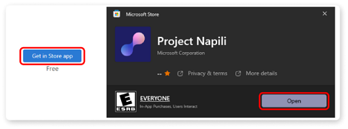

# Getting started with Microsoft Mesh

Users of Mesh for Custom Worlds can access events through the Mesh app
with the following access points:

- [Mesh app for PC](#microsoft-mesh-app-for-pc)

- [Mesh for Oculus Quest 2](#microsoft-mesh-on-quest-2)

Here's how to download and install the Mesh app on PC and the Meta Quest 2 devices.

## Microsoft Mesh app for PC

Download the Microsoft Mesh app on PC (codenamed **Project Napili**)
from the Microsoft Store for Business to access Events and to customize
your Avatar. Visit the link below:

   > [!div class="nextstepaction"]
   > [Project Napili -- Microsoft Store Apps](https://apps.microsoft.com/store/detail/project-napili/9P0B5VMS9RTQ)

>[!Note]
>If the app isn't available in the Microsoft Store, speak to
your Intune admin to make the app visible to you.

## Microsoft Mesh on Quest 2

>[!Important]
>There may be problems with accessing your corporate data through the
Mesh app on Quest 2. To gain access to Meta enterprise support, check
your corporate security policies or contact your IT admin.

### Mesh on Quest 2 available through App Lab

If you had previously downloaded the **Napili** app on your Quest 2
device, you should move to the new app available at the link below.
**Napili** will be deprecated in lieu of the new Microsoft **Mesh
(Preview) app**.

1. On your PC, visit the link below to download Mesh on Quest 2.

    > [!div class="nextstepaction"]
    > [Microsoft Mesh (Preview) on Oculus Quest 2 \| Oculus](https://www.oculus.com/experiences/quest/8919580184782498/)

    If the URL doesn't work, use a new private window in your browser.

2. Sign in with your **Meta device account** (*not* your corporate AAD
    account). This could be your Meta ID, Facebook account, or another
    email.

    [Can't find your Meta account associated with your Quest 2
    device?](\l)

    

3. Once authenticated, select the **Get** button.

    

4. You'll see the button grey out and change from **Get** to
    **Purchased** which indicates that the app has been acquired.

    

    >[!Note] 
    >You may need to restart your headset to ensure the app
    loads.

#### How do I find my Meta ID?

Log in to Oculus in a web browser, go to **Profile**, and get your
email.

1. Go to the Oculus login page on your web browser: [Log in with
    Facebook \| Meta](https://auth.oculus.com/login/)

2. Continue with your Facebook account or log in with your Oculus
    account.

3. It should bring you to your **Profile** page. If not, click your
    **Profile** icon in the top right corner.

   

4. Select **Profile**. From there you should see your Email.

#### Open Mesh on Quest 2

1. Start up your Quest. Use the Oculus button to open the dashboard menu.

2. Select the **App library** button.

    

3. Find the **Microsoft Mesh (Preview)** app in the App library.

    

4. Select to **Install** then **Open** the app by selecting it
    again.

5. Complete the device login flow using the link below on your computer (*this requires a mobile phone for verification*): https://login.microsoftonline.com/common/oauth2/deviceauth

    >[!Note] 
    >If the code doesn't work, quit the Microsoft Mesh app and restart it.

    You'll see a window like this when the authentication is complete:

    

6. Select to **Allow** any **Terms of service & Allow Diagnostic data**.

7. As the app loads, you\'ll see the Mesh startup screen. It may load slowly but be patient. It will load eventually.

8. Accept the **Terms of service & Allow Diagnostic data**.

**Congratulations! You\'re all set to start using Mesh on Quest 2!**

## Next steps

   > [!div class="nextstepaction"]
   > [Join an event](join-an-event.md)

   > [!div class="nextstepaction"]
   > [Create an event](events-guide/create-event.md)