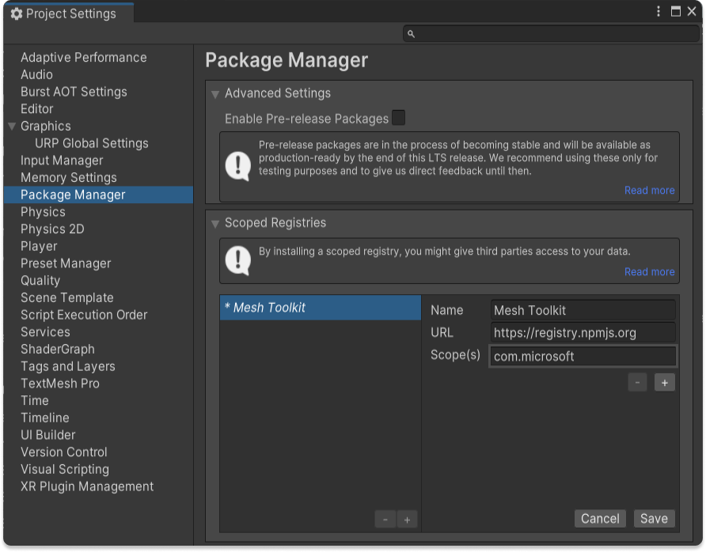
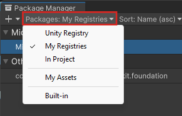

# Add the Mesh toolkit package

With the Mesh toolkit package installed in Unity, you can use your 3D world-building skills to create fully customized multi-user 3D experiences. Mesh itself does the heavy lifting to enable engagement in 3D environments by handling the avatar system, Spatial Audio, and multi-user synchronization, but you have control over environment development, iteration, performance optimization and publishing through the Mesh toolkit. If you're already an intermediate to advanced Unity user, you can build environments in a familiar way and leverage existing scenes and assets to create Mesh experiences. You can add interactive content, insert logic, integrate with business data, or infuse AI--all with physics and interaction tools that you can leverage out-of-the-box.

When you install the Mesh toolkit, it does the following:

- Adjusts your Unity project's settings to match Mesh. This modifies several files in the *ProjectSettings* folder (for example, *GraphicsSettings.asset*).
- Ensures that OpenXR is enabled and adjusts the XR settings. To see these settings, on the menu bar, select **Edit** > **Project Settings** > **XR Plug-in Management**.
- Ensures that *TextMeshPro* is configured and sets its default font to "Segoe UI Fluent Semibold SDF".

**To add the Mesh toolkit package(s) to your Unity project**:

1. Open your Unity project, and then on the menu bar, select **Edit** > **Project Settings** > **Package Manager**.

1. Add a scoped registry with the following details:

   - **Name:** Mesh Toolkit

   - **URL:** https://registry.npmjs.org

   - **Scopes(s):** com.microsoft

   

1. Click the **Save** button.
1. Close the **Project Settings** window, and then, on the menu bar, go to **Window** > **Package Manager**.

1. In the toolbar, click the **Packages** dropdown and then select **My Registries**.

   

1. In the list, you'll see the stable and preview build of the **Microsoft Mesh Toolkit**. 

    Select **Microsoft Mesh Toolkit** (the full package name should be **com.microsoft.mesh.toolkit**, as highlighted in the image below) and then click the **Install** button.

    :::image type="content" source="../../media/build-your-basic-environment/002-mesh-toolkit-in-package-manager.png" alt-text="A screenshot of the Unity package manager showing details of the preview Mesh toolkit.":::

When the spinner animation next to the package list stops, the package has finished downloading.

## Microsoft Mesh preview

In addition to the stable release builds, we offer a preview build and preview toolkit. These are ideal for developers who want to test out upcoming features and prepare in advance for the next public build. The preview toolkit and preview build of Microsoft Mesh should be used together.

We promote the preview build to the stable public build at regular intervals. As of November 2023, this happens every three weeks. If you downloaded the Mesh toolkit through the Package Manager in Unity, you should have both the Preview and Stable build.

:::image type="content" source="../../media/build-your-basic-environment/003-mesh-toolkit-preview.png" alt-text="A screenshot of the Unity Package manager showing the Mesh toolkit.":::

> [!Caution]
> Take caution when developing with the preview release of the Mesh toolkit. Environments published with this preview version of the Mesh toolkit will only work with the preview version of Mesh, and **are not compatible with the stable version of Mesh**.
>
> **Be careful not to overwrite stable environments currently in use by your company with environments using the preview toolkit.**

**To download the latest Mesh toolkit or preview version via GitHub**:
See the [Mesh Toolkit for Unity | GitHub](https://github.com/microsoft/Mesh-Toolkit-Unity/releases).

## Next steps

> [!div class="nextstepaction"]
> [Building for single and multiple platforms](build-for-single-and-multiple-platforms.md)
