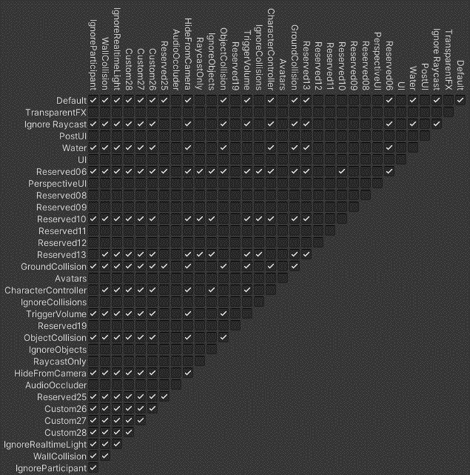
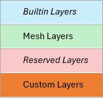
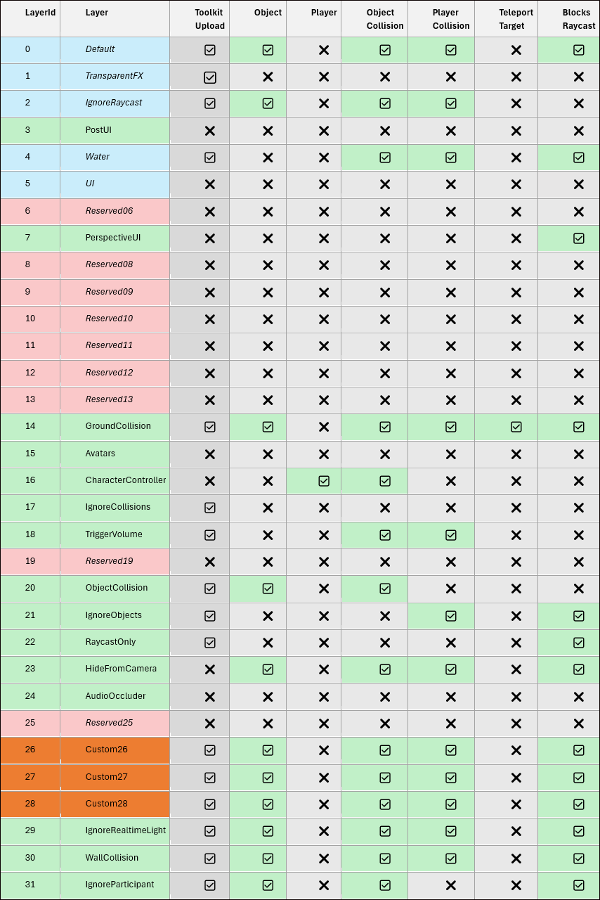

# Configuring for avatar movement and teleportation

## Overview

In order for Mesh avatars to move around and teleport in your experience successfully, it's important to follow certain design guidelines. This article contains information on how to set up surfaces for movement and teleportation, tips for things such as avatar movement limits and collider design, and a detailed section about Layers.

## Avatar movement guidance

A scene should have Colliders for the avatar to walk and teleport on. In general, a low poly Mesh Collider that tightly fits the visual geometry will produce the best results. Box Colliders work great for trivial scenarios, but can result in some problems such as causing the avatar to get stuck on the corners or defeat step height limits.

### Mesh avatar movement limits:

Maximum walkable slope: <45 degrees  
Maximum step height: 0.3  
Avatar capsule radius: 0.3  
Avatar capsule height: 2  
Avatar height: 1.8

### Suggestions for best results:

- Align the collision surfaces with the visual surfaces that the avatar will walk on. This is important in order to avoid issues with the avatar's position relative to the visual surface (to prevent floating or clipping).

- Rounded corners help smooth out avatar movement and prevent the avatar from getting stuck.

- To block avatar movement, use steep slopes or a height much larger than the maximum step height.

    - Modify the shape of your colliders to create surfaces that are naturally difficult or impossible for the avatar to traverse. For instance, use a Mesh Collider with an irregular shape that doesn't provide a flat surface or walkable slope for the avatar to stand on.

    - In some cases a Capsule Collider or similar rounded shape on objects or areas the avatar shouldn't walk on may suffice. These shapes are unwalkable if the slope is steep enough and will cause the avatar to slide off.

## Collision Layers

Interactable objects are GameObjects with a non-trigger collider and corresponding visual geometry on one of the object colliding layers. Avatars can walk and be positioned onto objects with non-trigger colliders, so be mindful of which layer is being used.

To have accurate avatar positioning and teleportation, scene colliders need to be on the appropriate layers. The local user's avatar will interact with (collide with and walk on) any colliders on the layers that support these interactions.

When the avatar is positioned or teleported, it's important that the avatar collides with a "ground" object and is consistently placed at the same height above the ground (this is called "grounding"). If no ground is detected, the avatar will fall. This is acceptable if above ground (there's no falling damage!), but if the avatar is placed below the "ground" object, the avatar might fail to register a collision with that object, causing it to fall out of the environment and respawn. If the avatar penetrates the ground during repositioning, it will be grounded.

All the avatars in a session should be at a consistent height. The avatar position is adjusted if its height changes out of range. For example:

- A VR user physically goes to and from a seated or standing position. The HMD movement causes the avatar in the scene to penetrate the ground or be standing much higher vertically than other avatars.

- A poorly configured visual script teleports the avatar into a position that they don't fit or is vertically too low.

Another reason this is important is that when the avatar physics update, if the avatar isn't grounded, it will jump into position as a result of its capsule colliding with the ground and yanking the avatar into the new position.  This is especially impactful for HMD users because unnatural movements like this can be nausea-inducing.

**Layers the avatar interacts with and can walk on:**

0  - Default  
2  - Ignore Raycast  
4  - Water (only trigger colliders allowed, not walkable)  
14 - GroundCollision (teleportable)  
18 - TriggerVolume (only trigger colliders allowed, not walkable)  
21 - IgnoreObjects  
26 - Custom26  
27 - Custom27  
28 - Custom28  
29 - IgnoreRealtimeLight  
30 - WallCollision

[Learn more about Layers in a Mesh project](#layers-in-detail).

## Supporting teleportation

For a scene to support teleportation, teleportable surfaces (for example, the floor or the ground) must have colliders on the *GroundCollision* layer. There are other walkable layers, but only *GroundCollision* is teleportable. Visual geometry isn't teleportable and shouldn't be on the *GroundCollision* layer; only Colliders can be on that layer. Improper or inconsistent layering and collision can cause undesirable effects when teleporting or finding the ground.

**A teleportable surface must meet the following conditions:**

- It must have some type of non-trigger Collider attached (for example, a Mesh Collider or Box Collider).  
- Its **Layer** must be set to *GroundCollision*.

Be cautious of low ceilings or tunnels; these could potentially affect avatar grounding and teleportation. For example, avatar physics or the teleport arc may intersect or interact with the collider above them. The height from ground to roof for a traversable area should be more than the 2m avatar capsule height. There needs to be a small buffer of space above the avatar's head, especially if the roof is sloped instead of flat.

The locomotion physics provide smooth avatar movement with all participant interactable colliders and prevent the penetration of areas that are too small for avatar collision. However, rogue ground collision or problematic environment geometry such as wedge shapes or very narrow spaces can potentially cause the avatar or the camera to penetrate objects or get stuck. It's essential that you thoroughly test all walkable and teleportable surfaces.

## Layers in detail

### Object Layers

When a GameObject has a non-trigger collider, it will collide with other objects if it's on one of the object layers.

0  - Default  
2  - Ignore Raycast  
4  - Water (only trigger colliders allowed)  
14 - GroundCollision  
18 - TriggerVolume (only trigger colliders allowed)  
20 - ObjectCollision  
26 - Custom26  
27 - Custom27  
28 - Custom28  
29 - IgnoreRealtimeLight  
30 - WallCollision  
31 - IgnoreParticipant

The default layer in Unity is (not surprisingly) named "Default", so you may need to use a different layer if you don't want to interact with other objects. For example, *IgnoreParticipant* is used for objects that shouldn't interact with the avatar and *IgnoreCollisions* is used for objects that shouldn't interact with anything.

### Some important layers

**Default**

If not otherwise specified, a Collider will be on the *Default* layer. This is a walkable layer, and the avatar will be correctly grounded. It's not a valid teleport target for the local user. This layer interacts and collides with other objects.

**GroundCollision**

Only colliders on the *GroundCollision* layer are valid teleport targets for the local user. It is otherwise identical to the *Default* layer.

Visual geometry not backed with collision is not walkable and doesn't block the avatar, so it's an improper teleport target and shouldn't be on the *GroundCollision* layer.

**WallCollision**

The *WallCollision* layer is used to indicate walls the avatar shouldn't penetrate in order to constrain the avatar within a playable space. VR users can move their avatars in arbitrary ways with HMD movement during roomscale locomotion and may physically walk through a virtual wall. The avatar will be teleported back to the bounds of the play area after it has walked a set distance. This layer is otherwise identical to the *Default* layer.

### Layer definitions

The following is a list of layers defined by ID and name, including blocking semantics and description:

0. Default

    *[Avatar/Object/Raycast Blocking]*

    Used for collision and lighting. An avatar can walk on it, but not teleport onto it. Default for most props.  Objects on the *Default* layer receive Realtime Directional Light from the environment.

1. TransparentFX

    *[Not Blocking]*

    Special handling in Unity's rendering pipeline for transparent and special effects objects; ensures correct rendering order for transparency.

2. IgnoreRaycast

    *[Avatar/Object Blocking]*

    Collision-enabled layer that doesn't block raycasts, such as non-interactable objects or invisible walls that avatars can't pass, but physics objects can pass through (for example, railings that objects can be thrown over, but avatars can't hop over).

3. n/a

4. Water

    *[Not Blocking]*

    Specifically for water surfaces. Can be used for specialized rendering and physics interactions with water. Don't use with non-trigger colliders.

5. n/a

6. n/a

7. n/a

8. n/a

9. n/a

10. n/a

11. n/a

12. n/a

13. n/a

14. GroundCollision

    *[Avatar/Object/Raycast Blocking]*

    Used for walkable collision surfaces that CAN be teleported onto. **Note**: In earlier versions of the Mesh Toolkit, this was the "NavMesh" layer.

15. n/a

16. n/a

17. IgnoreCollisions

    *[Not Blocking]*

    Doesn't interact with anything. Can clip through the environment and other objects.

18. TriggerVolume

    *[Not Blocking]*

    Layer for objects that shouldn't be affected by physics or raycasts and have no special usage otherwise. Don't use on objects with non-trigger colliders.

19. n/a

20. ObjectCollision

    *[Object Blocking]*

    Layer to collide with objects but not the avatar or raycasts.

21. IgnoreObjects

    *[Avatar/Raycast Blocking]*

    Layer to collide with avatar but not objects.

22. RaycastOnly

    *[Raycast Blocking]*

    Layer for objects that block raycasts or can be selected but don't affect avatar or object collision.

23. n/a

24. n/a

25. n/a

26. Custom26

    *[Avatar/Object/Raycast Blocking]*

    User custom-defined layer.

27. Custom27

    *[Avatar/Object/Raycast Blocking]*

    User custom-defined layer.

28. Custom28

    *[Avatar/Object/Raycast Blocking]*

    User custom-defined layer.

29. IgnoreRealtimeLight

    *[Avatar/Object/Raycast Blocking]*

    Specify which art objects in the environment DON'T receive realtime directional light, such as most static objects (use baked lighting instead with the lightmap).

30. WallCollision

    *[Avatar/Object/Raycast Blocking]*

    Collision which prevents clipping through a scene. If an HMD user sticks their head through the wall, they're respawned to a nearby location on the playable area.

31. IgnoreParticipant

    *[Object/Raycast Blocking]*

    Objects that block raycasts and other objects, but not avatars.

### Layer interactions and table

**Layer interactions**

**Layers table**

