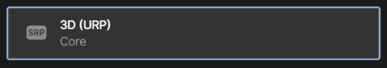

# Create a new project or update an existing one

An easy way to start creating a Mesh experience is to [open an existing sample](../getting-started/choose-your-journey.md) and build from there. However, if you know what you want to build and prefer to start from scratch, this article will get you started. You can add your own content to the scene and then upload it as an *Environment* to Mesh.

> [!IMPORTANT]
> In rare instances, after you update the toolkit package, your Unity project may become unexplainably and temporarily broken. This can result in mysterious compiler errors and missing script references despite the script file being present and clean. The steps to resolve this are:
> 1. Close and restart Unity.
> 1. If this doesn't work, in the Unity menu bar select **Assets** then **Reimport All**. *Note that this process can take some time.*

**To create a new project**:

1. Create a new Unity project using the **3D URP** (Core) template.  You may need to click **Download template** on the right before proceeding.

    

1. In Unity, you can use the default scene. Save it with the name you want.

1. In the **Hierarchy**, delete **Global Volume**.

1. [Add the Mesh toolkit package.](add-the-mesh-toolkit-package.md)

**To update an existing project**:

1. Ensure that your project targets the Universal Render Pipeline (URP).
1. [Add the Mesh toolkit package.](add-the-mesh-toolkit-package.md)

## Next steps

> [!div class="nextstepaction"]
> [Add the Mesh toolkit package](add-the-mesh-toolkit-package.md)
