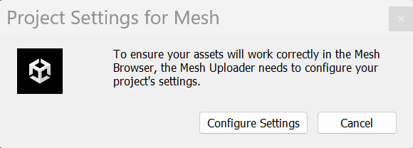

# Environment construction tips

After you [create a new Unity project or choose an existing one](./create-a-new-project-or-update.md) for Mesh development, [add the Mesh toolkit](./add-the-mesh-toolkit-package.md), [determine your target platform(s)](./build-for-single-and-multiple-platforms.md), and [set up your scene](./set-up-your-scene.md), you're ready to add new content and features or further develop existing content. Here are some tips:

- For design tips, see our series of design articles starting with [Designing for Mesh: Overview](../../develop/design/overview.md). There are also guides for implementing advanced features such as [Mesh Physics](../enhance-your-environment/physics/mesh-physics-overview.md) and [Mesh Scripting](../../develop/script-your-scene-logic/mesh-scripting-overview.md).

- Environments can't depend on any scripts that aren't included in the Mesh toolkit package. This includes scripts you've added to the project manually or ones obtained by installing other packages.

- The only event callbacks that are allowed to be called by environment components are _ScriptMachine.TriggerUnityEvent_ and _ScriptMachine.TriggerAnimationEvent_.

- Only some Unity components, methods and properties are supported in Visual Scripting within Mesh environments.

- If you're presented with the **Project Settings for Mesh** dialog which asks you to configure project settings, click the **Configure Settings** button. This ensures that your project is fully set up for Mesh.

    

- You can't use UnityUI (uGUI) for custom UI.

- If you publish any materials, including things such as web pages or digital ads, that feature Unity Trademarks, they must carry a trademark notice. This notice can appear in credits, a footer, or other similar locations. For more information, see [Guidelines for Using Unity Trademarks](https://unity.com/legal/branding-trademarks).

## Next Steps

To enhance your project with features such as web content, Mesh Interactables, or Mesh Physics, go to:

> [!div class="nextstepaction"]
> [Enhanced features overview](../enhance-your-environment/enhanced-features-overview.md)

If you're interested in some of the more artistic elements of experience creation such as modeling, texture, and lighting, go to:

> [!div class="nextstepaction"]
> [Design overview](../design/overview.md)