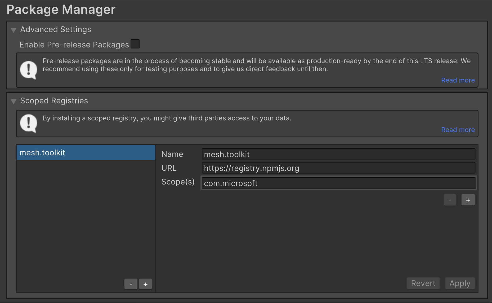
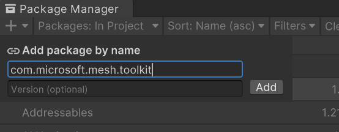

# Importing the Mesh Toolkit

The [Mesh Toolkit](../../develop/development-overview.md#develop-in-unity-with-mesh-toolkit) is a Unity package which is distributed via [npmjs.org](https://www.npmjs.com/package/com.microsoft.mesh.toolkit).

1. In the Package Manager settings add scope registry.
  
1. In the Package Manager add package by name **com.microsoft.mesh.toolkit**.
  

> [!div class="nextstepaction"]
> [Build for single and multiple platforms](build-for-single-and-multiple-platforms.md)    