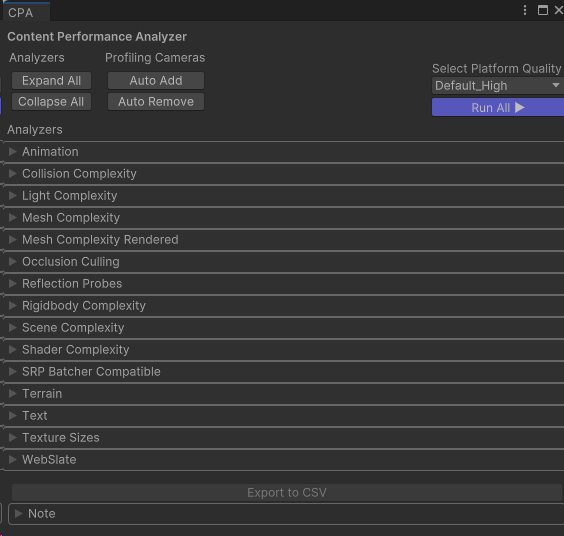
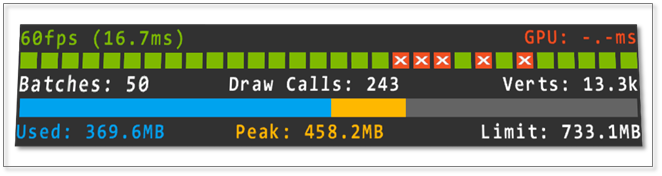
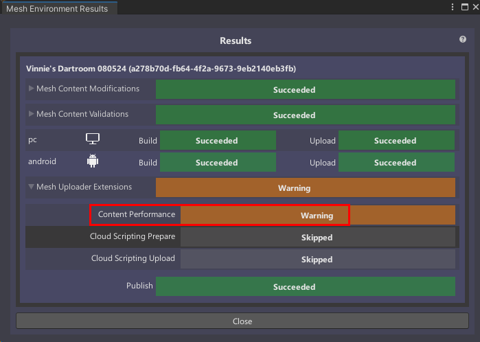

# Optimize as you build

This article contains a brief overview of optimization and performance. You can learn a lot more by reading our article named [Performance Guidelines](../debug-and-optimize-performance/performance-guidelines.md).

As you start your Mesh project, it's important to keep in mind the things you can do to ensure the best experience  for your users. This should include:

- Having a performance budget that aligns with the platforms you're targeting. You can build for PC, Quest/Android, or both. If you build for both, you'll need to optimize for Quest/Android.

- Ensuring that any 3D models, materials, and shaders you import into your project are constructed appropriately for real-time high-performance scenarios.

- As you build, regularly checking with the [Content Performance Analyzer](../debug-and-optimize-performance/cpa.md) (CPA) tool to view a range of helpful performance-related statistics about your project.

- Within the Mesh app, using the Performance Profiler to view your Mesh project's frame rate, scene complexity, and memory usage across all platforms. The Performance Profiler is also accessible within the Mesh toolkit.

You can also use these tools which are useful for profiling content in Unity:

- [Unity's Profiler](https://docs.unity3d.com/Manual/Profiler.html)
- [Unity's Frame Debugger](https://docs.unity3d.com/Manual/FrameDebugger.html)
- [RenderDoc](https://docs.unity3d.com/Manual/RenderDocIntegration.html) (**IMPORTANT**: RenderDoc can only perform captures from the Unity editor. Mesh app builds won't work).

**Note**: After you build and publish your project, the **Build and Upload Results** window appears. It contains a **Content Performance** indicator which gives you a results message related to content in your project. To learn more about these messages and what they mean, see the "Content Performance" section in [Understanding your Build and Publish results](../make-your-environment-available/understanding-build-and-publish-results.md#content-performance).

## Next Steps

> [!div class="nextstepaction"]
> [Environment construction tips](./environment-construction-tips.md)
> [Performance Guidelines](../debug-and-optimize-performance/performance-guidelines.md)
