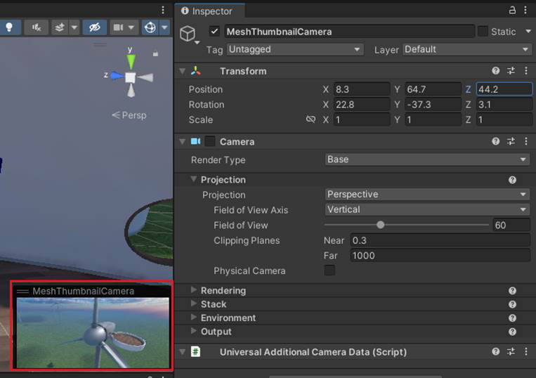

# Set up your scene

The operations below are required for new or existing projects.

## Guidelines for avatar movement and teleportation

In order for Mesh avatars to move around and teleport in your experience successfully, it's important to follow certain design guidelines. For further details, see [Configuring for avatar movement and teleportation](./configuring-for-avatar-movement-and-teleportation.md).

## Add a Travel Point

Every scene must have at least one *Travel Point*, which is used to configure avatar spawning behavior. If you're new to travel points, we recommend that you [read our Travel Point and Travel Group article](../enhance-your-environment/avatar-and-object-interactions/create-avatar-spawn-and-travel-points.md) and follow the instructions there.

## Add the Mesh Thumbnail Camera

Every time you upload your Environment, a thumbnail image of your scene will be captured based on the *TravelPoint* component and *LookAt* property using the *MeshThumbnailCamera*; however, you can also add your own *MeshThumbnailCamera* and position it wherever you like. The *Mesh Thumbnail Camera* provides a thumbnail image that will be
added to your Environment's listing in Mesh on the web and its
selection button in the Mesh app. This comes in handy when you're
selecting Environments in either place because it gives you a visual
reminder of what the Environment looks like.

**To add the thumbnail camera to the scene and set its view:**

1. In the **Scene** window, adjust the view so that it shows what you
    want to display in the thumbnail (the Thumbnail Camera's view will
    be based on the **Scene** window).

2. Select the "+" drop-down located below the **Hierarchy** tab, and
    then select **Mesh Toolkit** > **Thumbnail Camera**.

3. To confirm that the view in the Thumbnail Camera is what you want,
    in the **Hierarchy**, select **MeshThumbnailCamera**. The Camera's
    view appears in a small window in the lower right of the **Scene**
    window.

> **Note 1**: If you decide you want a different view for the Thumbnail
> Camera, you can adjust the Camera GameObject directly in the **Scene**
> window or change its **Position** and **Rotation** values in the
> **Inspector** prior to uploading your Environment to Mesh.

> - You can also add the camera as a child of a GameObject: right-click the GameObject and then select **Mesh Toolkit** > **Thumbnail Camera**. The camera position in this case will be 0 so it's important to adjust the position and rotation.

There are no set rules for how your thumbnail should look---it's totally
up to you. The example below is taken from our [Mesh 101 tutorial](../../develop/getting-started/mesh-101-tutorial/mesh-101-01-overview-and-setup.md). The tutorial teaches you how to add Mesh features to an educational experience about wind turbines, so the thumbnail shows the turbines.

## Next steps

> [!div class="nextstepaction"]
> [Optimize as you build](./optimize-as-you-build.md)
