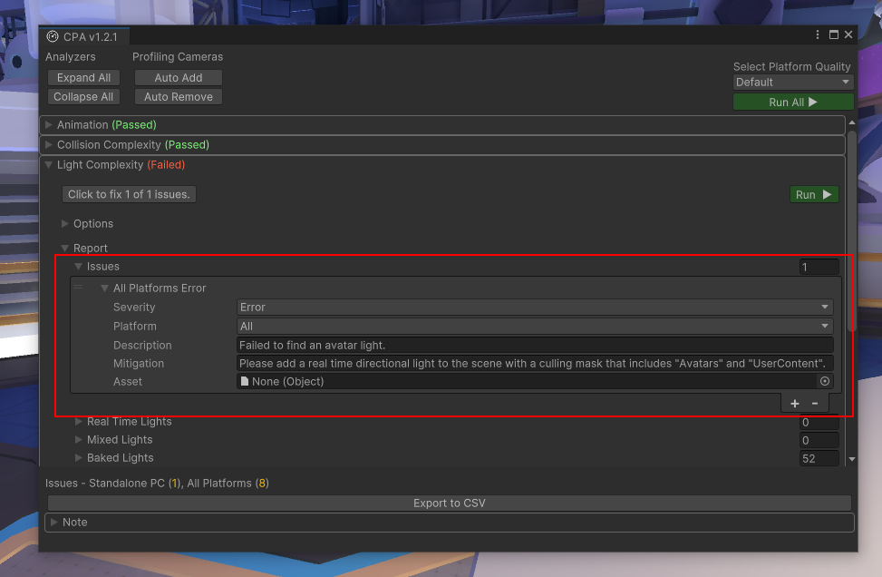

# Content Performance Analyzer

## What is the Content Performance Analyzer?

You can use the Content Performance Analyzer (CPA) to automatically catch content optimization issues and opportunities before you upload content to Mesh. You can use the CPA to audit triangle counts, batches, texture memory utilization, and more.

## Using the CPA tool

**To run the CPA tool**:  
On the menu bar, select **Mesh Toolkit** > **Content Performance Analyzer**.

This opens the CPA tool in its own window.

In the CPA tool, click the **Run All** (▶) button. Your content will be automatically analyzed based on the project's current quality settings. 

**To audit other platform quality settings**:  
Click the **Select Platform Quality** drop-down and then select your desired platform.

> [!IMPORTANT]
> For best results, make sure you run the CPA tool while playing in Unity. Some tests only work in Play mode, while some work in either Play or Edit mode.

## Analyzers

- **Animation** (visibility culling)
- **Collision Complexity** (dense mesh colliders)
- **Light Complexity** (real time lights, shadow casters, and avatar lights)
- **Mesh Complexity** (triangles and vertices)
- **Reflection Probes** (realtime vs baked probes)
- **Rigidbody Complexity** (rigidbody counts)
- **Scene Complexity** (batches and draw calls)
- **Shader Complexity** (vertex and fragment shader math instruction counts, variant counts)
- **SRP Batcher Compatible** (compatibility check with the SRP batcher)
- **Terrain** (terrain component settings)
- **Texture Sizes** (memory usage for lightmaps and other textures)
- **WebSlate** (runtime render time for WebSlate)

**Scene Complexity** and **Mesh Complexity** results are based on camera position and orientation. The CPA tool will search for all cameras within your scene, including disabled ones, and run tests from each camera. If your scene doesn't have a camera, the CPA tool will add a camera when testing that focuses on the bounds of your scene.

> [!IMPORTANT]
> Place a few cameras in your scene (disable them if you need to) that mimic real vantage points a user might experience. If you're unsure about where to add cameras by hand, you can click the **Auto Add** button in the **Profiling Cameras** section of the CPA window. This will automatically add cameras to the navigable space.

## How to interpret the results

After you click **Run All**, the words "Passed", "Warning", or "Failed" will be added to each analyzer's title. To gain more insight into why an analyzer failed, look in the **Report** > **Issues** section of the analyzer.

> [!TIP]
> You can export results to a .CSV file and then open it in Microsoft Excel by clicking the **Export to CSV** button.
