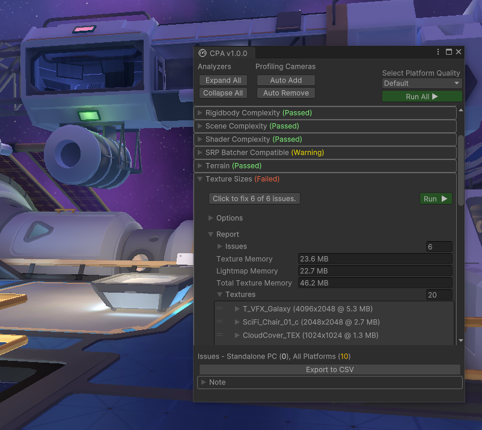

# Performance guidelines for Mesh

## Performance

Your current choice is to develop for desktop PC or Quest. Once your
scene is created and optimized for either of these platforms, it will
generally be easier to build for other platforms that may become
available in the future. Your Environment will be performant and you can
maximize the number of possible participants. In the future, you can
clone the scene to develop for higher-end platforms and take advantage
of extra computing power to incorporate things like advanced materials and more complex models.

## Simple vs complex scenes

As with all game development, in Mesh there's a tradeoff between
complexity/quality and performance. Depending on the machine running
Mesh, or other programs running simultaneously, your user may experience
decreased performance, especially if your scene is complex. As you
increase complexity and/or the quality of your Mesh Environments, the number
of users that Mesh can support without performance issues decreases.

## Tools for analyzing performance

### Content Performance Analyzer (CPA)

We recommend that you use the [Content Performance Analyzer (CPA)](./cpa.md) to
maximize the number of users that can access and use a Mesh experience 
without performance issues. You can use the CPA to audit polycount, draw
call, texture size, and more. This allows you to catch content
optimization issues and opportunities before content is uploaded to
Mesh. Issues are reported via an editor window in Unity.

The CPA is included in the [Mesh Toolkit](../development-overview.md#develop-in-unity-with-mesh-toolkit) package which is required for any Unity project being used to generate a Mesh Environment.

### Visual Profiler

The Visual Profiler provides a drop-in solution for viewing your Mesh Unity project's frame rate, scene complexity, and memory
usage across available platforms.

Missed frames are displayed over time to visually find problem areas.
Scene complexity is reported in the form of draw calls and rendered
vertex counts (or triangle counts). Memory is reported in a bar graph as current, peak
and max usage.

**Note:** To ensure the profiler is minimally intrusive, it doesn't 
create any GameObjects or perform any per frame managed allocations, and it renders in a single draw call.

**Add the Visual Profiler to your project**

The Visual Profiler is included in the [Mesh Toolkit](../development-overview.md#develop-in-unity-with-mesh-toolkit).

To use the Visual Profiler, add the *Visual Profiler* component to any GameObject in the Unity scene you wish to profile. The profiler is initially active and visible.

**To toggle the Visual Profiler on or off**:
- In the **Visual Profiler** component, select or clear the **Is Visible** option.

 **Note**: On Windows and UWP platforms, you can toggle the Visual Profiler on and off with enabled/disable voice command keywords.

 > [!IMPORTANT]
 > If you're using Playmode and have the Playmode Setup component in your scene, make sure the **Initial Screen Count** setting is zero. If it's "1" or higher, you won't see the Visual Profiler.

 

**Usage of the Visual Profiler**

When using the profiler, look for *missed frames*, which appear as
orange bars. Missed frames indicate that your application isn't hitting its
target frame rate and may need optimization work. Draw call counts and
vertex counts (or triangle counts) are also displayed under the missed
frame indicators. These numbers can indicate why your app isn't
meeting its target frame rate.

You should also keep an eye on the bottom memory bar to insure that memory
usage isn't rapidly changing or approaching the application's memory
limit.

The profiler UI (such as anchoring, scale, follow behavior and UI color)
can also be adjusted in the **Visual Profiler** component.

Custom profilers can be added to the bottom of the Visual Profiler by
adding to the list of "Profiler Groups." Profiler Groups use
Unity's [ProfilerRecorder](https://docs.unity3d.com/ScriptReference/Unity.Profiling.ProfilerRecorder.html) API.
For example, the image below shows how the "BehaviorUpdate",
"LateBehaviourUpdate", and "FixedBehaviourUpdate" markers display a
millisecond average over 300 samples with the group label "Scripting."

**Feedback on the Visual Profiler**

To file issues or suggestions, use
the [Issues](https://github.com/Microsoft/VisualProfiler/issues) page
for this project on GitHub.

### Performance Optimization

Optimizing for performance can be a balancing act depending on the
scenario you're developing for and the experience you want to achieve.
Below are how-to suggestions for our two current platforms.

We suggest that you use the cheaper out-of-the-box Universal Render
Pipeline shaders; this will make upgrading easier in the future. We also
understand the value of custom shaders. In general, we try to keep our
custom shaders for most of the environment at:

- 30 math operations in vertex

- 120 math operations in fragment

- Two texture lookups

#### Android

|Polycount           |Batches             | Renderer         | Color                  |
|--------------------|--------------------|------------------|------------------------|
| <~80k Triangles    |  ~50 batches       |  URP required    |     Linear required    |

|Textures          |Lightmaps             | Skybox           | Shader                  |
|--------------------|--------------------|------------------|------------------------|
| <~15 MB (=16) 512x512)  |  < ~20 MB (=(4) 1023x2024)       |  1024x2048    |     Universal Render Pipeline/Baked Lit    |

#### High-end PCs

|Polycount           |Batches             | Renderer         | Color                  |
|--------------------|--------------------|------------------|------------------------|
| <~500k Triangles    |  ~200 batches  (Use Unit Frame Debugger)    |  URP required    |     Linear required    |

|Textures          |Lightmaps             | Skybox           | Shader                  |
|--------------------|--------------------|------------------|------------------------|
| <~160 MB   |  < ~80 MB        |  2048x4096    |     Universal Render Pipeline/Baked Lit    |

#### Resources for developing advanced Mesh Environments in Unity

**Frame Debugger:** <https://docs.unity3d.com/Manual/FrameDebugger.html>

**Unity Sky:** <https://docs.unity3d.com/Manual/sky.html>

**URP:** <https://docs.unity3d.com/Manual/universal-render-pipeline.html>

**Lightmaps:** <https://docs.unity3d.com/Manual/Lightmappers.html>

**Draw Calls** <https://docs.unity3d.com/Manual/DrawCallBatching.html>

**Mipmapping:** [Advanced VR Graphics Techniques
(arm.com)](https://developer.arm.com/documentation/102073/0100/Mipmapping)

## Next steps

> [!div class="nextstepaction"]
> [Playmode](playmode.md)
