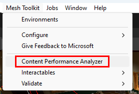
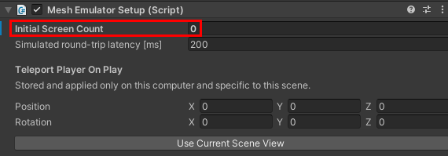

# Performance guidelines for Mesh

## Performance

This article is an introduction to understanding the significance of performance when authoring content in Mesh. Framerate is the easiest unit to rationalize performance. Normally framerate is measured in "frames per second" (fps) or how many times your application can render an image per second. A user's experience can be greatly degraded if your content doesn't run at an optimal framerate. To help you track and achieve quality framerate, Mesh provides a variety of tools and recommendations.

The below table lists the target framerate per platform Mesh supports.

|PC                                   |Android (Quest) |
|-------------------------------------|----------------|
|[Monitor refresh rate](https://support.microsoft.com/en-us/windows/change-your-display-refresh-rate-in-windows-c8ea729e-0678-015c-c415-f806f04aae5a) (minimum 30fps) |72fps |

## Simple vs complex scenes

As with all 3D development, in Mesh there's a tradeoff between visual fidelity and performance. Depending on the machine running
Mesh, your user may experience decreased performance, especially if your scene is complex.

Think of performance like a financial budget. If you have $100 dollars to spend you can't spend $60 rendering a complex environment, $40 simulating advanced physics, and $20 for visual scripts - you would end up spending over your budget. As a developer you have to make tradeoffs between visual fidelity, interaction complexity, the number of users, and other systems. The Mesh team has generated a list of [performance thresholds](#performance-thresholds) not as a rule, but a guide to development.

## Profiling methodology

Authoring environments in Mesh generally involves three steps.

1. Author content in Unity
1. Upload to Microsoft Mesh
1. Run your content in the Mesh app

During step one we recommend that you use a mixture of the [Content Performance Analyzer (CPA)](#content-performance-analyzer-cpa) and [Performance Profiler](#performance-profiler) found in the [Mesh toolkit](../build-your-basic-environment/add-the-mesh-toolkit-package.md) package which is required for any Unity project being used to generate a Mesh environment. During step two, the CPA tool automatically runs. Finally, during step three final, profiling should occur via Mesh's built-in Performance Profiler.

## Tools for analyzing performance

### Content Performance Analyzer (CPA)

We recommend that you use the [Content Performance Analyzer (CPA)](./cpa.md) to maximize the performance of your Mesh experience. The CPA tool can statically analyze your content at authoring time. You can use the CPA to audit triangle counts, batches, texture memory utilization, and more. This allows you to catch content optimization issues and opportunities before content is uploaded to Mesh.

To run the CPA tool select **Mesh Toolkit** > **Content Performance Analyzer** from the menu items.

Issues and suggestions are reported via an editor window in Unity.

> [!IMPORTANT]
> A portion of the CPA analyzers will run automatically when uploading content to Mesh. Because not all tests can run automatically it's good to run the CPA manually as part of your development process.

### Performance Profiler

The Performance Profiler provides a simple window for viewing your Mesh project's frame rate, scene complexity, and memory
usage across all platforms. The Performance Profiler is accessible within the Mesh app and within the Mesh toolkit.

To view the Performance Profiler in the Mesh app open the settings panel and select **For developers** > **Performance Profiler**. The Performance Profiler will appear at the top center of the window.

When using the Performance Profiler, look for *missed frames*, which appear as red boxes, marked with an 'x'. Missed frames indicate that your content isn't hitting Mesh's target framerate and may need optimization work. Scene complexity and memory usage is displayed under the missed
frame indicators. These numbers might indicate why your content isn't meeting Mesh's target frame rate.

Text on the Performance Profiler will turn red when a metric does not meet Mesh's recommended performance threshold. More details around [performance thresholds](#performance-thresholds) are listed in a proceeding section.

> [!IMPORTANT]
> Batches cannot be displayed within the Mesh app. They are only available within the Unity editor.

You should also keep an eye on the bottom memory bar to insure that memory usage isn't rapidly changing or approaching the application's memory limit.

To view the Performance Profiler in the Unity editor ensure you have the [Mesh Emulator Setup component](../debug-and-optimize-performance/mesh-emulator.md) in your scene. Make sure the **Initial Screen Count** setting is zero. If it's one or higher, you won't be able to toggle on the Performance Profiler when playing.

 

Click Unity's **Play** button to enter play mode, toggle the Performance Profiler on via the **'v'** key. The Performance Profiler will appear at the top center of the game window.

> [!IMPORTANT]
> When viewing the Performance Profiler in the Unity editor you an gleam more information, such as batch counts and and millisecond time it takes for certain subsystems to execute. Note these metrics are a relative approximation of performance and final profiling should happen within the Mesh app.

If you are curious what the millisecond times at the bottom of the Performance Profiler are measuring you can find that info in the [performance thresholds](#performance-thresholds) section.

### Other tools

Both the CPA and Performance Profiler are custom built for Mesh, but there are also a handful of great tools for profiling content in Unity:

- [Unity's Profiler](https://docs.unity3d.com/Manual/Profiler.html)
- [Unity's Frame Debugger](https://docs.unity3d.com/Manual/FrameDebugger.html)
- [RenderDoc](https://docs.unity3d.com/Manual/RenderDocIntegration.html) (**IMPORTANT**: RenderDoc can only perform captures from the Unity editor. Mesh app builds won't work).

### Performance thresholds

Optimizing for performance can be a balancing act depending on the scenario you're developing for and the experience you want to achieve.
Rendering a scene in Mesh is a direct consequence of how the environment's content is authored. Below are rendering suggestions for our current platforms.

#### PC rendering thresholds

|Polycount           |Batches             | Post processing     |
|--------------------|--------------------|---------------------|
|<~500k Triangles    |~200 batches        |Disabled             |
|**Textures**        |**Lightmaps**       |**Skybox Resolution**|
|< ~160 MB           |< ~80 MB            |2048x4096            |

#### Android (Quest) rendering thresholds

|Polycount           |Batches             |Post processing      |
|--------------------|--------------------|---------------------|
|<~80k Triangles     |~50 batches         |Disabled             |
|**Textures**        |**Lightmaps**       |**Skybox Resolution**|
|< ~15 MB            |< ~20 MB            |1024x2048            |

You might notice that shader restrictions are not specified in the above tables. Because Mesh uses Unity's [Universal Render Pipeline (URP)](https://docs.unity3d.com/Packages/com.unity.render-pipelines.universal@14.0/manual/index.html) we suggest that you use cheaper out-of-the-box URP shaders (like [Universal Render Pipeline/Baked Lit](https://docs.unity3d.com/Packages/com.unity.render-pipelines.universal@14.0/manual/baked-lit-shader.html) or [Universal Render Pipeline/Simple Lit](https://docs.unity3d.com/Packages/com.unity.render-pipelines.universal@14.0/manual/simple-lit-shader.html)). We also understand the value of custom shaders. In general, we try to keep our custom shaders for most of the environment within the below thresholds:

|Vertex math      |Fragment math     |Texture      |
|-----------------|------------------|-------------|
| < 30 operations | < 120 operations | < 2 lookups |

> [!IMPORTANT]
> Counting shader operations is in imperfect metric for calculating shader performance, a shader developer should also profile their shader running in Mesh to verify it runs performantly.

If you are curious how the URP's render pipeline is configured for the Mesh app you can inspect the platform specific renderers in your project's **\Library\PackageCache\com.microsoft.mesh.toolkit\mesh.toolkit.uploader\Assets\URP** directory.

#### Scripting thresholds

Mesh allows you to create interactive content via [visual scripting](../script-your-scene-logic/visual-scripting/visual-scripting-overview.md), [cloud scripting](../script-your-scene-logic/cloud-scripting/cloud-scripting-basic-concepts.md), [Mesh Physics](../enhance-your-environment/physics/mesh-physics-overview.md), and/or [WebSlate](../enhance-your-environment/webcontent.md). When viewing the Performance Profiler in the Unity editor the millisecond (ms) times it takes for certain subsystems to execute is displayed at the bottom of the profiler. When text changes from green to red that indicates a subsystem could be over budget. The table below provides more information about these budgets.

|Subsystem name |Max Frame Budget |Description          |
|---------------|-----------------|---------------------|
|Behaviour      |N/A              |Millisecond time taken to update all local MonoBehaviour scripts (C# and Visual) |
|Render         |25%              |Millisecond time for the CPU render of the scene|
|WebSlate       |N/A              |Millisecond time to update and render any WebSlates in the scene|
|Phys Sim       |15%              |Millisecond time to step the PhysX simulation|
|Phys Sync      |15%              |Millisecond time to synchronize all physics bodies|
|Phys Effx      |10%              |Millisecond time to update bespoke physics behaviors|
|VS User        |15%              |Millisecond time spent in Visual Script graphs placed in the scene|
|VS Env         |10%              |Millisecond time spent updating the Visual Script infrastructure|
|VS Net         |10%              |Millisecond time spent synchronizing the Visual Script network state|

The "Max Frame Percentage" values listed above are recommendations based on generic content. As a developer it is up to you to balance these systems to ensure your frame can update in the time alloted.

### Performance and Optimization Resources

**Graphics performance fundamentals** <https://docs.unity3d.com/Manual/OptimizingGraphicsPerformance.html>

**Universal Render Pipeline (URP)** <https://docs.unity3d.com/Packages/com.unity.render-pipelines.universal@14.0/manual/index.html>

**SRP Batcher** <https://docs.unity3d.com/Manual/SRPBatcher.html>

**Single-pass instanced rendering and custom shaders** <https://docs.unity3d.com/Manual/SinglePassInstancing.html>
