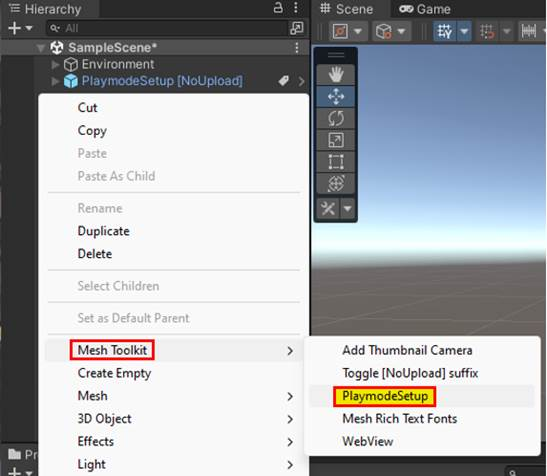
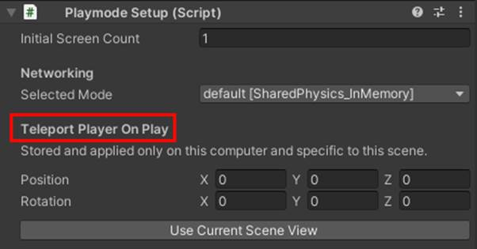
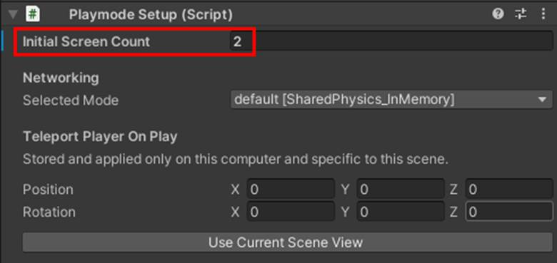
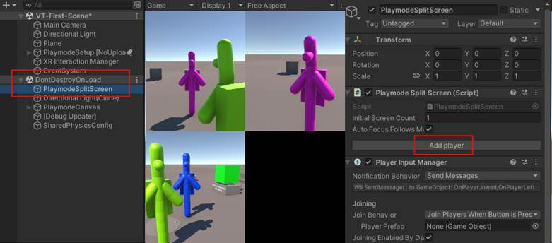

# Mesh Play Mode testing in Unity

**Mesh Play Mode** gives you the capability to
select *Play* in a Mesh Environment project and get an
approximate preview of what the content will look and feel like when it
runs in the Mesh app. This greatly speeds up the iteration cycle during
content development and allows developers of advanced interactive
content to deeply debug the logic with all the powerful tools that Unity
offers. From this point forward, we'll refer to this feature
as *Play Mode*.

The look and feel in Play Mode are similar but not identical to those in
the Mesh app. It's an ongoing effort to reduce the differences where
possible without sacrificing the lightweight Environment necessary for
quick iteration. A key feature of Play Mode is the ability to run
multiple clients within the same process; this allows a single developer
to easily get a first impression of a multi-user scenario.

**To use Play Mode in your project**:

1.  Add a *PlaymodeSetup [NoUpload]* prefab to the scene: right-click
    in the **Hierarchy**, and then select **Mesh Toolkit** >
    **PlaymodeSetup**.

    

2.  Ensure that the scene contains a piece of solid floor below the
    origin that's set to the *NavMesh* layer.

3.  Press the Play button.

## Teleport Player on Play

When working in a large scene, you may find it valuable to move to a
specific location at startup.

## Playmode Split Screen

This feature lets you run multiple clients within the same process and
show them side-by-side within the same window. Mesh toolkit itself implements a very minimal
emulated *PlaymodeNetwork* component that's sufficient to communicate
the player position between the clients, allowing the different players
to see each other as heavily stylized avatars:

This is sufficient for previewing static content. When developing
interactive content, visual scripting, cloud scripting and/or web slate,
keep in mind that those features each contain their own networking mechanisms
which provide a Play Mode preview of a synchronized experience with
multiple users.

Do one of the following:

-   Increase the initial screen count before entering Play mode by
    setting the value on the **PlaymodeSetup \[NoUpload\]** component:

-or-

1.  Start Play Mode.

2.  In the **DontDestroyOnLoad** scene, navigate to the
    **PlaymodeSplitScreen** component and then select **Add player**.

Now you can quickly test your Unity Scene without going through the
build and upload process each time you make an iteration.

 > [!IMPORTANT]
 > If you're using the [Visual Profiler](../debug-and-optimize-performance/performance-guidelines.md#visual-profiler) in your scene, make sure the **Initial Screen Count** setting in the **Playmode Setup** component is zero. If it's "1" or higher, you won't see the Visual Profiler.

 