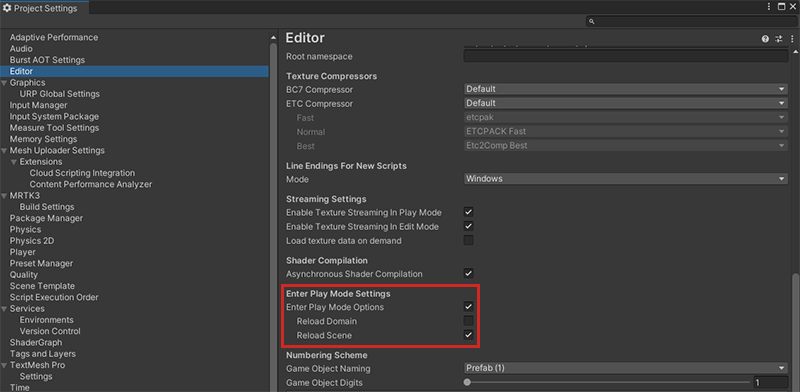

# Speed up Mesh Emulation Mode

## Overview

*Domain Reloading* is a Unity feature that resets all static fields and registered handlers and provides you with a completely fresh scripting state each time you enter Play Mode. This causes your project to enter Mesh Emulaton Mode in a very similar way to when it first starts up in a build. Domain Reloading is enabled by default. As of Mesh Toolkit version 5.2407, you can press the Play button in the Unity Editor and enter Mesh Emulation Mode with Domain Reloading disabled. This should significantly speed up the start and stop times of the Mesh Emulator, allowing you to iterate faster.

> [!IMPORTANT]
> This option is currently an experimental feature and might contain some rough edges. See the [Potential Problems](#potential-problems) section below.
 
[Learn more about Domain Reloading](https://docs.unity3d.com/Manual/DomainReloading.html)
 
## Reset scripts for Play Mode

Since disabling Domain Reloading means that Unity doesn't automatically reset the scripting state each time you enter Play Mode, you must add some code to ensure that your scripting state resets. For details, see the section named "Modifying your scripts to perform correctly when Domain Reload is disabled" in the [Unity Domain Reloading article](https://docs.unity3d.com/Manual/DomainReloading.html).
 
**To disable Domain Reloading**:  
1. On the menu bar, select **Edit** > **Project Settings**.
1. On the **Editor** page, navigate to the **Enter Play Mode Settings** section.
1. You should choose the following settings:

    - **Enter Play Mode Options** selected.
    - **Reload Domain** *not* selected.
    - **Reload Scene** selected.

After choosing these settings, entering Play mode won't invoke the "Domain Reloading" process. If you want to get the default behavior back, select **Reload Domain** on the **Project Settings** > **Editor** page (but keep **Reload Scene** selected).
 
## Potential problems

If you encounter any of the problems below, we request that you report them using our feedback option.

- **Console errors**: Mesh Emulator or some other system ends up in an inconsistent state between Play Mode sessions and it doesn't work properly until *Domain Reload* is invoked.  
- **Sticky behaviors**: Before exiting a Play Mode session, some static field was changed and it kept its value into the next Play Mode  session, causing unexpected behavior in the Mesh Emulator.
 
## Effects of changing code in your project

If you change code in your project, things will be the same. Any code change triggers Unity to recompile and do a Domain Reload unless your project is configured to not do so.

## Known issues

- [Registering subsystem descriptor with duplicate ID](https://docs.unity.cn/2021.1/Documentation/Manual/xrsdk-runtime-discovery.html)

