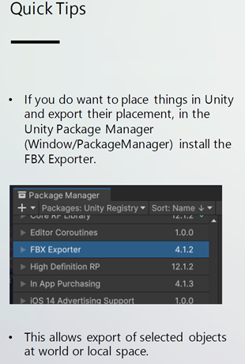
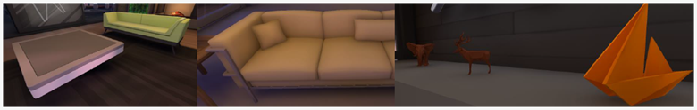
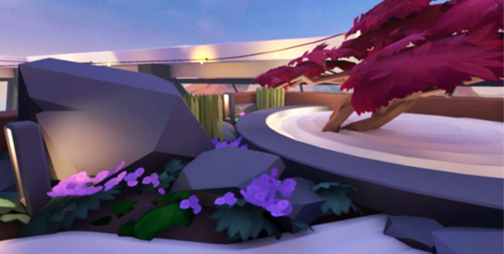
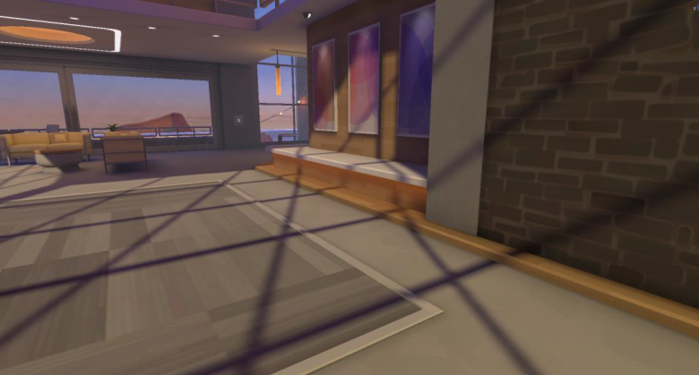
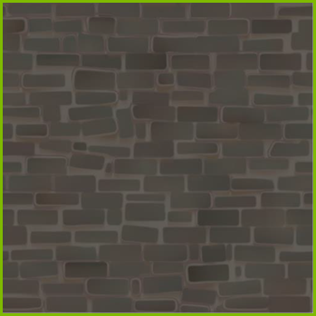
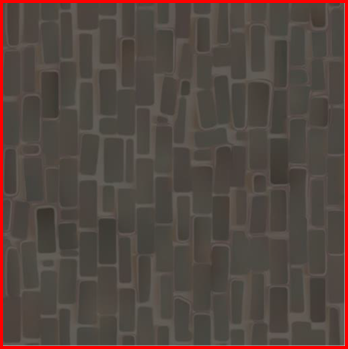
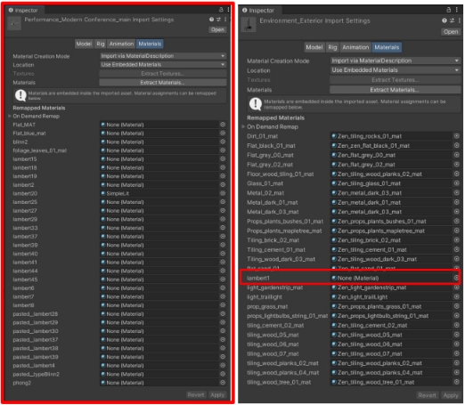
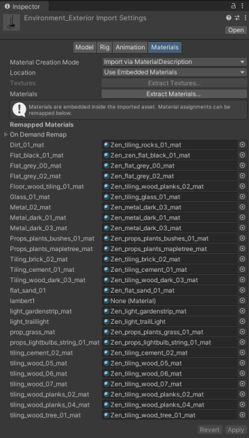
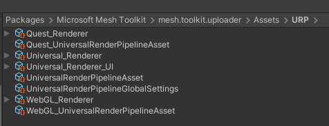

# 3D modeling tips

## Clean geometry

Each polygon needs to have a purpose and help sell the believability of
the Environment. If edge flow creates confusing shadows or
hard-to-understand shapes, you can simplify. If a mesh won't be seen up
close and has dense polygons, you can reduce its complexity.

A clean and easy-to-understand silhouette goes a long way towards
amplifying an environment or prop. A properly optimized mesh goes a long
way towards driving polish and enhancing the user's experience.

## Unseen faces

Make sure you delete faces the user will never see. Not only will this
save on polycount and increase performance, it also has a huge benefit
when creating optimized light map UVs.

## VR users

VR users can 'escape' collision boundaries by physically moving the
headset, with approximately up to two meters of wiggle room.

Plan for this and don't delete faces as aggressively when they're close
to the collision boundaries.

## Aliasing 

When modeling and designing, avoid straight lines and aliasing-producing
materials. This will save technical overhead later and create a better
experience for users.

Use matte, smooth, and larger shapes when possible. Avoid bevels, hard
edges, and metallic materials.

Consider the distance a user could be from an object and the lighting of
your Environments. Thin objects render as straight lines and metallic
objects produce specular artifacts when lit. It's best to avoid these
outcomes, when possible, with careful modelling.

## Resources for minimizing aliasing in levels & materials

**Level design:** [Advanced VR Graphics Techniques
(arm.com)](https://developer.arm.com/documentation/102073/0100/Level-design)

**Banding:** [Advanced VR Graphics Techniques
(arm.com)](https://developer.arm.com/documentation/102073/0100/Banding)

## Minimizing polycount for props

Increase performance of your final scene by minimizing the polycount of
your props before exporting them. This will reduce the resource cost to
render objects and maximize performance in your final scene.

## Resources for minimizing polycount

**Maya polycount reduction how to**: [HOW TO REDUCE POLYCOUNT IN MAYA -
YouTube](https://www.youtube.com/watch?v=xWYEXj_Cemc)

**Maya polygon modeling tips:** [Maya Help: Polygon modeling preferences
and tips
(autodesk.com)](https://help.autodesk.com/view/MAYAUL/2016/ENU/?guid=GUID-4A9B7918-06B9-4BDD-80DE-DD6D756B09B3)

## Materials

 

Name each material in your .fbxfile to
closely match its corresponding material inside Unity. Avoid exporting
default material names.

## Stairs

To optimize performance and to prevent visual artifacts in both camera
and character, we recommend representing stair **collision** geometry as
a sloped plane without modifying render geometry.

The character controller is represented by a capsule with a small radius
which does allow it to effectively climb up stepped geometry. However,
this approach can cause jittering0F[^1] in both the camera and character
movement.

## Model textures

Using flat colors and a clean light bake instead of custom textures is a very efficient and performant route to take for prop textures.

These props don't have custom textures, but instead rely on the URP/Baked Lit shader's Base Map color value and a clean light bake.

Not using textures also eliminates texture artifacts like pixelization and aliasing, which is a big boost to VR immersion.

When a custom texture is used, like on these purple plants, green leaves, and the red leaves of the tree, keeping the detail simple and clean goes a
long way towards hiding the textures' low resolution.

Tiling textures should be authored at 3x3 meter scale.

All tiling textures should be authored left to right.

**Correct**:

**Incorrect**:

## Unity model importer

Utilizing the Unity Importer for material management not only speeds up iteration time, it also has a positive impact on performance. As of Spring 2022, when the Importer lists the On Demand Remap slot as 'None (Material)', Unity embeds the default URP/Lit material into the asset.

**Even one material set to 'None (Material)' has a performance cost.**

**Ensure that all slots have corresponding Unity materials loaded in, as shown below.**

## Unity shaders

### Quick Links

- Universal Render Pipeline overview \| Universal RP \| 12.1.4 (unity3d.com)

- Baked Lit Shader \| Universal RP \| 12.1.4 (unity3d.com)

- Complex Lit Shader \| Universal RP \| 12.1.4 (unity3d.com)

### Shaders

Microsoft Mesh utilizes the URP renderer. Unity has multiple built-in URP shaders available to use.

**For Android-focused projects**, we only use the following: 

**URP/BakedLit** 

**URP/Unlit**

**For PC / High-end focused projects**, we recommend that you use the following:  

**URP/ComplexLit** (if advanced materials are needed)

### Resources for Unity shaders

**Complex Lit Shader:** [Complex Lit Shader \| Universal RP \| 10.2.2 (unity3d.com)](https://docs.unity3d.com/Packages/com.unity.render-pipelines.universal@10.2/manual/shader-complex-lit.html)

### Shader graph

Unity Shader Graph is okay to use; however, performance could be negatively impacted if the custom shader isn't properly optimized. 

**For Android projects:** we highly recommend that you stick to \~30 math operations in vertex, \~120 math operations in fragment, and \~2 texture look ups.

### Shader Features

Most shader and renderer features are available to every platform, but some platforms disable features for performance considerations.

| | **Android** | **PC** |
| -------------|--------|------------- |
| **\_CameraDepthTexture**  | ❌ | ❌ |
| **\_CameraColorTexture**  | ❌ | ❌ |
| **HDR** | ❌ |  ❌ |
| **MSAA** |  2x   |   2x |
| **Reflection Probe Blending** | ❌ |  ✔ |
| **Post Processing** |  ❌ | ❌ |

When unsure if a setting is enabled or disabled for a platform you are developing for, reference the URP assets contained within the Mesh
toolkit Uploader's URP folder:

**Note**: Altering render pipeline settings or adding renderers isn't supported.