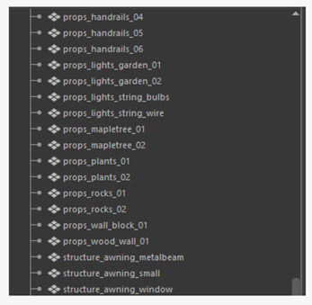

# Exporting models and environments

## Exporting models

- **Do not** export multiple prop meshes in one .fbxfile. Each prop
    should have its own .fbxfile.

- **Do not** export props with values in transforms in your modeling
    package. **Make sure to zero out transforms.**

- **Do not** export props with off-center pivot points. Make sure
    pivot points are at world origin (0,0,0) and properly snapped to the
    base of the mesh.

## Exporting environments

- **Do not** plan to move meshes inside Unity. For environment FBX's,
    adjust inside your modeling program before export.

    

