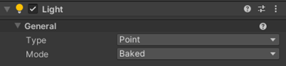
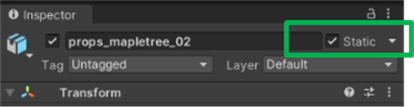
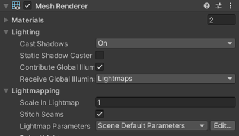
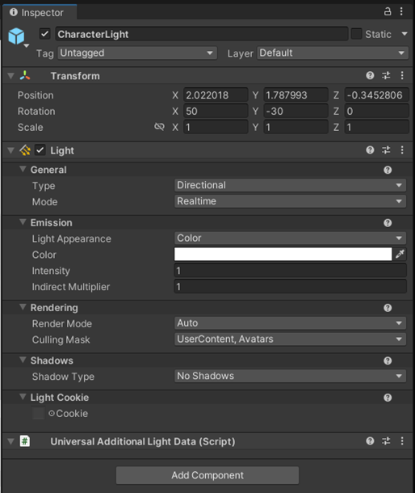

# Lighting

For Microsoft Mesh environments, utilize Unity Baked Lighting. To include a Mesh object in the light bake, make sure you check the **Static** checkbox in the **Inspector**.

All Unity light types are available when using baked lighting. Make sure you set the mode to "Baked". Realtime lights aren't
supported for use in the environment.

 

All Unity light types are available when using baked lighting.

To include a mesh object in the light bake, make sure you check the **Static** checkbox in the **Inspector**.

 

If this isn't checked, lighting won't be applied to the mesh and it won't cast any shadows in the scene.

The Scale in Lightmap value increases/decreases the size of the selected mesh's UVs in the Unity light map bake. If you need to change a specific mesh's resolution, this is where to do it.

Leave **Scale in Lightmap** at its default (1) while setting up your scene.

If you need to increase overall scene light map resolution, don't do it on a mesh-by-mesh basis; do it in the scene Lightmapping Settings.

### Quick tips for lighting

- The further a mesh object is from the scene's playable space, the smaller its Scale in Lightmap value can be.

- Deemphasizing far away objects in the light bake is a great way to save light bake texture space and use resolution on objects that players can get up close to.

## Dynamic lighting

Most environments use baked lighting, but there are a handful of objects in your environment that need to be dynamically lit. For example,
avatars, user content, and physics objects. To ensure these objects are properly lit add a single directional light that is:

- Type: Directional

- Mode: Real time

- Culling Mask: includes "Avatars" and "UserContent"

Color and intensity can be any values that suit the environment. The [Content Performance Analyzer](/mesh/develop/debug-and-optimize-performance/cpa) will also display an error if a light like this is not found.

